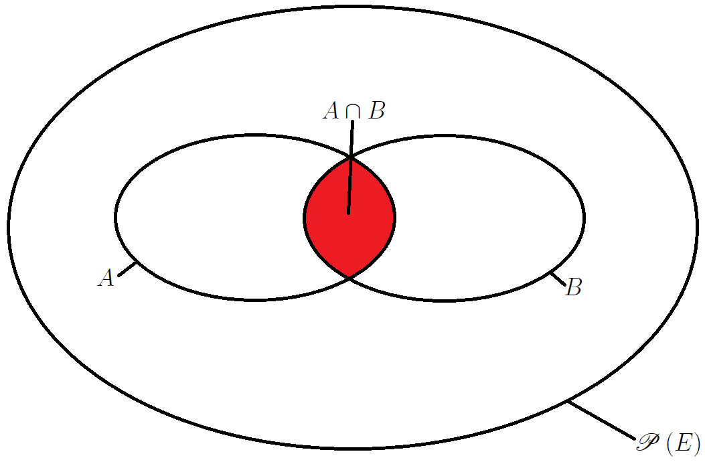
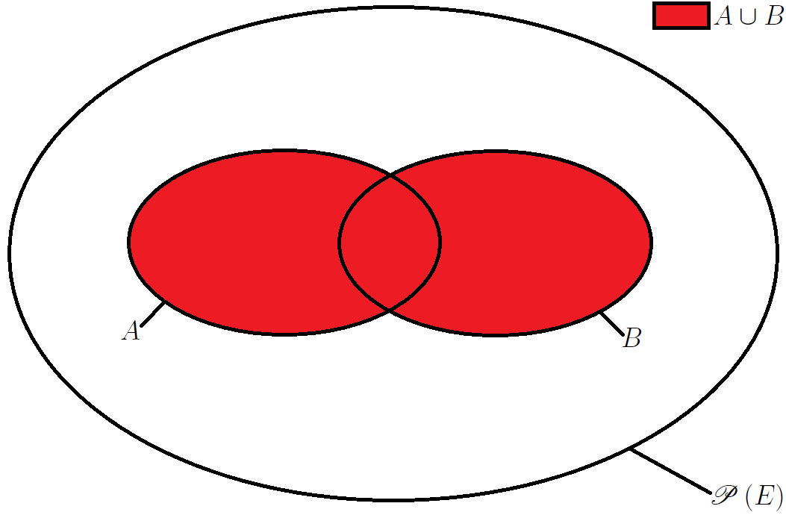
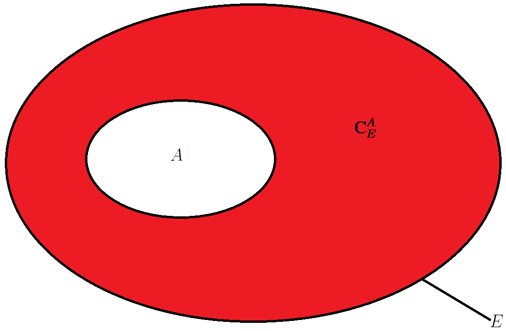

# Les ensembles mathématiques finis

## Cours

- [Ensembles et applications](https://www.youtube.com/watch?v=bPT6-g3B5wQ&list=PL6690366268FBF2C0)

## Les ensembles

Un **ensemble** est une collection de choses que l'on appelle **éléments**. Si un ensemble ne contient rien, on appelle d'**ensemble vide**, noté $\varnothing$.

Un ensemble peut être fini, comme le nombre de cas possibles, ou infini, comme l'ensemble des nombres, Si l'élément $e_i$ appartient à l'ensemble $E$, on le note : $e_i \in E$.

## Les ensembles finis

Un ensemble est **fini** s'il existe $n \in \mathbb{N}^{*}$ et une bijection de $E$ vers l'ensemble $\left\lbrace 1, 2, 3, \ldots{}, n \right\rbrace$.

## Le cardinal d'un ensemble fini

Le **cardinal** est le nombre d'éléments $n$ d'un ensemble fini $E$. Il est noté $\mathrm{card} E$, ou $\left| E \right|$, ou # $E$.

> [!WARNING]
> $\mathrm{card} \varnothing = 0$

Si $E$ est un ensemble fini, et $B \subset A$ alors :

1. $B$ est fini et $\mathrm{card} B \leq \mathrm{card} A$

2. $\mathrm{card} \left( \textrm{C}_{A}^{B} \right) = \mathrm{card} A - \mathrm{card} B$

## L'ensemble dénombrable

Soit $E$ un ensemble, on dit que $E$ est un ensemble (infini) dénombrable s'il est équipotent à $\mathbb{N}$, c'est-à-dire qu'il existe une bijection entre $E$ et $\mathbb{N}$.

\begin{itemize}
    \item $2 \mathbb{Z}$ est dénombrable.
    \item $\mathbb{R}$ est non dénombrable.
    \item $\mathbb{C}$ est non dénombrable.
\end{itemize}

## L'ensemble des parties

L'**ensemble des parties** $\mathscr{P} \left( E \right)$ de l'ensemble fini $E$ correspond à la totalité des combinaisons possibles.

**Exemple.** Soit $E = \left\lbrace a, b, c, d \right\rbrace$. Grâce à l'établissement d'un arbre, il est facile, dans ce cas, de connaître la totalité de l'ensemble des parties (Fig. 1). L'arbre reconstitue les étapes en commençant par le premier élément. $a$ est retenu à la branche de droite et non retenu à la branche de gauche. On poursuit avec le deuxième élément $b$. La logique est la même : à droite l'élément est retenu, à gauche, il ne l'est pas.

$ avec $E = \left\lbrace a, b, c, d \right\rbrace$")

**Figure 1. Arbre de dénombrement de l'ensemble des parties $\mathscr{P} \left( E \right)$ avec $E = \left\lbrace a, b, c, d \right\rbrace$**

$\mathscr{P} \left( E \right) = \left\lbrace \varnothing, \left\lbrace a \right\rbrace, \left\lbrace b \right\rbrace, \left\lbrace c \right\rbrace, \left\lbrace d \right\rbrace, \ldots{}, \left\lbrace a, b, c, d \right\rbrace \right\rbrace$

Il est fastidieux d'établir un arbre pour chaque ensemble. Il existe une formule permettant de calculer le cardinal de l'ensemble des parties $\mathscr{P} \left( E \right)$.

$\mathrm{card} \mathscr{P} \left( E \right) = 2^{\mathrm{card} E}$

> [!WARNING]
> L'ensemble vide est toujours du partie.

> [!WARNING]
>  L'ensemble en entier est toujours inclus dans lui-même.

> [!WARNING]
>  $a \in E$, mais $\left\lbrace a \right\rbrace \subset E$, mais $\left\lbrace a \right\rbrace \in \mathscr{P} \left( E \right)$.

### Les opérations dans l'ensemble des parties 

Soient $A \in \mathscr{P} \left( E \right)$ et $B \in \mathscr{P} \left( E \right)$ sont ensemblistes.

L'**intersection** est l'ensemble des éléments de $E$ qui appartiennent à $A$ **et** $B$ (Fig. 2). Elle est notée $A \cap B$.

$A \cap B = \left\lbrace x \in E / x \in A \textrm{ et } x \in B \right\rbrace$

**Figure 2. Modèle d'une intersection**

L'**union** est l'ensemble des éléments de $E$ qui appartiennent à $A$ **ou** $B$, **ou** les deux (Fig. 3). Elle est notée $A \cup B$.

$A \cup B = \left\lbrace x \in E / x \in A \textrm{ ou } x \in B \right\rbrace$

> [!WARNING]
>  Lorsque l'intersection est vide, les ensembles $A$ et  $B$ sont **disjoints**.

**Figure 3. Modèle d'une union**

La **différence** de $A$ moins $B$ est l'ensemble des éléments qui sont dans $A$, mais pas dans $B$. L'opérateur utilisé est $\diagdown$.

La **différence symétrique** de $A$ et $B$ est l'ensemble des éléments qui sont soit dans $A$ soit dans $B$, mais pas dans $A \cup B$. L'opérateur utilisé est $\vartriangle$.

## Le complémentaire d'un ensemble

On appelle le **complémentaire de** $A$ **dans l'ensemble** $E$ des éléments de $E$ qui n'appartiennent pas à $A$. Il est noté $\mathrm{C}_{E}^{A}$, ou $\bar{A}$, ou $A^c$, ou $C_{E} \left( A \right)$.

$\textrm{C}_{E}^{A} = \left\lbrace x \notin E, x \notin A \right\rbrace$

**Figure 4. Modèle d'un complémentaire de $A$ dans $E$**

Propriétés :

- $\textrm{C}_{A \cap B}^{A \cup B} = \left\lbrace x \in A \cup B, x \notin A \cap B \right\rbrace$
- $\mathrm{card} A + \mathrm{card} \textrm{C}_{E}^{A} = \mathrm{card} E$
- $\mathrm{card} \textrm{C}_{E}^{A} = \mathrm{card} E - \mathrm{card} A$

### La représentation des ensembles

Les figures 2 et 3 sont des **diagrammes de J. Venn**[^1] (ou logiques). Ils montrent toutes les relations logiques possibles dans une collection finie de différents ensembles.

## Les relations algébriques des ensembles

Soient $A, B, C$ trois ensembles.

- $E \cap A = A$
- $E \cap \varnothing = \varnothing$
- $E \cup A = E$
- $E \cup \varnothing = \varnothing$

### La commutativité

- $A \cap B = B \cap A$
- $A \cup B = B \cup A$

### L'associativité

- $A \cup \left( B \cap C \right) = \left( A \cup B \right) \cap \left( A \cup C \right)$
- $A \cap \left( B \cup C \right) = \left( A \cap B \right) \cup \left( A \cap C \right)$

### La distributivité

- $\left( A \cup B \right) \cap C = \left( A \cap C \right) \cup \left( B \cap  C\right)$
- $A \cup \left( B \cap C \right) = \left( A \cup B \right) \cap \left( A \cup  C\right)$
- $\bar{A \cup B} = \bar{A} \cap \bar{B}$
- $\bar{A \cap B} = \bar{A} \cup \bar{B}$

### Les règles de A. de Morgan[^2]

- $\left( \cup_{i = 1}^{n} A_i \right) \cap B = \cup_{i = 1}^{n} \left( A_i \cap B \right)$
- $\left( \cap_{i = 1}^{n} A_i \right) \cup B = \cap_{i = 1}^{n} \left( A_i \cap B \right)$
- $\bar{\cup_{i = 1}^{n} A_i} = \cap_{i = 1}^{n} \bar{A_i}$
- $\bar{\cap_{i = 1}^{n} A_i} = \cup_{i = 1}^{n} \bar{A_i}$

### Le produit cartésien

#### Le produit cartésien de deux ensembles

Soient $A$ et $B$ deux ensembles, on appelle **produit cartésien de** $A$ **par** $B$, l'ensemble des couples $\left( x, y \right)$ tels que $x$ soit élément de $A$, et $y$ soit un élément de $B$, ce qui définit l'ensemble $C = \left\lbrace \left( x, y \right) : x \in A, y \in B \right\rbrace$. Il est noté $A \times B$.

$A \times B = \left\lbrace \left( x, y \right) / x \in A \textrm{ et } y \in B \right\rbrace$

**Propriété.** Le nombre d'éléments d'un produit cartésien vaut :
    $\mathrm{card} \left( A \times B \right) = \mathrm{card} A \times \mathrm{card} B$

> [!WARNING]
> Dans le membre gauche de l'équation précédente, $\times$ se lit « croix », et non comme le symbole de la multiplication, tandis que, dans le membre droit de la même équation, $\times$ se lit « multiplié ».

#### Le produit cartésien de $n$ ensembles

Soient $A_1, A_2, \ldots{}, A_n$, un élément de $A_1 \times A_2 \times \ldots{} \times A_n$ est une **liste ordonnée** : le premier appartenant à $A_1$, le deuxième appartenant à $A_2$, ..., le dernier appartenant à $A_n$. Il est noté $A^n$.

Propriété. Le nombre d'éléments d'un produit cartésien à $n$ ensembles vaut :

$\mathrm{card} \left( A^n \right) = \left( \mathrm{card} A \right)^n$

### L'inclusion

L'opérateur $\subset$ est celui de l'inclusion.

Soient $\left( A_i \right)_{1 \leq i \leq n}$, $n$ ensembles inclus dans $\Omega$. La famille $\left( A_i \right)_{1 \leq i \leq n}$ est une partition de $\Omega$ si elle vérifie deux conditions :

1. $A_i \cap A_j = \varnothing$ pour tous $i \neq j$ ;

2. $\cup_{i = 1}^{n} A_i = \Omega$.

Soit $A \subset \Omega$, on définit sur $\Omega$ la fonction indicatrice de $A$, $1_A$, par :

$\forall \omega \in \Omega, 1_A \left( \omega \right) = \left\lbrace \begin{array}{l} 1 \textrm{ si } \omega \in A \\ 0 \textrm{ sinon} \end{array} \right.$

## Les relations entre les cardinaux

### L'additivité

Soient $A$ et $B$ deux ensembles finis disjoints, c'est-à-dire avec $A \cap B = \varnothing$, alors :

$\mathrm{card} A + \mathrm{card} B = \mathrm{card} \left( A \cap B \right)$

> [!WARNING]
>  Si $A$ et $B$ sont deux ensembles finis non disjoints, alors on obtient la formule des quatre cardinaux ou crible de H. Poincaré[^3] :

$\mathrm{card} A \cup B = \mathrm{card} A + \mathrm{card} B - \mathrm{card} A \cap B$

ou

$\mathrm{card} A \cap B = \mathrm{card} A + \mathrm{card} B - \mathrm{card} \left( A \cup B \right)$

Si on ajoute un ensemble $C$, la formule devient :

$\begin{array}{l} \mathrm{card} \left( A \cup B \cup C \right) = \mathrm{card} \left( \left( A \cup B \right) \cup C \right) \\ = \mathrm{card} A + \mathrm{card} B + \mathrm{card} C - \mathrm{card} \left( A \cap B \right) - \mathrm{card} \left( A \cap C \right) - \mathrm{card} \left( B \cap C \right) \\ + \mathrm{card} \left( A \cap B \cap C \right) \end{array}$

ce qui correspond au dénombrement d'un sous-ensemble.

### La multiplicativité

Soient $A$ et $B$ deux ensembles finis et $C = A \times B$, alors : 

$\mathrm{card} C = \mathrm{card} A \times \mathrm{card}  B$

### Le principe du dénombrement

Le **dénombrement** consiste à déterminer le nombre d'éléments d'un ensemble fini.

Soit $E$ un ensemble fini non vide et soit $F$ un ensemble, s'il existe une bijection de $E$ sur $F$ alors $F$ est fini et de même cardinal que $E$.

Lorsque l'on réalise deux expériences qui peuvent produire respectivement $n$ et $m$ résultats différents. Au total, pour les deux expériences prises ensemble, il existe $n \times m$ résultats possibles.

### Le nombre de suites

Soit $A$ un ensemble fini de cardinal $n$. Le nombre de suites de longueur $r$ constituées d'éléments de $A$ est : $n^r$

### L'inclusion-exclusion

Soient $A$ et $B$ deux ensembles finis, alors :

$\mathrm{card} \left( A \cup B \right) = \mathrm{card} A + \mathrm{card} B - \mathrm{card} \left( A \cap B \right)$

Pour $n$ ensembles finis $A_1$, ..., $A_n$,

$\begin{array}{l} \mathrm{card} \left( A_1, \cup A_2, \cup \ldots{} \cup A_n \right) = \sum_{i = 1}^{n} \mathrm{card} A_i - \sum_{i < j}^{n} \mathrm{card} \left( A_i \cap A_j \right) + \ldots{} \\ + \left( -1 \right)^{n + 1} \mathrm{card} \left( A_1 \cap A_2, \cap \ldots{} \cap A_n \right) \end{array}$

## Exercices

- [Exercices sur les ensembles finis](./Exercices/00-Ensembles-finis.pdf)

- [Corrections des exercices sur ](./Solutions/00-Ensembles-finis-Corrections.pdf)

## Notes de bas de page

[^1]: John Venn (1834-1923)

[^2]: Augustus de Morgan (1806-1871)

[^3]: Henri Poincaré (1854-1912)
