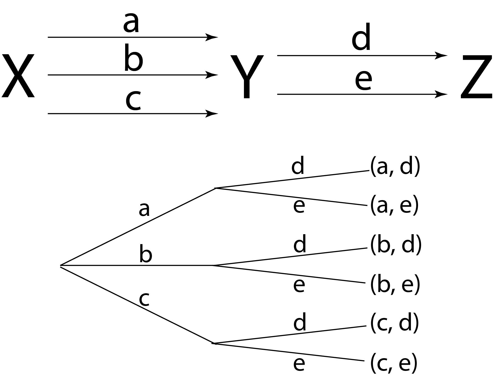

# Dénombrement

L'art du dénombrement est essentiel dans l'analyse de données. Si, la plupart du temps, les logiciels ou les codes permettent d'éviter de se poser la question, il est tout de même utile de savoir compter correctement l'ensemble des possibilités d'une situation.

Apprendre à compter est de fait la **base** des probabilités et des statistiques. Toutes ces formules vont être utilisées par la suite dans des situations d'analyse de données précises. Elles doivent être maîtrisées.

Même si ces formules peuvent paraître abscons, en réalité, il n'existe que deux cas possibles :
1. soit on sélectionne **tous** les élements ;
2. soit on sélectionne **quelques** éléments par d'autres, constituant la totalité des cas possibles.

Concrètement, à chaque situation pratique, vous devez poser la question de la situation statistique dans laquelle vous vous trouvez. De fait, si vous ne maîtrisez pas le dénombrement, faites des exercices. En général, ils sont à base de boules dans une urne ou de tirage de cartes. Les situations statistiques en géographie sont différentes. Par exemple, on étudiera les réponses d'un questionnaire :
- une question avec un ensemble de réponses pour laquelle le sondé ne doit faire qu'un choix. Dans quelle situation mathématique est-on ? Dans le cas d'une sélection dans le cadre d'un tirage successif sans remise. Assez naturellement, on répond qu'il y a 5 choix possibles ;
- une question avec un ensemble de réponses pour laquelle le sondé dispose de cinq réponses et peut en choisir autant qu'il veut parmi elles. Dans quelle situation mathématique est-on ? Dans le cas d'une sélection dans le cadre d'un tirage successif sans remise. La réponse est moins simple, mais ici il y a 120 choix possibles ;
- *etc*.

La bonne méthode est d'éliminer les cas.
- Est-ce un dénombrement nécessitant une sélection d'éléments ?
    - Si non, il s'agit d'une **permutation**. On utilise toutes les possibilités. Les éléments sont-ils utilisés sans ou avec répétition (ou remise) ?
        - Sans répétition, il s'agit d'une **permutation simple**. Si on a 5 éléments, tous les 5 éléments doivent présents dans la combinaison.
        - Avec répétition, il s'agit d'une **permutation avec répétitions**. Si on a 5 éléments, quelques éléments parmi les 5 peuvent présents dans la combinaison. Le jeu type est le mastermind. Vous avez le choix entre 5 éléments par exemple, mais vous pouvez choisir de créer une combinaison avec seulement 4 éléments pris parmi 5. Dans ce cas, un élément sera répété pour obtenir une combinaison avec 5 éléments.
    - Si oui, la sélection des élements est-elle successive ou simultanée ? On utilise quelques possibilités parmi un ensemble de possibilités bien défini.
        - Si elle est **successive**, c'est un **arrangement**. L'arrangement présuppose un ordre. Les élements sélectionnés sont-ils écartés du tirage suivant ou sont-ils remis dans la liste des choix possibles ?
            - Sans remise, il s'agit d'un **arrangement simple**.
            - Avec remise, il s'agit d'un **arrangement avec répétitions**.
        - Si elle est **simultanée**, c'est une **combinaison**. La combinaison présuppose l'absence d'ordre. Les élements sélectionnés sont-ils écartés du tirage suivant ou sont-ils remis dans la liste des choix possibles ?
            - Sans remise, il s'agit d'une **combinaison simple**.
            - Avec remise, il s'agit d'une **combinaison avec répétitions**.

Il faut se poser les questions sans *a priori* sur la situation géographique qu'on analyse. Suis-je **mathématiquement** dans ce cas plutôt que dans tel autre ? Il n'existe que **six possibilités**. Il faut s'entraîner pour bien les reconnaître au sein des cas pratiques. L'erreur que l'on commet le plus souvent au début consiste à identifier les cas avec ou sans remise, or c'est la dernière question à se poser. C'est comme si on raisonnait spontanément à l'envers. Raisonner en termes de dénombrement est le plus dur à acquérir et à maîtriser. Une fois que cela est fait, tout deviendra plus simple au niveau des probabilités et des statistiques, car, dans les deux cas, tout part du dénombrement.

## Les formules préalables à connaître

- Savoir calculer une factorielle

- Savoir calculer le binôme de Newton

## Les principes du dénombrement

### Le principe des tiroirs

Si on dispose de $n$ « tiroirs » à disposition pour y ranger $n + k$ « objets », alors certains « tiroirs » contiendront plus d'un « objets ».

### Le principe de décomposition

Si une opération globale peut se décomposer en $k$ opérations élémentaires successives, ces dernières pouvant s'effectuer respectivement de $n_1$, $n_2$, \ldots{}, $n_k$ manières, alors l'opération globale peut se faire de $n_1$, $n_2$, \ldots{}, $n_k$ manières différentes.

**Exemple.** Les localités $X$ et $Y$ sont reliées par trois routes $\left( a, b, c \right)$ et les localités $Y$ et $Z$ par deux routes $\left( d, e \right)$. Combien existe-t-il de trajets de $X$ à $Z$ en passant par $Y$ ? (Fig. 1)

**Figure 1. Arbre de dénombrement**

## L'analyse combinatoire

L'**analyse combinatoire** consiste à déterminer le nombre d'éléments d'une collection (liste, arrangement, combinaison, *etc*.).

Les ensembles sont des collections d'objets **non ordonnés** et **sans répétition**.

$\left\lbrace 1, 2, 3 \right\rbrace = \left\lbrace 3, 2, 1 \right\rbrace = \left\lbrace 3, 3, 1, 2 \right\rbrace$

Tenir compte de l'ordre fait intervenir l'analyse combinatoire. Soit $E$ un ensemble muni de $n$ éléments, que se passe-t-il lorsque l'on sélectionne $p$ éléments de $E$ pris parmi les $n$ éléments possibles de $E$.

Pour dénombrer des situations, il est commode de se poser quatre questions.

1. Quel est le nombre $n$ d'objets de référence ?

2. Quel est le nombre $p$ d'objets concernés par une situation ?

3. Les $p$ objets sont-ils considérés sans ordre (en vrac, tirage simultané) ou avec ordre (c'est-à-dire que la situation est différente si les mêmes $p$ objets sont classés de façon différente) ?

4. Les répétitions sont-elles impossibles (les $p$ objets sont tous distincts, tirage sans remise) ou possibles (tirage avec remise) ?

## Les situations sans sélection

### Permutation simple

#### La factorielle

La **factorielle** d'un nombre entier $n$ est le produit de tous les nombres entre eux entre 1 et $n$. Elle est notée $n!$.

$n! = 1 \times 2 \times \ldots{} \times n$

Par convention, $0! = 1$ et $1! = 1$.

**Propriété.** $\left( n + 1 \right)! = n! \left( n + 1 \right)$

#### La notion de permutation

Tout classement **ordonné** de $n$ éléments distincts est une **permutation** de ces $n$ éléments. En langage plus mathématique, soit un ensemble $E$ fini à $n$ éléments, on appelle permutation de $n$ éléments, toute suite ordonnée des $n$ éléments de $E$. La permutation suppose qu'il n'y ait pas de remise.

**Exemple .** Le rangement de livres dans une bibliothèque.

Le nombre de permutations de $n$ éléments se calcule en partant de l'observation qu'il existe $n$ places possibles pour un premier élément, $n - 1$ pour le deuxième, \ldots{}, et 1 pour le dernier.

$P_n = n \times \left( n - 1 \right) \times \left( n - 2 \right) \times \ldots{} \times 2 \times 1 = n!$

On peut représenter toutes les permutations par un **arbre**.

**Théorème.** On peut voir une permutation de $E$ comme une bijection de $\left[ 1, n \right]$ sur $E$.

**Théorème.** Soient $E$ et $F$ deux ensembles finis de même cardinal $n$, alors le nombre de bijections de $E$ sur $F$ est donné par $n!$. Cela signifie qu'il existe $n!$ permutations de $n$ éléments distincts.

**Théorème.** Soit $E$ un ensemble fini non vide de cardinal $n$, alors le nombre de permutations de  $E$ est $n!$.

Le **nombre d'inversions** dénombre combien de fois un nombre plus grand se rencontre avant un plus petit dans la suite $i_1$, $i_2$, \ldots{}, $i_n$. Si le nombre d'inversions est pair, la permutation est dite paire ; sinon, elle est **impaire**.

#### Décomposition de la permutation d'un ensemble de trois éléments

Soit un ensemble $E = \left\lbrace A, B, C \right\rbrace$ qu'il faut ranger dans une boîte qui possède trois places.

Étape n°1. Placer $A$. Le premier élément dispose de toutes les places disponibles.

|  |  |  |  |  |  |  | 
| --- | --- | --- | --- | --- | --- | --- |
| A |  |  |  | A |  |  |
|  | A |  |  |  | A |  |
|  |  | A |  |  |  | A |
 
**Tableau 1. Placement du premier élément**

Étape n°2. Placer $B$. Le deuxième élément dispose des deux places restantes. 

|   |  |  |  |  |  |  | 
| --- | --- | --- | --- | --- | --- | --- |
| A | B |  |  | A |  | B |
| B | A |  |  |  | A | B |
| B |  | A |  |  | B | A |

**Tableau 2. Placement du deuxième élément**

Étape n°3. Placer $C$. Le troisième élément dispose de la dernière place restante. 

|  |  |  |  |  |  |  |
| --- | --- | --- | --- | --- | --- | --- |
| A | B | C |  | A | C | B |
| B | A | C |  | C | A | B |
| B | C | A |  | C | B | A |

**Tableau 3. Placement du troisième élément**

Bilan. $3 \times 2 \times 1 = 3!$

**Généralisation.** $p \left( p - 1 \right) \left( p - 2 \right) \ldots{}  \left( 1 \right) = p!$ permutations.

#### Exercice type

Un sac contient les cinq lettres indiscernables au toucher du mot TABLE inscrite sur cinq cartons. On tire un à un tous les cartons du sac, que l'on dispose dans l'ordre du tirage pour former un mot. Combien de mots différents peut-on obtenir ?

Il existe $5!$ permutations possibles, soit 120 mots au total.

### Permutation avec répétitions

Le nombre de permutations que l'on peut constituer si certains des éléments sont identiques est évidemment plus petit que si tous les éléments sont distincts.

Lorsque seuls $k$ éléments sont distincts $\left( k \leq n \right)$, chacun d'eux apparaissant $n_1$, $n_2$, \ldots{}, $n_k$ fois, avec $n_1 + n_2 + \ldots{} + n_k = n$ et $n_i \geq 1$, on a :
    $\bar{P_n} \left( n_1, n_2, \ldots{}, n_k \right) = \frac{n!}{{n_1}!{n_2}! \ldots{} {n_k}!}$

**Question classique.** Combien d'anagrammes peut-on former avec les lettres de tel mot ?

#### Exercice type 1

Un sac contient les cinq lettres indiscernables au toucher du mot VILLE inscrite sur cinq cartons. On tire un à un tous les cartons du sac, que l'on dispose dans l'ordre du tirage pour former un mot. Combien de mots différents peut-on obtenir ?

Il existe $5!$ permutations possibles, soit 120 mots au total. Toutefois, le L figure deux fois, donc il y a $2!$ mots en double.

Pour dénombrer sans doublon, il faut faire le rapport entre les permutations et les lettres en double $\frac{5!}{2!} = \frac{120}{2} = 60$ mots différents.

#### Exercice type 2

Même exercice avec ASSURANCES. $10! = 3 628 800$ mots au total, mais le A figure deux fois $2! = 2$, le S trois fois $3! = 6$. Il y a ainsi $\frac{3 628 800}{2 \times 6} = 302400$ mots différents.

## Les situations avec sélection

### Les situations successives

#### Les tirages sans remise : l'arrangement simple

Un **arrangement** est une collection de $p$ objets pris successivement parmi $n$ **en tenant compte de l'ordre d'apparition**. Il est dit **simple** si on ne peut prendre chaque objet une fois **au plus**. Il s'agit d'une **liste ordonnée à** $p$ **éléments sans répétition**. En langage plus mathématique, soit un ensemble $E$ fini de cardinal $n$, on appelle $p$ arrangements toute collection **ordonnée** de $p$ éléments de $E$ **distincts** les uns des autres. Il est noté $\mathrm{A}_{n}^{p}$.

Exemples :

- le tiercé ;

- le tirage successif de trois boules sans remise.

Le premier élément peut être choisi de $n$ façons différentes. Le deuxième peut prendre $\left( n - 1 \right)$ valeurs. Le troisième peut prendre $\left( n - 2 \right)$ valeurs, \ldots{}, et le $p$-ième $n - p +1$ valeurs.

$\mathrm{A}_{n}^{p} = n \times \left( n - 1 \right) \times \left( n - 2 \right) \times \ldots{} \times \left( n - p - 1 \right)$

Il s'agit d'une permutation incomplète. On en déduit le théorème suivant.

**Théorème.** Soit un ensemble $E$ fini de cardinal $n$, le nombre de $p$ arrangements $p \leq n$ de $E$, noté $\textrm{A}_{n}^{p}$ avec $p$, le plus petit nombre et $n$, plus grand nombre, est égal à :

$\mathrm{A}_{n}^{p} = \frac{n!}{\left( n - p \right)!}$

Cas particuliers :

- $\textrm{A}_{n}^{0} = 1$

- $\textrm{A}_{n}^{1} = n$

- $\textrm{A}_{n}^{n} = n!$

> [!WARNING]
> Un arrangement de $n$ éléments pris parmi $n$ est une **permutation de $n$ éléments**.

**Théorème.** Soient $E$ et $F$ deux ensembles finis de cardinaux respectifs $p$ et $n$, alors le nombre d'applications injectives de $E$ vers $F$ est égal à :

$\mathrm{A}_{n}^{p} = \frac{n!}{\left( n - p \right)!}$

##### Décomposition d'un arrangement de trois éléments parmi un ensemble de cinq éléments

Combien de rangements avec ordre sont possibles de $p$ éléments au sein de $n$ places ?

Compter le nombre d'arrangements possible de trois éléments $E = \left\lbrace A, B, C \right\rbrace$ parmi cinq éléments.

Étape n°1. Le A est placé en premier. Il y a cinq places disponibles.

Étape n°2. Le B est placé en deuxième. Il y a quatre places disponibles.

Étape n°3. Le C est placé en troisième. Il y a trois places disponibles.

Bilan. $5 \times 4 \times 3 = \frac{5!}{\left( 5 - 3 \right)!}$

Généralisation. $n \left( n + 1 \right) \left( n + 2 \right) \ldots{} \left( n - p + 1 \right)$, c'est-à-dire $p$ facteurs pris parmi $n$. $n \left( n + 1 \right) \left( n + 2 \right) \ldots{} \left( n - p + 1 \right) = \frac{n!}{\left( n - p \right)!}$

Chaque permutation engendre un nouvel arrangement parce que l'on tient compte de l'ordre.

##### Exercice type

Soit une urne avec six boules noires, trois boules blanches et deux boules bleues. On effectue un tirage sans remise de trois boules.

Combien de tirages sont possibles ? $\mathrm{A}_{11}^{3} = \frac{11!}{8!} = 9 \times 10 \times 11 = 990$ tirages possibles.

Combien de tirages comportent **exactement** une boule noire ? Il est possible de piocher une boule noire parmi les six possibles $\mathrm{A}_{6}^{1} = \frac{6!}{1!} = 6$, et piocher une boule noire revient à piocher deux autres boules parmi cinq autres boules possibles $\mathrm{A}_{5}^{2} = \frac{5!}{2!} = 3 \times 4 \times 5$. Au total, il y a $6 \times 3 \times 4 \times 5 = 360$ tirages possibles.

Combien de tirages comportent **au moins** une boule noire ? Pour y répondre, il faut raisonner avec le complémentaire. Le nombre de tirages sans boule noire vaut : $\mathrm{A}_{5}^{3} = \frac{5!}{2!} = 60$. Le nombre de tirage avec au moins une boule noire correspond à la différence entre le nombre total de tirages possibles et le nombre de tirage sans boule noire : $990 - 60 = 930$ tirages avec au moins une boule noire.

#### Les tirages avec remise : l'arrangement avec répétitions

Le nombre d'arrangements de $p$ éléments choisis parmi $n$ avec répétitions possibles est noté $\bar{\mathrm{A}_{n}^{p}}$. Si les répétitions sont permises, alors tous les éléments peuvent prendre $n$ valeurs. D'après le principe de décomposition, on a :

$\bar{\mathrm{A}_{n}^{p}} = n^p$

Les arrangements avec répétitions constituent des listes ordonnées à $p$ éléments avec répétition. En langage plus mathématique, soit un ensemble $E$ fini de cardinal $n$, on appelle $p$ liste tout $p$ uplet de $E$, c'est-à-dire des objets de la forme : $\left( x_1, x_2, \ldots{}, x_n \right)$ avec $\forall i \in \left[ 1, p \right]$. Dit autrement, ne **liste ordonnée avec répétition** de $p$ éléments pris parmi $n$ éléments d'un ensemble $E$ est $n$ éléments de $E^n$. Le nombre de listes correspond au cardinal de $p$ produits cartésiens, c'est-à-dire ;

$\mathrm{card} \left( E^p \right) = \left( \mathrm{card} E \right)^p = n^p$

Exemples :

- la combinaison d'un cadenas ;

- le nombre d'anagramme d'un mot.

**Théorème.** Soit un ensemble $E$ fini de cardinal $n$, soit $p$ un entier naturel non nul, alors le nombre de $p$ listes que l'on peut former avec des éléments de $E$ est donné par : $n^p$.

> [!WARNING]
> Une $p$ liste peut être vue comme une application de $\left[ 1, p \right]$ vers $E$.

##### Exercice type

Soit un tirage avec remise de cinq boules. Si on pioche cinq fois parmi cinq boules différentes. Dans ce cadre, on a une liste de cinq tirages parmi cinq boules : $5 \times 5 \times 5 \times 5 \times 5 = 5^5 = 3125$.

### Les situations simultanées

#### Les tirages sans remise : la combinaison simple

Une **combinaison** est une collection de $p$ objets pris **simultanément** parmi $n$, c'est-à-dire **sans tenir compte de l'ordre d'apparition**. Elle est dite **simple** si on ne peut prendre chaque objet qu'une fois **au plus**. Les combinaisons simples sont les combinaisons pour un **ensemble non ordonné et sans répétition des éléments**. De manière plus mathématique, soit un ensemble $E$ fini dont le cardinal est noté $n$, on appelle $p$ **combinaisons** toute partie de $E$ à $p$ éléments. Le résultat est un sous-ensemble de $p$ éléments pris parmi $n$.

Le nombre de combinaisons de $p$ éléments choisis parmi $n$ est noté $\mathrm{C}_{n}^{p}$ ou $\left( \begin{array}{c} n \\ p \end{array} \right)$.

Exemples :

- une main au poker ;

- un tirage du loto.

**Théorème.** Soit un ensemble $E$ fini de cardinal $n$, le nombre de $p$ combinaisons de $E$ est égal :

$\mathrm{C}_{n}^{p} = \left( \begin{array}{c} n \\ p \end{array} \right) = \frac{\textrm{A}_{n}^{p}}{p!} = \frac{n!}{p! \left( n - p \right)!}$

L'ensemble des combinaisons possibles par rapport à un arrangement correspond au nombre de combinaisons multiplié par le nombre de permutation de $p$ éléments. Dit autrement, si l'on permute les éléments de chaque combinaison simple, on obtient tous les arrangements simples. Il existe $p!$ fois plus d'arrangements que de combinaisons, ce qui s'écrit :

$\mathrm{A}_{n}^{p} = p! \mathrm{C}_{n}^{p} = p! \left( \begin{array}{c} n \\ p \end{array} \right)$

**Exemple.** Les parties $k = 2$ éléments de $\left\lbrace 1, 2, 3 \right\rbrace$ sont $\left\lbrace 1, 2 \right\rbrace$, $\left\lbrace 1, 3 \right\rbrace$ et $\left\lbrace 2, 3 \right\rbrace$, donc $\mathrm{C}_{3}^{2} = \left( \begin{array}{c} 3 \\ 2 \end{array} \right) = 3$.

Décomposition de $n = 5$.

- 0 parmi 5 vaut $\left( \begin{array}{c} 5 \\ 0 \end{array} \right) = 1$

- 1 parmi 5 vaut $\left( \begin{array}{c} 5 \\ 1 \end{array} \right) = 5$

- 2 parmi 5 vaut $\left( \begin{array}{c} 5 \\ 2 \end{array} \right) = 10$

- 3 parmi 5 vaut $\left( \begin{array}{c} 5 \\ 3 \end{array} \right) = 10$

- 4 parmi 5 vaut $\left( \begin{array}{c} 5 \\ 4 \end{array} \right) = 5$

- 5 parmi 5 vaut $\left( \begin{array}{c} 5 \\ 5 \end{array} \right) = 1$

Cas particuliers :

- 0 parmi $n$, $\mathrm{C}_{n}^{0} = \left( \begin{array}{c} n \\ 0 \end{array} \right) = \mathrm{C}_{n}^{n} = \left( \begin{array}{c} n \\ n \end{array} \right)$, c'est-à-dire $n$ parmi $n$

    - Pour $\mathrm{C}_{n}^{0}$, il n'existe qu'une partie qui contient 0 élément parmi $n$ ; c'est l'ensemble vide.
    
    - Pour $\mathrm{C}_{n}^{n}$, il n'existe qu'une partie qui contient $n$ éléments parmi $n$ ; c'est l'ensemble $E$ lui-même.

- 1 parmi $n$, $\mathrm{C}_{n}^{1} = \left( \begin{array}{c} n \\ 1 \end{array} \right) = \mathrm{C}_{n}^{n - p} = \left( \begin{array}{c} n - p \\ n \end{array} \right)$

- Compter le nombre de partie $A$ dans $E$ ayant $k$ éléments équivaut à compter le nombre de parties de la forme complémentaire de $A$ ayant $n - p$ éléments. $\mathrm{C}_{n}^{n - p} = \left( \begin{array}{c} n \\ n - p \end{array} \right) = \mathrm{C}_{n}^{p} = \left( \begin{array}{c} n \\ p \end{array} \right)$

- Soient $\mathrm{card} E = n, a \in E \textrm{ et } E' = E / \left\lbrace a \right\rbrace$\footnote{Se lit $E$ privé de $a$.}. Il existe deux sortes de parties $A \subset E$ ayant $p$ éléments :

1. celles qui ne contiennent pas $a$ ;

2. celles qui contiennent $a$.

Celles qui ne contiennent pas $a$ sont des parties à $p$ éléments dans $E'$ qui possède $n - 1$ éléments, et il y en a $\textrm{C}_{n - 1}^{p}$. Celles qui contiennent $a$ sont de la forme $A = \left\lbrace a \right\rbrace \cup A'$ avec $A'$ une partie à $p - 1$ éléments de $E'$, et il y en a $\textrm{C}_{n - 1}^{p - 1}$. Il s'agit de la formule du **triangle de B. Pascal** : $\mathrm{C}_{n - 1}^{p} + \mathrm{C}_{n - 1}^{p - 1} = \left( \begin{array}{c} n - 1 \\ p \end{array} \right) + \left( \begin{array}{c} n - 1 \\ p - 1 \end{array} \right) =  \mathrm{C}_{n}^{p} = \left( \begin{array}{c} n \\ p \end{array} \right)$ avec $0 < p < n$.

##### Exercice type 1

Le jeu du scrabble comporte quatre-vingt dix-huit lettres dont quinze E. On tire sept lettres parmi quatre-vingt dix-huit lettres.

Combien de tirages différents sont possibles ? C'est un tirage simultané sans répétition. $\mathrm{C}_{98}^{7} = \frac{98!}{7!91!}$.

Combien de tirage comportent **exactement** une lettre E ? 15 choix possibles pour E, c'est-à-dire 6 choix parmi les 83 lettres restant. $15 \times \mathrm{C}_{83}^{6} = 15 \times \frac{83!}{6!77!}$.

Combien de tirages comportent **au moins** une lettre E ? Il faut raisonner avec le complémentaire. Il faut estimer les cas sans E : $\mathrm{C}_{83}^{7} = \frac{83!}{7!76!}$. Pour obtenir les cas où il y a au moins une lettre E, il faut soustraire le nombre total de combinaisons avec le nombre de cas sans E : $\mathrm{C}_{98}^{7} - \mathrm{C}_{83}^{7}$.

##### Exercice type 2

Tirer huit cartes parmi cinquante-deux est une combinaison $\mathrm{C}_{52}^{8} = 752538150$ possibilités.

#### Le coefficient binomial

Le **coefficient binomial** est le nombre de façons de choisir $p$ objets distincts parmi un ensemble de $n$ éléments. On ne tient pas compte de l'ordre, et il ne peut y avoir de répétitions. C'est de fait le nombre de sous-ensembles de $p$ éléments que l'on peut construire sur un ensemble de $n$ éléments.

Soient $n \in \mathbb{N}^{*}$ et $p \in \mathbb{Z}$,

- $\left( \begin{array}{c} n \\ p \end{array} \right) = 0$ si $p > n$

- $\left( \begin{array}{c} n \\ p \end{array} \right) = 0$ si $p < 0$

- $\left( \begin{array}{c} n \\ p \end{array} \right) = \frac{n!}{p!\left( n - p \right)!}$ si $0 \leq p \leq n$

- $\left( \begin{array}{c} n \\ p \end{array} \right) = \frac{n \left( n - 1 \right) \ldots{} \left( n - p + 1 \right)}{p!}$

- $\left( \begin{array}{c} n \\ 0 \end{array} \right) = \left( \begin{array}{c} n \\ n \end{array} \right) = 1$

- $\left( \begin{array}{c} n \\ 1 \end{array} \right) = n$

- $\left( \begin{array}{c} n \\ 2 \end{array} \right) = \frac{n \left( n - 1 \right)}{2}$

La formule de la symétrie :

$\left( \begin{array}{c} n \\ p \end{array} \right) = \left( \begin{array}{c} n \\ n - p \end{array} \right)$

La formule du pion :

$\left( \begin{array}{c} n \\ p \end{array} \right) = \frac{n}{p} \left( \begin{array}{c} n - 1 \\ p - 1 \end{array} \right)$

La somme $\left( \begin{array}{c} n \\ 0 \end{array} \right) + \left( \begin{array}{c} n \\ 1 \end{array} \right) + \left( \begin{array}{c} n \\ 2 \end{array} \right) + \ldots{} + \left( \begin{array}{c} n \\ k \end{array} \right) + \ldots{} + \left( \begin{array}{c} n \\ n \end{array} \right)$ revient à compter toutes les parties de $E$.

$\left( \begin{array}{c} n \\ 0 \end{array} \right) + \left( \begin{array}{c} n \\ 1 \end{array} \right) + \left( \begin{array}{c} n \\ 2 \end{array} \right) + \ldots{} + \left( \begin{array}{c} n \\ k \end{array} \right) + \ldots{} + \left( \begin{array}{c} n \\ n \end{array} \right) = 2^n$

La formule du triangle de B. Pascal :

- $\left( \begin{array}{c} n \\ p \end{array} \right) = \left( \begin{array}{c} n - 1 \\ p - 1 \end{array} \right) + \left( \begin{array}{c} n - 1 \\ p \end{array} \right)$

- $\left( \begin{array}{c} n \\ p \end{array} \right) = \left( \begin{array}{c} n \\ p \end{array} \right) + \left( \begin{array}{c} n \\ p + 1 \end{array} \right)$

La petite formule :

- $p \geq 1, p \left( \begin{array}{c} n \\ p \end{array} \right) = n \left( \begin{array}{c} n - 1 \\ p - 1 \end{array} \right)$ 

- $p \geq 2, p \left( p - 1 \right) \left( \begin{array}{c} n \\ p \end{array} \right) = n \left( n - 1 \right) \left( \begin{array}{c} n - 2 \\ p - 2 \end{array} \right)$

Le **binôme de I. Newton**[^1] vaut pour $a, b \in \mathbb{R}$ :

$\left( a + b \right)^n = \sum_{k = 0}^{n} \textrm{C}_{n}^{p} {a^k} {b^{n - k}} = \sum_{k = 0}^{n} \left( \begin{array}{c} p \\ n \end{array} \right) {a^k} {b^{n - k}} = \sum_{k = 0}^{n} \frac{n!}{k! \left( n - k \right)!} {a^k} {b^{n - k}}$

avec $n \in \mathbb{N}$.

Propriétés :

- $\left( a + b \right)^2 = a^2 + 2ab + b^2$

- $\left( a + b \right)^3 = a^3 + 3{a^2}b + 3a{b^2} + b^3$

- Si $a = 1$ et $b = 1$, alors $\sum_{k = 0}^{n} \textrm{C}_{n}^{p} = 2^n$

La formule de A.-T. Vandermonde[^2] :

$n \in \left[ 0, a + b \right], \sum_{k = 0}^{n} \left( \begin{array}{c} a \\ k \end{array} \right) \left( \begin{array}{c} b \\ n - k \end{array} \right) =\left( \begin{array}{c} a + b \\ n \end{array} \right)$

Exemple. $\sum_{k = 0}^{n} \left( \begin{array}{c} n \\ k \end{array} \right)^2 = \left( \begin{array}{c} 2 n \\ n \end{array} \right)$

#### Les tirages avec remise : la combinaison avec répétitions

Si les répétitions sont permises, le nombre de combinaisons de $p$ éléments choisis parmi $n$ est noté $\bar{\mathrm{C}_{n}^{p}}$ ou $\left[ \begin{array}{c} n \\ p \end{array} \right]$. Les combinaisons avec répétitions sont les combinaisons pour un **ensemble non ordonné et avec répétition des éléments**. L'usage des combinaisons avec répétitions est relativement rare. De manière plus mathématique, soit un ensemble $E$ fini de cardinal $n$, on appelle $p$ **combinaisons avec répétition** toute collection non ordonnée d'éléments de $E$ non nécessairement distincts les uns des autres.

- un jet simultané de trois dés ;

- les dominos.

**Théorème.** Soit un ensemble $E$ fini de cardinal $n$, le nombre de $p$ combinaisons avec répétitions de $E$ est égal à :

$\bar{\mathrm{C}_{n}^{p}} = \left[ \begin{array}{c} n \\ p \end{array} \right] = \mathrm{C}_{n + p - 1}^{p} = \left( \begin{array}{c} n + p - 1 \\ p \end{array} \right) = \frac{\left( n + p - 1 \right)!}{\left( n - 1 \right)!p!}$

##### Exercice type 1

Quel est le nombre de combinaisons avec répétitions de deux lettres choisies parmi $a$, $b$, $c$ et $d$ ?

Ici, $n = 4$ et $p = 2$, donc e nombre de combinaisons avec répétitions de deux lettres choisies parmi $a$, $b$, $c$ et $d$ vaut :

$\mathrm{C}_{4 + 2 - 1}^{2} = \frac{\left( 4 + 2 - 1 \right)!}{p!\left( 4 - 1 \right)!2!} = \frac{5!}{3!2!} = \frac{5 \times 4}{2} = 5 \times 2 = 10$

Il est facile de le vérifier en listant les combinaisons possibles : $\left( a, a \right)$, $\left( b, b \right)$, $\left( c, c \right)$, $\left( d, d \right)$, $\left( a, b \right)$, $\left( b, c \right)$, $\left( c, d \right)$, $\left( a, c \right)$, $\left( b, d \right)$, et $\left( a, d \right)$.

##### Exercice type 2

Combien existe-t-il de dominos avec 10 symboles différents ?

Les dominos fonctionnent avec un couple de chiffres, donc $p = 2$. Le nombre de dominos avec $n = 10$ symboles différents vaut :

$\mathrm{C}_{10 + 2 - 1}^{2} = \frac{\left( 10 + 2 - 1 \right)!}{p!\left( 4 - 1 \right)!2!} = \frac{11!}{9!2!} = \frac{11 \times 10}{2} = 11 \times 5 = 55$

## Synthèse

| **Ordonnée** | **Avec répétition** | **Type de dénombrement** |
| :-: | :-: | :-: |
 | non | non | $p$ combinaisons |
 | non | oui | $p$ combinaisons avec répétion |
 | oui | non | $p$ arrangements |
 | oui | non | permutation de $n$ arrangements |
 | oui | oui | $p$ liste |
 
**Tableau 4. Les formules du dénombrement**

## Conclusion

La base des probabilités, et, par extension, des statistiques, est de savoir compter. Si vous avez des difficultés, travaillez ce cours jusqu'à sa maîtrise totale.

## Exercices

- [Exercices sur le dénombrement](./Exercices/01-Denombrement.pdf)

- [Corrections des exercices sur le dénombrement](./Solutions/01-Denombrement-Corrections.pdf)

## Tutoriels

- [Le dénombrement - Vision d'ensemble](https://www.youtube.com/watch?v=fO3T4njqyAs)

- [Les arrangements](https://www.youtube.com/watch?v=4UFSi4bD4xw)

- [Les combinaisons 1](https://www.youtube.com/watch?v=56QOmkALKjg)

- [Les combinaisons 2](https://www.youtube.com/watch?v=YPSJnwkiZ04)

## Ressources

- [Ensembles et dénombrement](https://math.univ-lyon1.fr/~perrut/mass/cours1-4.pdf)

- [Le dénombrement](https://www.maths-et-tiques.fr/telech/20Combi.pdf)

- [Le dénombrement](https://www.apprendre-en-ligne.net/MADIMU2/PROBA/PROBA1.PDF) (Cours de Didier Müller)

    - [Corrections des exercices](https://www.apprendre-en-ligne.net/MADIMU2/PROBA/CORRIGE.PDF)

    - [Quiz sur le dénombrement](https://www.apprendre-en-ligne.net/MADIMU2/PROBA/quiz1.php)

## Exercices

- [Exercices sur le dénombrement](./Exercices/01-Denombrement.pdf)

- [Corrections des exercices sur le dénombrement](./Solutions/01-Denombrement-Corrections.pdf)

## Notes de bas de page

[^1]: Isaac Newton (1643-1727)

[^2]: Alexandre-Théophile Vandermonde (1735-1796)
