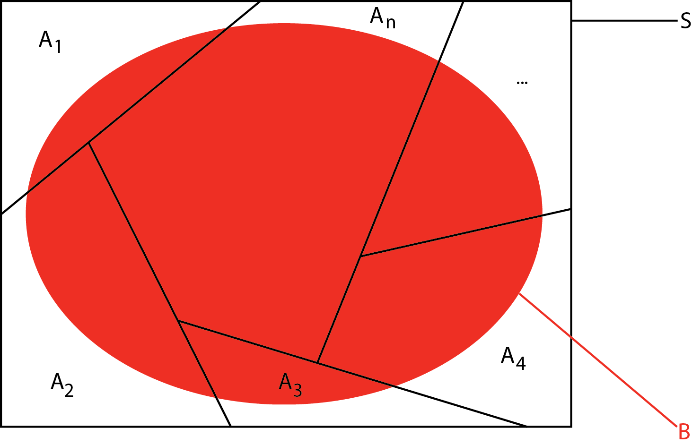
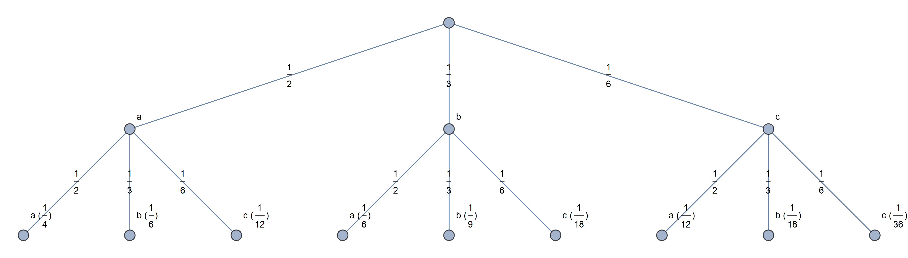
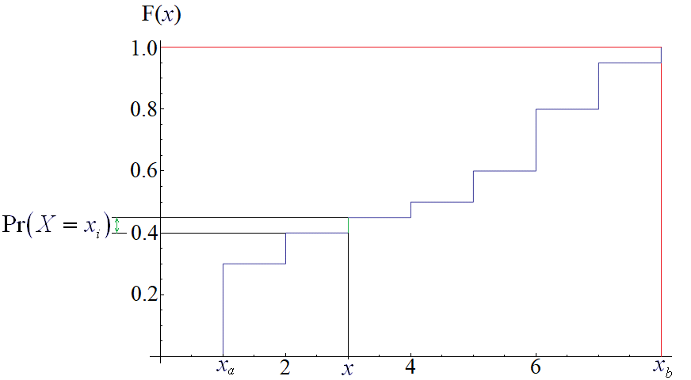
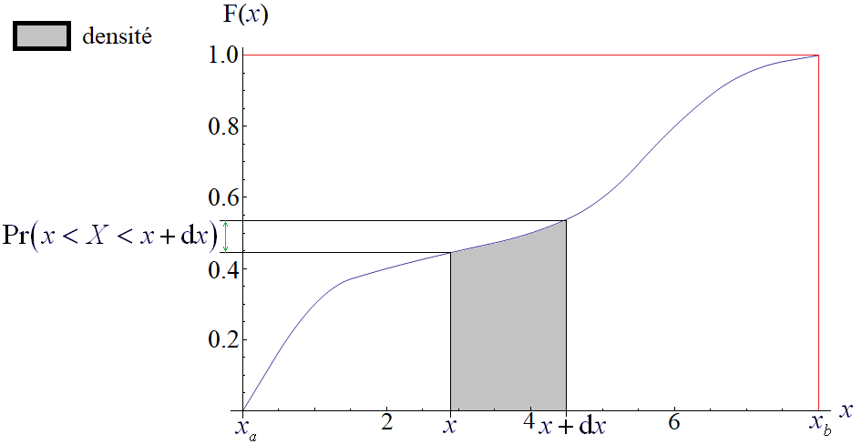
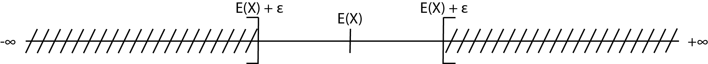
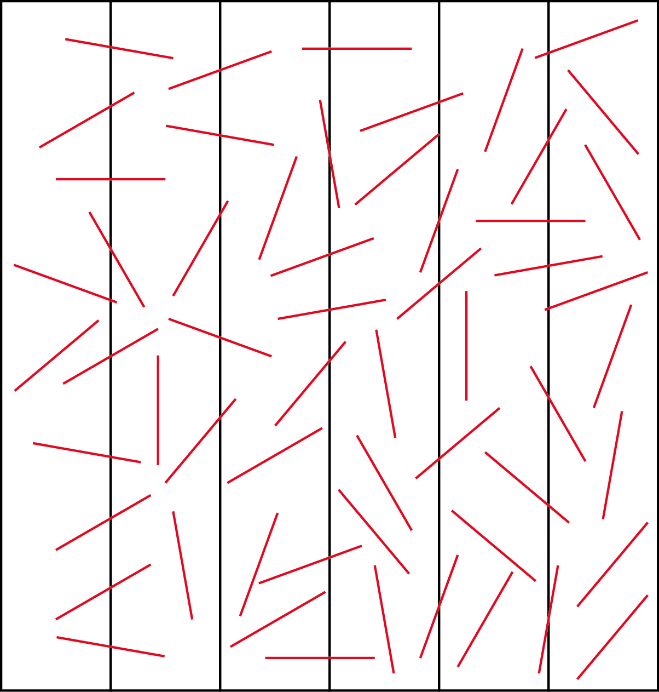
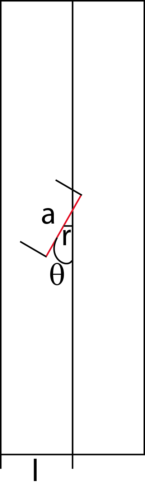

# Probabilités

Vous savez [dénombrer](./01-Denombrement.md). Désormais, il est possible d'envisager de comprendre les probabilités. En statistiques, les probabilités sont souvent ramener à des fréquences, qui correspondent à des « probabilités pratiques ». De fait, les statistiques ne peuvent être comprises qu'à deux conditions :

1. savoir dénombrer ;

2. savoir établir des probabilités.

Dans le cadre des statistiques, il est difficile de ne pas évoquer la notion de probabilité. Toutefois, il est fondamental, pour bien comprendre ce chapitre, qu'il ne s'agit que de récapituler les notions utiles dans le cadre des statistiques des variables quantitatives. Dit autrement, ce chapitre n'est qu'une vaste introduction à la notion mathématique de probabilité.

Mathématiquement, les probabilités peuvent être très complexes. En cas pratique, il faut savoir reconnaître des situations plutôt simples, mais parfois contre-intuitives. Il n'y a pas de secret, il faut pratiquer pour comprendre.

Le calcul de probabilité, « reposant sur des définitions et conventions purement logiques, constitue, en soi, un corps de doctrine indépendant de toute réalité ; mais qu'à l'expérience il s'est révélé applicable à certaines réalités bien concrètes »[^1]. H. Baulig[^2], un géographe, exprimait ainsi sa méfiance vis-à-vis des probabilités. Sont-elles pertinentes dans un contexte géographique ? Ce chapitre n'a pas la prétention de répondre à cette question. Il expose les bases nécessaires pour vous forger votre propre opinion.

Commençons par un cas pratique : le [problème du chevalier de Méré](./PDF/Mere.pdf)[^3].

Le calcul de probabilité s'occupe des **phénomènes aléatoires** (ou processus stochastiques). De tels phénomènes ont pour caractéristique de ne pas arriver tout le temps à la même issue. Les probabilités permettent ainsi de décrire des situations dans lesquelles le futur est incertain.

D'un point de vue mathématique, les probabilités ont longtemps été formulées intuitivement. Elles trouvent leur origine dans le [**problème du chevalier de Méré**](./PDF/Mere.pdf) au XVIIe siècle. « Deux joueurs, Primus et Secondus, engagent chacun 32 pistoles dans un jeu de pile ou face ; empochera les 64 pistoles, celui d'entre eux qui, le premier, aura obtenu trois succès, consécutifs ou non. Ils jouent une première manche, Primus gagne ; ils sont à ce moment obligés de se séparer, la partie ne sera jamais terminée. Comment partager équitablement l'enjeu entre eux ? » En effet, si Primus gagne la première manche, il a davantage de chances de gagner les trois manches. De fait, il serait injuste de rendre les mises initiales à Primus et Secondus. **Comment traduire l'espérance de chacun ?**
Pour répartir équitablement le gain de Primus par rapport à Secondus, Primus empoche 44 pistoles. Il réalise un gain de 12 pistoles, tandis que Secondus empoche 20 pistoles. Il réalisé une perte de 12 pistoles.

Par la résolution de ce problème, B. Pascal[^4] introduisit les notions d'**espérance** (le gain espéré par les joueurs) et la notion de **probabilité**. Afin d'éviter toute confusion avec les termes utilisés en probabilités modernes, les définitions de B. Pascal ne doivent pas être reprises.

La formalisation définitive et l'usage dans la modélisation des probabilités est assez récente. Elle fut inventée par A. N. Kolmogorov[^5] en 1933. Toutefois, certaines notions clés furent inventées bien plutôt, ce qui confèrent aux probabilités une histoire ancienne. Par exemple, T. Bayes[^6] inventa la notion de **probabilités conditionnelles**, ainsi qu'un théorème sur lequel certains ont longtemps pensé fonder la statistique. Malheureusement, s'il est parfait d'un point de vue théorique, il s'est avéré quasiment inutilisable en pratique jusqu'à l'arrivée des ordinateurs.

Les usages des probabilités sont nombreuses. On les rencontre principalement :

1. dans les jeux de hasard ;

2. dans la gestion du risque (assurance, industrie) ;

3. dans la gestion des processus stochastiques ;

4. dans la finance (portefeuilles).

Le géographe est-il confronté à la gestion du hasard ? La réponse est **affirmative**. La géographie du risque regroupe aussi bien des problèmes de géographie physique (crues, avalanches, précipitations, *etc*.) que de géographie humaine (circulation routière, *etc*.) En réalité, le hasard est présent dans toutes les branches de la géographie. Il faut savoir l'ordonner, l'étudier. Pour ce, il convient d'utiliser : 

1. les raisonnements probabilistes ;

2. les modèles statistiques associés.

## Les axiomes de Kolmogorov

Le calcul des probabilités est l'étude des phénomènes aléatoires ou non déterministes. La théorie moderne des probabilités repose sur les **quatre axiomes de A. N. Kolmogorov**.

La validité du modèle mathématique pour une **expérience** donnée dépend de la similitude des probabilités attribuées avec les fréquences relatives réelles. Ainsi, probabilités et statistiques se lient, notamment avec des tests et des estimations.

Une **expérience aléatoire** a un résultat impossible à connaître à l'avance.

- **Exemple.** Une population statistique permet de réaliser une infinité d'expériences aléatoires.

L'ensemble de tous les résultats $S$ est appelé un **univers**, ou **ensemble fondamental**, ou **ensemble des possibilités**. Il correspond à l'ensemble des réalisations potentielles. Tout élément appartenant à $S$ est une **éventualité** $e$. Un sous-ensemble de $S$ est appelé un **événement** $E$. Tout événement possède un **complément** (ou un **contraire**), c'est-à-dire si $e$ n'est pas réalisé, noté $\lnot E$ ou $E^C$ ou $S / E$. Une éventualité peut aussi être désignée comme un événement élémentaire.

$\varnothing$ est l'**événement impossible**.

$S$ est l'**événement certain**.

Soient $A$ et $B$ deux événements alors :

- $A \cup B$ est l'événement qui se produit si $A$ est réalisé, ou si $B$ est réalisé, si $A$ et $B$ sont réalisés ;

- $A \cap B$ est l'événement qui se produit si $A$ et $B$ sont réalisés.

Deux événements sont **incompatibles** si deux événements $A$ et $B$ sont **disjoints**. Lorsque deux événements $A$ et $B$ sont disjoints, c'est-à-dire lorsque $A \cap B = \varnothing$, on dit qu'ils **s'excluent mutuellement**. Dit autrement, $A$ et $B$ s'excluent mutuellement lorsqu'ils ne peuvent pas se réaliser simultanément.

Si l'univers $S$ est **fini** ou **infiniment dénombrable**, alors chaque sous-ensemble $S$ est un événement.

Si l'univers $S$ n'est **pas dénombrable**, certains sous-ensembles de $S$ ne peuvent être des événements.

Tous les événements forment une $\sigma$-algèbre $\varepsilon$ de sous-ensembles de $S$. L'algèbre des événements renvoie aux opérations ensemblistes (union, intersection, complémentaire, *etc*.).

Soient $S$ un univers, $\varepsilon$ la famille des événements, et $\Pr$ une fonction à valeurs réelles définies sur $\varepsilon$. On dit que $\Pr$ est une **fonction de probabilité**, et que $\Pr \left( A \right)$ est la probabilité de l'événement $A$.

Par exemple, pour une expérience de jets de dé, $S$ possède six éventualités que l'on peut noter : $e_1 = 1$, $e_2 = 2$, $e_3 = 3$, $e_4 = 4$, $e_5 = 5$, $e_6 = 6$, c'est-à-dire que $S = \left\lbrace 1, 2, 3, 4, 5, 6 \right\rbrace$, et représente un **ensemble fini**. Si on définit un événement $E$ tel que $E = \left\lbrace e_1, e_2, e_3 \right\rbrace$, alors son contraire est $E^C = \left\lbrace e_4, e_5, e_6 \right\rbrace$.

Si on définit l'événement $A$ comme l'ensemble des chiffres pairs du dé, $A = \left\lbrace e_2, e_4, e_6 \right\rbrace$. Si on définit l'événement $B$ comme l'ensemble des chiffres impairs du dé, $B = \left\lbrace e_1, e_3, e_5 \right\rbrace$. $A \cap B = \varnothing$, donc $A$ et $B$ sont incompatibles.

Une **probabilité** est un nombre compris entre 0 et 1, 0 étant l'événement impossible, et 1, l'événement certain (axiome 1). La probabilité d'un événement est la proportion de cas pour lesquels l'événement se manifeste si l'expérience est répétée **indépendamment** et **sous les mêmes conditions** à l'infini. La probabilité correspond à la limite de la fréquence relative.

$\Pr \left( E \right)  = \lim_{n \rightarrow +\infty} f_n$

où $f_n$ est la fréquence relative de l'événement $E$. Cette remarque est fondamentale pour comprendre les liens entre les probabilités et les distributions statistiques.

Plus simplement, une probabilité correspond au rapport entre le nombre de cas réalisés (ou favorables) pour un événement donné et le nombre total d'événements possibles dans l'univers.

> [!WARNING]
> La probabilité de l'événement impossible $E$, c'est-à-dire l'ensemble vide, est nulle.
> $\Pr \left( E \right) = \Pr \left( \varnothing \right) = 0$

> [!WARNING] La probabilité de l'événement certain $E$ vaut 1 (axiome 2).
> $\Pr \left( E \right) = \Pr \left( \S \right) = 1$

Si $A$ et $B$ sont des événements qui s'excluent mutuellement, alors :

$\Pr \left( A \cup B \right) = \Pr \left( A \right) + \Pr \left( B \right)$

Cela se généralise avec $A_n$ événements s'excluant mutuellement (axiome 3).

$\Pr \left( A_1 \cup A_2 \cup \ldots{} \cup A_n \right) = \Pr \left( A_1 \right) + \Pr \left( A_2 \right) + \ldots{} + \Pr \left( A_n \right)$

En résumé, on note les probabilité $\Pr \left( e_i \right)$ avec $i \in \mathbb{N}$. Les axiomes de Kolmogorov sont : 

1. la positivité de $\Pr \left( e_i \right)$ ; 

2. l'**échelle** de $\Pr \left( e_i \right)$ comprise entre 0 et 1 ; 

3 l'**additivité de deux événements incompatibles**.

### La notion de tribu

Soit $X$ un ensemble et soit $A$ une partie de $X$, une **tribu** vérifie trois axiomes :

- $A$ n'est pas vide ;

$A \neq \varnothing$		

- $A$ est stable par complémentaire.

$\forall B \in A, \mathrm{C}_{A}^{B} \in A$

- $A$ est stable par union dénombrable.

$\textrm{si } \forall n \in \mathbb{N}, B_n \in A, \textrm{ alors } \bigcup B_n \in A.$

Dit autrement, une **tribu** est une algèbre d'ensembles stable par réunion dénombrable.

Le couple $\left( X, A \right)$ est appelé **espace mesurable** ou **espace probabilisable**. Dans un contexte probabiliste, les parties de $X$ qui appartiennent à la tribu $A$ sont appelées des événements ; dans le cadre d'une mesure, des ensembles mesurables.

Il faut juste retenir que, dans le cadre probabiliste, la tribu normale est la **tribu de E. Borel**[^7] (ou tribu borélienne). Géométriquement, la tribu de E. Borel correspond à la droite des réels. La notion ne servira pas dans cet exposé, mais le lecteur peut la rencontrer dans des textes d'approfondissement.

#### Ensembles probabilisés finis

Soit $S$ un univers fini, $S = \left\lbrace a_1, a_2, \ldots{}, a_n \right\rbrace$. Si, à chaque point $a_i \in S$, on attribue un réel $p_i$, appelé **probabilité de** $a_i$, vérifiant :

1. chaque $p_i$ est positif ou nul $\left( p_i \geq 0\right)$ ;

2. la somme $p_i$ est égale à 1 :

$p_1 + p_2 + \ldots{} + p_n = 1$

alors on dit que l'on est en présence d'un **ensemble probabilisé fini**.

On définit alors la probabilité $\Pr \left( A \right)$ d'un événement quelconque $A$ comme étant la somme des probabilités des points de $A$. Pour des raisons de commodité, on écrit $\Pr \left( a_i \right)$ au lieu de $\Pr \left( \left\lbrace a_i \right\rbrace \right)$.

##### Exercice type

Trois chevaux $A$, $B$ et $C$ participent à une course. $A$ a deux fois plus de chances que $B$ de gagner. $B$ a deux fois plus de chances que $C$ de gagner.

- Quelles sont les probabilités respectives $\Pr \left( A \right)$, $\Pr \left( B \right)$ et $\Pr \left( C \right)$ de gagner des trois chevaux ?

    - On pose $\Pr \left( C \right) = p$.
    
    - On sait que $\Pr \left( B \right) = 2p$.
    
    - On sait que $\Pr \left( A \right) = 2 \Pr \left( B \right) = 4p$.
    
    - Or $\Pr \left( A \right) + \Pr \left( B \right) + \Pr \left( C \right) = 1$

        $4p + 2p + p = 1 \Leftrightarrow p = \frac{1}{7}$

    - On en déduit que :

$\Pr \left( A \right) = \frac{4}{7}$

et

$\Pr \left( B \right) = \frac{2}{7}$

et

$\Pr \left( C \right) = \frac{1}{7}$

- Quelle est la probabilité pour que $B$ **ou** $C$ soit vainqueur ?

$\Pr \left( \left\lbrace B, C \right\rbrace  \right) = \left( B \right) + \Pr \left( C \right) = \frac{2}{7} + \frac{1}{7} = \frac{3}{7}$

#### Ensembles finis équiprobables

Si, dans un univers $S$, chaque élément possède la même probabilité, alors il s'agit d'un **espace équiprobable** (ou uniforme).

Soit l'univers $S = \left\lbrace e_1, e_2, \ldots{}, e_n \right\rbrace$. L'**équiprobabilité** correspond au cas où chaque éventualité dispose de la même probabilité. Ce sont des **probabilités symétriques** qui sont très fréquentes aux niveaux des jeux de hasard comme les dés.

$\Pr \left( e_1 \right) = \Pr \left( e_2 \right) = \ldots{} = \Pr \left( e_n \right) = p$

Dit autrement,

$\Pr \left( S \right) = \Pr \left( e_1 \right) + \Pr \left( e_2 \right) + \ldots{} + \Pr \left( e_n \right) = n p = 1$

Les probabilités se réduisent à une seule identique pour chaque éventualité. Elle vaut :

$p = \frac{1}{p} = \frac{1}{\mathrm{card} E}$

Dit autrement, si l'univers $S$ contient $n$ éléments, la probabilité de chaque élément est : $\frac{1}{n}$. Si un événement $A$ est formé de $r$ éléments, sa probabilité est :

$\Pr \left( A \right) = r \times \frac{1}{n} = \frac{r}{n}$

avec $r$ le nombre de cas favorables à la réalisation de l'événement $A$ et $n$ le nombre de cas possibles de l'univers $S$.

> [!WARNING]
> La moyenne arithmétique pose cette hypothèse.

> [!WARNING]
> « Choisir un élément au hasard dans l'ensemble $S$ » signifie que $S$ est un espace équiprobable, ce qui signifie que chaque élément de $S$ a la même probabilité.

#### Ensembles fondamentaux infinis

$S$ est un univers infiniment dénombrable.

$S = \left\lbrace  a_1, a_2, \ldots{} \right\rbrace$

Comme dans le cas fini, on obtient un espace probabilisé en attribuant à chaque $a_i \in S$ un nombre réel $p_i$; appelé sa probabilité et tel que :

1. $p_i \geq 0$ ;

2. $p_1 + p_2 + \ldots{} = \sum_{i = 1}^{\infty} p_i = 1$

La probabilité $\Pr \left( A \right)$ d'un événement quelconque $A$ est alors la somme de tous ses éléments.

#### Ensembles discrets et continus

On dit qu'un ensemble probabilisé **fini ou infini dénombrable** est **discret**, tandis qu'un ensemble probabilisé **non dénombrable** est dit **non discret** (ou continu).

### L'addition de probabilités

Les probabilités de deux événements peuvent s'additionner sous certaines conditions. Cela arrive lorsque l'on s'intéresse à l'union de deux ou de plusieurs événements.

1. **Théorème.** La probabilité de l'événement contraire correspond à la différence entre 1 et la probabilité de l'événement.

$\Pr \left( E^C \right) = 1 - \Pr \left( E \right)$

2. **Axiome 3.** Si deux événements $E$ et $F$ sont incompatibles, c'est-à-dire que leur intersection est nulle, que ce sont deux ensembles disjoints, la probabilité qu'au moins un des deux survienne est égale à la somme de leurs probabilités respectives.
    
    $\Pr \left( E \textrm{ ou } F \right) = \Pr \left( E \right) + \Pr \left( F \right)$

    - **Théorème.** Si $E \subset F$, alors $\Pr \left( E \right) \leq \Pr \left( F \right)$.
     
    - **Théorème.** Soient deux événements $E$ et $F$, alors :

$\Pr \left( \bar{F} \right) = \Pr \left( E \right) - \Pr \left( E \cap F \right)$

- **Théorème.** À l'opposé, si les événements sont compatibles, c'est-à-dire que leur intersection est non nulle, l’addition des probabilités donne une fausse solution. Il faut nécessairement lui ôter les valeurs de l'intersection.

$\Pr \left( E \textrm{ ou } F \right) = \Pr \left( E \right) + \Pr \left( F \right) - \Pr \left( E \textrm{ et } F \right)$

Cela correspond à la probabilité que l'un ou l'autre des événements se produisent. La formule reprend celle des quatre cardinaux.
    
- **Corollaire.** $E$, $F$ et $G$ sont des événements quelconques :

$\begin{array}{l} \Pr \left( E \cup F \cup G \right) = \Pr \left( E \right) + \Pr \left( F \right) + \Pr \left( G \right) - \Pr \left( E \cap F \right) - \Pr \left( E \cap G \right) \\ - \Pr \left( F \cap G \right) + \Pr \left( E \cap F \cap G \right) \end{array}$

> [!WARNING]
> Lors d'un cas pratique, il faut tenter de décomposer le problème en éléments incompatibles.

### La multiplication de probabilités

La multiplication de deux probabilités intervient lorsque l'on souhaite calculer la probabilité d'une intersection de deux événements, c'est-à-dire la chance que les deux arrivent simultanément lors d'une expérience.

#### Événement dépendant et événement indépendant

Deux événements sont **indépendants** si la connaissance préalable que le premier arrivera ne change pas la probabilité de l'autre. Les résultats d'un tirage avec remise sont indépendants – la remise ne change pas le nombre total d'événements possibles –, tandis que les résultats d'un tirage sans remise sont en général dépendants – la non remise change le nombre total d'événements possibles d'un tirage à l'autre.

Si deux événements $E$ et $F$ sont indépendants, la probabilité que tous les deux se produisent simultanément est le produit des deux probabilités de $E$ et de $F$.

$\Pr \left( E \textrm{ et } F \right) = \Pr \left( E \right) \times \Pr \left( F \right)$

Cela implique que la probabilité de l'un ne modifie pas la probabilité de l'autre lorsque l'autre est réalisé.

> [!WARNING]
> Ne pas confondre indépendant et incompatible.

#### Probabilité conditionnelle (ou épreuves successives)

Toute probabilité n'est bien définie qu'en fonction des connaissances disponibles. Cela implique en particulier que la valeur d'une probabilité peut changer et doit s'adapter si davantage de connaissances sont acquises au cours d'une expérience. Ce concept de connaissances partielles est une idée pivot du calcul de probabilité. C'est dans ce cadre qu'interviennent les probabilités conditionnelles.

La **probabilité conditionnelle** de l'événement $E$ en connaissant (ou en sachant) $F$, notée $\Pr \left( E / F\right)$, est donnée par :

$\Pr \left( E / F \right) = \frac{\Pr \left( E \cap F \right) }{\Pr \left( F \right) }$

c'est-à-dire que la probabilité que deux événements se produisent vaut :

$\Pr \left( E \cap F \right) = \Pr \left( E / F\right) \times \Pr \left( F \right)$

C'est le **théorème des probabilités composées**.

**Théorème.** Sur un univers $S$, soient deux événements $E$ et $F$, alors :

$\Pr \left( E / F\right) = \frac{\textrm{nombre de réalisations possibles de } E \textrm{ et } F}{\textrm{nombre de réalisations possibles de } E}$
    
Comme $E \cap F = F \cap E$, on peut en déduire que :

$\Pr \left( F \cap E \right) = \Pr \left( F \right) \times \Pr \left( E / F \right)$

**Corollaire.** Pour des événements quelconques $E_1$, $E_2$, \ldots{}, $E_n$

$\begin{array}{l} \Pr \left( E_1 \cap E_2  \cap \ldots{}  \cap E_n \right) = \Pr \left( E_1 \right) \times \Pr \left( E_2 / E_1 \right) \times \Pr \left( E_3 / E_1 \cap E_2 \right) \\ \ldots{} \Pr \left( E_n / E_1 \cap E_2 \cap \ldots{} \cap E_{n - 1} \right) \end{array}$

Il est alors possible de reformuler la définition de l'indépendance de deux événements. Deux événements $E$ et $F$ sont indépendants, si la probabilité conditionnelle de $E$ sachant $F$ vaut la probabilité de $E$, et si la probabilité conditionnelle de $F$ sachant $E$ vaut la probabilité de $F$.

$\left\lbrace  \begin{array}{c} \Pr \left( E / F \right) = \Pr \left( E \right)\\ \Pr \left( F / E \right) = \Pr \left( F \right) \end{array} \right.$

On dit qu'un événement $F$ est **indépendant** d'un événement $E$ si la probabilité pour que $F$ se produise n'est pas influencée par le fait que $E$ se soit ou ne se soit pas produit. Dit autrement, $F$ est indépendant de $E$ si la probabilité $F$ est égale à la probabilité conditionnelle de $F$ sachant que $E$ s'est produit.

$\Pr \left( F \right) = \Pr \left( F / E \right)$

Si on remplace $\Pr \left( F / E \right)$ par $\Pr \left( F \right)$ dans le théorème de la multiplication :

$\Pr \left( E \cap F \right) = \Pr \left( E \right) \Pr \left( F / E \right)$

on obtient l'équation définissant formellement l'indépendance entre $A$ et $B$ :

$\Pr \left( E \cap F \right) = \Pr \left( E \right) \Pr \left( F \right)$

Dans le cas contraire, les événements sont dépendants.

> [!WARNING]
> Très fréquemment, on postulera que deux événements sont indépendants d'après la nature de l'expérience.

On dit que **trois** événements $E$, $F$ et $G$ sont indépendants si :

1. les événements sont indépendants deux à deux :

$\begin{array}{l} \Pr \left( E \cap F \right) = \Pr \left( E \right) \Pr \left( F \right)\\ \Pr \left( E \cap G \right) = \Pr \left( E \right) \Pr \left( G \right)\\ \Pr \left( F \cap G \right) = \Pr \left( F \right) \Pr \left( G \right) \end{array}$

2. $\Pr \left( E \cap F \cap G \right) = \Pr \left( E \right) \Pr \left( F \right) \Pr \left( G \right)$

#### Principe de probabilité totale

Il est possible de décomposer la probabilité de tout autre événement en somme.

Soit $E$ un événement, il vérifie les propriétés suivantes par définition :
$E \subset S$

$E \cup E^C = S$

$E \cap E^C = \varnothing$

Soit $F$ un autre événement, il est défini par :

$F \subset S$

$F = F \cap E = F \cap \left( E \cup E^C \right) = \left( F \cap E \right) \cup \left( F \cap E^C \right)$

Dit autrement, la probabilité de $F$ vaut alors :

$\Pr \left( F \right) = \Pr \left( \left( F \cap E \right) \cup \left( F \cap E^C \right) \right)$

$\Pr \left( F \right) = \Pr \left( \left( F \cap E \right) \right) + \Pr \left( \left( F \cap E^C \right) \right)$

$\Pr \left( F \right) = \Pr \left( E \right) \times \Pr \left( F / E \right) + \Pr \left( E \right) \times \Pr \left( F / E^C \right)$

$\Pr \left( F \right) = \Pr \left( E \right) \times \left( \Pr \left( F / E \right) + \Pr \left( F / E^C \right) \right)$

Cette équation se généralise assez facilement en :

$\Pr \left( F \right) = \sum_{k = 1}^{n} \Pr \left( E_k \right) \times \Pr \left( F / E_k \right)$

avec une partition de l'univers $S$ telle que $E_i \cap E_j = \varnothing$ avec $i \neq j$, $i \in \left[ 1, n \right]$ et $j \in \left[ 1, n \right]$.

#### Théorème de Bayes

Le diagramme en arbre est utile pour représenter des expériences avec une partition naturelle de l'ensemble fondamental, ou bien des expériences qui se font en étapes. La loi de la probabilité totale permet de calculer la probabilité d'un événement quelconque. Le théorème de Bayes renverse ce problème. Au lieu de demander avec quelle probabilité un résultat se produit lors de l'expérience, on s'interroge sur la manière dont un résultat particulier a pu se produire.

Soient des événements $A_1$, $A_2$, \ldots{}, $A_n$ formant une partition de l'univers $S$. Les événements $A_i$ s'excluent mutuellement et leur réunion est $S$.

Soit $B$ un autre événement quelconque dans $S$ (Fig. 1), alors $B = S \cap B$, or $S = A_1 \cup A_2 \cup \ldots{} \cup A_n$

$\begin{array}{l} B = \left( A_1 \cup A_2 \cup \ldots{} \cup A_n \right) \cap B\\ B = \left( A_1 \cap B \right) \cup \left( A_2 \cap B \right) \cup \ldots{} \cup \left( A_n \cap B \right) \end{array}$

**Figure 1. Partition des ensembles $A_i$ dans S et $B$ dans $S$**

$A_i \cap B$ s'excluant mutuellement. On peut dire que :

$\Pr \left( B \right) = \Pr \left( A_1 \cap B \right) + \Pr \left( A_2 \cap B \right) + \ldots{} + \Pr \left( A_n \cap B \right)$

D'après le théorème de la multiplication :

$\Pr \left( B \right) = \Pr \left( A_1 \right) \Pr \left( B / A_1 \right) + \Pr \left( A_2 \right) \Pr \left( B / A_2 \right) + \ldots{} + \Pr \left( A_n \right) \Pr \left( B / A_n \right)$

Pour un $i$ donné, la probabilité conditionnelle de $A_i$ en sachant $B$ réalisé, est définie par :

$\Pr \left( A_i / B \right) = \frac{\Pr \left( A_i \cap B \right)}{\Pr \left( B \right)}$

Or la partition représentée par $\Pr \left( B \right)$ est connue, et permet d'énoncer le **théorème de T. Bayes**.

**Théorème de T. Bayes.** Soient $A_1$, $A_2$, \ldots{}, $A_n$, une partition de $S$, et $B$ un événement quelconque pour tout $i$, on a alors :

$\Pr \left( A_i / B \right) = \frac{\Pr \left( A_i \right) \Pr \left( B / A_i \right)}{\sum_{j = 1}^{n} \left(\Pr \left( A_j \right) \Pr \left( B / A_j \right)\right)}$

Par comprendre de quoi il s'agit, on peut reprendre l'expérience de Bayes. Soient trois urnes contenant des boules rouges. L'urne n°1, notée $A_1$, contient de 2 boules rouges sur 5. L'urne \no2, notée $A_2$, contient 3 boules rouges sur 5. L'urne \no3, notée $A_3$, continent 1 boule rouge sur 5. Avec un dé, on décide que si le lancer est 1, 2 ou 3, on pioche dans $A_1$, si le lancer est 4 ou 5, on pioche dans $A_2$, et si le lancer est 6, on pioche dans $A_3$. Sans connaître le résultat du dé, quelle est la probabilité de tirer une boule rouge ?

Dans ce cas, les événements sont incompatibles. Pour répondre à cette question, on calcule une **probabilité *a posteriori***, définie comme le rapport entre une probabilité conditionnelle et l'application du théorème des probabilités totales, c'est-à-dire :

$\Pr \left( E_k / F \right) = \frac{\Pr \left( E_k \right) \times \Pr \left( F / E_k \right) }{\sum_{i = 1}^{n} \Pr \left( E_k \right) \times \Pr \left( F / E_k \right) }$

où $\Pr \left( E_k \right)$ est une **probabilité *a priori***. Le souci est qu'elle est souvent inconnue. Le théorème est de fait impossible à mettre en œuvre. La probabilité *a priori* relève souvent d'une **probabilité subjective** (ou personnelle).

Toutefois, il est possible d'obtenir des probabilités *a priori* par des chroniques historiques (crues) ou un historique Internet (traitement des spams). Avec la massification des données, la statistique bayésienne et les réseaux bayésiens ont fait leur retour en force dans les applications.

##### La technique de la capture-recapture

Soit $N$ l'ensemble des poissons d'un lac, pour lequel $n$ est inconnu. Comment estimer $n$ ?

Soit $n_1$ une capture de poissons (c'est-à-dire un échantillon de $n$). On met une bague à ses poissons et on les rejette dans le lac.

Soit $n_2$ une deuxième capture de poissons (c'est-à-dire un nouvel échantillon de $N$). Dans ce cas, il existe une portion de poissons déjà bagués représentée par le nombre $k$.

Intuitivement, la portion $\frac{n_1}{n}$ est identique à $\frac{k}{n_2}$.

$\frac{n_1}{n} = \frac{k}{n_2} \Rightarrow n = \frac{{n_1} {n_2}}{k}$

Si l'on formule en termes de probabilités la deuxième pêche, $\Pr \left( k / n \right)$ est le rapport entre les cas favorables et le nombre de cas total.

On capture $k$ parmi les $n_1$ poissons marqués, c'est-à-dire $\left( \begin{array}{c} n_1 \\ k \end{array} \right)$.

Il existe $\left( n_2 - k \right)$ poissons non marqués parmi les $\left( n - n_1 \right)$ poissons non marqués, c'est-à-dire $\left( \begin{array}{c} n - n_1 \\ n_2 - k \end{array} \right)$.

Le cas total est $n_2$ parmi $n$, c'est-à-dire $\left( \begin{array}{c} n \\ n_2 \end{array} \right)$.

Au final,

$\Pr \left( k / n \right) = \frac{\left( \begin{array}{c} n_1 \\ k \end{array} \right) \left( \begin{array}{c} n - n_1 \\ n_2 - k \end{array} \right)}{\left( \begin{array}{c} n \\ n_2 \end{array} \right)}$

Le souci est que ce résultat ne correspond pas à celui qui est recherché. Il faut par conséquent appliquer le théorème de Bayes. Une nouvelle fois, la probabilité *a priori* est inconnue.

$\Pr \left( n / k \right) = \frac{\Pr \left( n \right) \times \Pr \left( k / n \right) }{\sum_{i = 1}^{n} \Pr \left( n \right) \times \Pr \left( k / n \right) }$

La notion de **vraisemblance** permet de résoudre le problème.

Une première étape consiste à regarder la probabilité pour $n + 1$.

$\frac{\Pr \left( k / n + 1 \right)}{\Pr \left( k / N \right)} = \frac{\left( n + 1 - n_1 \right) \left( n + 1 -n_2 \right)}{\left( n + 1 - n_1 - n_2 \right) \left( n + 1 \right)} = \frac{{n_1}{n_2}}{k} - n$

avec $\frac{\Pr \left( k / n + 1 \right)}{\Pr \left( k / n \right)} \leq 1$. De fait,

$n \geq \frac{{n_1}{n_2}}{k} - 1$

Une seconde étape consiste à regarder la probabilité pour $n - 1$.

$\frac{\Pr \left( k / n \right)}{\Pr \left( k / n - 1 \right)} = \frac{\left( n - n_1 \right) \left( n - n_2 \right)}{\left( n - n_1 - n_2 + k \right) n} = \frac{{n_1}{n_2}}{n k}$

avec $\frac{\Pr \left( k / n \right)}{\Pr \left( k / n - 1 \right)} \geq 1$. De fait,

$n \leq \frac{{n_1}{n_2}}{k}$

En combinant les deux inéquations, il est **vraisemblable** que :

$\frac{{n_1}{n_2}}{k} - 1 \leq n^{*} \leq \frac{{n_1}{n_2}}{k}$

$n^{*}$ est une estimation de $n$. La base de l'échantillonnage repose sur la notion de vraisemblance.

#### Épreuves indépendantes ou répétées

Soit $S$ un univers fini. Par $n$ **épreuves indépendantes** (ou répétées), on entend l'ensemble probabilisé $T$ formé de $n$-uples ordonnés d'éléments de $S$, la probabilité d'un $n$-uple étant définie comme le produit des probabilités de ses composantes :

$\Pr \left( \left\lbrace  s_1, s_2, \ldots{}, s_n \right\rbrace \right) = \Pr \left( s_1 \right) \Pr \left( s_2 \right) \ldots{} \Pr \left( s_n \right)$

Les épreuves répétées peuvent se représenter par un arbre.

##### Exercice type

Chaque fois que trois chevaux $A$, $B$ et $C$ courent ensemble, leurs probabilités respectives de gagner sont $\frac{1}{2}$, $\frac{1}{3}$ et $\frac{1}{6}$.

_ Cela se traduit par l'univers $S = \left\lbrace A, B, C \right\rbrace$ et
    $\begin{array}{r} \Pr \left( A \right) \frac{1}{2} \\ \Pr \left( B \right) \frac{1}{3} \\ \Pr \left( C \right) \frac{1}{6} \end{array}$

> [!WARNING]
> $\Pr \left( A \right) + \Pr \left( B \right) + \Pr \left( C \right) = 1$

- Si les chevaux courent deux fois, l'univers des deux épreuves répétées est :

$T = \left\lbrace \left\lbrace a, a \right\rbrace, \left\lbrace a, b \right\rbrace, \left\lbrace a, c \right\rbrace, \left\lbrace b, a \right\rbrace, \left\lbrace b, b \right\rbrace, \left\lbrace b, c \right\rbrace, \left\lbrace c, a \right\rbrace, \left\lbrace c, n \right\rbrace, \left\lbrace c, c \right\rbrace \right\rbrace$

On obtient un arbre pondéré (Fig. 2).

- La probabilité que $A$ gagne toutes les courses est de $\frac{1}{2} \times \frac{1}{2} = \frac{1}{4}$.

- La probabilité que $A$, puis $B$, gagnent successivement est de $\frac{1}{2} \times \frac{1}{3} = \frac{1}{6}$.

- La probabilité que $A$, puis $C$, gagnent successivement est de $\frac{1}{2} \times \frac{1}{6} = \frac{1}{12}$.

- La probabilité que $B$, puis $A$, gagnent successivement est de $\frac{1}{3} \times \frac{1}{2} = \frac{1}{6}$.

- La probabilité que $B$ gagne toutes les courses est de $\frac{1}{3} \times \frac{1}{3} = \frac{1}{9}$.

- La probabilité que $B$, puis $C$, gagnent successivement est de $\frac{1}{3} \times \frac{1}{6} = \frac{1}{18}$.

- La probabilité que $C$, puis $A$, gagnent successivement est de $\frac{1}{6} \times \frac{1}{2} = \frac{1}{12}$.

- La probabilité que $C$, puis $B$, gagnent successivement est de $\frac{1}{6} \times \frac{1}{3} = \frac{1}{18}$.

- La probabilité que $C$ gagne toutes les courses est de $\frac{1}{6} \times \frac{1}{6} = \frac{1}{36}$.

> [!WARNING]
> $\frac{1}{4} + \frac{1}{6} + \frac{1}{12} + \frac{1}{6} + \frac{1}{9} + \frac{1}{18} + \frac{1}{12} + \frac{1}{18} + \frac{1}{36} = 1$

**Figure 2. Arbre pondéré présentant les neuf résultats possibles de la course de chevaux**

#### Épreuve de Bernoulli

On **répète** la **même expérience** dans les **mêmes conditions**.

On s'intéresse à chaque fois à la réalisation d'un événement. Chacun de ces expériences s'appelle une **épreuve de J. Bernoulli**. Elle se conclut par un **succès** ou un **échec**.

1. Chaque épreuve a deux issues : succès ($S$) ou échec ($E$).

2. Pour chaque épreuve, la probabilité d'un succès est la même.

$\begin{array}{l} \Pr \left( S \right) = p\\ \Pr \left( E \right) = q = 1 - p \end{array}$

3. Les épreuves sont **indépendantes**. Dit autrement, la probabilité d'un succès ne varie pas. Elle ne dépend pas des informations sur les résultats des autres épreuves.

**Théorème.** Soit un schéma de J. Bernoulli avec $p$ la probabilité d'un succès à une épreuve de J. Bernoulli et $n$ le nombre d'épreuves de J. Bernoulli effectuées. L'univers $\Omega$ est :

$\Omega = \left\lbrace S, E \right\rbrace \times \ldots{} \times \left\lbrace S, E \right\rbrace = \left\lbrace S, E \right\rbrace^n$

L'épreuve de J. Bernoulli servira dans un prochain chapitre pour introduire la loi de J. Bernoulli, la loi binomiale, la loi multinomiale, *etc*.

## L'approche des probabilités par les côtes

N'importe quelle probabilité $p$ peut être exprimée comme un pari. On définit la **côte** $d$ à « un contre un » par :
    $d = \frac{p}{p - 1}$

c'est-à-dire une probabilité valant :
    $p = \frac{d}{d - 1}$

## Les quatre espaces de probabilité les plus fréquents

Certains ont déjà été évoqués, mais, avant d'attaquer la notion de loi de probabilité, il est bon de rappeler quatre principaux espaces de travail pour les probabilités :

1. l'univers fini ou dénombrable ;

2. le cas équiprobable ;

3. le schéma binaire « succès » / « échec » ;

4. le cas où l'univers correspond aux nombres réels.

## La notion de variable aléatoire

Une **variable aléatoire** (v.a.) $X$ sur un univers $S$ est une **fonction** de $S$ dans l'ensemble $\mathbb{R}$ des nombres réels, telle que l'inverse de chaque intervalle de $\mathbb{R}$ soit un événement de $S$. À chaque événement élémentaire $s$, on associe une quantité $X \left( s \right)$.

> [!WARNING]
> Si $S$ est un ensemble discret dans lequel chaque sous-ensemble est un événement, toute fonction à valeurs réelles, définie sur $S$ est une variable aléatoire.

> [!WARNING]
>  Si $S$ est un ensemble non dénombrable, certaines fonctions à valeurs réelles définies sur $S$ ne sont pas des variables aléatoires.

> [!WARNING]
>  On utilise les lettres capitales de la fin de l'alphabet latin pour désigner les variables aléatoires $\left( X, Y, Z \right)$.

Soit $a \in \mathbb{R}$ et $b \in \mathbb{R}$, on note $\left( X = a \right)$ l'ensemble des antécédents de $a$ et $\left( X = b \right)$ l'ensemble des antécédents de $b$. On utilise les notations :

- $\Pr \left( X = a \right)$ pour $\Pr \left( \left\lbrace s \in S : X \left( s \right) = a \right\rbrace \right)$ ce qui se lit « si la variable aléatoire $X = a$, que vaut sa probabilité ? » ;

- $\Pr \left( a \leq X \leq b \right)$ pour $\Pr \left( \left\lbrace s \in S : a \leq X \left( s \right) \leq b \right\rbrace \right)$

En résumé, une variable aléatoire est un nombre réel qui dépend du résultat d'une expérience aléatoire. Une variable aléatoire réelle traduit l'idée de résultat numérique associé au phénomène aléatoire étudié. Néanmoins, il existe des variables aléatoires complexes et vectorielles (ou vecteur aléatoire, plongé dans un espace à $n$ dimensions). Chaque exécution de l'expérience génère une réalisation de variable aléatoire. Les variables aléatoires constituent un espace fondamental d'éléments aléatoires, un tel élément étant défini par référence à une expérience aléatoire.

## La notion de loi de probabilité

Soit $X$ une variable aléatoire définie sur un univers $S$ à valeurs finies, c'est-à-dire :

$X \left( S \right) = \left\lbrace x_1, x_2, \ldots{}, x_n \right\rbrace$

$X \left( S\right)$ devient un espace probabilité si l'on définit la probabilité $\Pr \left( X = x_i \right)$ des $x_i$, que l'on écrira $f \left( x_i \right)$. Cette fonction $f$ sur $X \left( S \right)$ qui est définie par $f \left( x_i \right) = \Pr \left( X = x_i \right)$ est ce que l'on appelle la **distribution** ou la **loi de probabilité** de $X$. On la donne sous la forme d'un tableau (Tab. 1).

|   |   |   |   | 
| :-: | :-: | :-: | :-: |
| $x_1$ | $x_2$ | ... | $x_n$ |
 | $f \left( x_1 \right)$ | $f \left( x_2 \right)$ | ... | $f \left( x_n \right)$ |
 
**Tableau 1. Loi de probabilité de $X$**

Si $X$ est une variable aléatoire ayant la loi de probabilité observée, la moyenne ou l'**espérance mathématique** de $X$ que l'on note $\mathbb{E} \left( X \right)$, ou ${\mu}_X$, ou $E$, ou $\mu$, est définie par :

$\mathbb{E} \left( X \right) = x_1 f \left( x_1 \right) + x_2 f \left( x_2 \right) + \ldots{} + x_n f \left( x_n \right) = \sum_{i = 1}^{n} x_i f \left( x_i \right)$

$\mathbb{E} \left( X \right)$ est la moyenne pondérée des valeurs que $X$ peut prendre, chaque valeur étant pondérée par sa probabilité.

**Proposition sur la linéarité.** Soient $X$ une variable aléatoire et $a$, $b$, deux réels.

$\mathbb{E} \left( aX + b \right) = a \mathbb{E} \left( X \right) + b$

**Théorème du transfert.** Soit $X$ une variable aléatoire et $f$ une fonction définie sur $X \left( \Omega \right)$, alors :

$\mathbb{E} \left( f \left( X \right) \right) = \sum_{k \in X \left( \Omega \right)}^{} f \left( k \right) \Pr \left( X = k \right)$

La variance de $X$, notée $\mathbb{V} \left( X \right)$, vaut :

$\mathbb{V} \left( X \right) = \sum_{i = 1}^{n} \left( x_i - \mathbb{E} \left( X \right) \right)^2 f \left( x_i \right) = E \left[ \left( X - \mathbb{E} \left( X \right) \right)^2 \right]$

L'écart type de $X$, noté ${\sigma}_X$, vaut :

${\sigma}_X = \sqrt{\mathbb{V} \left( X \right)}$

**Théorème.** $\mathbb{V} \left( \lambda \right) = \sum_{i = 1}^{n} \left( {x_i}^2 f \left( x_i \right) - \mathbb{E} \left( X \right)^2\right) = \mathbb{E} \left( X^2 \right) - \left[ \mathbb{E} \left( X \right) \right]^2$

**Théorème.** Soit $X$ une variable aléatoire et $k$ un nombre réel, on a alors :

1. $\mathbb{V} \left( X + k \right) = \mathbb{V} \left( X \right)$ ;

2. $\mathbb{V} \left( kX \right) = k^2 \mathbb{V} \left( X \right)$ ;

3. ${\sigma}_{X + k} = {\sigma}_{X}$ ;

4. ${\sigma}_{kX} = \left| k \right| {\sigma}_{X}$ ;

5. $\mathbb{V} \left( X \right) = 0$ $\Leftrightarrow$ $X$ est constante égale à $\mathbb{E} \left( X \right)$.

> [!WARNING]
>  La moyenne est le **centre de gravité du système**.

> [!WARNING]
>  La variance est le **moment d'inertie du système**. Variance et écart type mesurent la dispersion de la variable aléatoire autour de sa moyenne $\mathbb{E} \left( X\right)$.

> [!WARNING]
>  La variable aléatoire centrée-réduite $X^{*}$ vaut :
> - $X^{*} = \frac{X - \mathbb{E} \left( X \right)}{{\sigma}_X}$ ;
> - $\mathbb{E} \left( X^{*} \right) = 0$ et $\mathbb{V} \left( X^{*} \right) = 1$.

### Variables aléatoires discrètes

Si $X$ est une variable aléatoire sur $S$ avec un espace infini dénombrable, c'est-à-dire $X \left( S \right) = \left\lbrace x_1, x_2, \ldots{} \right\rbrace$ (Tab. 2). Ce genre de variables aléatoires est appelée **variable aléatoire discrète**. Comme dans le cas fini, on transforme $X \left( S \right)$ en un espace probabilisé, en définissant la probabilité de $x_i$ par $f \left( x_i \right) = \Pr \left( X = x_i \right)$, et on dit que $f$ est la loi de probabilité de $X$.

|   |   |   |   | 
| :-: | :-: | :-: | :-: |
| $x_1$ | $x_2$ | ... |
 | $f \left( x_1 \right)$ | $f \left( x_2 \right)$ | ... |
 
**Tableau 2. Loi de probabilité de la variable aléatoire discrète $X$**

La loi de probabilité $f$ pour une **variable aléatoire discrète** satisfait les conditions :

1. $f \left( x_i \right) \geq 0$ ;

2. $\Pr \left( X \right) = \sum_{i = 1}^{n} f \left( x_i \right) = 1$.

On définit l'espérance mathématique $\mathbb{E} \left( X \right)$ et la variance $\mathbb{V} \left( X \right)$ par :

- $\mathbb{E} \left( X \right) = x_1 f \left( x_1 \right) + x_2 f \left( x_2 \right) + \ldots{} = \sum{i = 1}^{n} x_i f \left( x_i \right)$ ;

- $\mathbb{V} \left( X \right) = \left( x_1 - \mu \right)^2 f \left( x_1 \right) + \left( x_2 - \mu \right)^2 f \left( x_2 \right) + \ldots{} = \sum{i = 1}^{n} \left( x_i - \mu \right)^2 f \left( x_i \right)$.

lorsque les séries correspondantes convergent absolument.

La variance $\mathbb{V} \left( X \right)$ existe si et seulement si $\mu = \mathbb{E} \left( X \right)$ et $\mathbb{E} \left( X^2 \right)$ existent en même temps, et que, dans ce cas, la formule

$\mathbb{V} \left( X \right) = \left( X^2 \right) - {\mu}^2$

est valable, comme dans le cas fini. Lorsque $\mathbb{V} \left( X \right)$ existe, on définit l'écart type ${\sigma}_X$, comme dans le cas fini, par :

${\sigma}_X = \sqrt{\mathbb{V} \left( X \right)}$

Les notions de loi de probabilité produit, de variables aléatoires indépendantes et de fonctions de variables aléatoires se transposent directement au cas général. Si $X$ et $Y$ sont définies sur le même univers $S$, et si $\mathbb{V} \left( X \right)$ et $\mathbb{V} \left( Y \right)$ existent en même temps, alors la série $\mathrm{cov} \left( X, Y \right)$ converge absolument.

### Variables aléatoires continues

Si $X$ est une variable aléatoire dont l'ensemble de valeur $X \left( S \right)$ est l'ensemble des points d'un intervalle.

Par définition, des variables aléatoires l'ensemble $\left\lbrace a \leq X \leq b \right\rbrace$ est un événement de $S$, et la probabilité $\Pr \left( a \leq X \leq b \right)$ est par conséquent bien définie.

On suppose qu'il existe une fonction continue par morceaux $f$ : $\mathbb{R} \rightarrow \mathbb{R}$ telle que $\Pr \left( a \leq X \leq b \right)$ soit égale à l'aire située en dessous de la courbe $f$, entre $x = a$ et $x = b$.

En termes de calcul intégral,

$\Pr \left( a \leq X \leq b \right) = \int_{a}^{b} f \left( x \right) \mathrm{d} x$

Dans ce cas, on dit que $X$ est une **variable aléatoire continue**. On appelle la fonction $f$, la **distribution** ou la **loi de probabilité continue** de $X$. Cette fonction satisfait les conditions :

1. $f \left( x \right) \geq 0$ ;

2. $\int_{\mathbb{R}}^{} f \left( x \right) \mathrm{d} x = 1$.

Cela signifie que $f$ est positive ou nulle et que l'aire totale en dessous de la courbe est égale à 1.

On définit l'**espérance mathématique** $\mathbb{E} \left( X \right)$ par :

$\mathbb{E} \left( X \right) = \int_{\mathbb{R}}^{} x f \left( x \right) \mathrm{d} x$

lorsqu'elle existe.

On définit les fonctions de variables aléatoires de la même manière que dans le cas discret. On peut montrer que si $Y = \Phi \left( X \right)$, alors :

$\mathbb{E} \left( Y \right) = \int_{\mathbb{R}}^{} \Phi \left( x \right) f \left( x \right) \mathrm{d} x$

lorsque le membre de droite existe.

On définit la variance $\mathbb{V} \left( X \right)$ par :

$\mathbb{V} \left( X \right) = \mathbb{E} \left[ \left( X - \mu \right)^2 \right] = \int_{\mathbb{R}}^{} \left( x - \mu \right)^2 f \left( x \right) \mathrm{d} x$

lorsqu'elle existe.

De la même manière que dans le cas discret, on peut montrer que $\mathbb{V} \left( X \right)$ existe si et seulement si $\mu = \mathbb{E} \left( X \right)$ et $\mathbb{E} \left( X^2 \right)$ existe en même temps, et qu'alors :

$\mathbb{V} \left( X \right) = \mathbb{E} \left( X^2 \right) - {\mu}^2 = \left[ \int_{\mathbb{R}}^{} x^2 f \left( x \right) \mathrm{d} x \right] - {\mu}^2$

Lorsque $\mathbb{V} \left( X \right)$ existe, on définit l'écart type ${\sigma}_X$ par :

${\sigma}_X = \sqrt{\mathbb{V} \left( X \right)}$

> [!WARNING]
> Les résultats établis pour les variables aléatoires finies seront supposés également valables dans le cas plus général des variables aléatoires discrètes et dans le cas continu.

On dit que des variables aléatoires continues en nombre fini, $X$, $Y$, \ldots{}, $Z$ sont **indépendantes** si pour tout intervalle $\left[ a, a' \right]$, $\left[ b, b' \right]$, \ldots{}, $\left[ c, c' \right]$

$\begin{array}{l} \Pr \left( a \leq X \leq a', b \leq X \leq b', \ldots{}, c \leq X \leq c' \right) = \Pr\left( a \leq X \leq a' \right) \Pr\left( b \leq X \leq b' \right) \\ \ldots{} \Pr\left( c \leq X \leq c' \right) \end{array}$

Ainsi, dans le cas continu, les intervalles jouent le même rôle que les points dans le cas discret.

## La fonction de répartition d'une variable aléatoire

Si $X$ est une variable aléatoire numérique (discrète ou continue), on peut considérer comme événement favorable $e$, le fait que $X$ soit inférieure ou égale à une valeur $x$ de $E$. La probabilité de voir se réaliser cet événement est une fonction numérique de $x$, comprise entre 0 et 1, et que l'on appelle **fonction de répartition** $F$.

### Variable aléatoire discrète

Soit $X$ une variable aléatoire définie sur $E$. On appelle **fonction de répartition de $X$** (ou fonction en non-dépassement), la fonction $F$ définie sur $\mathbb{R}$ par :

$\forall a \in \mathbb{R}, F \left( a \right) = \Pr \left( X \leq a \right) = \Pr \left( e / E \right)$

Cette loi de probabilité doit être **monotone** et **non décroissante** (c'est-à-dire strictement croissante) et **varier de 0 à 1** lorsque la valeur $x$ décrit l'intervalle de variation de $X$ : $\left[ x_i, x_{i + 1}\right]$.

Aux limites, lorsque $x \rightarrow -\infty$, $F \left( x \right)$ vaut 0. Lorsque $x \rightarrow +\infty$, $F \left( x \right)$ vaut 1.

Si la variable aléatoire est réelle et discrète, la fonction $F$ est continue à gauche et non dérivable.

Pour une variable aléatoire discrète, sa représentation graphique est un **« escalier »** (Fig. 3). On dit que la fonction de répartition varie **par plage**.

$X \left( E \right) = \left\lbrace x_1, x_2, \ldots{}, x_n \right\rbrace \textrm{ avec } x_1 < x_2 < \ldots{} < x_n$

La fonction est définie par :

$F \left( x \right) = \sum_{x_i \leq x}^{} f \left( x_i \right)$

**Figure 3. Exemple de fonction de répartition d'une variable aléatoire discrète**

$\begin{array}{l} x \in \left] -\infty, x_1 \right[, \left( X \leq x \right) = \varnothing, F \left( x \right) = 0 \\ x \in \left[ x_1, x_2 \right[, \left( X \leq x \right) = (X = x_1), F \left( x \right) = \Pr \left( X = x_1\right) \\ x \in \left[ x_2, x_3 \right[, \left( X \leq x \right) = (X = x_1) \cup (X = x_2), \\ F \left( x \right) = \Pr \left( X = x_1\right) + \Pr \left( X = x_2\right) \\ \\ \ldots{} \\ \\ x \in \left[ x_n, +\infty \right[, \left( X \leq x \right) = (X = x_1) \cup (X = x_2) \cup \ldots{} \cup (X = x_n), \\ F \left( x \right) = \Pr \left( X = x_1\right) + \Pr \left( X = x_2 \right) + \ldots{} + \Pr \left( X = x_n \right) = 1 \end{array}$

En pratique, pour l'obtenir, il faut utiliser les **fréquences cumulées** de la variable aléatoire étudiée.

> [!WARNING]
> Deux variables aléatoires ayant la même loi de probabilité ont la même fonction de répartition.

### Variable aléatoire continue

Il existe également des fonctions de répartition de variable continue (Fig. \ref{fig6}). Dans le cas où $F$ est dérivable, la fonction dérivée $f \left(  x \right)$ de $F$ par rapport à $x$ est appelée la **densité de probabilité**.

$F \left( x_i \right) = \int_{x_a}^{x_i} f \left( x \right) \mathrm{d} x \textrm{ et } F \left( x_{i + 1} \right) = \int_{x_a}^{x_{i + 1}} f \left( x \right) \mathrm{d} x$

La probabilité d'être en $F \left( x_i \right)$ et $F \left( x_{i + 1} \right)$ vaut alors :

$\Pr \left( x_i < X < x_{i + 1} \right) = F \left( x_{i + 1} \right) - F \left( x_i \right) = \int_{x_i}^{x_{i + 1}} f \left( x \right) \mathrm{d} x$

La probabilité d'atteindre la valeur $x_0$ est :

$\Pr \left( X < x_0 \right) = \int_{-\infty}^{x_0} f \left( x \right) \mathrm{d} x = F \left( x_0 \right)$

Si la variable aléatoire est réelle et continue, la fonction $F$ est continue à droite et dérivable. Elle est monotone croissante, c'est-à-dire $F \left( a \right) \leq F \left( b \right)$ lorsque $a \leq b$. La limite de $F$ à gauche est 0, et sa limite à droite est 1 :

$\lim_{x \rightarrow -\infty} F \left( x \right) = 0$

et

$\lim_{x \rightarrow +\infty} F \left( x \right) = 1$

**Figure 4. Exemple de fonction de répartition d'une variable aléatoire continue**

> [!NOTE]
> Dans le cas d'une variable aléatoire continue, il est impossible d'associer une probabilité non nulle à l'apparition d'une valeur particulière de $X$.

> [!NOTE]
> Si l'on considère plusieurs variables aléatoires réelles, la seule connaissance des fonctions de répartition de chacune des variables est insuffisante pour déterminer la dépendance entre ces variables. Dans ce cadre, les probabilités associées deviennent potentiellement conditionnelles.

L'espérance mathématique vaut $\mathbb{E} \left( X \right) = \sum_{i = 1}^{n} x \Pr \left( X = x_i \right)$ pour une variable discrète, et $\mathbb{E} \left( X \right) = \int_{-\infty}^{+\infty} x f \left( x \right) \mathrm{d} x$ pour une variable continue. L'espérance peut être considérée comme le centre de gravité de la distribution de masse $\Pr \left( x_i \right)$ ou $\Pr \left( x \right)$. Certaines variables aléatoires n'ont pas d'espérance ; la série statistique est divergente dans ce cas.

La variance vaut $\mathbb{V} \left( X \right) = \mathbb{E} \left[ \left( X - \mathbb{E} \left( X \right) \right)^2 \right]$ pour une variable discrète, et $\mathbb{E} \left( X \right) = \int_{-\infty}^{+\infty} \left( x - \mathbb{E} \left( X \right) \right)^2 f \left( x \right) \mathrm{d} x$ pour une variable continue. Dans le cadre de deux variables aléatoires, la covariance $\mathrm{cov}$ correspond à $\mathbb{E} \left( \left( X - \mathbb{E} \left( X \right) \right) \left( Y - \mathbb{E} \left( Y \right) \right) \right)$. Dit autrement, pour un couple de deux variables aléatoires, il existe trois moments différents d'ordre 2 : $\mathbb{V} \left( X \right), \mathbb{V} \left( Y \right) \textrm{ et } \mathrm{cov} \left( X, Y \right)$. Il faut remarquer que si $X$ et $Y$ sont indépendantes alors leur covariance est nulle. Tout cela se généralise pour $n$ variables aléatoires

## La fonction en dépassement d'une variable aléatoire

Soit $X$ une variable aléatoire définie sur $E$. On appelle **fonction de répartition en dépassement de $X$**, la fonction $G$ définie sur $\mathbb{R}$ par :

$\forall x \in \mathbb{R}, G \left( X \right) = \Pr \left( X \geq x \right)$

Cette fonction est décroissante au sens large. Elle a une fonction dérivée négative qui ne peut pas définir une probabilité. De fait, elle est rarement utilisée comme fonction de répartition.

## Inégalité de Bienaymé[^8]-Tchebychev[^9]

Soient $X$ une variable aléatoire, $\mathbb{E} \left( X \right)$, son espérance, et $\mathbb{V} \left( X \right)$, sa variance, alors :

$\forall \varepsilon \in {\mathbb{R}}_{*}^{+}, \Pr \left( \left| X - \mathbb{E} \left( X \right) \right| \geq \varepsilon \right) \leq \frac{\mathbb{V} \left( X \right)}{{\varepsilon}^2}$

Schématiquement, la formule permet d'estimer la probabilité d'être dans l'intervalle hachuré (Fig. 5).

**Figure 5. Représentation de l'inégalité de Bienaymé-Tchebychev**

On utilise plus souvent sa réciproque avec l'événement contraire.

$-\Pr \left( \left| X - \mathbb{E} \left( X \right) \right| \geq \varepsilon \right) \geq -\frac{\mathbb{V} \left( X \right)}{{\varepsilon}^2}$

$1 - \Pr \left( \left| X - \mathbb{E} \left( X \right) \right| \geq \varepsilon \right) \geq 1 - \frac{\mathbb{V} \left( X \right)}{{\varepsilon}^2}$

$\Pr \left( \left| X - \mathbb{E} \left( X \right) \right| < \varepsilon \right) \geq 1 - \frac{\mathbb{V} \left( X \right)}{{\varepsilon}^2}$

La probabilité d'être autour de $\mathbb{E} \left( X \right)$ est $\Pr \left( \left| X - \mathbb{E} \left( X \right) \right| < \varepsilon \right)$.

> [!WARNING]
> On utilise parfois l'écart type tel que : ${\sigma}_{X}^{2} = \mathbb{V} \left( X \right)$.

> [!WARNING]
> L'inégalité de Bienaymé-Tchebychev est valable aussi bien dans les cas discrets que continus.

###### Exercice type

Soit $M \left( \Omega \right) = \left[ 0, 20 \right]$ un ensemble de notes.

- $\mathbb{E} \left( M \right) = 12,3$

- $\mathbb{V} \left( M \right) = 0,47355$

Quel est le plus grand pourcentage entier $p$ tel que $\Pr \left( 10,3 < M < 14,3 \right) \geq p$ ?

- On remarque que l'on recherche une valeur centrée telle que $\mathbb{E} \left( X \right) + 2$ soit compris entre $10,3$ et $14,3$.

- On applique l'inégalité de Bienaymé-Tchebychev.

$\Pr \left( \left| M - 12,3 \right| \geq 2 \right) \leq \frac{0,47355}{2^2}$
Toutefois, on recherche l'événement contraire $\Pr \left( \left| M - 12,3 \right| \geq 2 \right)$.

$-\Pr \left( \left| M - 12,3 \right| \geq 2 \right) \geq -\frac{0,47355}{4}$

$1 - \Pr \left( \left| M - 12,3 \right| \geq 2 \right) \geq 1 - \frac{0,47355}{4}$

$\Pr \left( \left| M - 12,3 \right| < 2 \right) \geq 1 - \frac{0,47355}{4}$

$\Pr \left( \left| M - 12,3 \right| < 2 \right) \gtrsim 0,8816$

- Le plus grand pourcentage entier $p$ vérifiant la probabilité demandée est :

$p = 88 \textrm{ %}$

## Loi des grands nombres

Soient $X_1$, $X_2$, \ldots{}, une suite de variables aléatoires indépendantes, ayant la même loi de probabilité, de moyenne $\mu$ et de variance ${\sigma}^2$.

Soit la **moyenne de l'échantillonnage**.

$\bar{S_n} = \frac{X_1 + X_2 + \ldots{} + X_n}{n}$

alors pour tout $\varepsilon > 0$

$\lim_{n \rightarrow +\infty} \Pr \left( \left| \bar{S_n} - \mu \right| \geq \varepsilon \right) = 0$

ou

$\lim_{n \rightarrow +\infty} \Pr \left( \left| \bar{S_n} - \mu \right| < \varepsilon \right) = 1$

> [!NOTE]
> Cela se démontre avec l'inégalité de Bienaymé-Tchebychev.

> [!WARNING]
>  Dans le cas de cette loi des grands nombres, la variance des $X_i$ existe, c'est-à-dire qu'elle ne diverge pas. Le théorème est vrai si $\mathbb{E} \left( X \right)$ existe.

## Les probabilités et la certitude : un exemple pour comprendre, les aiguilles de Buffon

**Dans un phénomène aléatoire, il n'est pas possible de prévoir le détail des réalisations, *mais il est possible de dégager une certitude globale***. L'exemple des aiguilles de Buffon[^10] permet d'en faire le constat simplement.

Sur un parquet, on jette des aiguilles. C'est un processus purement aléatoire. Il est impossible de prévoir la manière dont les aiguilles vont tomber sur les lattes de parquet (Fig. 6). Toutefois, il est possible d'envisager deux cas : 

1. soit l'aiguille touche en tombant une ligne de parquet (cas favorables) ; 

2. soit l'aiguille ne touche pas en tombant une ligne de parquet (cas défavorables). 

L'analyse probabiliste de Buffon démontre que la probabilité $\frac{\textrm{nombre de cas favorables}}{\textrm{nombre de lancers}}$ tend à l'infini vers $\frac{2}{\pi}$.

**Figure 6. Modèle des aiguilles de Buffon**

Pour parvenir à ce résultat, il faut fixer les variables utiles (Fig. 7). La longueur de l'aiguille $a$ mesure soit la largeur de la latte $l$, soit est d'une longueur inférieure $a \leq l$. La distance entre le centre de l'aiguille et la rainure du parquet la plus proche est notée $r$. L'angle entre l'aiguille et la rainure est noté $\theta$.

**Figure 7. Modèle des aiguilles de Buffon – Définition des variables aléatoires**

Les lancers sont évidemment **indépendants**. Pour illustrer la convergence, le plus simple est d'étude le cas particulier dans lequel $l = a$. Le cas général $a < l$ est un peu plus complexe à étudier. L'objectif de cet exemple étant d'illustrer le raisonnement probabiliste appliqué en statistique, il n'est pas nécessaire d'aller au-delà du cas le plus simple.

L'angle $\theta$ suit une loi aléatoire uniforme sur $\left[ 0, \frac{\pi}{2} \right]$.

La distance $r$ suit une loi aléatoire uniforme sur $\left[ 0, \frac{l}{2} \right]$.

Soient $n$ lancers, toutes les positions différentes de l'aiguille mises bout à bout forment un polygone à $n$ côtés. Plus $n$ est grand, plus ce polygone se rapprochera d'un cercle. Son périmètre vaut alors $P = n \times a$, et son diamètre $D = \frac{P}{\pi} = \frac{n \times a}{\pi}$. Le problème revient alors à « Combien de rainures parallèles sont coupées par le polygone ? » ou « Combien y a-t-il de rainures à l'intérieur du cercle ? »

Le nombre d'intersections du cercle avec les rainures $R$ vaut :

$R = \frac{2 D}{l}$

De fait, la probabilité $p$ que l'aiguille coupe une rainure est donnée par :

$p = \frac{R}{n} = \frac{2 D}{l} \times \frac{1}{n} = \frac{2 n a}{\pi l} \times \frac{1}{n} = \frac{2}{\pi} \times \frac{a}{l}$

Au cas limite,

$\sin \theta = \frac{r}{\frac{a}{2}} \Leftrightarrow \frac{a}{2} \sin \theta = r$

Cela correspond au fait que si l'aiguille touche un point de rainure avec sa pointe sans la chevaucher, alors le triangle rectangle dont l'hypothénuse est la moitié de l'aiguille apparaît, muni d'un côté de longueur $r$, et d'une portion de la rainure.

Pour les cas défavorables, si l'aiguille est pleinement sur la latte, on a :

$\frac{a}{2} \sin \theta < r$

Pour les cas favorables, si l'aiguille chevauche une rainure,

$\frac{a}{2} \sin \theta > r$

Comme $l = a$,

$p = \frac{2}{\pi} \times \frac{a}{l} = \frac{2}{\pi}$

Il est impossible de prédire dans quelle position tombera l'aiguille, mais il est certain que la probabilité l'aiguille coupe une rainure converge vers la valeur $\frac{2}{\pi}$. Cette expérience a été utilisée pour estimer les décimales de $\pi$. Cette méthode reste compliquée à mettre en œuvre ; il faut plus de 10 000 aiguilles pour arriver à une approximation des deux premières décimales de $\pi$. Puisqu'une telle convergence existe, il n'y a pas de raison qu'il n'en existe pas d'autres, et c'est ce que recherche la statistique. Les méthodes statistiques établissent ces convergences (ou divergences), notamment au niveau de la moyenne, de l'écart type, *etc*. Elles permettent de proposer des faits certains dans les processus aléatoires. L'objectif est bien sûr de limiter le risque de se tromper. C'est pour cela que tout paramètre statistique dispose de barres d'erreur, d'intervalle de confiance, *etc*.

## La construction des lois de probabilité

Une **loi de probabilité** se définit par sa formulation mathématique qui se caractérise par les valeurs des paramètres, qui sont estimées d'après l'échantillon observé, entrant dans la formulation mathématique. Les paramètres concernent la position, la dispersion et la forme de la distribution statistique.

Pour construire les lois de probabilité, la **variable centrée réduite** est souvent utilisée. Néanmoins, cet usage n'est possible que si la moyenne $\mu$ et la variance (donc l'écart type $\sigma$) existent, ou, à défaut, un paramètre de position et un paramètre de dispersion. Pour obtenir la variable centrée réduite $u$, il faut en premier lieu centrée la variable sur la moyenne (ou le paramètre de position) :

$x - \mu$

puis réduire par l'écart type (ou le paramètre de dispersion) la variable centrée :

$u = \frac{x - \mu}{\sigma}$

L'opération permet de placer la moyenne à l'origine de la distribution. Cela permet de repérer facilement la tendance centrale sur un graphique. La moyenne de la variable centrée réduite est par conséquent nulle.

$\left\langle u \right\rangle = 0$

L'écart type de la variable centrée réduite, c'est-à-dire l'unité du nouveau système de coordonnées vaut un. 

${\sigma}_u = 1$

Pour illustrer le cas de distributions sans moyenne et sans écart type, il est possible de citer les lois de Pareto dont l'exposant $\alpha$ est supérieur à deux.

### Conclusion

À partir des lois de probabilités, il devient possible d'établir les **distributions statistiques**.

## Exercices

- [Exercices sur les probabilités](./Exercices/02-Probabilites.pdf)

- [Corrections des exercices sur les probabilités](./Solutions/02-Probabilites-Corrections.pdf)

## Ressources

- [Probabilité](https://www.apprendre-en-ligne.net/MADIMU2/PROBA/PROBA2.PDF) (Cours de Didier Müller)

    - [Corrections des exercices](https://www.apprendre-en-ligne.net/MADIMU2/PROBA/CORRIGE.PDF)

    - [Quiz sur les probabilités](https://www.apprendre-en-ligne.net/MADIMU2/PROBA/quiz2.php)

    - [Approfondissement et programmes en `Python`](https://www.apprendre-en-ligne.net/hearthstone/index.html)

## Exercices

- [Exercices sur les probabilités](./Exercices/02-Probabilites.pdf)

- [Corrections des exercices sur les probabilités](./Solutions/02-Probabilites-Corrections.pdf)

## Notes de bas de page

[^1]: Baulig, Henri, 1959, [« Morphométrie »](https://www.persee.fr/doc/geo_0003-4010_1959_num_68_369_15984), *Annales de Géographie*, vol. 68, n°369, p. 385-408

[^2]: Henri Baulig (1877-1962)

[^3]: Antoine Gombaud (1607-1684) dit le chevalier de Méré

[^4]: Blaise Pascal (1623-1662)

[^5]: Andrei Nikolaïevitch Kolmogorov (1903-1987)

[^6]: Thomas Bayes (1702-1761)

[^7]: Émile Borel (1871-1956)

[^8]: Irénée-Jules Bienaymé (1796-1878)

[^9]: Pafnouti Tchebychev (1821-1894)

[^10]: Georges Louis Leclerc, comte de Buffon (1707-1788)
