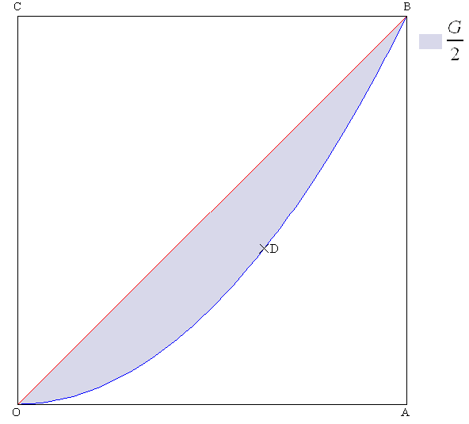

# L'indice de concentration

L'indice de concentration fut inventé par l'économiste italien C. Gini[^1]. Il permet de mesurer la répartition d'une variable au sein d'une population, c'est-à-dire qu'il mesure le **niveau d'inégalité** de sa répartition.

L'indice de Gini varie entre 0 et 1. 0 signifie que l'égalité est parfaite ; 1 que l'inégalité est parfaite.

Géométriquement, plus la distribution de $X$ est inégalement répartie, plus la courbe de concentration s'éloigne de la première bissectrice, traduisant l'équirépartition (Fig. 1). La courbe en bleu correspond à la courbe de Lorenz[^2] est la réprésentation graphique de la fonction qui, à la part $x$ des détenteurs d'une part d'une grandeur, associe la part $y$ de la grandeur détenue. L'indice de Gini vaut :

$G = \textrm{aire}_{ODBC} = \textrm{aire}_{ODBA}$

**Figure 1. Courbe de Lorenz et indice de Gini**

Numériquement, cet indice est calculé par l'intégrale double dans laquelle $f$ est la densité de la loi de la variable $X$ et $\mu$ sa moyenne :

$G = \frac{1}{2 \mu \left( X \right)} \int_{-\infty}^{+\infty} \int_{-\infty}^{+\infty} \left| x - y \right| f \left( x \right) f \left( y \right) \mathrm{d} x \mathrm{d} y$

Cette relation continue a pour équivalent discret :

$G = \frac{E}{2 \mu}$

avec $E = \frac{1}{n^2} \sum_{i = 1}^{n} \sum_{j = 1}^{n} \left| x_i - x_j \right|$ et $\mu = \frac{1}{n} \sum_{k = 1}^{n} x_k$.

Pour un échantillon de taille $n$, on obtient : 

$G = \frac{E}{2 \bar{X}}$

avec $E = \frac{1}{n \left( n - 1 \right)} \sum_{i = 1}^{n} \sum_{j = 1}^{n} \left| x_i - x_j \right|$ et $\bar{X} = \frac{1}{n} \sum_{k = 1}^{n} x_k$.

## Liens

- [Topo en format P.D.F.](./PDF/01-L-indice-de-concentration.pdf)

## Notes de bas de page

[^1]: Corrado Gini (1884-1965)

[^2]: Max Otto Lorenz (1876-1959)
