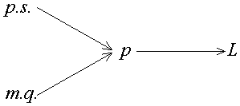

# Convergence des suites de variables aléatoires

Les modes de convergence les plus utilisés en probabilité sont les suivants :

1. la convergence en probabilité notée $p$ ;

2. la convergence presque sûre notée $p.s.$ ;

3. la convergence en loi notée $L$ ;

4. la convergence en moyenne quadratique notée $m.q.$

Ces différents modes de convergence ne sont pas indépendants et satisfont aux implications représentables dans un schéma (Fig. 1).

**Figure 1. Schéma illustrant les différentes convergences de suites de variables aléatoires**

## Convergence en probabilité

Une suite de $n$ variables aléatoires $\left( X_n \right)$, non nécessairement indépendantes, converge en probabilité vers une constante $a$ et on écrit $X_ n {\overset{p}{\longrightarrow}} a$ lorsque $n$ tend vers l'infini si :

$\forall \varepsilon, \eta > 0, \exists N \left( \varepsilon, \eta \right) \backslash n > N\Rightarrow \Pr \left( \left| X_n - a \right| \right) < \eta$

La convergence en probabilité de la suite $\left( X_n \right)$ vers la variable aléatoire $X$ est la convergence de la suite de variables aléatoires $\left( X_n - X \right)$ vers 0.

> [!NOTE]
> Si $\mathbb{E} \left( X_n \right)$ tend vers $a$, il suffit de montrer que $\mathbb{V} \left( X_n \right)$ tend vers 0 pour établir la convergence en probabilité de la suite $\left( X_n \right)$ vers $a$ par l'application de l'inégalité de Bienaymé-Tchebycheff.

> [!NOTE]
> La convergence en probabilité n'entra\^{i}ne pas celle des moments. En particulier, elle n'entraîne pas celle des espérances mathématiques.

## Convergence presque sûre

Deux variables aléatoires $X$ et $Y$ sont égales presque sûrement si :

$\Pr \left[ \omega \setminus X \left( \omega \right) \neq Y \left( \omega \right) \right] = 0$

Il s'agit de la définition de l'égalité presque partout des fonctions mesurables.

La suite de variables aléatoires $\left( X_n \right)$, non nécessairement indépendantes, converge presque sûrement vers $X$, et on écrit $X_ n {\overset{p.s.}{\longrightarrow}} X$ lorsque $n$ tend vers l'infini, si :

$\Pr \left[ \omega \setminus \lim_{n \rightarrow +\infty} X_n \left( \omega \right) \neq X \left( \omega \right) \right] = 0$

###### Comparaison de ces deux modes de convergence

1. La convergence en probabilité de la suite  $\left( X_n \right)$ vers 0, par exemple, implique que, $\varepsilon$ et $\eta$ positifs étant donnés, l'événement $\left\lbrace \left| X_n \right| \leq \varepsilon \right\rbrace$ est réalisé avec une probabilité supérieure à $\left( 1 - \eta \right)$ pour tout $n$ fixé, à partir d'un certain rang.

2. La convergence presque sûre de la suite $\left( X_n \right)$ vers 0 implique que, à partir d'un certain rang, tous les événements $\left\lbrace \left| X_n \right| \leq \varepsilon \right\rbrace$ sont réalisés simultanément avec une probabilité supérieure à $\left( 1 - \eta \right)$.

3. La convergence presque sûre est **plus stricte** que la convergence en probabilité, elle l'entraîne comme on peut facilement le démontrer.

4. La convergence en probabilité justifie l'utilisation de la méthode des sondages pour estimer la proportion des individus qui ont le caractère $A$ dans une population donnée.

5. La convergence en probabilité implique la loi faible des grands nombres, la convergence presque sûre implique la loi forte des grands nombres.

## Convergence en loi

La suite des variables aléatoires $\left( X_n \right)$, non nécessairement indépendantes, de fonction de répartition $F_n$, convergence en loi vers la variable aléatoire $X$, de fonction de répartition $F$, lorsque $n$ tend vers l'infini, si en tout point de continuité $x$ de $F$, la limite de la fonction $F_n$ est égale à la fonction $F$, et on écrit : $X_ n {\overset{L}{\longrightarrow}} X$. La convergence est réalisée aux points de continuité de la fonction $F$. Il s'agti de la convergence ponctuelle de la suite des fonctions de répartition. En un point de discontinuité $x_0$ de $F$, différentes situations sont possibles, soit $F_n \left( x_0 \right)$ n'a pas de limite, soit possède une limite différente de $F \left( x_0 \right)$\ldots{}

Deux théorèmes donnent les relations entre la convergence en loi d'une suite de variables aléatoires $\left( X_n \right)$ et la convergence de la suite $\left( {\varphi}_n \right)$ des fonctions caractéristiques.

- **Théorème 1.** Si la suite de variables aléatoires $\left( X_n \right)$ convergence en loi vers la variable aléatoire $X$ lorsque $n$ tend vers l'infini, alors la suite $\left( {\varphi}_n \right)$ des fonctions caractéristiques converge vers la fonction caractéristique $\varphi$ de la variable aléatoire $X$, la convergence étant uniforme dans tout intervalle fini.

- **Théorème 2 de Lévy-Cramér-Dugué.** Si la suite $\left( {\varphi}_n \right)$ de fonctions caractéristiques converge simplement, lorsque $n$ tend vers l'infini, vers une fonction $\varphi$, et si la partie réelle de $\varphi$ est continue à l'origine alors :

- $\varphi$ est une fonction caractéristique ;

- la suite de fonctions de répartition $F_n$ de $X_n$ converge simplement vers la fonction de répartition $F$ dont $\varphi$ est la transformée de Fourier-Stieltjes, la convergence a lieu en tous les points de continuité de $F$.

Si $F$ est continue, la convergence est alors uniforme.

## Convergence en moyenne quadratique

Une suite de variables aléatoires $\left( X_n \right)$, non nécessairement indépendantes, converge en moyenne quadratique d'ordre $q$ vers $X$ si $\mathbb{E} \left[ \left( X_n - X \right)^q \right]$ tend vers 0 lorsque $n$ tend vers l'infini. Cette condition implique que le moment d'ordre $q$ existe. Toutefois, le cas $q = 2$ demeure le plus utilisé. Il faut bien noter que la convergence en moyenne quadratique implique la convergence en probabilité.

## Liens

- [Topo en format P.D.F.](./PDF/02-Convergence-des-suites-de-variables-aleatoires.pdf)
