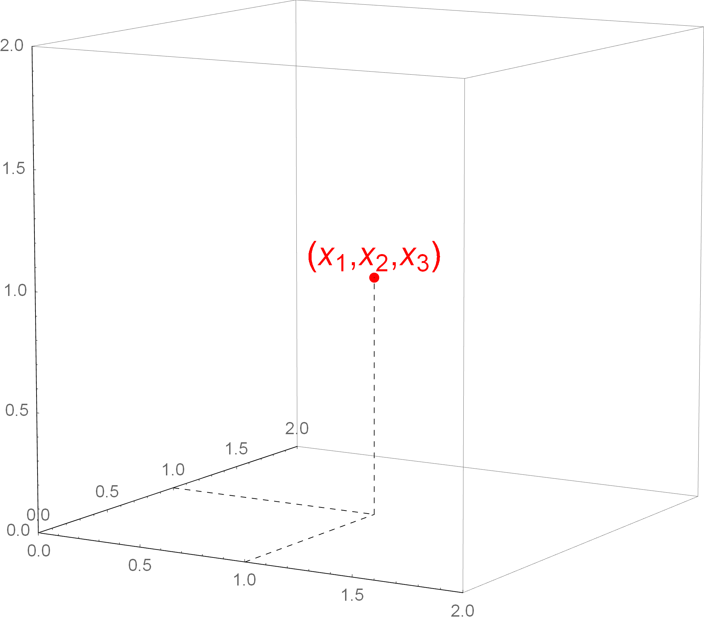
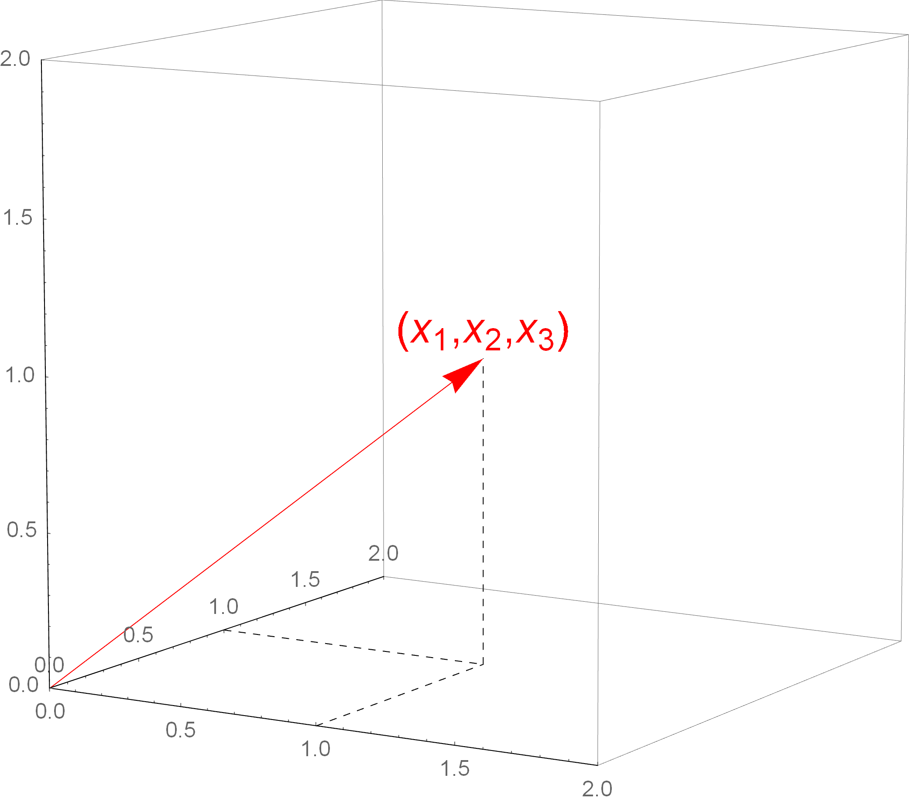
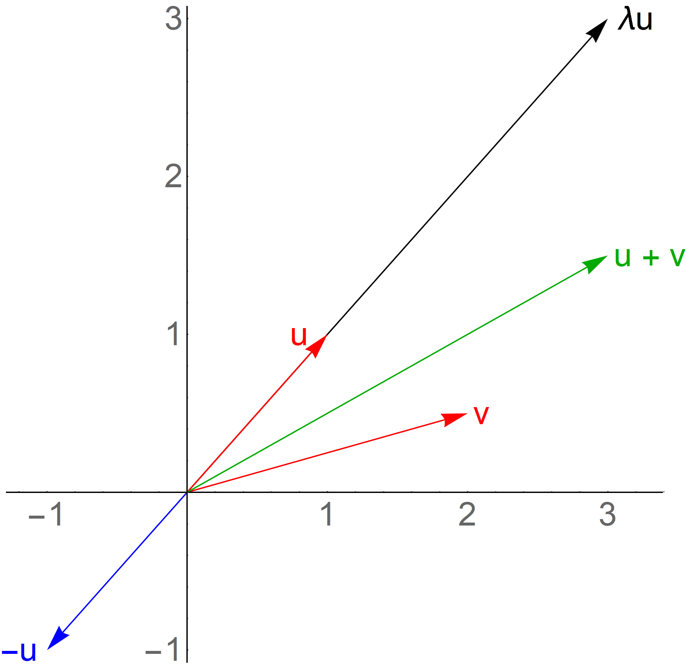

# Généralisation de la notion de vecteurs

## Tutoriels

- [Espaces vectoriels](https://www.youtube.com/watch?v=a1EkNGstaUU&list=PL1E86FABE7386FC5A)

- [Dimensions finies](https://www.youtube.com/watch?v=oxTywIAVJZY&list=PL024XGD7WCIGqPxryNQ4PIjVjuqsZbw7U)

- [Espace vectoriel ${\mathbb{R}}^n$](https://www.youtube.com/watch?v=8J0pCiBu0vE&list=PL024XGD7WCIHYmxeY6pXCxaIY7hHBDCF-)

## Notion d'espace vectoriel $\mathbb{R}^n$

### Introduction

Le plan $\mathbb{R}^2$ est formé des **couples** $\left[ \begin{array}{c} x_1 \\ x_2 \end{array} \right]$. Il est de dimension 2.

Le plan $\mathbb{R}^3$ est formé des **triplets** $\left[ \begin{array}{c} x_1 \\ x_2 \\ x_3 \end{array} \right]$. Il est de dimension 3.

> [!NOTE]
> Les triplets peuvent être vus soit comme un point (Fig. 1), soit comme un vecteur (Fig. 2).

### Généralisation

L'espace $\mathbb{R}^n$ de **dimension $n$** pour tout $n = 1, 2, 3, \ldots{}$ avec $n > 0$.

Les **éléments** sont les **$n$-uplets** $\left[ \begin{array}{c} x_1 \\ x_2 \\ \ldots{} \\ x_n \end{array} \right]$ de nombres réels.

L'**espace de dimension $n$** est noté $\mathbb{R}^n$.

$\left[ \begin{array}{c} x_1 \\ x_2 \\ \ldots{} \\ x_n \end{array} \right]$ représente aussi bien un **point** qu'un **vecteur à $n$ dimensions** ayant pour centre l'origine du repère.

### Définitions

Soient $u = \left[ \begin{array}{c} u_1 \\ u_2 \\ \ldots{} \\ u_n \end{array} \right]$ et $v = \left[ \begin{array}{c} v_1 \\ v_2 \\ \ldots{} \\ v_n \end{array} \right]$ deux vecteurs de $\mathbb{R}^n$.

- La somme de deux vecteurs : $u + v = \left[ \begin{array}{c} u_1 + v_1 \\ u_2 + v_2 \\ \ldots{} \\ u_n + v_n \end{array} \right]$

- Le produit d'un vecteur par un scalaire $\lambda \in \mathbb{R}$ : ${\lambda}u = \left[ \begin{array}{c} {\lambda}u_1 \\ {\lambda}u_2 \\ \ldots{} \\ {\lambda}u_n \end{array} \right]$

- Le vecteur nul de $\mathbb{R}^n$ est le vecteur $0 = \left[ \begin{array}{c} 0 \\ 0 \\ \ldots{} \\ 0 \end{array} \right]$

- L'opposé du vecteur $u$ est le vecteur $-u = \left[ \begin{array}{c} -u_1 \\ -u_2 \\ \ldots{} \\ -u_n \end{array} \right]$

> [!NOTE]
> Il faut apprendre à écrire les vecteurs sans flèche.

### Les huits propriétés d'un espace vectoriel

Soient $u = \left[ \begin{array}{c} u_1 \\ u_2 \\ \ldots{} \\ u_n \end{array} \right]$, $v = \left[ \begin{array}{c} v_1 \\ v_2 \\ \ldots{} \\ v_n \end{array} \right]$ et $w = \left[ \begin{array}{c} w_1 \\ w_2 \\ \ldots{} \\ w_n \end{array} \right]$ des vecteurs $\mathbb{R}^n$, et ${\lambda}, {\mu} \in \mathbb{R}$ alors :

1. $u + v = v + u$

2. $u + \left( v + w \right) = \left( u + v \right) + w$

3. $u + 0 = 0 + u = u$

4. $u + \left( -u \right) = 0$

5. $1 u = u$

6. ${\lambda}\left( \mu u \right) = \left( \lambda \mu \right) u$

7. ${\lambda} \left( u + v \right) = {\lambda} u + {\lambda} v$

8. $\left( {\lambda} + {\mu} \right) u = {\lambda} u + {\mu} u$

Les propriétés se démontrent par les règles de la somme et de la multiplication par un scalaire.

### Les matrices

$u = \left[ \begin{array}{c} u_1 \\ u_2 \\ \ldots{} \\ u_n \end{array} \right]$ est un **vecteur colonne**. On le considère comme une matrice $n \times 1$.

$u = \left[ \begin{array}{cccc} u_1 & u_2 & \ldots{} & u_n \end{array} \right]$ est un **vecteur ligne**. On le considère comme une matrice $1 \times n$.

Si $u$ est un vecteur colonne, alors ${{}^t}u$, sa transposée, est un vecteur ligne.

### Le produit scalaire

Soient $u = \left[ \begin{array}{c} u_1 \\ u_2 \\ \ldots{} \\ u_n \end{array} \right]$ et $v = \left[ \begin{array}{c} v_1 \\ v_2 \\ \ldots{} \\ v_n \end{array} \right]$ deux vecteurs de $\mathbb{R}^n$.

Le produit scalaire, noté $\left\langle u | v \right\rangle$, se définit tel que :

$\left\langle u | v \right\rangle = u_1 v_1 + u_2 v_2 + \ldots{} + u_n v_n$

C'est un **scalaire**. La forme généralise le produit scalaire du plan et de l'espace $\mathbb{R}^n$.

> [!NOTE]
> Il existe une autre écriture. Il faut considérer $u$ comme un vecteur ligne, c'est-à-dire sa transposée, et $v$ comme un vecteur colonne.
> $\left\langle u | v \right\rangle = {{}^t}u.v = \left[ \begin{array}{cccc} u_1 & u_2 & \ldots{} & u_n \end{array} \right] . \left[ \begin{array}{c} v_1 \\ v_2 \\ \ldots{} \\ v_n \end{array} \right]$
> Le résultat est une matrice $1 \times 1$, considérée comme un nombre réel.

Soient $u, v, w \in \mathbb{R}^n$ et $\lambda \in \mathbb{R}$.

- **Propriété 1.** $\left\langle u | v \right\rangle = \left\langle v | u \right\rangle$

- **Propriété 2.** $\left\langle u + v | w \right\rangle = \left\langle u | w \right\rangle + \left\langle v | w \right\rangle$

- **Propriété 3.** $\left\langle {\lambda}u | v \right\rangle = {\lambda}\left\langle u | v \right\rangle$

- **Propriété 4.** $\left\langle u | u \right\rangle = 0 \Leftrightarrow u = 0$

### Applications linéaires

Quelles sont les fonctions qui relient les espaces $\mathbb{R}^n$ entre eux ?

Soient $n$ fonctions de $p$ variables réelles à valeurs réelles, c'est-à-dire une application $\mathbb{R}^p$ dans $\mathbb{R}^n$.

$f_1 : \mathbb{R}^p \rightarrow \mathbb{R}, f_2 : \mathbb{R}^p \rightarrow \mathbb{R}, \ldots{}, f_n : \mathbb{R}^p \rightarrow \mathbb{R}$

$f_i \left\lbrace \begin{array}{l}\mathbb{R}^p \rightarrow \mathbb{R} \\\left( x_1, x_2, \ldots{}, x_p \right) \mapsto f_i \left( x_1, x_2, \ldots{}, x_p \right) \end{array}\right.$

On construit une application 

$f_i \left\lbrace \begin{array}{l} \mathbb{R}^p \rightarrow \mathbb{R} \\ f \left( x_1, x_2, \ldots{}, x_p \right) \mapsto \left( f_1 \left( x_1, x_2, \ldots{}, x_p \right), \ldots{}, f_n \left( x_1, x_2, \ldots{}, x_p \right) \right) \end{array} \right.$

On note $f \left( x_1, x_2, \ldots{}, x_p \right) = \left( y_1, y_2, \ldots{}, y_p \right)$. $y_1, \ldots{}, y_n$ sont les **composantes** du vecteur. Par exemple, $y_1 = f \left( x_1 \right)$. $f$ est une **application linéaire** si :

$\left\lbrace \begin{array}{l}y_1 = a_{11} x_1 + a_{12} x_2 + \ldots{} + a_{1p} x_p \\y_2 = a_{21} x_1 + a_{22} x_2 + \ldots{} + a_{2p} x_p \\\ldots{} \\y_n = a_{n1} x_1 + a_{n2} x_2 + \ldots{} + a_{np} x_p \end{array}\right.$

c'est-à-dire que chaque **composante** est une **équation linéaire**.

Il faut bien assimiler qu'une application linéaire correspond à une **matrice**.

$f \left( \begin{array}{c} x_1 \\ \ldots{} \\ x_p \end{array} \right) = \left( \begin{array}{c} y_1 \\ \ldots{} \\ y_p \end{array} \right) = \left( \begin{array}{ccc} a_{11} & \ldots{} & a_{1p} \\ \ldots{} & \ldots{} & \ldots{} \\ a_{n1} & \ldots{} & a_{np} \end{array} \right) . \left( \begin{array}{c} x_1 \\ \ldots{} \\ x_p \end{array} \right)$

$\Rightarrow X = \left( \begin{array}{c} x_1 \\ \ldots{} \\ x_p \end{array} \right) \textrm{ et } A = \left( a_{ij} \right) \in M_{n, p} \left( \mathbb{R} \right), f \left( X \right) = A.X$

Une application linéaire $\mathbb{R}^p \rightarrow \mathbb{R}^n$ s'écrit :

$X \mapsto A.X$

$A \in M_{n, p} \left( \mathbb{R} \right)$ est la **matrice d'application linéaire $f$** de la **base canonique** de $\mathbb{R}^p$ vers la **base canonique** de $\mathbb{R}^n$

#### L'application linéaire identité

$\left\lbrace \begin{array}{l}\mathbb{R}^n \rightarrow \mathbb{R}^n \\\left( x_1, \ldots{}, x_n \right) \mapsto \left( x_1, \ldots{}, x_n \right)\end{array}\right.$

dans ce cas la matrice carrée est la **matrice identité** $I_n$

$I_n . X = X$

#### L'application linéaire nulle

$\left\lbrace \begin{array}{l}\mathbb{R}^n \rightarrow \mathbb{R}^n \\\left( x_1, \ldots{}, x_n \right) \mapsto \left( 0, \ldots{}, 0 \right)\end{array}\right.$

dans ce cas, la matrice associée est la **matrice nulle** $0_{n, p}$.

$0_{n, p} . X =0$

#### Exemples d'applications linéaires géométriques

##### Réflexion par rapport à l'axe $\left( Oy \right)$

$f : \left\lbrace \begin{array}{l}\mathbb{R}^2 \rightarrow \mathbb{R}^2 \\\left[ \begin{array}{c} x \\ y \end{array} \right] \mapsto \left[ \begin{array}{c} -x \\ y \end{array} \right] \end{array}\right.$

Pour arriver à ce résultat, il faut une **matrice associée** : $\left[ \begin{array}{cc} -1 & 0 \\ 0 & 1 \end{array} \right]$

$\left[ \begin{array}{c} x \\ y \end{array} \right] . \left[ \begin{array}{cc} -1 & 0 \\ 0 & 1 \end{array} \right] = \left[ \begin{array}{c} -x \\ y \end{array} \right]$

##### Réflexion par rapport à l'axe $\left( Ox \right)$

$f : \left\lbrace \begin{array}{l}\mathbb{R}^2 \rightarrow \mathbb{R}^2 \\\left[ \begin{array}{c} x \\ y \end{array} \right] \mapsto \left[ \begin{array}{c} x \\ -y \end{array} \right] \end{array}\right.$

$\left[ \begin{array}{c} x \\ y \end{array} \right] . \left[ \begin{array}{cc} 1 & 0 \\ 0 & -1 \end{array} \right] = \left[ \begin{array}{c} x \\ -y \end{array} \right]$

##### Réflexion par rapport à la droite $y = x$

$f : \left\lbrace \begin{array}{l}\mathbb{R}^2 \rightarrow \mathbb{R}^2 \\\left[ \begin{array}{c} x \\ y \end{array} \right] \mapsto \left[ \begin{array}{c} y \\ x \end{array} \right] \end{array}\right.$

$\left[ \begin{array}{c} x \\ y \end{array} \right] . \left[ \begin{array}{cc} 0 & 1 \\ 1 & 0 \end{array} \right] = \left[ \begin{array}{c} y \\ x \end{array} \right]$

##### Homothéties

$f : \left\lbrace \begin{array}{l}\mathbb{R}^2 \rightarrow \mathbb{R}^2 \\\left[ \begin{array}{c} x \\ y \end{array} \right] \mapsto \left[ \begin{array}{c} {\lambda}x \\ {\lambda}y \end{array} \right] \end{array}\right.$

$\left[ \begin{array}{c} x \\ y \end{array} \right] . \left[ \begin{array}{cc} {\lambda} & 0 \\ 0 & {\lambda} \end{array} \right] = \left[ \begin{array}{c} {\lambda}x \\ {\lambda}y \end{array} \right]$

##### Rotations

$f : \left\lbrace \begin{array}{l}\mathbb{R}^2 \rightarrow \mathbb{R}^2 \\\left[ \begin{array}{c} x \\ y \end{array} \right] \mapsto \left\lbrace \begin{array}{c} x' = x \cos \theta - y \sin \theta \\ y' = x \sin \theta - y \cos \theta \end{array} \right. \end{array}\right.$

avec $\theta$ l'angle de la rotation ayant pour centre l'origine O.

$\left[ \begin{array}{c} x' \\ y' \end{array} \right] = \left[ \begin{array}{cc} \cos \theta & -\sin \theta \\ \sin \theta & \cos \theta \end{array} \right] . \left[ \begin{array}{c} x \\ y \end{array} \right]$

##### Projections orthogonales sur l'axe $\left( Ox \right)$

$f : \left\lbrace \begin{array}{l}\mathbb{R}^2 \rightarrow \mathbb{R}^2 \\\left[ \begin{array}{c} x \\ y \end{array} \right] \mapsto \left[ \begin{array}{c} x \\ 0 \end{array} \right]  \end{array}\right.$

$\left[ \begin{array}{c} x \\ 0 \end{array} \right] = \left[ \begin{array}{cc} 1 & 0 \\ 0 & 0 \end{array} \right] . \left[ \begin{array}{c} x \\ y \end{array} \right]$

##### Projections orthogonales sur le plan $\left( Oxy \right)$

$f : \left\lbrace \begin{array}{l}\mathbb{R}^3 \rightarrow \mathbb{R}^3 \\\left[ \begin{array}{c} x \\ y \\ z \end{array} \right] \mapsto \left[ \begin{array}{c} x \\ y \\ 0 \end{array} \right]  \end{array}\right.$

$\left[ \begin{array}{c} x \\ y \\ 0 \end{array} \right] = \left[ \begin{array}{ccc} 1 & 0 & 0 \\ 0 & 1 & 0 \\ 0 & 0 & 0 \end{array} \right] . \left[ \begin{array}{c} x \\ y \\ z \end{array} \right]$

##### Réflexions dans l'espace par rapport au plan $\left( Oxy \right)$

$f : \left\lbrace \begin{array}{l}\mathbb{R}^3 \rightarrow \mathbb{R}^3 \\\left[ \begin{array}{c} x \\ y \\ z \end{array} \right] \mapsto \left[ \begin{array}{c} x \\ y \\ -z \end{array} \right]  \end{array}\right.$

$\left[ \begin{array}{c} x \\ y \\ -z \end{array} \right] = \left[ \begin{array}{ccc} 1 & 0 & 0 \\ 0 & 1 & 0 \\ 0 & 0 & -1 \end{array} \right] . \left[ \begin{array}{c} x \\ y \\ z \end{array} \right]$

> [!WARNING]
> Une translation n'est pas une application linéaire.

### Propriétés des applications linéaires

#### Composition d'applications linéaires et produits de matrice

Soient deux applications linéaires $f : \mathbb{R}^p \rightarrow \mathbb{R}^n$ et $g : \mathbb{R}^q \rightarrow \mathbb{R}^p$, et leur composition $\left\lbrace \begin{array}{c} \mathbb{R}^p \rightarrow \mathbb{R}^n \rightarrow \mathbb{R}^n \\ f \circ g \rightarrow \mathbb{R}^p \rightarrow \mathbb{R}^n \end{array} \right.$. $f \circ g$ est application linéaire.

Comment calculer la matrice linéaire $f \circ g$ en fonction de celles de $f$ et de $g$ ?

1. $A = \textrm{Mat} \left( f \right) \in M_{n, p} \left( \mathbb{R} \right)$, la matrice associée à $f$. $X \mapsto A.X$. 

2. $B = \textrm{Mat} \left( g \right) \in M_{p, q} \left( \mathbb{R} \right)$, la matrice associée à $g$. $X \mapsto B.X$.

3. $C = \textrm{Mat} \left( f \circ g \right) \in M_{n, p} \left( \mathbb{R} \right)$, la matrice associée à $f \circ g$.

Pour tout $X \in \mathbb{R}^q$, $\left( f \circ g \right) \left( X \right) = f \left( g \left( X \right) \right) = f \left( B.X \right) = A \left( B.X \right) = \left( A.B \right) .X$ ou $= \mathrm{Mat} \left( f \circ g \right) = \mathrm{Mat} \left( f \right) \times \mathrm{Mat} \left( g \right)$, donc $C = A.B$.

**Exemple.** Soit $f : \mathbb{R}^2 \rightarrow \mathbb{R}^2$ la réflexion par rapport à la droite $y = x$.

$A = \mathrm{Mat} \left( f \right) = \left[ \begin{array}{cc} 0 & 1 \\ 1 & 0 \end{array} \right]$

Soit $g : \mathbb{R}^2 \rightarrow \mathbb{R}^2$ la rotation d'angle $\theta = \frac{\pi}{3}$ centrée sur l'origine.

$B = \mathrm{Mat} \left( g \right) = \left[ \begin{array}{cc} \cos \theta & -\sin \theta \\ \sin \theta & \cos \theta \end{array} \right] = \left[ \begin{array}{cc} \frac{1}{2} & -\frac{\sqrt{3}}{2} \\ \frac{\sqrt{3}}{2} & \frac{1}{2} \end{array} \right]$

$\Rightarrow C = \textrm{Mat} \left( f \circ g \right) = \textrm{Mat} \left( f \right) \times \textrm{Mat} \left( g \right)$

$C = A.B = \left[ \begin{array}{cc} 0 & 1 \\ 1 & 0 \end{array} \right] . \left[ \begin{array}{cc} \frac{1}{2} & -\frac{\sqrt{3}}{2} \\ \frac{\sqrt{3}}{2} & \frac{1}{2} \end{array} \right] = \left[ \begin{array}{cc} \frac{\sqrt{3}}{2} & \frac{1}{2} \\ \frac{1}{2} & -\frac{\sqrt{3}}{2} \end{array} \right]$

> [!WARNING]
> $g \circ f \neq f \circ g$. L'inversion de la composition fournit un autre résultat.
> $D = \textrm{Mat} \left( g \circ f \right) = \textrm{Mat} \left( g \right) \times \textrm{Mat} \left( f \right)$
> $D = \left[ \begin{array}{cc} \frac{1}{2} & -\frac{\sqrt{3}}{2} \\ \frac{\sqrt{3}}{2} & \frac{1}{2} \end{array} \right] . \left[ \begin{array}{cc} 0 & 1 \\ 1 & 0 \end{array} \right] = \left[ \begin{array}{cc} -\frac{\sqrt{3}}{2} & \frac{1}{2} \\ \frac{1}{2} & \frac{\sqrt{3}}{2} \end{array} \right]$
> $C \neq D$

#### Théorème n°1

Une application linéaire $f : \mathbb{R}^n \rightarrow \mathbb{R}^n$ est bijective $\Leftrightarrow$ sa matrice associée $A = \textrm{Mat} \left( f \right) \in M_n \left( \mathbb{R} \right)$ est inversible.

$\textrm{Mat} \left( f^{-1} \right) = \left( \textrm{Mat} \left( f \right) \right)^{-1}$

$f$ est définie par $f \left( X \right) = A.X$.

1. Si $f$ est bijective alors $f \left( X \right) = Y \Leftrightarrow X = f^{-1} \left( Y \right)$.

2. $A.X = Y \Leftrightarrow X = {A^{-1}}.Y$ si $A$ est inversible.

3. On en conclut que $f^{-1} \left( Y \right) = A^{-1}.Y$.

4. La matrice associée de $f^{-1}$ est $A^{-1}$.

#### Théorème n°2

Une application $f : \mathbb{R}^p \rightarrow \mathbb{R}^n$ est linéaire. $\Leftrightarrow$ Pour tous les vecteurs $u, v$ de $\mathbb{R}^{p}$ et pour tout scalaire $\lambda \in \mathbb{R}$, on a :

$f \left( u + v \right) = f \left( u \right) + f \left( v \right)$

$f \left( \lambda u \right) = \lambda f \left( u \right)$

Il est à noter qu'il s'agit du cadre général des espaces vectoriels pour définir une application linéaire.

Les **vecteurs de la base canonique** de $\mathbb{R}^p$ sont :

$e_1 = \left[ \begin{array}{c} 1 \\ 0 \\ \ldots{} \\ 0 \end{array} \right]$

$e_2 = \left[ \begin{array}{c} 0 \\ 1 \\ \ldots{} \\ 0 \end{array} \right]$

$\ldots{}$

$e_p = \left[ \begin{array}{c} 0 \\ 0 \\ \ldots{} \\ 1 \end{array} \right]$

Elle dépend de l'ensemble $\mathbb{R}^p$, et non des valeurs numériques.

**Corollaire.** Il est possible de calculer une matrice linéaire dans les bases canoniques de $\mathbb{R}^p$. Soit $f : \mathbb{R}^p \rightarrow \mathbb{R}^n$ une application linéaire, alors la matrice $f$ dans les bases canoniques de $\mathbb{R}^p$ vers $\mathbb{R}^n$ est donnée par :

$\mathrm{Mat} \left( f \right) = \left[ \begin{array}{cccc} f \left( e_1 \right) & f \left( e_2 \right) & \ldots{} & f \left( e_p \right) \end{array} \right]$

dans laquelle les $f \left( e_p \right)$ correspondent à des vecteurs colonnes.

**Exemple.** Soit l'application linéaire $f : \mathbb{R}^3 \rightarrow \mathbb{R}^4$ définie par :

$\left\lbrace \begin{array}{l}y_1 = 2 x_1 + x_2 - x_3 \\y_2 = -x_1 - 4x_2 \\y_3 = 5x_1 + x_2 + x_3 \\y_4 = 3x_2 + 2x_3\end{array}\right.$

Soit la base canonique $\left( \begin{array}{c} 1 \\ 0 \\ 0 \end{array} \right)$, $\left( \begin{array}{c} 0 \\ 1 \\ 0 \end{array} \right)$, $\left( \begin{array}{c} 0 \\ 0 \\ 1 \end{array} \right)$ dans $\mathbb{R}^3$.

Il faut calculer les images des vecteurs de la base dans $f$.

$f \left( \begin{array}{c} 1 \\ 0 \\ 0 \end{array} \right) = \left( \begin{array}{c} 2 \\ -1 \\ 5 \\ 0 \end{array} \right)$

$f \left( \begin{array}{c} 0 \\ 1 \\ 0 \end{array} \right) = \left( \begin{array}{c} 1 \\ -4 \\ 1 \\ 3 \end{array} \right)$

$f \left( \begin{array}{c} 0 \\ 0 \\ 1 \end{array} \right) = \left( \begin{array}{c} -1 \\ 0 \\ 1 \\ 2 \end{array} \right)$

On obtient alors dans la base canonique :

$\mathrm{Mat} \left( f \right) = \left( \begin{array}{ccc}2 & 1 & -1 \\-1 & -4 & 0 \\5 & 1 & 1 \\0 & 3 & 2 \end{array} \right)$

## Les espaces vectoriels

La notion d'espace vectoriel est une structure fondamentale des mathématiques modernes. Elle permet de dégager des **propriétés communes** que partagent des ensembles for différents.

- **Exemple 1.** Deux vecteurs du plan peuvent s'additionner (ou se soustraire), et un vecteur peut être multiplié par un réel.

- **Exemple 2.** Deux fonctions peuvent s'additionner (ou se soustraire), et une fonction peut être multiplié par un réel.

- **Exemple 3.** Les polynômes

- **Exemple 4.** Les [matrices](./04-Calcul%20matriciel.md)

- *etc.*

**L'objectif est d'obtenir des théorèmes généraux applicables à n'importe quel exemple d'espace vectoriel**. Dit autrement, c'est une notion très difficile.

Un $\mathbb{K}$-espace vectoriel est un ensemble non vide $E$ muni :

1. d'une **loi de composition interne**, c'est-à-dire d'une application de $E \times E$ dans $E$

$\left\lbrace  \begin{array}{l} E \times E \rightarrow E \\ \left( u, v \right) \mapsto u + v \end{array} \right.$

> [!NOTE]
> $\times$ se lit « croix ».

2. d'une **loi de composition externe**, c'est-à-dire une application $\mathbb{K} \times E$ dans $E$

$\left\lbrace  \begin{array}{l} \mathbb{K} \times E \rightarrow E \\ \left( \lambda, u \right) \mapsto {\lambda}u \end{array} \right.$

> [!NOTE]
> $\mathbb{K}$ désigne un corps.

Il existe huit propriétés (ou axiomes) pour ces deux lois :

1. Axiomes relatifs à la loi interne

    - **Commutativité** $\forall u, v \in E, u + v = v + u$

    - **Associativité** $\forall u, v, w \in E, u + \left( v + w \right) = \left( u + v \right) + w$

    - **Élément neutre** $\forall u \in E, \exists 0_E \in E \backslash u + 0_E = u$

    - **Élément symétrique** Tout $u \in E$ admet un symétrique, $u' \backslash u + u' = 0_E$. $u'$ est noté $-u$.

2. Axiomes relatifs à la loi externe
    
    - **Élément neutre** $\forall u \in E, 1u = u$
    
    - $\forall u \in E, \forall {\lambda}, {\mu} \in \mathbb{K}, {\lambda} \left( {\mu}u \right) = \left( {\lambda}{\mu} \right) u$

3. Axiomes liant les deux lois
    
    - **Distributivité de la multiplication par rapport à l'addition** $\forall u, v \in E, \forall {\lambda} \in \mathbb{K}, {\lambda} \left( u + v \right) = {\lambda}u + {\lambda}v$
    
    - **Distributivité de la multiplication par rapport à l'addition** $\forall u \in E, \forall {\lambda}, {\mu} \in \mathbb{K}, \left( {\lambda} + {\mu} \right) u = {\lambda}u + {\mu}u$

### Le $\mathbb{R}$-espace vectoriel de $\mathbb{R}^2$ : $\mathbb{K} = \mathbb{R}$ et $E = \mathbb{R}^2$

$u \in E$ est un couple $\left( x, y \right)$ avec $x$ élément de $\mathbb{R}$ et $y$ élément de $\mathbb{R}$.

$\mathbb{R}^2 = \left\lbrace \left( x, y \right) | x \in \mathbb{R}, y \in \mathbb{R} \right\rbrace$

- **Loi interne** $\left( x, y \right) + \left( x', y' \right) = \left( x + x', y + y' \right)$

- **Loi externe** ${\lambda} \left( x, y \right) = \left( {\lambda}x, {\lambda}y \right)$

- **Élément neutre de la loi interne** $\left( 0, 0 \right)$ (vecteur nul)

- **Élément symétrique par rapport à l'origine du repère** Le symétrique de $\left( x, y \right)$ et $\left( -x, -y \right)$, noté $-\left( x, y \right)$

**En mathématique, un vecteur a toujours pour origine l'origine du repère**.

### Le $\mathbb{R}$-espace vectoriel de $\mathbb{R}^n$ : $\mathbb{K} = \mathbb{R}$ et $E = \mathbb{R}^n$

$u \in E$ est un $n$-uplet $\left( x_1, x_2, \ldots{}, x_n \right)$

- **Loi interne** $\left( x_1, x_2, \ldots{}, x_n \right) + \left( {x'}_1, {x'}_2, \ldots{}, {x'}_n \right) = \left( x_1 + {x'}_1, x_2 + {x'}_2, \ldots{}, x_n + {x'}_n \right)$

- **Loi externe** ${\lambda} \left( x_1, x_2, \ldots{}, x_n \right) = \left( {\lambda}x_1, {\lambda}x_2, \ldots{}, {\lambda}x_n \right)$

- **Élément neutre de la loi interne** $\left( 0, 0, \ldots{}, 0 \right)$ (vecteur nul)

- **Élément symétrique par rapport à l'origine du repère** Le symétrique de $\left( x_1, x_2, \ldots{}, x_n \right)$ et $\left( -x_1, -x_2, \ldots{}, -x_n \right)$, noté $-\left( x_1, x_2, \ldots{}, x_n \right)$

### Le $\mathbb{C}$-espace vectoriel de $\mathbb{C}^n$.

### Le $\mathbb{K}$-espace vectoriel de $\mathbb{K}^n$.

### Tout plan passant par l'origine dans $\mathbb{R}^3$ est un espace vectoriel.

$\mathbb{K} = \mathbb{R}$ et $E$ un plan passant par l'origine (c'est-à-dire l'élément neutre).

Le plan passant par l'origine est d'équation de la forme

$ax + by + cz =0$

$a \in \mathbb{R}^{*}$, $b \in \mathbb{R}^{*}$ et $c \in \mathbb{R}^{*}$.

Un élément $u$ de $E$ est un triplet, noté en vecteur colonne, $\left[ \begin{array}{c} x \\ y \\ z \end{array} \right]$ tel que $ax + by +cz = 0$.

Soient $u = \left[ \begin{array}{c} x \\ y \\ z \end{array} \right]$ et $v = \left[ \begin{array}{c} x' \\ y' \\ z' \end{array} \right]$ deux éléments de $E$

$\left. \begin{array}{l}ax + by +cz = 0 \\\textrm{et} \\ax' + by' +cz' = 0\end{array} \right\rbrace a \left( x + x' \right) + b \left( y + y' \right) + c \left( z + z' \right) = 0$

$u + v = \left[ \begin{array}{c} x + x' \\ y + y' \\ z + z' \end{array} \right] \in E$

L'élément neutre

$\left[ \begin{array}{c} 0 \\ 0 \\ 0 \end{array} \right] \in E$

L'élément symétrique

$-\left[ \begin{array}{c} x \\ y \\ z \end{array} \right] \in E$

> [!WARNING]
> Un plan ne contenant pas l'origine **n'est pas un espace vectoriel**.

Les éléments de $E$ sont des **vecteurs**.

Les éléments de $\mathbb{K}$ sont des **scalaires**.

Les éléments neutres de $0_E$ s'appelle le **vecteur nul**.

> [!WARNING] Il ne doit pas être confondu avec l'élément $0$ du corps $\mathbb{K}$. S'il n'y a pas de confusion possible, il sera noté $0$.

Le symétrique $-u$ d'un vecteur $u \in E$ s'appelle l'**opposé**.

La loi de composition interne , notée $+$, est appelée l'**addition**. $u + v$ est la somme des vecteurs $u$ et $v$.

La loi de composition externe sur $E$ est la **multiplication par un scalaire**.

**Somme de $n$ vecteurs.** La somme de deux vecteurs est $v_1 + v_2$. Par récurrence, il est possible de définir la somme de $n$ vecteurs.

$v_1 + v_2 +\ldots{} + v_n = \left( v_1 + v_2 +\ldots{} + v_{n - 1} \right) + v_n = \sum_{i = 1}^{n} v_i$

### L'espace vectoriel des fonctions de $\mathbb{R}$ dans $\mathbb{R}$.

$\mathcal{F} \left( \mathbb{R}, \mathbb{R} \right)$ est l'ensemble des fonctions $f : \mathbb{R} \rightarrow \mathbb{R}$

- **Loi interne** Pour $f, g \in \mathcal{F} \left( \mathbb{R}, \mathbb{R} \right)$, $f + g$ est définie par :

$\forall x \in \mathbb{R}, \left( f + g \right) \left( x \right) = f \left( x \right) + g \left( x \right)$

- **Loi externe** Pour $f \in \mathcal{F} \left( \mathbb{R}, \mathbb{R} \right)$ et $\lambda \in \mathbb{R}$ un scalaire, la fonction $\lambda f$ est définie par :

$\forall x \in \mathbb{R}, \left( \lambda f \right) \left( x \right) = \lambda f \left( x \right)$

- **Élément neutre** La fonction nulle est :

$\forall x \in \mathbb{R}, f \left( x \right) = 0$

- **Élément symétrique** $f \in \mathcal{F} \left( \mathbb{R}, \mathbb{R} \right)$ est $g$ définie par :

$\forall x \in \mathbb{R}, g \left( x \right) = - f \left( x \right)$

**Un vecteur est une fonction**.

### Le $\mathbb{R}$-espace vectoriel des suites réelles.

$S = \mathcal{F} \left( \mathbb{N}, \mathbb{R} \right)$ est l'ensemble des suites réelles $\left( u_n \right)_{n \in \mathbb{N}}$

- **Loi interne** $u = \left( u_n \right)_{n \in \mathbb{N}}$ et $v = \left( v_n \right)_{n \in \mathbb{N}}$ deux suites, la suite $u + v$ est la suite dont le terme général est :

$u_n + v_n$

- **Loi externe** ${\lambda} \in \mathbb{R}$ et $\left( u_n \right)_{n \in \mathbb{N}}$, une suite, ${\lambda}u$ est le suite dont le terme général est :

${\lambda}u_n$

- **Élément neutre** Suite dont tous les termes sont nuls.

- **Élément symétrique** Suite dont le terme général est $-u_n$.

### Exemple : les [matrices](./04-Calcul%20matriciel.md).

L'ensemble $M_{n, p} \left( \mathbb{R} \right)$ des matrices à $n$ lignes et $p$ colonnes à coefficients dans $\mathbb{R}$ est muni d'une structure de $\mathbb{R}$-espace vectoriel.

- **Loi interne** $A + B$

- **Loi externe** ${\lambda}A$

- **Élément neutre** Matrice nulle

- **Élément symétrique** $A = \left( a_{ij} \right) \rightarrow - A = \left( -a_{ij} \right)$

L'espace vectoriel $\mathbb{R} \left( X \right)$ des polynômes

$P \left( X \right) = a_n X^n + \ldots{} + a_2 X^2 + a_1 X^1 + a_0 X^0$

- **Loi interne** $P \left( X \right) + Q \left( X \right)$

- **Loi externe** ${\lambda}P \left( X \right)$

- **Élément neutre** Polynôme nul

- **Élément symétrique** $P \left( X \right)$ a pour opposé $- P \left( X \right)$

**Exemple.** L'ensemble des fonctions continues de $\mathbb{R}$ dans $\mathbb{R}$.

**Exemple.** L'ensemble des fonctions dérivables de $\mathbb{R}$ dans $\mathbb{R}$.

**Exemple.** L'ensemble des fonctions indéfiniment dérivable de $\mathbb{R}$ dans $\mathbb{R}$.

### Règles de calcul pour l'opération externe

Soit $E$ un espace vectoriel sur un corps $\mathbb{K}$.

Soient $u \in E$ et $\lambda \in \mathbb{K}$

- $0u = 0_E$

- ${\lambda} 0_E = 0_E$

- $\left( -1 \right) u = -u$

- ${\lambda}u = 0_E \Leftrightarrow \left\lbrace \begin{array}{l} \lambda = 0 \\ \textrm{ou} \\ u = 0_E \end{array} \right.$

La soustraction

- $u - v = u + \left( -v \right)$

- ${\lambda} \left( u - v \right) = \left( {\lambda}u - {\lambda}v \right)$

- $\left( {\lambda} - {\mu} \right) u = {\lambda}u + {\mu}u$

## Les sous-espaces vectoriels

Il est vite fatiguant de vérifier les huit axiomes définissant un espace vectoriel. La notion sous-espace vectoriel permet de prouver plus rapidement qu'un espace est vectoriel.

### Définition

Soit $E$ un $\mathbb{K}$-espace vectoriel, une partie de $F$ de $E$ est appelée un **sous-espace vectoriel** si :

1. Le vecteur seul doit être présent dans $F$ : $0_E \in F$.

2. Pour tous $u, v \in F$, $F$ doit être stable par addition : $u + v \in F$.

3. Pour tout $\lambda \in \mathbb{K}$ et tout $u \in F$, $F$ est stable par la multiplication par un scalaire : ${\lambda}u \in F$.

**Exemple.** $F = \left\lbrace \left( x, y \right) \in \mathbb{R}^2 | x + y = 0 \right\rbrace$ est un sous-espace vectoriel de $\mathbb{R}^2$.

1. $\left( 0, 0 \right) \in F$

2. Si $u = \left( x_1, y_1 \right) \in F$ et $v = \left( v_1, v_2 \right) \in F$, alors, par définition de $F$, $\left\lbrace \begin{array}{l} x_1 + y_1 = 0 \\ x_2 + y_2 = 0 \end{array} \right.$, or $\left( 0, 0 \right) \in F$ d'après le point 1, donc $F$ est stable par l'addition.

3. Soit ${\lambda}u$ alors 

$\begin{array}{l}  {\lambda}x_1 + {\lambda}y_1 = 0 \\  \Leftrightarrow x_1 + y_1 = 0  \end{array}$

donc $F$ est stable par la multiplication par un scalaire.

**Exemple.** L'ensemble des fonctions continues sur $\mathbb{R}$ est un sous-espace vectoriel de l'espace vectoriel des fonctions de $\mathbb{R}$ dans $\mathbb{R}$.

1. La fonction nulle est continue.

2. La somme de deux fonctions continues est continue.

3. Une constante fois une fonction continue est une fonction continue.

Exemple. L'ensemble des suites réelles convergentes est un sous-espace vectoriel de l'espace vectoriel des suites réelles.

> [!WARNING]
> **Tous les sous-ensembles ne sont pas des espaces vectoriels**.
> 1. $F_1 = \left\lbrace \left( x, y \right) \in \mathbb{R}^2 | x + y = 2 \right\rbrace$ n'est pas un sous-espace vectoriel de $\mathbb{R}^2$, car $0_E \notin F_1$.
> 2. $F_2 = \left\lbrace \left( x, y \right) \in \mathbb{R}^2 | x = 0 \textrm{ ou } y = 0 \right\rbrace$ n'est pas un sous-espace vectoriel de $\mathbb{R}^2$, car $F_2$ n'est pas stable par addition : $u = \left( 1, 0 \right) \in F_2$, $v = \left( 0, 1 \right)  \in F_2$, mais $u + v = \left( 1, 1 \right) \notin F_2$.
> 3. $F_3 = \left\lbrace \left( x, y \right) \in \mathbb{R}^2 | x \geq 0 \textrm{ et } y \geq 0 \right\rbrace$ n'est pas un sous-espace vectoriel de $\mathbb{R}^2$, car $F_2$ n'est pas stable par la multiplication par un scalaire. $u = \left( 1, 1 \right) \in F_3$, mais pour ${\lambda} = 1$, $u = \left( 1, -1 \right) \notin F_3$.

**Théorème.** **Soient $E$ un $\mathbb{K}$-espace vectoriel et $F$ un sous-espace vectoriel $E$, alors $F$ est lui-même un $\mathbb{K}$-espace vectoriel pour les lois induites par $E$**.

- **Question.** L'ensemble $F$ est-il un espace vectoriel ?
    
    1. Trouver un espace vectoriel $E$ contenant $F$.
    
    2. Prouver que $F$ est un sous-espace vectoriel de $E$.

**Exemple.** L'ensemble $\mathcal{P}$ des fonctions paires forme-t-il un espace vectoriel ?

1. $\mathcal{P} \subset \mathcal{F} \left( \mathbb{R}, \mathbb{R} \right) : \mathcal{P} = \left\lbrace f \in \mathcal{F} \left( \mathbb{R}, \mathbb{R} \right) | \forall x \in \mathbb{R}, f \left( -x \right) = f \left( x \right) \right\rbrace$

2. $\mathcal{P}$ est-il un sous-espace vectoriel des fonctions $f$ de $\mathcal{F} \left( \mathbb{R}, \mathbb{R} \right)$.
    
    - La fonction nulle est paire.
    
    - Si $f, g \in \mathcal{P}$ alors $f + g \in \mathcal{P}$.
    
    - Si $f \in \mathcal{P}$ et $\lambda \in \mathbb{R}$, alors ${\lambda}f \in \mathcal{P}$.

3. Par le théorème, $\mathcal{P}$ est un espace vectoriel.

**Exemple.** L'ensemble $\mathcal{I}$ des fonctions impaires est un espace vectoriel

$\mathcal{I} = \left\lbrace f \in \mathcal{F} \left( \mathbb{R}, \mathbb{R} \right) | \forall x \in \mathbb{R}, f \left( x \right) = -f \left( x \right) \right\rbrace$

**Exemple.** L'ensemble $S_n$ des matrices symétriques est un espace vectoriel

${{}^t}A = A$

**Exemple.** Les systèmes d'équations homogènes

$A \in M_{n, p} \left( \mathbb{R} \right)$

$A.X = 0$ est un système d'équations à $n$ équations à $p$ inconnues

$\left[ \begin{array}{ccc} a_{11} & \ldots{} & a_{1p} \\ \ldots{} & \ldots{} & \ldots{} \\ a_{n1} & \ldots{} & a_{np} \end{array} \right] . \left[ \begin{array}{c} x_1 \\ \ldots{} \\ x_n \end{array} \right] = \left[ \begin{array}{c} 0 \\ \ldots{} \\ 0 \end{array} \right]$

**Théorème.** **L'ensemble des vecteurs $X$ solutions de $A.X = 0$ est un sous-espace vectoriel de $\mathbb{R}^{p}$**.

### Combinaisons linéaires

Soient $v_1, \ldots{}, v_n$, $n$ vecteurs d'un espace vectoriel $E$.

**Définition.** Tout vecteur de forme :

$u = {{\lambda}_1}v_1 + {{\lambda}_2}v_2 + \ldots{} + {{\lambda}_n}v_n$

est appelé **combinaison linéaire des vecteurs $v_1, v_2, \ldots{}, v_n$**. Les scalaires ${{\lambda}_1}, {{\lambda}_2}, \ldots{}, {{\lambda}_n} \in \mathbb{K}$ sont les **coefficients** de la combinaison linéaire.

> [!NOTE]
> Si $n = 1$, alors $u = {{\lambda}_1}v_1$ ; $u$ et $v_1$ sont **colinéaires**.

**Exemple.** Soit $E = \mathcal{F} \left( \mathbb{R}, \mathbb{R}, \right)$, et $f_0$, $f_1$, $f_2$ et $f_3$ les fonctions définies par :

$\left. \begin{array}{r}f_0 \left( x \right) = 1 \\f_1 \left( x \right) = x \\f_2 \left( x \right) = x^2 \\f_3 \left( x \right) = x^3 \end{array}\right\rbrace \Rightarrow f \left( x \right) = x^3 - 2x^2 - 7x - 4$ 

est la combinaison linéaire des fonctions $f_0$, $f_1$,  $f_2$ et $f_3$.

$f \left( x \right) = f_3 - 2f_2 - 7f_1 - 4f_0$

et c'est valable pour tout polynôme de degré 3.

**Théorème.** Soient $E$ un $\mathbb{K}$-espace vectoriel et $F$ une partie non vide de $E$, $F$ est un sous-espace vectoriel de $E \Leftrightarrow {\lambda}u + {\mu}v \in F, \forall u, v \in F \textrm{ et } \forall {\lambda}, {\mu} \in \mathbb{K}$. Dit autrement, la combinaison linéaire permet de caractériser un sous-espace vectoriel.

**Proposition.** Soient $F$, $G$, deux sous-espaces vectoriels d'un $\mathbb{K}$-espace vectoriel de $E$, l'intersection $F \cap G$ est un sous-espace vectoriel de $E$. De même, $F_1 \cap F_2 \cap\ldots{} \cap F_n$ est un sous-espace vectoriel de $E$.

**Exemple.** $\mathcal{D} = \left\lbrace \left( x, y, z \right) \in \mathbb{R}^3 \ x + 3y +z = 0 \textrm{ et } x - y + 2z = 0 \right\rbrace$

$F = \left\lbrace \left( x, y, z \right) \in \mathbb{R}^3 \ x + 3y + z = 0 \right\rbrace$

$G = \left\lbrace \left( x, y, z \right) \in \mathbb{R}^3 \ x - y + 2z = 0 \right\rbrace$

$F$ et $G$ sont des plans vectoriels. $\Rightarrow$ Ce sont deux sous-espaces vectoriels de $\mathbb{R}^3$. $\Rightarrow$ Comme $F \cap G = \mathcal{D}$, $F \cap G$ est un espace vectoriel.

> [!WARNING]
> **En général, la réunion de deux sous-espaces vectoriels de $E$ n'est pas un sous-espace vectoriel de $E$**.

### Somme de deux sous-espaces vectoriels

Soient $F$ et $G$ deux sous-espaces vectoriels d'un $\mathbb{K}$-espace vectoriel de $E$, l'ensemble de tous les éléments $u + v$, où $u$ est un élément de $F$, et $v$ un élément de $G$, est appelé **somme des sous-espaces vectoriels $F$ et $G$**.

$F + G = \left\lbrace u + v | u \in F, v \in G \right\rbrace$

**Proposition.** $F + G$ est un sous-espace vectoriel de $E$. $F + G$ est le plus petit[^1] sous-espace vectoriel contenant $F$ et $G$.

**Exemple.** $F = \left\lbrace \left( x, y, z \right) \in \mathbb{R}^3 | y = z = 0 \right\rbrace$ et $G = \left\lbrace \left( x, y, z \right) \in \mathbb{R}^3 | x = z = 0 \right\rbrace$.

Un élément $w$ de $F + G$ s'écrit $w = u + v$ où $u \in F$ et $v \in G$.

Comme $u \in F, \exists u = \left( x, 0, 0 \right)$ et comme $v \in G, \exists v = \left( 0, y, 0 \right)$ $\Leftrightarrow w = \left( x, y, 0 \right)$

$F + G = \left\lbrace \left( x, y, z \right) \in \mathbb{R}^3 | z = 0 \right\rbrace$

C'est un plan passant par l'origine.

La décomposition d'un élément de $F + G$ est unique, **mais ce n'est pas toujours cas**.

Soient $F$ et $G$ deux sous-espaces vectoriels de $E$, $F$ et $G$ sont en **somme directe** si

$\left\lbrace \begin{array}{l}F \cap G = \left\lbrace 0_E \right\rbrace \\F + G = E\end{array}\right.$

Elle est notée $\oplus$.

$F \oplus G = E$

$F$ et $G$ sont des sous-espaces vectoriels **supplémentaires** dans $E$.

**Proposition.** $F$ et $G$ sont supplémentaires dans $E$. $\Leftrightarrow$ Tout élément de $E$ s'écrit d'une **manière unique** comme la somme d'élément de $F$ et d'un élément de G. La décomposition est unique.

Si $\left\lbrace \begin{array}{l} w = u + v \\ w' = u' + v' \end{array} \right.$ avec $\left\lbrace \begin{array}{l} u \in F, v \in G \\ u' \in F, v' \in G \end{array} \right.$ alors $\left\lbrace \begin{array}{l} u = u' \\ v = v' \end{array} \right.$.

**Exemple.** $F = \left\lbrace \left( x, 0 \right) \in \mathbb{R}^2 | x \in \mathbb{R} \right\rbrace$ et $G = \left\lbrace \left( 0, y \right) \in \mathbb{R}^2 | y \in \mathbb{R} \right\rbrace$.

$F \cap G = \left( 0, 0 \right)$ et $\left( x, 0 \right) + \left( 0, y \right) = \left( x, y \right) = \mathbb{R}^2$.

$F \oplus G = \mathbb{R}^2$

De plus, $G' = \left\lbrace \left( x, x \right) \in \mathbb{R}^2 | x \in \mathbb{R} \right\rbrace$.

$F \cap G' = \left( 0, 0 \right)$ et $\left( x, y \right) = \left( x - y, 0 \right) + \left( y, y \right)$.

$F \oplus G = \mathbb{R}^2$

**Deux droites distinctes du plan passant par l'origine forment des sous-espaces supplémentaires**.

Il n'existe pas d'unicité de l'espace supplémentaire.

**Théorème du sous-espace engendré.** Soient $\left( v_1, v_2, \ldots{}, v_n \right)$ des vecteurs d'un $\mathbb{K}$-espace vectoriel de $E$, l'ensemble des combinaisons linéaires des vecteurs $\left\lbrace v_1, v_2, \ldots{}, v_n \right\rbrace$ est un sous-espace vectoriel de $E$. C'est **le plus petit** sous-espace vectoriel de $E$ contenant les vecteurs $v_1, v_2, \ldots{}, v_n$. Il s'agit du **sous-espace engendré par $v_1, v_2, \ldots{}, v_n$**, noté $\mathrm{Vect} \left( v_1, v_2, \ldots{}, v_n \right)$.

$u \in \mathrm{Vect} \left( v_1, v_2, \ldots{}, v_n \right) \Leftrightarrow \exists {{\lambda}_1}, \ldots{}, {{\lambda}_n} \in \mathbb{K}, u = {{\lambda}_1}v_1 + \ldots{} + {{\lambda}_n}v_n$

**Exemple.** La droite vectorielle $\mathrm{Vect} \left( u \right) = \left\lbrace {\lambda}u | \lambda \in \mathbb{K} \right\rbrace = \mathbb{K} u$ avec $u \neq 0_E$. **Le vecteur $u$ engendre la droite vectorielle, car toutes ces opérations se localiseront sur cette droite (multiplication par un scalaire seulement ici)**.

**Exemple.** $\mathrm{Vect} \left( u, v \right) = \left\lbrace {\lambda}u + {\mu}v | {\lambda}, {\mu} \in \mathbb{K} \right\rbrace$.

**Exemple.** Si $u$ et $v$ ne sont pas colinéaires, alors il s'agit d'un plan vectoriel. **$u$ et $v$ vont engendrer un plan**. $v \notin \mathrm{Vect} \left( u \right) \Rightarrow \dim \left( \mathrm{Vect} \left( u \right) \right) = 2$

**Exemple.** Soient $u = \left( \begin{array}{c} 1 \\ 1 \\ 1 \end{array} \right)$ et $v = \left( \begin{array}{c} 1 \\ 2 \\ 3 \end{array} \right)$. Déterminez $\mathcal{P} = \mathrm{Vect} \left( u, v \right)$

$\begin{array}{l}\left( \begin{array}{l} x \\ y \\ z \end{array} \right) \in \mathrm{Vect} \left( u, v \right) \\\Rightarrow \left( \begin{array}{ccc} x & y & z \end{array} \right) = {\lambda}u + {\mu}v = {\lambda} \left( \begin{array}{c} 1 \\ 1 \\ 1 \end{array} \right) + {\mu} \left( \begin{array}{c} 1 \\ 2 \\ 3 \end{array} \right) \\{\lambda}u + {\mu}v = \left( \begin{array}{c} {\lambda} \\ {\lambda} \\ {\lambda} \end{array} \right) + \left( \begin{array}{c} {\mu} \\ 2{\mu} \\ 3{\mu} \end{array} \right) \\{\lambda}u + {\mu}v = \left( \begin{array}{c} {\lambda} + {\mu} \\ {\lambda} + 2{\mu} \\ {\lambda} + 3{\mu} \end{array} \right) \\\Rightarrow \left\lbrace \begin{array}{l} x = {\lambda} + {\mu} \\ y = {\lambda} + 2{\mu} \\ z = {\lambda} + 3{\mu} \end{array} \right. \mathrm{(Plan paramétré)} \\\textrm{Le plan obtenu a pour équation cartésienne : } x - 2y + z = 0\end{array}$

## Espace vectoriel de dimension finie

### Famille libre

#### Combinaison linéaire – Rappel

Soient $v_1 , v_2, \ldots{}, v_p$ des vecteurs d'un $\mathbb{K}$-espace vectoriel $E$ avec $p \geq 1$.

Soient ${\lambda}_1$, ${\lambda}_2$, \ldots{}, ${\lambda}_p$ des éléments de $\mathbb{K}$.

**Définition.** Le vecteur 

$u = {\lambda}_1 v_1 + {\lambda}_2 v_2 + \ldots{} + {\lambda}_p v_p$

est une **combinaison linéaire** des vecteurs $v_1 , v_2, \ldots{}, v_p$. Les scalaires ${\lambda}_1, {\lambda}_2, \ldots{}, {\lambda}_n$ sont les **coefficients** de la combinaison linéaire.

#### Définition d'une famille libre de vecteurs

Une **famille** $\left\lbrace v_1, v_2, \ldots{}, v_n \right\rbrace$ de $E$ est une **famille libre** (ou **linéairement indépendante**) si toute combinaison linéaire nulle

${\lambda}_1 v_1 + {\lambda}_2 v_2 + \ldots{} + {\lambda}_p v_p = 0$

est telle que tous les coefficients sont nuls, c'est-à-dire

$\left\lbrace \begin{array}{l}{\lambda}_1 = 0 \\{\lambda}_2 = 0 \\\ldots{} \\{\lambda}_p = 0\end{array}\right.$

Si la famille $\left\lbrace v_1, v_2, \ldots{}, v_n \right\rbrace$ de $E$ n'est pas libre, la **famille** est **liée** (ou **linéairement dépendante**). Dans ce cas, il existe une combinaison linéaire nulle de $\left\lbrace v_1, v_2, \ldots{}, v_n \right\rbrace$ avec **au moins un coefficient nul**.

- **Exemple** 1. Dans $\mathbb{R}^3$, on pose la famille

$\left\lbrace \left( \begin{array}{c} 1 \\ 2 \\ 3 \end{array} \right), \left( \begin{array}{c} 4 \\ 5 \\ 6 \end{array} \right), \left( \begin{array}{c} 2 \\ 1 \\ 0 \end{array} \right) \right\rbrace$

la famille est-elle libre ou liée ? Pour y répondre, il faut poser et chercher les valeurs ${\lambda}_p$ telles que :

$\begin{array}{cl} & {\lambda}_1 \left( \begin{array}{c} 1 \\ 2 \\ 3 \end{array} \right) + {\lambda}_2 \left( \begin{array}{c} 4 \\ 5 \\ 6 \end{array} \right) {\lambda}_3 \left( \begin{array}{c} 2 \\ 1 \\ 0 \end{array} \right)  \\ \Leftrightarrow & \left\lbrace  \begin{array}{l} {\lambda}_1 + 4 {\lambda}_2 + 2 {\lambda}_3 = 0 \\  2 {\lambda}_1 + 5 {\lambda}_2 + {\lambda}_3 = 0 \\  3 {\lambda}_1 + 6 {\lambda}_2 + 0 = 0 \end{array} \right. \\ \Leftrightarrow & \left\lbrace  \begin{array}{l} {\lambda}_1 - {\lambda}_3 = 0 \\  {\lambda}_2 + {\lambda}_3 = 0  \end{array} \right. \\ \Leftrightarrow & \textrm{Le système a une infinité de solutions.} \end{array}$

La famille est liée.
    
- **Exemple** 2. Dans $\mathbb{R}^3$, on pose la famille

$\left\lbrace \left( \begin{array}{c} 1 \\ 1 \\ 1 \end{array} \right), \left( \begin{array}{c} 2 \\ -1 \\ 0 \end{array} \right), \left( \begin{array}{c} 2 \\ 1 \\ 1 \end{array} \right) \right\rbrace$

la famille est-elle libre ou liée ? Pour y répondre, il faut poser et chercher les valeurs ${\lambda}_p$ telles que :

$\begin{array}{cl} & {\lambda}_1 \left( \begin{array}{c} 1 \\ 1 \\ 1 \end{array} \right) + {\lambda}_2 \left( \begin{array}{c} 2 \\ -1 \\ 0 \end{array} \right) {\lambda}_3 \left( \begin{array}{c} 2 \\ 1 \\ 1 \end{array} \right)  \\ \Leftrightarrow & \left\lbrace  \begin{array}{l} {\lambda}_1 + 2 {\lambda}_2 + 2 {\lambda}_3 = 0 \\  {\lambda}_1 - {\lambda}_2 + {\lambda}_3 = 0 \\  {\lambda}_1  + 0 + {\lambda}_3 = 0 \end{array} \right. \\ \Leftrightarrow & \left\lbrace  \begin{array}{l} {\lambda}_1 = 0 \\  {\lambda}_2 = 0 \\ {\lambda}_3 = 0  \end{array} \right. \\ \end{array}$

La famille est libre.

**Proposition.** La famille $\left\lbrace v_1, v_2 \right\rbrace$ est liée si et seulement si $v_1$ est un multiple de $v_2$ est un multiple de $v_1$.

\begin{description}
    \item[**Théorème.**] Soit $E$ un $\mathbb{K}$-espace vectoriel, une famille $\mathcal{F} = \left\lbrace v_1, v_2, \ldots{}, v_p \right\rbrace$ de $p \geq 2$ vecteurs de $E$ est une famille liée si et seulement si au moins un des vecteurs de $\mathcal{F}$ est combinaison linéaire des autres vecteurs de $\mathcal{F}$.
\end{description}

\begin{description}
    \item[**Exemple 1.**] Deux vecteurs dans le plan sont linéairement dépendants si et seulement si ils sont colinéaires.
    \item[**Exemple 2.**] Trois vecteurs dans l'espace sont linéairement dépendants si et seulement si ils sont coplanaires.
\end{description}

**Proposition.** Soit $\mathcal{F} = \left\lbrace v_1, v_2, \ldots{}, v_p \right\rbrace$ une famille de $p$ vecteur de $\mathbb{R}^n$. Si $\mathcal{F}$ contient plus de $n$ éléments (c'est-à-dire $p > n$), alors $\mathcal{F}$ est une famille libre.

### Famille génératrice de vecteur

#### Définition

Soit $E$ un $\mathbb{K}$-espace vectoriel.

Soient $v_1, \ldots{}, v_p$ des vecteurs de $E$.

La famille $\left\lbrace v_1, v_2, \ldots{}, v_p \right\rbrace$ est une **famille génératrice** de $E$ si tout vecteur $E$ est une combinaison linéaire des vecteurs $v_1, \ldots{}, v_p$ c'est-à-dire

$\forall v \in E, \exists {\lambda}_1, \ldots{}, {\lambda}_p \in \mathbb{K} \backslash v = {\lambda}_1 v_1 + \ldots{} + {\lambda}_p v_p$

La famille **engendre** l'espace vectoriel $E$. $E$ est le sous-espace engendré par les vecteurs $v_1, \ldots{}, v_p$.

#### Liens entre familles génératrices

**Proposition.** Soit $\mathcal{F} = \left\lbrace v_1, v_2, \ldots{}, v_p \right\rbrace$ une famille génératrice de $E$, alors $\mathcal{F}' = \left\lbrace {v'}_1, {v'}_2, \ldots{}, {v'}_p \right\rbrace$ est aussi une famille génératrice de $E$ si et seulement si tout vecteur de $\mathcal{F}$ est une combinaison linéaire de vecteurs de $\mathcal{F}'$.

**Proposition.** Si la famille de vecteurs $\mathcal{F} = \left\lbrace v_1, v_2, \ldots{}, v_p \right\rbrace$ **engendre $F$** et si l'un des vecteurs, par exemple $v_p$, est combinaison linéaire des autres, alors la famille $\mathcal{F} \backslash v_p \left\lbrace \right\rbrace = \left\lbrace v_1, v_2, \ldots{}, v_{p - 1} \right\rbrace$ est **encore** génératrice.

### Base d'un espace vectoriel

#### Définition

Soit $E$ un $\mathbb{K}$-espace vectoriel, une famille $\mathcal{B} = \left( v_1, \ldots{}, v_n \right)$ de vecteurs de $E$ est une **base** de $E$ si $\mathcal{B}$ est une famille libre **et** génératrice.

Il s'agit de la généralisation de la notion de repère.

**Théorème.** Soit $\mathcal{B} = \left( v_1, \ldots{}, v_n \right)$ une base de l'espace vectoriel $E$. Tout vecteur $v \in E$ s'exprime de façon unique comme combinaison linéaire d'éléments de $\mathcal{B}$. Dit autrement, il **existe** des scalaires **uniques** ${\lambda}_1, {\lambda}_2, \ldots{}, {\lambda}_n \in \mathbb{K}$ tels que :

$v = {\lambda}_1 v_1 + {\lambda}_2 v_2 + \ldots{} + {\lambda}_n v_n$

avec $\left( {\lambda}_1, {\lambda}_2, \ldots{}, {\lambda}_n \right)$ les **coordonnées de $v$ dans la base $\mathcal{B}$**.

> [!NOTE]
> La base est ordonnée.

- **Exemple 1.** $e_1 = \left( \begin{array}{c} 1 \\ 0 \end{array} \right)$ et $e_2 = \left( \begin{array}{c} 0 \\ 1 \end{array} \right)$ forment la **base canonique de $\mathbb{R}^2$**. On peut écrire une vecteur $v$ comme une combinaison linéaire de $e_1$ et de $e_2$.

$v = x e_1 + y e_2 = {\lambda}_1 v_1 + {\lambda}_2 v_2$

- **Exemple 2.** $v_1 = \left( \begin{array}{c} 3 \\ 1 \end{array} \right)$ et $v_1 = \left( \begin{array}{c} 1 \\ 2 \end{array} \right)$ forment une **autre base de $\mathbb{R}^2$**.

- **Exemple 3.** Soient $v_1 = \left( \begin{array}{c} 1 \\ 2 \\ 1 \end{array} \right)$, $v_2 = \left( \begin{array}{c} 2 \\ 9 \\ 0 \end{array} \right)$ et $v_3 = \left( \begin{array}{c} 3 \\ 3 \\ 4 \end{array} \right)$. $\left( v_1, v_2, v_3 \right)$ forment-ils une base de $\mathbb{R}^2$ ?
    
    1. La famille $\left\lbrace v_1, v_2, v_3 \right\rbrace$ est-elle libre ?
    
    $\begin{array}{cl} & {\lambda}_1 \left( \begin{array}{c} 1 \\ 2 \\ 1 \end{array} \right) + {\lambda}_2 \left( \begin{array}{c} 2 \\ 9 \\ 0 \end{array} \right) + {\lambda}_3 \left( \begin{array}{c} 3 \\ 3 \\ 4 \end{array} \right) = \left( \begin{array}{c} 0 \\ 0 \\ 0 \end{array} \right) \\ \Leftrightarrow & \left\lbrace  \begin{array}{lr} {\lambda}_1 + 2 {\lambda}_2 + 3 {\lambda}_3 = 0 & L_1\\ 2 {\lambda}_1 + 9 {\lambda}_2 + 3 {\lambda}_3 = 0 & L_2 \\ {\lambda}_1 + 4 {\lambda}_3 = 0 & L_3  \end{array} \right. \\ \Leftrightarrow & \left\lbrace  \begin{array}{lr} {\lambda}_1 + 2 {\lambda}_2 + 3 {\lambda}_3 = 0 & L_1\\ 5 {\lambda}_2 - {\lambda}_3 = 0 & L_2 \leftarrow L_2 - 2 L_1 \\ -2 {\lambda}_1 + {\lambda}_3 = 0 & L_3 \leftarrow L_3 - L_1  \end{array} \right. \\ \Leftrightarrow & \left\lbrace  \begin{array}{lr} {\lambda}_1 + 2 {\lambda}_2 + 3 {\lambda}_3 = 0 & L_1\\ {\lambda}_2 - \frac{1}{5} {\lambda}_3 = 0 & L_2 \leftarrow \frac{1}{5} L_2 \\ {\lambda}_2 - \frac{1}{2} {\lambda}_3 = 0 & L_3 \leftarrow -\frac{1}{2} L_3  \end{array} \right. \\ \Leftrightarrow & \left\lbrace  \begin{array}{lr} {\lambda}_1 + 2 {\lambda}_2 + 3 {\lambda}_3 = 0 & L_1\\ {\lambda}_2 - \frac{1}{5} {\lambda}_3 = 0 & L_2 \leftarrow \frac{1}{5} L_2 \\ \frac{3}{10} {\lambda}_3 = 0 & L_3 \leftarrow L_3 - L_2  \end{array} \right. \\ \Leftrightarrow & \left\lbrace  \begin{array}{lr} {\lambda}_1 + 2 {\lambda}_2 + 3 {\lambda}_3 = 0 & L_1\\ {\lambda}_2 = 0 & L_2 \leftarrow L_2 + \frac{2}{3} L_3 \\ {\lambda}_3 = 0 & L_3 \leftarrow \frac{10}{3} L_3 \end{array} \right. \\ \Leftrightarrow & \left\lbrace  \begin{array}{lr} {\lambda}_1 + 2 {\lambda}_2 = 0 & L_1 \leftarrow L_1 - 3 L_3\\ {\lambda}_2 = 0 & L_2 \\ {\lambda}_3 = 0 & L_3 \end{array} \right. \\ \Leftrightarrow & \left\lbrace  \begin{array}{lr} {\lambda}_1 = 0 & L_1 \leftarrow L_1 - 2 L_2\\ {\lambda}_2 = 0 & L_2 \\ {\lambda}_3 = 0 & L_3 \end{array} \right. \\ \end{array}$

    La famille est libre.
    
    2. La famille $\left\lbrace v_1, v_2, v_3 \right\rbrace$ est-elle génératrice de $\mathbb{R}^3$ ? Pour y répondre, on pose $v = \left( \begin{array}{c} x \\ y \\ z \end{array} \right)$.
    
    $\begin{array}{cl} & {\lambda}_1 \left( \begin{array}{c} 1 \\ 2 \\ 1 \end{array} \right) + {\lambda}_2 \left( \begin{array}{c} 2 \\ 9 \\ 0 \end{array} \right) + {\lambda}_3 \left( \begin{array}{c} 3 \\ 3 \\ 4 \end{array} \right) = \left( \begin{array}{c} x \\ y \\ z \end{array} \right) \\ \Leftrightarrow & \left\lbrace  \begin{array}{lr} {\lambda}_1 + 2 {\lambda}_2 + 3 {\lambda}_3 = x & L_1 \\ 2 {\lambda}_1 + 9 {\lambda}_2 + 3 {\lambda}_3 = y & L_2 \\ {\lambda}_1 + 4 {\lambda}_3 = z & L_3 \end{array} \right. \\ \Leftrightarrow & \left\lbrace  \begin{array}{lr} {\lambda}_1 = 0 & L_1 \\ {\lambda}_2 = 0 & L_2 \\ {\lambda}_3 = 0 & L_3 \end{array} \right. \\ \Leftrightarrow & \left\lbrace  \begin{array}{lr} x = 0 & L_1 \\ y = 0 & L_2 \\ z = 0 & L_3 \end{array} \right. \\ \end{array}$
    
    > [!NOTE]
    > L'équation du point 1. est le système homogène de l'équation du point 2.
    
    3. Les points 1. et 2. se vérifient affirmativement si la matrice $A = \left[ \begin{array}{ccc} 1 & 2 & 3 \\ 2 & 2 & 3 \\ 1 & 0 & 4 \end{array} \right]$ est inversible.
        
        - Si $A$ est inversible, le second système admet une solution $\left( {\lambda}_1, {\lambda}_2, {\lambda}_3 \right)$ quel que soit $\left( x, y, z \right)$
        
        - Si elles est inversible, le premier système admet une solution unique $\left( 0, 0, 0 \right)$.
        
    $\mathcal{B}$ est génératrice et libre, donc c'est une base de $\mathbb{R}^3$.
    
- **Exemple 4.** $\left( 1, X, X^2, X^3, \ldots{}, X^n \right)$ est la **base canonique** de l'ensemble des polynômes $\mathbb{R}_n \left[ X \right]$. $\left( 1, 1 + X, 1 + X + X^2, 1 + X + X^2 + X^3, \ldots{}, 1 + X + X^2 + \ldots{} + X^n \right)$ est une **autre base** de l'ensemble des polynômes $\mathbb{R}_n \left[ X \right]$.	

#### Théorème d'existence d'une base

Tout espace vectoriel admettant une **famille finie génératrice** admet une base.

#### Théorème de la base incomplète

Soit $E$ un $\mathbb{K}$-espace vectoriel admettant une famille génératrice finie.

1. **Toute famille libre $\mathcal{L}$ peut être complétée en une base**, c'est-à-dire qu'il existe une famille $\mathcal{F}$ telle que $\mathcal{L} \cup \mathcal{F}$ soit une famille libre et génératrice de $E$.

2. **De toute famille génératrice $\mathcal{G}$, on peut extraire une base de $E$**, c'est-à-dire qu'il existe une famille $\mathcal{B} \subset \mathcal{G}$ telle que $\mathcal{B}$ soit une famille libre génératrice de $E$.

#### Théorème

Soit $\mathcal{G}$ une famille finie de $E$, et $\mathcal{L}$ une famille libre de $E$, alors il existe un sous-ensemble $\mathcal{F}$ de $\mathcal{G}$ telle que $\mathcal{L} \cup \mathcal{F}$ soit une base de $E$.

**Exemple.**

$\begin{array}{ll} P_1 \left( X \right) = 1 & E = \mathrm{Vect} \left( P_1, P_2, P_3, P_4, P_5 \right) \\ P_2 \left( X \right) = X & \mathcal{G} = \left\lbrace P_1, P_2, P_3, P_4, P_5 \right\rbrace \\ P_3 \left( X \right) = 1 + X & \mathcal{F} = \varnothing \\ P_4 \left( X \right) = 1 + X^3 & \\ P_5 \left( X \right) = X - X^3 &   \end{array}$

Il faut rechercher $\mathcal{F} \subset \mathcal{G}$ telle que $\mathcal{F}$ soit une base de $E$.

- Étape 0. $\mathcal{L}$ n'est pas génératrice.

- Étape 1. $\mathcal{L}_1 =\mathcal{L} \cup \left\lbrace P_1 \right\rbrace = \left\lbrace P_1 \right\rbrace$ la famille est libre, mais pas génératrice.

- Étape 2. $\mathcal{L}_2 = \left\lbrace P_1, P_2 \right\rbrace$ la famille est libre, mais pas génératrice.

- Étape 3. $\mathcal{L}_3 = \left\lbrace P_1, P_2, P_3 \right\rbrace$ la famille est liée, car $P_3 = P_1 + P_2$, la famille est exclue.

- Étape 4. $\mathcal{L}_4 =\left\lbrace P_1, P_2, P_4 \right\rbrace$ la famille est libre et génératrice, car $P_5 = P_1 + P_2 - P_4$.

L'algorithme s'arrête $\left\lbrace P_1, P_2, P_4 \right\rbrace$ est une base de $E$.

### Dimension d'un espace vectoriel

#### Définition d'une dimension finie

Un $\mathbb{K}$-espace vectoriel $E$ admettant une base ayant un nombre fini d'éléments est dit de **dimension finie**. Cela équivaut à une famille libre et génératrice.

**Théorème de la dimension.** Toutes les bases d'un espace vectoriel $E$ de dimension finie ont le même nombre d'éléments.

La **dimension** d'un espace vectoriel de dimension finie $E$, notée $\dim E$, est par définition le nombre d'éléments d'une base de $E$.

$\dim \mathbb{K}^n = n$

$\dim \mathbb{R}_X \left[ X \right] = n + 1$

> [!NOTE]
> Toutes les dimensions ne sont pas finies.

#### Compléments

Soit $E$ un espace vectoriel de dimension finie.

- **Lemme.** Soit $\mathcal{L}$ une famille libre et soit $\mathcal{G}$ une famille génératrice $E$, alors

$\mathrm{card } \mathcal{L} \leq \mathrm{card } \mathcal{G}$

- **Proposition.** Soit $E$ un $\mathbb{K}$-espace vectoriel de dimension $n$, alors

    1. toute famille libre de $E$ a **au plus** $n$ éléments ;
    2. toute famille génératrice de $E$ a **au moins** $n$ éléments.

- **Théorème.** Soit $E$ un $\mathbb{K}$-espace vectoriel de dimension $n$, alors, avec $\mathcal{F} \left( v_1, v_2, \ldots{}, v_n \right)$ une famille de vecteurs de $E$, il y a une équivalence entre :
    
    1. $\mathcal{F}$ est une base de $E$ ;
    
    2. $\mathcal{F}$ est une famille libre de $E$.

### Dimension des sous-espaces vectoriels

Soit $E$ un $\mathbb{K}$-espace vectoriel de dimension finie.

- **Théorème 1.** Tout sous-espace vectoriel $F$ de $E$ est de dimension finie.

- **Théorème 2.** $\dim F \leq \dim E$.

- **Théorème 3.** $\dim F = \dim E \Leftrightarrow F = E$.

Dans un $\mathbb{K}$-espace vectoriel $E$ de dimension $n$,

- un sous-espace vectoriel de dimension 1 est une **droite vectorielle de $E$** ;

- un sous-espace vectoriel de dimension 2 est un **plan vectoriel de $E$** ;

- un sous-espace vectoriel de dimension $n - 1$ est un **hyperplan de $E$**.

**Corollaire.** Soit $E$ un $\mathbb{K}$-espace vectoriel. Soient $F$ et $G$ deux sous-espaces vectoriel d'un $\mathbb{K}$-espace vectoriel $E$ avec $F$ de dimension finie et $G \subset F$, alors :

$F = G \Leftrightarrow \dim F = \dim G$

**Théorème des quatre dimensions.** Soit $E$ un espace vectoriel de dimension finie. Soient $F$, $G$ des sous-espaces vectoriels de $E$ :

$\dim \left( F + G \right) = \dim F + \dim G - \dim \left( F \cap G \right)$

**Corollaire.** Si $E = F \oplus G$, alors $\dim E = \dim F + \dim G$.

**Corollaire.** Tout sous-espace vectoriel $F$ d'un espace vectoriel $E$ de dimension finie admet un **supplémentaire**.

## Notes de bas de page

[^1]: au sens de l'inclusion
