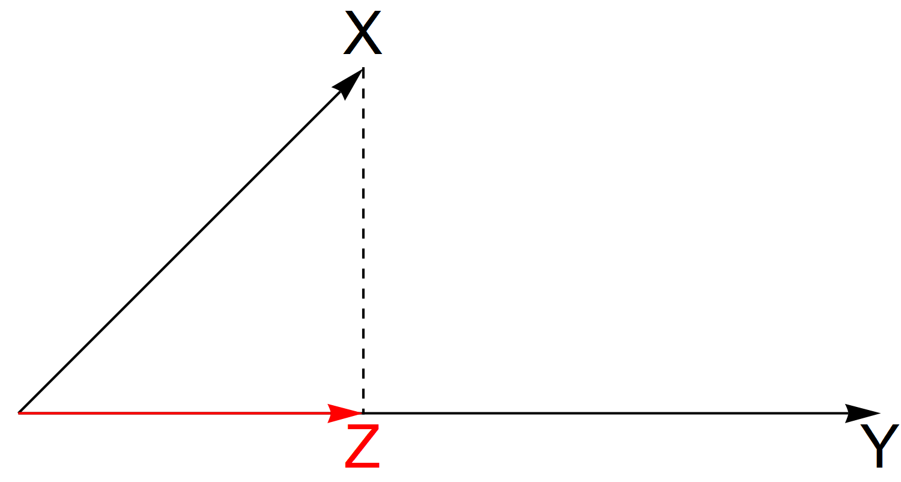

# Produit scalaire

## Le produit scalaire $\mathbb{R}^n$

Soit une application $\phi$ de $\mathbb{R}^n \times \mathbb{R}^n$ dans $\mathbb{R}$, on note $\left\langle X | \phi | Y \right\rangle$ ou ${\left\langle X | Y \right\rangle}_{\phi}$ le nombre réel $\phi \left( X, Y \right)$ avec $X = \left( \begin{array}{c} x_1 \\ \ldots{} \\ x_n \end{array} \right)$ et $Y = \left( \begin{array}{c} y_1 \\ \ldots{} \\ y_n \end{array} \right)$.

$\phi : \left\lbrace  \begin{array}{l} \mathbb{R}^n \times \mathbb{R}^n \longrightarrow \mathbb{R} \\ \left( X, Y \right) \longmapsto \phi \left( X, Y \right) = \sum_{i = 1}^{n} x_i y_i  \end{array} \right.$

On appelle produit scalaire dans $\mathbb{R}^n$ toute application de $\mathbb{R}^n \times \mathbb{R}^n$ dans $\mathbb{R}$ qui possède les quatre propriétés suivantes :

1. la bilinéarité ;

2. la symétrie ;

3. la positivité ;

4. la non dégénérescence.

### La bilinéarité

La linéarité par rapport à la première variables s'exprime de la manière suivante :

$\forall \lambda \in \mathbb{R}, \forall X \in \mathbb{R}^n, \forall X' \in \mathbb{R}^n, \forall Y \in \mathbb{R}^n, \phi \left( X + X', Y \right) = \phi \left( X, Y \right) + \phi \left( X', Y \right)$

et

$\forall \lambda \in \mathbb{R}, \forall X \in \mathbb{R}^n, \forall Y \in \mathbb{R}^n, \phi \left( \lambda X, Y \right) = \lambda \phi \left( X, Y \right)$

En utilisant la notation précédente, la propriété s'exprime de la manière suivante :

$\left\langle X + X' | \phi | Y \right\rangle = \left\langle X | \phi | Y \right\rangle + \left\langle X' | \phi | Y \right\rangle$

La linéarité par rapport à la seconde variable s'exprime de la manière suivante :

$\forall \lambda \in \mathbb{R}, \forall X \in \mathbb{R}^n, \forall Y \in \mathbb{R}^n, \forall Y' \in \mathbb{R}^n, \phi \left( X , Y + Y' \right) = \phi \left( X, Y \right) + \phi \left( X, Y' \right)$

et

$\forall \lambda \in \mathbb{R}, \forall X \in \mathbb{R}^n, \forall Y \in \mathbb{R}^n, \phi \left( X, \lambda Y \right) = \lambda \phi \left( X, Y \right)$

De fait

$\phi \left( \lambda X, Y \right) = \phi \left( X, \lambda Y \right)$

### La symétrie

$\forall X \in \mathbb{R}^n, \forall Y \in \mathbb{R}^n, \phi \left( X, Y \right) =  \phi \left( Y, X \right)$

c'est-à-dire

$\left\langle X | \phi | Y \right\rangle = \left\langle Y | \phi | X \right\rangle$

### La positivité

$\forall X \in \mathbb{R}^n, \left\langle X | X \right\rangle \geq 0$

### La non dégérescence

$\phi \left( X , X \right) = 0 \Rightarrow X = 0$

c'est-à-dire

$\left\langle X | \phi | X \right\rangle \geq 0 \Rightarrow X = 0$

Le vecteur $0 = \left( 0, \ldots{}, 0 \right)$ de $\mathbb{R}^n$ est l'unique solution de l'équation $\phi \left( X, X \right) = 0$.

### Bilan

Le produit scalaire sur $\mathbb{R}^n$ est une **forme bilinéaire symétrique positive non dégénérée**.

> [!NOTE]
> Le terme « forme » renvoie au fait que les valeurs sont des scalaires.

**Propriété.** Si $\mathbb{R}^n$ est muni d'un produit scalaire, alors $\mathbb{R}^n$ est un **espace vectoriel euclidien**.

## Le calcul du produit scalaire

### Le produit scalaire canonique

L'application de $\mathbb{R}^n \times \mathbb{R}^n$ dans $\mathbb{R}$ définie par

$\left\langle X | Y \right\rangle = {{}^t}X.Y = \left( x_1, \ldots{}, x_j, \ldots{}, x_n \right).\left( \begin{array}{c} y_1 \\ \ldots{} \\ y_i \\ \ldots{} \\ y_n \end{array} \right)$

$\left\langle X | Y \right\rangle = \sum_{i = 1}^{n} x_i y_i$

est **un** produit scalaire sur $\mathbb{R}^n$ appelé le **produit scalaire canonique de $\mathbb{R}^n$**.

### Le produit scalaire défini par une matrice diagonale à éléments positifs

Soit une matrice réelle $M$ à $n$ lignes et $n$ colonnes dont tous les éléments en dehors de la diagonale principale sont nuls.

$\forall i, j \in \left\lbrace 1, \ldots{}, n \right\rbrace \textrm{ avec } i \neq j, m_{ij} = 0$

$M$ est une **matrice (carrée) diagonale**. Les éléments de la diagonale principale sont des **nombres réels strictement positifs**.

$\forall i \in \left\lbrace 1, \ldots{}, n \right\rbrace, m_{ii} > 0$

L'application

$\begin{array}{l} \left( X, Y \right) \mapsto \left\langle X | M | Y \right\rangle = {{}^t}X.M.Y \\ {{}^t}X.M.Y = \left( x_1, \ldots{}, x_j, \ldots{}, x_n \right) . M . \left( \begin{array}{c} y_1 \\ \ldots{} \\ y_i \\ \ldots{} \\ y_n \end{array} \right) \\ {{}^t}X.M.Y = \sum_{{\scriptsize \begin{array}{c} i = 1 \\ j = 1 \end{array}}}^{n} m_{ij} x_j y_i = \sum_{i = 1}^{n} m_{ii} x_i y_i \end{array}$

est le produit scalaire sur $\mathbb{R}^n$. $M$ est appelée la **matrice des poids**. On désigne par « poids » tout élément de la diagonale.

### Bilan

La produit scalaire canonique correspond au cas où la matrice $M$ est la **matrice unité $I_n$**, c'est-à-dire où tous les points en diagonale valent 1.

$\left(  \begin{array}{ccccc} 1, \ldots{}, 0, \ldots{}, 0 \\ \ldots{}, \ldots{}, \ldots{}, \ldots{}, \ldots{} \\ 0, \ldots{}, 1, \ldots{}, 0 \\ \ldots{}, \ldots{}, \ldots{}, \ldots{}, \ldots{} \\ 0, \ldots{}, 0, \ldots{}, 1 \\ \end{array} \right)$

On note souvent $M = D_{\frac{1}{n}} = \frac{1}{n} I_n$ la matrice diagonale dans laquelle tous les poids sont égaux à $\frac{1}{n}$ et la somme des poids vaut 1.

## Les propriétés du produit scalaire

### Matrice d'un produit scalaire

Pour tout produit scalaire $\phi$ sur $\mathbb{R}^n$, on peut écrire

$\begin{array}{l} \phi \left( X, Y \right) = \phi \left( \sum_{i = 1}^{n} x_i e_i, \sum_{j = 1}^{n} y_j e_j \right) \\ \phi \left( X, Y \right) = \sum_{{\scriptsize \begin{array}{c} i = 1 \\ j = 1 \end{array}}}^{n} \phi \left( e_i, e_j \right) x_i x_j \\ \phi \left( X, Y \right) = \left( x_1, \ldots{}, x_i, \ldots{}, x_n \right) . M_{\phi} . \left( \begin{array}{c} y_1 \\ \ldots{} \\ y_j \\ \ldots{} \\ y_n \end{array} \right)  \end{array}$

La matrice $M_{\phi} = \left[ \phi \left( e_i, e_j \right) \right]$ s'appelle la **matrice du produit scalaire $\phi$ dans la base canonique**.

- **Proprété 1.** La matrice $M_{\phi}$ est symétrique :

$\phi \left( e_i, e_j \right) = \phi \left( e_j, e_i \right)$

- **Proprété 2.** Les éléments de sa diagonale sont des nombres réels strictement positifs :

$\phi \left( e_i, e_j \right) > 0$

> [!NOTE]
> Ces deux propriétés ne sont pas suffisantes pour définir un produit scalaire. Pour qu'une matrice carrée symétrique réelle soit la matrice d'un produit scalaire, il faut et il suffit que toutes ses **valeurs propres**, qui sont toujours des nombres réels, soient strictement positives.

### Norme d'un vecteur

Si $\phi$ est un produit scalaire sur $\mathbb{R}^n$, le nombre réel positif ${\left| \left| X \right| \right|}_{\phi} = \sqrt{\phi \left( X, X \right)}$ s'appelle la **$\phi$-norme** de $X$, ou la **$\phi$-longueur** de $X$.

> [!NOTE]
> Lorsqu'il n'y a pas de confusion possible, on parlera simplement de norme ou de longueur, notée $\left| \left| X \right| \right|$.

Un vecteur est **normé** si sa $\phi$-longueur vaut 1. 

**Exemple.** Dans $\mathbb{R}^2$ muni du produit scalaire canonique, la longueur de $X = \left( x_1, x_2 \right)$ est $\left| \left| X \right| \right| = \sqrt{{x_1}^2 + {x_2}^2}$. Le vecteur $\left( 1, 0 \right)$ est normée, tout comme $\left( 0, 1 \right)$.

### Angle de deux vecteurs

Soient deux vecteurs $X$ et $Y$ de $\mathbb{R}^n$ et un produit scalaire $\phi$ sur $\mathbb{R}^n$,

$\begin{array}{l} \forall \lambda \in \mathbb{R}, \phi \left( X + \lambda Y, X + \lambda Y \right) = {{\left| \left| X + \lambda Y \right| \right|}_{\phi}}^2 \geq 0 \\ \Leftrightarrow {\lambda}^2 \phi \left( Y, Y \right) + \lambda \left[ \phi \left( Y, X \right) + \phi \left( X, Y \right) \right] + \phi \left( X, X \right) \geq 0 \\ \Leftrightarrow {\lambda}^2 \phi \left( Y, Y \right) + 2\lambda \phi \left( X, Y \right) + \phi \left( X, X \right) \geq 0 \textrm{ car } \phi \left( X, Y \right) = \phi \left( Y, X \right) \textrm{ (propriété de symétrie)} \\ \Leftrightarrow {\lambda}^2 {{\left| \left| Y \right| \right|}_{\phi}}^2 + 2\lambda {\left\langle X | Y \right\rangle}_{\phi} +  {{\left| \left| X \right| \right|}_{\phi}}^2 \geq 0 \end{array}$

Cette inégalité est vraie pour tout nombre réel $\lambda$. Le **discriminant** de ce trinôme du second degré est négatif.

$\begin{array}{l} \Delta = {{\left\langle X \ Y \right\rangle}_{\phi}}^2 - {{\left| \left| X \right| \right|}_{\phi}}^2 {{\left| \left| Y \right| \right|}_{\phi}}^2 \\ \Delta \leq 0 \Leftrightarrow \left| {\left\langle X \ Y \right\rangle}_{\phi} \right| \leq {{\left| \left| X \right| \right|}_{\phi}} {{\left| \left| Y \right| \right|}_{\phi}} \end{array}$

On obtient alors, pour tous les vecteurs $X$ et $Y$ de $\mathbb{R}^2$, l'**inégalité de Schwarz**.

**Propriété.** Si les deux vecteurs $X$ et $Y$ sont non nuls, leur longueur n'est pas nulle ; le produit de leur longueur n'est pas nul. De fait, le rapport $\frac{{{\left\langle X | Y \right\rangle}_{\phi}}}{{\left| \left| X \right| \right|}_{\phi} {\left| \left| Y \right| \right|}_{\phi}}$ est compris entre $-1$ et $+1$, ce qui signifie qu'est existe un angle $\alpha$ compris entre $0$ et $\pi$ radians, dont le cosinus vaut ce rapport. Cet angle $\alpha$ étant unique, il vérifie :

$\cos \alpha = \frac{{{\left\langle X | Y \right\rangle}_{\phi}}}{{\left| \left| X \right| \right|}_{\phi} {\left| \left| Y \right| \right|}_{\phi}} = \frac{{{\left\langle X | \phi | Y \right\rangle}_{\phi}}}{{\left| \left| X \right| \right|}_{\phi} {\left| \left| Y \right| \right|}_{\phi}}$

Il correspond à l'**angle des deux vecteurs non nuls $X$ et $Y$**.

### Orthogonalité

Soient deux vecteurs $X$ et $Y$ et un produit scalaire $\phi$ sur $\mathbb{R}^n$, on dit que $X$ et $Y$ sont **$\phi$-orthogonaux** si et seulement si leur produit scalaire est nul.

$\phi \left( X, Y \right) = {{\left\langle X \ Y \right\rangle}_{\phi}} = 0$

> [!NOTE]
> S'il n'y a pas de confusion possible, $X$ et $Y$ sont simplement dit orthogonaux.

- **Propriété 1.** $0$ est $\phi$-orthogonal à tout vecteur de $\mathbb{R}^n$.

- **Propriété 2.** L'angle de deux vecteurs non nuls $\phi$-orthogonaux est $\frac{\pi}{2}$.

- **Propriété 3.** La base canonique $\mathbb{R}^n$ muni du produit scalaire canonique est formée de vecteurs normés orthogonaux deux à deux. On dit que la **base** est **orthonormée**.

### Projeté orthogonal

Soient $X$ et $Y$ deux vecteurs non nuls de $\mathbb{R}^n$ et $\phi$ un produit scalaire sur $\mathbb{R}^n$, il existe un unique vecteur $Z$ de $\mathbb{R}^n$ proportionnel à $Y$ et tel que $X - Z$ soit orthogonal $Y$.

**Démonstration.** Pour tout vecteur $Z$, on peut écrire :

${{\left\langle X - Z | Y \right\rangle}_{\phi}} = {{\left\langle X | Y \right\rangle}_{\phi}} - {{\left\langle Z | Y \right\rangle}_{\phi}}$

$Z$ étant le résultat du vecteur projeté sur $Y$, $Z$ et $Y$ sont colinéaires $Z = aY$, donc :

$\begin{array}{l} {{\left\langle X | Y \right\rangle}_{\phi}} - {{\left\langle Z | Y \right\rangle}_{\phi}} \\ = {{\left\langle X | Y \right\rangle}_{\phi}} - {{\left\langle aY | Y \right\rangle}_{\phi}} \\ = {{\left\langle X | Y \right\rangle}_{\phi}} - a {{\left\langle Y | Y \right\rangle}_{\phi}} \\ = {{\left\langle X | Y \right\rangle}_{\phi}} - a {{\left| \left| Y \right| \right|}_{\phi}}^2 \end{array}$

Pour que $X - Z$ soit orthogonal à $Y$, soit ${{\left\langle X - Z | Y \right\rangle}_{\phi}} = 0$, il faut et il suffit que l'on prenne :

$a = \frac{{{\left\langle X | Y \right\rangle}_{\phi}}}{{{\left| \left| Y \right| \right|}_{\phi}}^2}$

L'unique vecteur $Z = \frac{{{\left\langle X | Y \right\rangle}_{\phi}}}{{{\left| \left| Y \right| \right|}_{\phi}}^2} Y$, proportionnel à $Y$ et tel que $X - Z$ soit orthogonal à $Y$, s'appelle le **projeté orthogonal de $X$ sur $Y$**.

**Figure 1. Projection du vecteur $X$ sur le vecteur $Y$**

> [!NOTE]
> C'est le projeté de $X$ dans $\mathrm{Vect} \left( Y \right)$ en algèbre linéaire.

**Propriété importante.** Le projeté orthogonal $Z_0$ de $X$ sur $Y$ est le vecteur $Z$ de $\mathbb{R}^n$ proportionnel à $Y$ qui minimise ${{\left| \left| X - Z \right| \right|}_{\phi}}^2$.

**Démonstration.** Soient $Z$ un vecteur proportionnel à $Y$ et $Z_0 = \frac{{{\left\langle X | Y \right\rangle}_{\phi}}}{{{\left| \left| Y \right| \right|}_{\phi}}^2} Y$ le projeté orthogonal de $X$ sur $Y$. Est-ce vrai que $Z = Z_0$ ? Pour le vérifier, on introduit $Z_0$ dans l'équation :

${{\left| \left| X - Z \right| \right|}_{\phi}}^2 = {{\left| \left| X - Z_0 + Z_0 - Z \right| \right|}_{\phi}}^2$

Comme $Z$ est proportionnel à $Y$ et que $Z_0$ est proportionnel à $Y$, la différence $Z_0 - Z$ est proportionnel à $Y$, or $X - Z_0$ est orthogonal à $Y$, et $X - Z_0$ est orthogonale à $Z_0 - Z$ qui est proportionnel à $Y$. Il en résulte que l'on a :

$\begin{array}{l} {{\left| \left| X - Z \right| \right|}_{\phi}}^2 = {{\left| \left| X - Z_0 + Z_0 - Z \right| \right|}_{\phi}}^2 \\ {{\left| \left| X - Z \right| \right|}_{\phi}}^2 = {{\left| \left| X - Z_0 \right| \right|}_{\phi}}^2 + {{\left| \left| Z_0 - Z \right| \right|}_{\phi}}^2 \end{array}$

or ${{\left| \left| X - Z_0 \right| \right|}_{\phi}}^2 + {{\left| \left| Z_0 - Z \right| \right|}_{\phi}}^2 \geq {{\left| \left| X - Z \right| \right|}_{\phi}}^2$, donc ${{\left| \left| X - Z \right| \right|}_{\phi}}^2$ atteint son minimum lorsque $Z = Z_0$.

### Matrices orthogonalement semblables

Si $P$ est une matrice orthogonale et si $B = P^{-1}.A.P$, alors $B$ est dite « orthogonalement semblable » à $A$.

> [!NOTE]
> $P^{-1} = {{}^t}P$

Dit autrement, toute matrice $A$ réelle **symétrique est orthogonalement semblable** à une matrice diagonale pour laquelle les éléments diagonaux sont les **valeurs propres de $A$**.

L'ensemble des matrices diagonales constitue une **ensemble canonique** de matrices réelles symétriques pour la similitude orthogonale.

## Liens

- [Topo en format P.D.F.](./PDF/06-Produit-scalaire.pdf)
