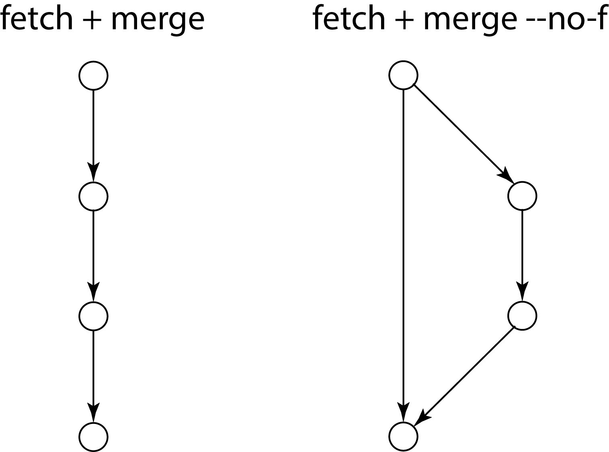
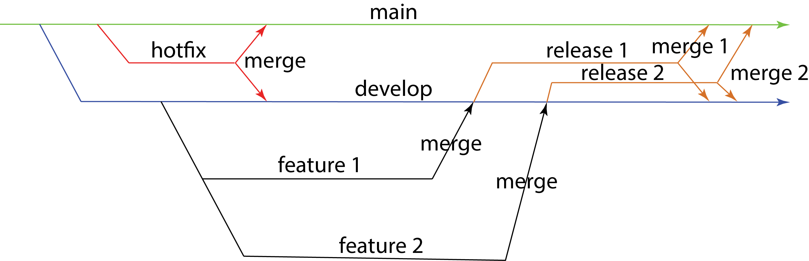
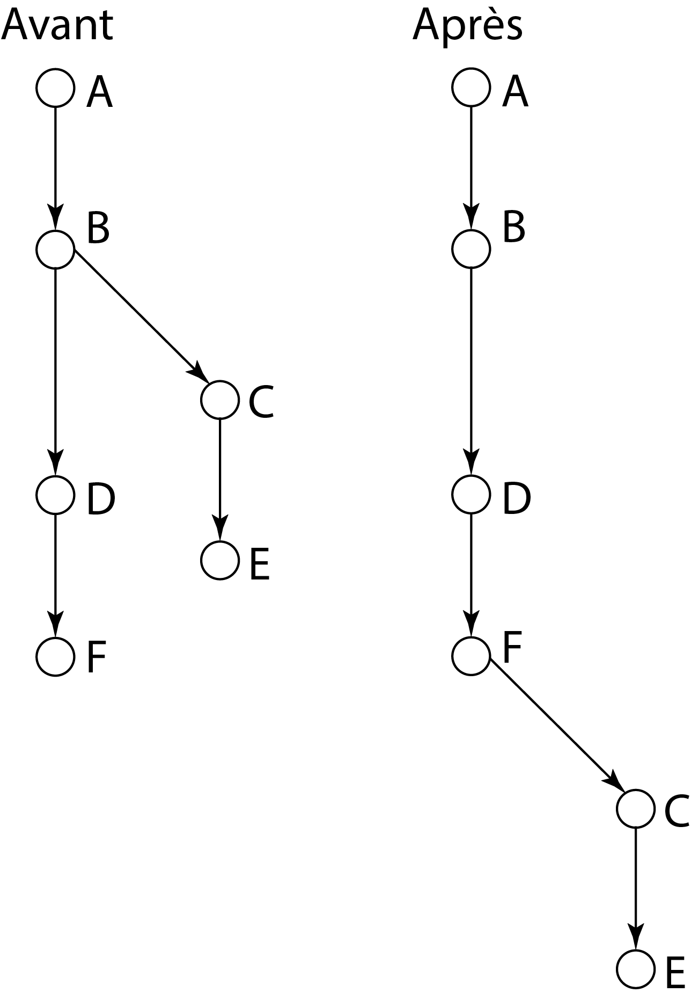

# `Git`- Approfondissement

## Création de fichiers MarkDown

Les fichiers `MarkDown` ont pour extension `*.md`. Ce sont des fichiers décrivant le code. Il est conseillé de mettre au minimum un `README.md` à la racine du dépôt. Il décrit les dépendances et les installations particulières.

Les fichiers `MarkDown` ont un balisage particulier et très rigoureux.

### Les titres

`#` : niveau 1

`##` : niveau 2

`###` : niveau 3

`####` : niveau 4

`#####` : niveau 5

`######` : niveau 6

### Les styles du texte

`** ... **` ou `__ ... __` : mettre le texte en gras

`* ... *` ou `_ ... _` : mettre le texte en italique

`   ...   ` : barrer le texte

`*** ... ***` : mettre le texte en gras et en italique

`<sub> ... </sub>` : mettre le texte en indice

`<sup> ... </sup>` : mettre le texte en exposant

``` ` ... ` ``` : mettre le texte dans un style code

>[!NOTE]
> Pour introduire du code sur une ligne, il suffit de mettre un alinéa.

` ``` ... ``` ` : mettre le texte dans un style code sur plusieurs lignes

`[ ... ](` *lien hypertexte* `)` : mettre un lien hypertexte

`$ ... $` : écrire des équations `LaTeX`

> [!NOTE]
> Entre le dollar du début et le début de l'équation et entre le dollar de fin et la fin de l'équation, il ne doit pas y avoir d'espaces.
> `$x^2$`
> et non
> `$ x^2 $`

### Les listes

Faire une liste non triée :

1. `+`

2. `*`

3. `-`

Faire une liste triée :

- `1.`

- `2.`

- `3.`

- *etc*.

Faire une liste de tâches :

- `[ ]` : tâche en cours

- `[X]` : tâche finie

### Les paragraphes

Pour créer un paragraphe, il faut laisser une ligne vide.

### Les tableaux

Les colonnes sont séparées par un `|`.

La première ligne contient toujours les titres.

La deuxième ligne précise l'alignement :

- `--` pour « à gauche » ;

- `:-:` pour « au centre » ;

- `–:` pour « à droite ».

À partir de la troisième ligne, le tableau commence.

Le site [tablesgenerator.com](tablesgenerator.com) permet de réaliser des tableaux en `MarkDown`.

### Les images

``

### Les traits

La commande `--` permet de tirer un trait.

### Les notes de bas de page

Définir une note de bas de page : `[^1]: ` *note*

Appeler une note de bas de page : `[^1]`

### Les alertes

Indication :

```
	> [!NOTE]
	> ...	
```

Astuce :

```
	> [!TIP]
	> ...
```

Indication importante :

```
	> [!IMPORTANT]
	> ...
```

Attention :

```
	> [!WARNING]
	> ...
```

Interdit :

```
	> [!CAUTION]
	> ...
```

Administration :

```
	> [!ADMINISTRATION]
	> ...
```

Disponibilité :

```
	> [!AVAILABILITY]
	> ...
```

Pré-requis :

```
	> [!PREREQUISITES]
	> ...
```

Erreur :

```
	> [!ERROR]
	> ...
```

Information :

```
	> [!INFO]
	> ...
```

Réussite :

```
	> [!SUCCESS]
	> ...
```

## Gestion des branches

Une branche équivaut entre une heure de travail et une demi-journée de travail maximum.

### Gestion native des branches

#### Créer une branche

Sur `GitHub`, il est possible de créer une branche parallèle à la branche principale `main` avec la commande :

- `$ git branch` *nom de la branche*

#### Se rendre dans une branche

Pour déposer dans la nouvelle branche créée, on utilise :

- `$ git checkout` *nom de la branche*

Désormais, tous les dépôts s'effectueront dans cette branche secondaire.

> [!NOTE]
> `checkout` servant également à restaurer l'espace de travail, il a été remplacé par `switch` pour effectuer la commande de changement de branche.
> - `$ git switch` *nom de la branche*

> [!NOTE]
> Pour revenir à la branche principale, il faut taper :
> ```
> 	$ git checkout main
> ```

> [!NOTE]
> La commande `checkout` permet d'utiliser le `Cherry-Pick`. Cette technique permet de sélectionner les `commit` d'une branche.
> - `$ git cherry-pick` *numéro du* `commit` *d'une autre branche*

#### Configurer une branche par défaut

Pour définir une branche par défaut `main`, on tape la commande :

```
	$ git config --global init.defaultBranch main
```

#### Téléchargement depuis son dépôt distant personnel

La commande `pull` rapatrie et intègre un autre dépôt ou une autre branche locale dans la branche actuelle.

Dans le mode par défaut, `pull` est l'abréviation de l'exécution des commandes `fetch`, elle-même suivie par `merge FETCH_HEAD`.

`pull` lance un `fetch` avec les paramètres donnés et appelle un `merge` pour fusionner les têtes de branche récupérées dans la branche courante.

Avec l'option `--rebase`, `pull` lance un `rebase` à la place d'un `merge`.

`$ git pull` *options* *dépôt* *références à récupérer et références locales à mettre à jour*

#### Téléchargement depuis un autre dépôt distant

La commande `fetch` télécharge les objets et références depuis un autre dépôt.

- `git fetch --all` *nom du dépôt distant source ou groupe*\footnote{Un groupe est une liste de dépôts.} $\rightarrow$ récupération de tous les éléments distants

- `git fetch --depth=` *nombre entier* $\rightarrow$ récupération en indiquant le nombre de `commit` à récupérer (la profondeur)

- `git fetch -f`  $\rightarrow$ pour forcer la commande

- `git fetch -p` (ou `--prune`) $\rightarrow$ pour, avant de récupérer, supprimer toutes les références de suivi à distance qui n'existe plus sur le dépôt distant 

- `git fetch -t` (ou `--tags`)  $\rightarrow$ récupération de toutes les étiquettes à distance 

- `git fetch -n` (ou `--no-tags`) 

- `git fetch -v` (ou `--verbose`) $\rightarrow$ déclenchement du mode bavard

- *etc*.

#### Visualiser la liste des dernières modifications

La commande `blame` permet de visualiser la liste des dernières modifications de chaque ligne d'un fichier.

- `git blame` *nom du fichier*

Pour lister des lignes précises :

- `git blame -L l1,l2` *nom du fichier*

liste les lignes de 1 à 2.

`git log -S "ligne" --pretty=format:'%h %an %ad %s'` recherche les log concernant des lignes contenant `"ligne"`.

#### Notion de *fast-forward*

La notion de *fast-forward* permet de gérer l'historique des branches. Elle est utilisée **par défaut**, que l'on utilise les commandes `pull` ou `merge`. L'historique est toujours compatible.

Il est possible de supprimer l'option dans un fichier `.gitconfig` en y tapant :

```
	[merge]
		ff=no
		commit=no
	[pull]
		ff=yes
```

ou en tapant :

```
	$ git config --global merge.commit no$ git config –global merge.ff no
```



**Figure 1. Différence entre *fast-forward* et sans *fast-forward***

#### Fusionner deux branches

Toute branche secondaire peut être fusionnée à la branche principale. La fusion s'effectue toujours sur la branche parente la plus proche. Cela signifie que la branche source s'importe vers la branche actuelle mentionnée. Cette opération est un *merge request*.

- `$ git merge` *nom de la branche à fusionner*

La fonction `merge` permet de conserver les deux branches et leur historique.

Il peut exister un conflit entre les branches. Pour l'établir, on utilise la commande suivante pour supprimer l'option *fast-forward* :

- `$ git merge --no-ff` *nom d'une autre branche secondaire*

Le conflit se résout manuellement sur l'éditeur local qui affiche le conflit.

Soient deux branches partant chacune dans leur direction, jusqu'à ce qu'elles finissent par se rejoindre tôt ou tard. La commande `merge commit` règle le conflit de `commit` en **fusionnant deux** `commit` **parents**.

1. Le premier parent correspond au dernier `commit` de la branche courante.

2. Le second parent correspond au dernier `commit` sur la branche externe qui a été fusionnée.

Lors de la création d'un `commit` de fusion, `Git` tentera de fusionner automatiquement les historiques séparés. Si `Git` rencontre une donnée modifiée dans les deux historiques, il ne pourra pas les combiner automatiquement.

```
	$ git merge --no-f -m "merge" nom_de_la_branche
```

équivaut à :

```
	$ git merge commit
```

Le `merge commit` peut se faire sur l'interface de `Git`.

#### Fusion du dépôt local avec le dépôt distant

La commande `pull` exécute les commandes `fetch`, puis `merge`.

Il peut exister un conflit entre les branches. Pour l'établir, on utilise la commande suivante pour supprimer l'option *fast-forward* :

- `$ git pull --no-ff`

Le conflit se résout manuellement sur l'éditeur local qui affiche le conflit.

#### Suppression d'une branche

Il faut, à la suite de la fusion, supprimer la branche secondaire.

- `$ git branch -d ` *nom de la branche à supprimer*

#### Nettoyage des branches obsolètes

La commande `$ git fetch –prune` permet de nettoyer les branches obsolètes.

1. Elle permet de se connecter à un dépôt distant partagé.

2. Elle récupère toutes les références sur les branches distantes.

3. Elle supprime les références distantes qui ne sont plus utilisées sur le référentiel distant.

Pour automatiser la tâche, il suffit de la configurer :

```
	$ git config --global remote.origin.prune true
```

### Utilisation de `GitFlow`

Le projet `GitFlow` permet de gérer plus visuellement les branches de `GitHub`. `GitFlow` est un *workflow* (flux de travail), une méthode de travail.

- [https://danielkummer.github.io/git-flow-cheapsheet/index.fr_FR_html](https://danielkummer.github.io/git-flow-cheapsheet/index.fr_FR_html)

#### Utilisation des branches

Dans un projet géré par `GitFlow`, il existe cinq branches (Fig. 2).

- `main` désigne la branche principale. Elle doit normalement avoir peu de dépôts. Il s'agit de la **branche de production**.

> [!NOTE]
> `master` est l'ancien nom.

- `develop` est la branche correspondant aux programmes en cours de développement.

- `feature branches` correspondent aux branches de test proposées par les développeurs. Plusieurs branches de ce type sont possibles. Elles ne sont connectées qu'à `develop`. Elles basculent sur une branche `release`, puis sur les branches `main` et `develop`.

> [!NOTE]
>  On nomme les branches de tests `feature/` *nom de l'action menée*

- `release branches` correspondent aux branches des différentes versions.
> [!NOTE]

>  On nomme les branches de tests avant dépôt sur la branche `main`, `release/` *nom de l'action menée*

- `hotfixes` correspondent aux branches de résolution des petits bogues.

> [!NOTE]
>  En général, dans les cas où le développeur dispose de 8 heures pour résoudre un **bogue urgent**.



**Figure 2. Convention du nommage des branches en fonction de leur utilisateur sur `Git-Flow`**

> [!NOTE]
>  En mode DevOps, on utilise la **technique basée sur un tronc**[^1]. L'objectif est de lancer en permanence des traitements.

#### Installation de `GitFlow`

Pour installer `GitFlow` sur `Windows`, il faut se rendre sur la page \href{https://gist.github.com/ilyar/11190988}{https://gist.github.com/ilyar/11190988}.

1. Télécharger le `zip` contenant `getopt.exe`.

2. Télécharger le `zip` contenant `libintl3.dll`.

3. Télécharger le `zip` contenant `libiconv2.dll`.

> [!WARNING]
> Ne prendre que les trois fichiers situés dans le dossier `bin` de leur `zip` respectif.

4. Copier-coller les trois fichiers dans le dossier :

```
	C:\...\git\bin\
```

5. Ouvrir `GitBash` et y taper

```
	$ git clone –recursive git://github.com/nvie/gitflow.git
```

6. Installer `git` à partir de `GitSCM to Windows` en téléchargeant l'outil à partir de la page \href{https://gitforwindows.org}{https://gitforwindows.org} :

	- `ln -s /C/` *dossier contenant l'exécutable téléchargé* `/git-flow`

7. Vérifier sur `GitBash` si `GitFlow` est bien installé :

```
	$ git flow
```

Sous `Linux`, on tape :

```
	(type -p wget >/dev/null || (sudo apt update && sudo apt-get install wget -y)) \
		&& sudo mkdir -p -m 755 /etc/apt/keyrings \
		&& wget -qO- https://cli.github.com/packages/githubcli-archive-keyring.gpg | sudo tee /etc/apt/keyrings/githubcli-archive-keyring.gpg > /dev/null \
		&& sudo chmod go+r /etc/apt/keyrings/githubcli-archive-keyring.gpg \
		&& echo "deb [arch=$(dpkg –print-architecture) signed-by=/etc/apt/keyrings/githubcli-archive-keyring.gpg] https://cli.github.com/packages stable main" | sudo tee /etc/apt/sources.list.d/github-cli.list > /dev/null \
		&& sudo apt update \
		&& sudo apt install gh -y
```

#### Création d'un `GitFlow`

Pour initialiser un `GitFlow`, on utilise la commande :

```
	$ git flow init
```

Pour afficher la version, on utilise la commande :

```
	$ git flow version
```

Pour afficher et gérer la configuration, on utilise la commande :

```
	$ git flow config
```

Pour afficher les log d'une branche, on utilise la commande :

```
	$ git flow log
```

Pour créer une nouvelle branche, on utilise les quatre branches spécifiques à `GitFlow`.

##### Créer une branche de test

1. Créer une branche `feature`
	- `$ git flow feature start` *nom de la nouvelle branche*
2. Gérer le dépôt à distance
	- `$ git remote add origin ../remote`
	- `$ git flow feature publish` *nom de la nouvelle branche*
	- `$ git pull origin feature/` *nom de la nouvelle branche*
	- `$ git remote rm origin ../remote` pour supprimer une branche
3. Fusionner la branche `feature` avec la branche `develop`
	- `$ git flow feature finish` *nom de la branche à fusionner*

##### Créer une branche de version

1. Créer une branche `release`

	- `$ git flow release start v` *numéro de version*

2. Ajouter un fichier

	- `$ git add` *nom du fichier à déposer*

	- `$ git commit -m "` *description de la version* `"`

	- `$ git flow release finish`

		- Un utilitaire s'ouvre et pose une série de questions auxquelles il faut répondre.

		- Taper `ctrl + x` pour quitter l'utilitaire et enregistrer les modifications.

3. Pousser les versions vers la branche voulue

	- `$ git push --tags`

	- `$ git push origin main`

	- `$ git push origin develop`

	- `$ git push -u origin main` (pour pousser une branche d'un dépôt local sur un dépôt distant ; `-u` est un raccourci de `–set-upstram`)
	
	- `$ git push -f origin main` (pour forcer la poussée)

##### Créer une branche corrigeant un bogue

1. Créer une branche `hotfix`

	- `$ git flow hotfix start` *nom de la modification*

2. Ajouter une correction

	- `$ git add` *nom du fichier à déposer*

	- `$ git commit -m "` *description de la modification* `"`

	- `$ git flow hotfix finish` *nom de la modification*

		- Un utilitaire s'ouvre et pose une série de questions auxquelles il faut répondre.

		- Taper `ctrl + x` pour quitter l'utilitaire et enregistrer les modifications.

##### Autres branches

`$ git flow bugfix` gère la branche `bugfix`.

`$ git flow support` gère la branche `support`.

`GitFlow` propose un graphe présentant les branches, mais il est **souvent jugé illisible**. Toutefois, il reste intéressant dans le cadre d'un travail d'équipe.

## Fusion des `commit`

Il est possible de fusionner les `commit` afin d'en faciliter leur lecture. `rebase` réapplique des `commit` sur le sommet de l'autre base. Il change le point de bifurcation (Fig. \ref{td5-fig4}).

```
	$ git rebase -i HEAD 2
```

La commande ouvre un fichier dans l'éditeur de code par défaut. `HEAD 2` permet d'appeler l'avant-dernier `commit`. Au début de ce fichier, il y a une série de `pick` avec le numéro de `commit`. Il suffit de remplacer `pick` (ou `p`) par `squash` (ou `s`) au niveau de ce que l'on souhaite fusionner. `squash` fusionne et reprend les historiques. `squash` regroupe les `commit` d'un `merge` de branches.



**Figure 3. Schéma de l'action de `rebase` : avant – après**

Avec `rebase`, la modification de l'historique est irréversible. Le `merge` est une solution certaine qui préserve tout l'historique du dépôt, tandis que le `rebase` génère un historique linéaire en déplaçant la branche de fonctionnalité sur la pointe de la branche principale.

Options :

- `git rebase --continue` redémarre le processus de `rebase` après avoir résolu un conflit de fusion.

- `git rebase --skip` redémarre le processus de `rebase` en sautant la rustine actuelle.

- `git rebase --abort` abandonne l'opération `rebase` et réinitialise `HEAD` à la branche originale.

- `git rebase --quit` abandonne l'opération `rebase`, mais `HEAD` n'est pas réinitialisé à la branche d'origine.

- `git rebase --edit-todo` édite la liste à faire lors d'un `rebase` interactif.

- `git rebase –show-current-patch` affiche la rustine actuelle dans un `rebase` interactif, ou lorsque le `rebase` est arrêté en raison de conflits. Cela équivaut à `git rebase REBASE_HEAD`.

## Différences entre `merge` et `rebase`

La commande `git merge` permet de ramener les modifications d'une branche qui a bifurqué de la branche courante.

1. Un `commit` de `merge` permet de fusionner `develop` avec `main`

```
	$ git switch main
	$ git merge develop
```

2. Le `fast-forward` s'applique en cas d'historique linéaire.

```
	$ git switch main
	$ git merge develop
```

La commande `git rebase` permet de déplacer le point de départ de la première à la suite de la seconde.

1. Se déplacer sur la branche à déplacer :

```
	$ git switch develop
```

2. Utiliser la commande :

```
	$ git rebase main
```

> [!NOTE]
> Les deux branches doivent avoir un moins un `commit` commun.

3. Utiliser la commande :

```
	$ git rebase --continue
	$ git rebase --abort
```

Le `rebase` d'une branche sur une autre amène les deux branches dans une situation de `fast-forward`. Cela implique un `merge` sans `merge commit`.

## Retour à un état antérieur

Il existe la commande `reset` pour revenir à un état antérieur (Fig. 4).

- `$ git reset` *option* `HEAD `*numéro*

Les options sont :

- `--soft` retourne sur le précédent `commit` tout en enregistrant l'historique en cours sur le précédent `commit`. Il ne touche pas du tout le fichier d'index ou l'arbre de travail. La commande laisse tous les fichiers modifiés dans `Changes` `to` `be` `commited`.

- `--mixed` réinitialise l'index, mais pas l'arbre de travail. Les fichiers modifiés sont conservés, mais ils ne sont pas marqués pour l'engagement. Par défaut, il rapporte ce qui n'a pas été mis à jour.

- `--hard` modifie tout. Il réinitialise l'index et l'arbre de travail. Toute modification des fichiers de suivis dans l'arbre de travail depuis `commit` sont détruits. Tout fichier non suivi ou les répertoires dans la manière d'écrire les fichiers suivis sont simplement supprimés. **Cela supprime le dépôt sans l'enregistrer**.

- `--merge` réinitialise l'index et met à jour les fichiers de l'arbre de travail qui sont différents entre `commit` et `HEAD`, mais conserve ceux qui sont différents entre l'index et l'arbre de travail. Si un fichier est différent entre `commit` et l'index qui a des modifications non indexées, la réinitialisation est annulée.

- `--keep` réinitialise les entrées d'index et met à jour les fichiers dans l'arbre de travail qui sont différents entre `commit` et `HEAD`. Si un fichier qui est différent entre `commit` et `HEAD` qui a des modifications locales, la réinitialisation est annulée.

- `--recurse-submodules`. Lorsque l'abre est mis à jour, `--recurse-submodules` réinitialisera de manière récursive l'arbre de travail de tous les sous-modules actifs en fonction du `commit` enregistré dans le super projet.

- `--no-recurse-submodules`

> [!NOTE]
> Les quatre dernières options sont rarement utilisées.

Pour supprimer un dépôt, on tape la commande :

```
	$ git reset
```

Pour supprimer un fichier déposé, on tape la commande :

```
	$ git reset "nom du fichier"
```

Pour fusionner une branche secondaire vers la branche principale `main`, on tape :

```
	$ git reset "nom du SHA" –hard$ git checkout "Nom de la branche secondaire"
	$ git rebase "Nom de la branche secondaire"$ git checkout main
	$ git merge "Nom de la branche secondaire"
```

Cela permet de réorganiser les dépôts locaux avant tout envoi en ligne aux autres participants du projet. Cela permet de répondre à une urgence. Par exemple, votre supérieur vous demande de finir un code alors que vous n'avez pas terminé celui que vous êtes en train de taper.

La commande supprimant les nœuds, elle est à éviter (Fig. 4).

## Enlèvement d'un `commit`

Pour défaire un `commit`, on tape la commande :

```
	$ git revert
```

> [!NOTE]
> Cela s'opère entre le `commit` et le `push`.

Pour défaire un `commit` déposé, on tape la commande :

```
	$ git revert "numéro du commit"
```

Par exemple :

```
	$ git revert HEAD 2..HEAD
```

permet de revenir deux `commit` en arrière (Fig. 4).


**Figure 4. Différence entre `revert` et `reset`**

## Remisage

Le remisage est une **mémoire de stockage sans dépôt**.

Pour remettre les modifications d'un répertoire de travail non fini avec la commande suivante (à éviter) :

```
	$ git stash .
```

ou

```
	$ git add .
```

Le fichier se déplace dans la remisage (*stash*).

Pour visualiser la liste des remisages :

```
	$ git stash list
```

Pour enregistrer les remisages dans le dépôt :

```
	$ git commit -a
```

Pour restaurer une pile de remisage :

```
	$ git stash apply
```

Pour supprimer une pile de remisage :

```
	$ git stash drop
```

Pour enregistrer une suppression dans une pile de remisage :

```
	$ git rm --cached .
```

Pour retirer les éléments ajoutés dans une pile de remisage :

```
	$ git restored --stage .
```

ou

```
	$ git reset
```

Les commandes du remisage enregistrent les modifications locales et rétablit le répertoire de travail afin qu'il correspondent au dépôt `HEAD`.

- `$ git stash` *nom de la pile*

- `$ git stash show stash@{` *numéro de la pile* `} [-p]`

- `$ git stash pop stash@{` *1* `}`

Une fois la dernière ligne de commande exécutée, la pile de remisage est supprimée et elle s'applique par dessus l'état de l'arbre de travail actuel.

Pour changer de branche lors d'un remisage :

- `$ git stash`

- `$ git checkout` *nom de la branche secondaire*

- `$ git stash apply`

- `$ git stash drop`

Pour créer une branche à partir du remisage :

- `$ git stash`

- `$ git stash branch` *nom de la branche*

## Gestion des références avec `reflog`

Dès la présentation de `Git`, les références ont été présentées. Après avoir vu les `commit` et leur gestion par les principales fonctions de l'outil, il est possible d'expliquer en détail cette fonction.

Un `commit` contient deux éléments :

- des métadonnées (un *timestamp*, un auteur, un message de description du `commit`) ;

- un *blob* définissant un code à un instant *t*.

Tout `commit` est **stocké de manière immuable**.

C'est à ce niveau que les références interviennent. Par exemple, une branche est une référence sur un `commit`. La propriété `head` est une référence permettant de localiser un `commit` sur une branche. Elle pointe :

- soit vers un `commit` ;

- soit vers une autre référence ;

- soit vers un *tag* ou un *stash*.

La commande `git reflog` permet d'accéder à l'historique de positionnement d'une référence. Elle renvoie :

- le *hash* du `commit` ;

- la référence du pointeur vers cette référence ;

- la branche ;

- l'index ;

- l'action effectuée à partir de cette référence ;

- les informations sur le `commit`.

Pour obtenir l'intégralité de l'historique de `head`, on tape la commande :

```
	$ git reflog
```

Pour obtenir l'historique d'une branche, on tape la commande :

```
	$ git reflog nom_de_la_branche
```

C'est cette dernière commande qui doit être le plus souvent utilisé, car `head` liste souvent beaucoup trop d'informations pour être exploitable.

Il existe deux principaux cas d'utilisation :

1. revenir en arrière après avoir opéré par erreur la commande `git` `reset` `–hard`  `origin/master`. On effectue la manipulation suivante :

```
	$ git reflog nom_de_la_branche$ git reset –hard hash_du_commit_supprimé_par_erreur
```

La première commande permet de récupérer le *hash* du `commit` que l'on veut. En général, il est rare que l'on fasse cette opération après avoir réalisé plusieurs `commit`. On l'effectue immédiatement après avoir commis l'erreur. La commande suivante permet en une ligne de récupérer le dernier `commit` effacé par erreur :
	
```
	$ git reset --hard nom_de_la_branche@{1}
```

2. revenir en arrière après une commande `rebase` ratée.

De manière générale, la commande permet de corriger **toute manipulation effectuée par erreur**.

De manière marginale, elle peut permettre de récupérer un `commit` réalisé à une date précise.

La commande connaît tout de même plusieurs limites.

- Elle n'est efficace que sur les éléments ayant subi un `commit`. Dit autrement, les changements sans `commit` ne peuvent faire l'objet d'une rectification, d'où la nécessité d'en réaliser très fréquemment.

- Elle est inutile si le `Garbage collector` a été effectué (automatiquement tous les 30 jours) par `Git`.

## Création et gestion d'un dépôt centralisé

Il est possible de créer un dépôt centralisé, en local ou sur `GitHub`, appelé `remote`.

Créer un lien entre le dépôt centralisé et le dépôt à distance
```
	$ git remote add origin "C:\...\depot-remote"
	$ git remote -v
```

`origin` est le nom de la branche sur laquelle il faut déposer. La dernière commande fournit une visualisation du dépôt à distance.

Ajouter une branche au dépôt à distance :

- `$ git branch` *nom de la branche*

- `$ git push origin` *nom de la branche*

- `$ git branch -r`

La dernière commande fournit une visualisation des branches à distance.

Récupérer les branches d'un développeur sur le projet déposé

```
	$ git pull origin main
```

avec `origin` le nom de la branche.

Cloner le projet d'un développeur sur sa machine locale

- `$ git clone "C:\...\depot-remote" "` *nom du dossier dans lequel on enregistre le clone* `"`

- `$ git config --global branch.autosetuprebase always` (La commande permet de configurer le clone afin d'éviter les conflits de dépôt)

Donner une version pour un livrable :

```
	$ git tag "v1.0"
	$ git push tags
```

avec `"v1.0"` le numéro de version.

Supprimer le dépôt à distance

```
	$ git remote remove origin
```

## Sécurisation des dépôts

Sur son profil `GitHub`, aller dans l'onglet `Settings`, puis `SSH and GPG keys`, et cliquer sur `New SSH Key`.

Sous `Windows`, aller dans ou créer le dossier `C:\Users\` *nom du propriétaire* `\.ssh\id_ed25519` afin de vérifier les clés. **Il faut bien faire attention à la localisation des clés dans son système d'exploitation, car elle peut être source d'erreur**.

Avec `GitBash`, on tape la commande :

```
	$ssh-keygen -t ed25519 -C "maxime.forriez@gmail.com"
```

`ed25519` peut être remplacé par `rsa`.

```
	$ssh-keygen -t rsa -b 4096 -C "maxime.forriez@gmail.com"
```

En général, on préfère cette dernière ligne de commande, car elle crée une meilleure sécurité.

La commande affiche le texte suivant :

- `Generating public/private ed25519 key pair`

- `Enter file in which to save the key:` *on peut soit laisser celui par défaut, soit donner un nom au fichier (sans extension).*

- `Enter passphrase (empty for no passphrase):` *on peut soit faire « entrée », soit mettre une phrase clé*

- `Enter same passphrase again:` *on peut soit faire « entrée », soit mettre une phrase clé*

> [!NOTE]
> Il est conseillé de ne pas mettre de phrase lors de projets d'entraînement.

Pour finir, sur `GitHub`, on place la clé SSH générée et contenue dans le fichier `id_rsa.pub` dans `Settings`$\rightarrow$`SSH and GPG keys`$\rightarrow$`Add New SSH Key` en la copiant et la collant. On enregistre un titre pour la clé SSH.

> [!NOTE]
> Il ne faut pas toucher à la clé privée `id_rsa`.

> [!NOTE]
> Pour `Windows`, bien respecter les étapes avec ce [tutoriel](https://www.youtube.com/watch?v=qixAZdj-I4I)
> Le fichier `id_rsa.pub` se trouve dans le répertoire **caché** : `C:\Users\`*nom de l'utilisateur*`\.ssh\`.

Pour établir le tunnel, il ne faut plus utiliser l'adresse du dépôt `https://github.com/...`, mais l'adresse SSH `git@github.com:`*nom de l'utilisateur*`/`*nom du dépôt*.

```
	$ git remote add origin git@github.com:...
```

Il faut bien compléter la bonne adresse SSH. Pour vérifier la connexion, taper et exécuter :

```
	$ ssh -T git@github.com
```

Ici, on ne complète rien. Si la connexion sécurisée est acceptée, alors le nom du dépôt apparaît avec un message de succès.

## Modèles pour `Git` : `README.md`

- [https://docs.github.com/fr/repositories/creating-and-managing-repositories/best-practices-for-repositories/host-practises-for-repositories](https://docs.github.com/fr/repositories/creating-and-managing-repositories/best-practices-for-repositories/host-practises-for-repositories)
- [https://dev.to/pwd9000/github_repository-besy-practises-23ck](https://dev.to/pwd9000/github_repository-besy-practises-23ck)
- [https://github.com/matiassingers/awesone-readme](https://github.com/matiassingers/awesone-readme)

1. Créer un fichier `README.md` et un fichier `LISEZMOI`
	- Que fait le projet ,
	- En quoi ce projet est-il utile ?
	- Comment les utilisateurs prennent-ils en main le projet ?
	- Où les utilisateurs peuvent-ils obtenir de l'aide sur le projet ?
	- Qui maintient et contribue au projet ?
2. Privilégier la création de branches à la duplication
3. Utiliser le stockage de fichiers volumineux `Git`

Il faut créer un dossier `docs`. On y accède par des liens relatifs à partir du `README`.

Il existe un bouton pour générer automatiquement la table des matières du `README.md`.

Il doit exister un lien de section dans les fichiers `README.md` et les pages d'objets `blobs`.

Il est possible d'indiquer le message par défaut, dans un fichier, qui apparaîtra dans l'éditeur lorsque l'on exécute la commande `git commit` :

```
	$ git config --global commit.template nom_du_fichier.txt
```

## Références

Il est possible de créer un fichier dans lequel on stocke l'empreinte `SHA-1` sous un nom afin d'utiliser ce **pointeur** plutôt que l'empreinte `SHA-1`. Sous `Git`, ce pointeur est appelé **référence** (ou `refs`).

Les références sont dans le dossier `/.git/refs`. Il contient trois dossiers :
- `heads` ;
- `remotes` :
	- `origin` ;
	- `upstream`.
- `tags`.

En fonction du type, on peut copier la référence dans le fichier *ad hoc*.

## `GitHub CLI`

`GitHub CLI` (ou `gh`) est une interface pour la ligne de commande pour `GitHub`.

- [https://cli.github.com](https://cli.github.com)

### Installation de `GitHub CLI`

#### Installation de `GitHub CLI` sous `Windows`

Il suffit de télécharger l'exécutable d'installation `Windows` : \href{https://github.com/cli/cli/releases/download/v2.57.0/gh_2.57.0_windows_amd64.msi}{https://github.com/cli/cli/releases/download/v2.57.0/gh_2.57.0_windows_amd64.msi}

L'installation est simple et rapide.

#### Installation de `GitHub CLI` sous `Linux`

[https://github.com/cli/blob/trunk/docs/install-linux.md](https://github.com/cli/blob/trunk/docs/install-linux.md)

```
	(type -p wget >/dev/null || (sudo apt-get update && sudo apt-get install wget -y)) \
		&& sudo mkdir -p -m 755 /etc/apt/keyrings \
		&& wget -qO- https://cli.github.com/packages/githubcli-archive-keyring.gpg | sudo tee /etc/apt/keyrings/githubcli-archive-keyring.gpg > /dev/null \
		&& sudo chmod go+r /etc/apt/keyrings/githubcli-archive-keyring.gpg \
		&& echo "deb [arch=$(dpkg –print-architecture) signed-by=/etc/apt/keyrings/githubcli-archive-keyring.gpg] https://cli.github.com/packages stable main" | sudo tee /etc/apt/sources.list.d/github-cli.list > /dev/null \
		&& sudo apt-get update \
		&& sudo apt-get install gh -y
```

> [TIP]
> Faire un fichier `*.sh` pour exécuter la commande.

### Configuration

Pour obtenir la version, on tape la commande :

```
	$ gh --version
```

Pour s'authentifier avec son compte `GitHub`, il faut utiliser la commande :

```
	$gh auth login
```

À défaut, `gh` respecte la variable d'environnement `GITHUB_TOKEN`. En général, il faut avoir préalablement créer un tunnel SSH.

Pour définir l'éditeur de code, on utilise :

- `$ gh config set editor` *nom de l'éditeur*

Il est possible de déclarer des alias avec la commande :

```
	$gh alias set
```

### Variables d'environnement

`GH_TOKEN` ou `GITHUB_TOKEN` définit le jeton d'authentification pour les requêtes A.P.I. vers `GitHub`. Ce paramètre évite d'être invité à s'authentifier et a la priorité sur les informations d'identification précédemment stockées.

`GH_ENTERPRISE_TOKEN` ou `GITHUB_ENTERPRISE_TOKEN` définit le jeton d'authentification pour les requêtes A.P.I. vers `GitHub Enterprise`. Il faut définir également un `GH_HOST`.

`GH_HOST` spécifie le nom de l'hôte `GitHub` pour les commandes. Il faut définir cette valeur si on définit un `GH_ENTERPRISE_TOKEN` ou `GITHUB_ENTERPRISE_TOKEN`.

`GH_REPO` spécifie le dépôt `GitHub` au format `host/owner/repo` pour les commandes qui fonctionnent autrement sur un dépôt local.

`GH_EDITOR` ou `GIT_EDITOR` ou `VISUAL` ou `EDITOR` est l'outil d'édition à utiliser pour la création de texte.

`GH_BROWSER` ou `BROWSER` permet de définir le navigateur web utilisé pour ouvrir les liens.

`GH_DEBUG` définit une valeur de vérité pour activer la sortie détaillée sur l'erreur standard.

`GH_PAGER` ou `PAGER` est un programme de pagination de terminal vers lequel envoyer la sortie standard.

`GLAMOUR_STYLE` est le style à utiliser pour le rendu `MarkDown`\footnote{\href{https://github.com/charmbracelet/glamour#styles}{https://github.com/charmbracelet/glamour#styles}}.

`NO_COLOR` définit sur n'importe quelle valeur pour éviter d'afficher des séquences d'échappement A.N.S.I. pour la sortie couleur.

`CLICOLOR` définit sur 0 pour désactiver l'impression des couleurs A.N.S.I. dans la sortie.

`CLICOLOR_FORCE` définit une valeur autre que 0 pour conserver les couleurs A.N.S.I. dans la sortie même lorsque la sortie est canalisée.

`GH_FORCE_TTY` définit une valeur quelconque pour forcer la sortie de type terminal, même lorsque la sortie est redirigée. Lorsque la valeur est un nombre, elle est interprétée comme le nombre de colonnes disponibles dans la fenêtre d'affichage. Lorsque la valeur est un pourcentage, elle sera appliquée au nombre de colonnes disponibles dans la fenêtre d'affichage actuelle.

`GH_NO_UPDATE_NOTIFIER` définit une valeur quelconque pour désactiver les notifications de mise à jour. Par défaut, `gh` recherche les nouvelles versions une fois toutes les 24 heures et affiche un avis de mise à niveau sur l'erreur standard si une version plus récente a été trouvée.

`GH_CONFIG_DIR` est le répertoire dans lequel `gh` stockera les fichiers de configuration. Si elle n'est pas spécifiée, la valeur par défaut sera l'un des chemins suivant (par ordre priorité) :
	\begin{itemize}
		\item `$XDG_CONFIG_HOME/gh` si `$XDG_CONFIG_HOME` est défini ;
		\item `$AppData/GitHub CLI` sous `UNIX` ;
		\item `$HOME/.config/gh`
	\end{itemize}
	
`GH_PROMPT_DISABLED` définit une valeur quelconque pour désactiver le `PROMPT` du terminal.

`GH_PATH` définit le chemin d'accès à l'exécutable `gh`, utile lorsque `gh` ne peut pas déterminer correctement son propre chemin, comme dans le terminal `cygwin`.

### Commandes de base

[https://cli.github.com/manual](https://cli.github.com/manual)

`$ gh` permet de visualiser les niveaux de commande.

#### `gh auth`

`$ gh auth login` *options* permet d'identifier un hôte `GitHub`. L'option `–with-token` précise le jeton de l'entrée standard. Par défaut, la commande utilise le jeton d'authentification contenu dans les environnements d'environnement. Il est possible de créer `GH_TOKEN:${{ github.token }})` dans le fichier `env` sous `Linux`. Les autres options sont :

- `--git-protocol` *chaîne de caractères* (ou `-p`) qui définit le protocole à utiliser pour les opérations `git` sur cet hôte ;

- `--hostname` *chaîne de caractères* (ou `-h`) qui donne le nom d'hôte de l'instance `GitHub` pour s'authentifier avec ;

- `--insecure-storage` qui sauvegarder les justificatifs d'authentification en texte clair au lieu du magasin d'accréditation ;

- `--scopes` *chaîne de caractères* (ou `-s`) qui donne des champs d'authentification supplémentaires à demande ;

- `--skip-ssh-key` qui gère les clés SSH ;

- `--web` (ou `-w`) qui ouvre un navigateur pour s'authentifier ;

- `--with-token` qui renvoie au jeton de lecture standard.

`$ gh auth loginout` *option* supprime l'authentification pour un compte `GitHub`. Cette commande supprime la configuration d'authentification stockée pour un compte. La configuration n'est supprimée que localement. Néanmoins, elle n'invalide pas les jetons d'authentification. Les options sont :

- `--hostname` *chaîne de caractères* (ou `-h`) qui enregistre le nom de l'hôte de l'instance de `GitHub` pour se déconnecter ;

- `--user` *chaîne de caractères* (ou `-u`) qui permet de définir le compte à déconnecter.

`$ gh auth refresh` *option* étend ou fixe les possibilités d'autorisation pour les identifiants stockés pour le compte actif. Les options sont :

- `--hostname` *chaîne de caractères* (ou `-h`) qui définit l'hôte `GitHub` à utiliser pour l'authentification ;

- `--insecure-storage` qui sauvegarde les justificatifs d'authentification en texte clair au lieu d'une autre modification ;

- `--remove-scopes` *chaîne de caractères* (ou `-r`) qui retire des champs d'authentification ; ils sont séparés par une virgule ;

- `--reset-scopes` *chaîne de caractères* qui réinitialise les champs d'authentification à l'ensemble minimal de champ d'application par défaut ;

- `--scopes` *chaîne de caractères* (ou `-s`) qui définit des champs d'authentification supplémentaires ; ils sont séparés par une virgule.

`$ gh auth setup-git` *option* configure l'aide à l'authentification. S'il n'existe pas d'hôtes authentifiés, la commande échoue avec une erreur. Les options sont :

- `--force` *chaîne de caractères* (ou `-f`) qui force la mise en place même si l'hôte n'est pas connu. Toutefois, il doit être utilisé avec `–hostname` ;

- `--hostname` *chaîne de caractères* (ou `-h`) qui définit l'hôte `GitHub` à utiliser pour l'authentification.

`$ gh auth status` *options* permet d'obtenir l'emplacement du jeton, le compte actif et l'état d'authentification pour chaque hôte `GitHub`. Les options sont :

- `--active` (ou `-a`) qui affiche uniquement le compte actif ;

- `--hostname` *chaîne de caractères* (ou `-h`) qui vérifie uniquement le statut d'authentification d'un nom d'hôte spécifique ;

- `--show-token` *chaîne de caractères* (ou `-t`) qui affiche le jeton d'authentification. 

`$ gh auth switch` *options* change le compte actif d'authentification d'un hôte `GitHub`. Les options sont :

- `--hostname` *chaîne de caractères* (ou `-h`) qui vérifie uniquement le statut d'authentification d'un nom d'hôte spécifique ;

- `--user` *chaîne de caractères* (ou `-u`) qui permet de changer de compte utilisateur. 

`$ gh auth token` renvoie le jeton d'authentification pour un compte `GitHub` donné.

- `--hostname` *chaîne de caractères* (ou `-h`) qui vérifie uniquement le statut d'authentification d'un nom d'hôte spécifique. Sans cette option, l'hôte par défaut est choisi ;

- `--user` *chaîne de caractères* (ou `-u`) qui permet de changer de compte utilisateur. 

#### `gh browse`

La commande ouvre le référentiel `GitHub dans le navigateur web`.

`$ gh browse` *nombre* *option* ou `$ gh browse` *chemin* *option* ou `$gh browse` *numéro SHA-1 du commit* *option* permet d'ouvrir le référentiel `GitHub` dans le navigateur web.

`$ gh browse -b` *chaîne de caractères* (ou `--branch`) sélectionne une autre branche en passant dans le nom de la branche.

`$ gh browse -c` *chaîne de caractères* (ou `--commit`) sélectionne un autre `commit` SHA-1. Par défaut, il renvoie le dernier `commit`.

`$ gh browse -n` (ou `--no-browser`) fournit l'U.R.L. de destination au lieu d'ouvrir le navigateur.

`$ gh browse -p` (ou `--projects`) définit les projets du dépôt ouvert.

`$ gh browse -r` (ou `--releases`) définit les `release` du dépôt ouvert.

`$ gh browse -R` *hôte / propriétaire / dépôt* (ou `–repo`) sélectionne un autre référentiel en utilisant le format indiqué.

`$ gh browse -s` (ou `--settings`) paramètre le dépôt ouvert.

`$ gh browse -w` (ou `--wiki`) définit le wiki du dépôt.

#### `gh codespace`

La commande permet de connecter et de gérer le codage.

`$ gh codespace code` *options* ouvre un espace de codage dans `Visual Studio Code`.

`$ gh codespace cp` *options* copie des fichiers entre les systèmes locaux et distants.

`$ gh codespace create` *options* crée un espace de codage.

`$ gh codespace delete` *options* supprime les espaces de codage sur des critères de sélection.

`$ gh codespace edit` *options* modifie l'espace de codage.

`$ gh codespace jupyter` *options* ouvre un espace de codage `JupyterLab`.

`$ gh codespace list` *options* énumère les espaces de codage de l'utilisateur authentifié.

`$ gh codespace logs` *options* fournit les log d'accès à l'espace de codage.

`$ gh codespace ports` *options* liste des ports dans un espace de codage.

`$ gh codespace rebuild` *options* reconstruit l'espace de codage. Le code et toutes ses modifications seront conservées. L'espace de codage sera reconstruit à l'aide du conteneur de développement contenu dans le répertoire de travail. Cette commande supprime également les images `Docker` mises en cache.

`$ gh codespace ssh` *options* permet d'utiliser une clé SSH dans l'espace de codage.

`$ gh codespace stop` *options* arrête un espace de codage en cours.

`$ gh codespace view` *options* renvoie les détails de l'espace de codage.

#### `gh gist`

La commande permet de travailler avec `GitHub gists`.

`$ gh gist clone` *nom du dépôt à cloner* permet de cloner un dépôt distant.

`$ gh gist create` *nom du dépôt* *option* permet de créer un dépôt distant. Les options sont :

- `--desc` *description* qui décrit le dépôt ;

- `--filename` *nom du fichier* qui fournit un nom de fichier à utiliser lors de la lecture à partir d'une entrée standard ;

- `--public` (ou `-p`) qui crée un dépôt public (par défaut) ;

- `--web` (ou `-w`) qui ouvre le navigateur web avec un dépôt crée.

`$ gh gist delete` *nom du dépôt* supprime le dépôt.

`$ gh gist edit` *nom du dépôt* *options* modifie le dépôt. Les options sont :

- `--add` *nom du fichier* (ou `-a`) qui ajoute un fichier au dépôt ;

- `--desc` *description* qui décrit le dépôt ;

- `--filename` *nom du fichier* qui modifie un fichier du dépôt ;

- `--remove` *nom du fichier* (ou `-r`) qui supprime un fichier du dépôt.

`$ gh gist list` *options* liste les dépôts. Les options sont :

- `--limit` *nombre* (ou `-L`) qui limite le nombre maximal de dépôt ;

- `--public` qui permet d'afficher que le dépôt public ;

- `--private` qui permet d'afficher que le dépôt privé.

`$ gh gist rename`*nom du dépôt* *nom de l'ancien fichier* *nom du nouveau fichier* permet de renommer un fichier dans le dépôt choisi.

`$ gh gist view` *nom du dépôt* *options* permet de visualiser le dépôt distant. Les options sont :

- `--filename` *nom du fichier* (ou `-f`) qui permet d'afficher un seul fichier ;

- `--files` qui permet de lister les noms des fichiers ;

- `--raw` (ou `-r`) qui renvoie le contenu brut au lieu d'être rendu du contenu ;

- `--web` (ou `-w`) qui renvoie le contenu `gist` du navigateur.

#### `gh issue`

La commande permet de gérer les problèmes (ou *issues*) généré par des tickets `GitHub`.

`$ gh issue create` *options* permet de créer une *issue*. Il est possible de donner un titre à la tâche, de décrire précisément la tâche, puis de la soumettre. 

`$ gh issue list` *option* permet de visualiser toute les *issue* disponibles.

`$ gh issue status` *option* affiche l'état d'avancement des questions pertinentes.

`$ gh issue close` *numéro de l'*issue *option* ferme un *issue*.

`$ gh issue comment` *numéro de l'*issue *option* ajoute un commentaire à un *issue*.

`$ gh issue delete` *numéro de l'*issue *option* supprime un *issue*.

`$ gh issue develop` *numéro de l'*issue *option* gère les branches liées à un *issue*.

`$ gh issue edit` *numéro de l'*issue *option* modifie un ou plusieurs *issue* dans le même référentiel.

> [!NOTE]
> Les projets d'édition des *issue* doivent être autorisés avec `project`. Pour l'autoriser et l'exécuter, il faut taper la commande :
> ```
> 	$ gh auth refresh -s project
> ```

`$ gh issue lock` *numéro de l'*issue *option* verrouille l'*issue*.

`$ gh issue pin` *numéro de l'*issue *option* épingle un problème de dépôt.

`$ gh issue reopen` *numéro de l'*issue *option* réouvre un *issue*.

`$ gh issue transfer` *numéro de l'*issue *option* déplace l'*issue* vers un autre dépôt.

`$ gh issue unlock` *numéro de l'*issue *option* débloque la conversation d'un *issue*.

`$ gh issue unpin` *numéro de l'*issue détache un problème d'un dépôt.

`$ gh issue view` *numéro de l'*issue *option* permet de voir un *issue* : titre, corps et d'autres informations.

#### `gh org`

La commande permet de travailler avec les organisations `GitHub`.

`$ gh org list` *option* liste les organisation rattachées à l'utilisateur authentifié. Son unique option est :

- `--limit` *nombre* (ou `-L`) qui limite le nombre maximal d'organisation à inscrire dans la liste affichée (par défaut, 30).

#### `gh pr`

> [!NOTE]
> `pr` signifie *pull request*.

`$ gh pr create` permet de créer un *pull request*. Les options sont :

- `--assignee` *mot de passe* (ou `-a`) qui assigne les utilisateurs par leur mot de passe – on utilise `-me` pour s'assigner soi-même ; 

- `--base` *nom de la branche* (ou `-B`) qui permet de choisir la branche sur laquelle on effectue un `pull request` ;

- `--body` *chaîne de caractères* (ou `-b`) qui permet de donner un titre au `pull request` ;

- `--body-file` (ou `-F`) qui permet de lire le corps du texte à partir du fichier ;

- `--draft` (ou `-d`) qui permet de tenter un `pull request` ;

- `--dry-run` qui fournit les détails au lieu de créer le `pull request` ;

- `--editor` (ou `-e`) qui permet de sauter et d'ouvrir l'éditeur de texte pour écrire le titre (première ligne) et le corps du texte (à partir de la deuxième ligne) ;

- `--fill` (ou `-f`) qui utilise les informations du `commit`n pour le titre et le corps ;

- `--fill-first` qui utilise les informations du premier `commit` pour le titre et le corps ; 

- `--fill-verbose` qui utilise les informations du `commit` pour sa description ;

- `--head` *nom de la branche* (ou `-H`) qui permet de définir la branche envoyée par `pull request` ;

- `--label` *chaîne de caractères* (ou `-l`) qui ajoute des étiquettes ;

- `--milestone` *nom* (ou `-m`) qui ajoute la demande de `pull request` à un `commit` par son nom ;

- `--no-maintainer-edit` qui permet de désactiver la capacité de modifier le `pull request` ;

- `--projet` *titre* (ou `-p`) qui permet d'ajouter la demande d'extraction aux projets par tire ;

- `--recover` *chaîne de caractères* qui permet de récupérer les entrées d'une exécution de création ayant échoué ;

- `--reviewer` (ou `-r`) qui permet de demander des avis à des personnes ou à des équipes par leur identifiant ;

- `--template` *fichier* (ou `-T`) qui définit `template` à utiliser comme texte de départ ;

- `--title` *chaîne de caractères* (ou `-t`) qui permet de définir un titre pour le `pull request` ;

- `--web` (ou `-w`) qui permet d'ouvrir le navigateur web pour créer une `pull request`.

`$ gh pr list` *option* permet de visualiser la liste des dernières *pull request*. Les options permettent d'opérer des filtres :

- `--assignee` *chaîne de caractères* (ou `-a`) qui permet de filtrer par accesseur ;

- `--author` *nom* (ou `-A`) qui permet de filtrer les auteurs ;

- `--base` *nom de la branche* (ou `-B`) qui permet de filtrer par branche de type `base` ;

- `--draft` (ou `-d`) qui permet de filtrer par projet ;

- `--head` *nom de la branche* (ou `-H`) qui permet de filtrer par branche `head` ;

- `--jq` *expression* (ou `-q`) qui permet de filtrer la sortie JSON en utilisant une expression `jq` ;

- `--json` *champs* qui permet de filtrer la sortie JSON avec des champs spécifiques ;

- `--label` *nom* (ou `-l`) qui filtre par étiquette ;

- `--limit` (*nombre* ou `-L`) qui fixe le nombre maximal de réponses (par défaut : 30) ;

- `--search` *requête* (ou `-S`) qui recherche le `pull request` ;

- `--state` *option* (ou `-s`) qui filtre par état : `open`, `closed`, `merged` et `all` ;

- `--template` *chaîne de caractères* (ou `-t`) qui formate la sortie JSON à l'aide d'un modèle ;

- `--web` (ou `-w`) qui liste les demandes de `pull request` dans le navigateur web.

`$ gh pr status` *options* affiche l'état d'avancement des `pull request`. Les options sont :

- `--conflict-status` (ou `-c`) qui permet d'afficher l'état des conflits des `commit` de chaque demande d'extraction ;

- `--jq` *expression* (ou `-q`) qui filtre la sortie JSON utilsant une expression `jq` ;

- `--json` *champs* qui filtre la sortie JSON avec des champs spécifiés ;

- `--template` *modèle* (ou `-t`) qui formate la sortie JSON à l'aide d'un modèle.

`$ gh pr checkout` *numéro du* `pull request` *option* vérifie un `pull request`.

`$ gh pr checks` *numéro du* `pull request` *option* affiche le statut pour un `pull request`. Sans argument, la demande de `pull request` appartenant à la branche actuelle est sélectionnée.

`$ gh pr close` *numéro du* `pull request` *option* clôt le `pull request`.

`$ gh pr comment` *numéro du* `pull request` *option* ajoute un commande à un `pull request`. Sans corps de texte fourni par les options, la commande est interactive au texte du commentaire.

`$ gh pr diff` *numéro du* `pull request` *option* permet de visualiser les changements d'un `pull request`. Sans argument, le `pull request` appartenant à la branche actuelle est sélectionnée.

`$ gh pr edit` *numéro du* `pull request` *option* permet de modifier un `pull request`. Sans argument le `pull request` appartenant à la branche actuelle est sélectionnée.

`$ gh pr lock` *numéro du* `pull request` *option* permet de verrouiller un `pull request`.

`$ gh pr merge` *numéro du* `pull request` *option* permet de fusionner un *pull request* sur `GitHub`. Les options possibles sont : 

- `--admin` qui utilise les privilèges de l'administrateur pour fusionner un `pull request` qui ne satisfait pas aux exigences ;

- `--author-email` *courriel* (ou `-A`) qui envoie un message à l'auteur du `pull request` ;

- `--auto` qui envoie automatiquement un `pull request` satisfaisant aux exigences nécessaires ;

- `--body` *texte* (ou `-b`) qui permet d'écrire un texte d'envoi pour le `pull request` ;

- `--body-file` *fichier* (ou `-F`) qui permet de lire le corps du texte à partir du fichier ;

- `--delete-branch` (ou `-d`) qui permet de supprimer la branche locale et la branche éloignée après la fusion ;

- `--disable-auto` permet de désactiver l'auto-fusion pour le `pull request` ;

- `--match-head-commit` *numéro du SHA-1* qui permet de valider le SHA auquel l'entête du `pull request` doit correspondre pour autoriser la fusion ;

- `--merge` (ou `-m`) qui permet de fusionner les `commit` sur la branche de base ;

- `--rebase` (ou `-r`) qui permet de fusionner les `commit` par un `rebase` sur la branche de base ;

- `--squash` (ou `-s`) qui permet de réduire les `commit` en seul `commit` et le fusionner dans la branche de base ;

- `--subject` (ou `-t`) qui permet d'inscrire un message dans le `merge commit`.

`$ gh pr ready` *numéro du* `pull request` *option* permet de marquer un `pull request` comme prête à être examinée. Sans argument, le `pull request` appartenant à la branche actuelle est marqué comme prêt.

`$ gh pr reopen` *numéro du* `pull request` *option* permet de réouvrir un `pull request`.

`$ gh pr review` *numéro du* `pull request` *option* permet d'ajouter un examen à un `pull request`. Sans argument, le `pull request` appartenant à la branche actuelle est examinée.

`$ gh pr unlock` *numéro du* `pull request` permet de déverrouiller la conversation de requête.

`$ gh pr update-branch` *numéro du* `pull request` *option* permet de mettre à jour une branche dans un `pull request` avec les derniers changements de la branche de base. Sans argument, le `pull request` appartenant à la branche courante est sélectionnée. Le comportement par défaut est de mettre à jour avec un `merge commit`.

`$ gh pr view` *numéro du* `pull request` *option* permet de visualiser en détail le `pull request`. Sans argument, le `pull request` appartenant à la branche actuelle est affiché.

#### `gh project`

La commande permet d'utiliser le mode projet de `GitHub`. Néanmoins, pour l'utiliser, le jeton utilisé doit avoir une porté de « projet », qui n'est pas définie par défaut.

`$ gh project close` *numéro du projet* *option* clôture un projet.

`$ gh project copy` *numéro du projet* *option* copie un projet.

`$ gh project create` *numéro du projet* *option* crée un projet

`$ gh project delete` *numéro du projet* *option* supprime un projet

`$ gh project edit` *numéro du projet* *option* modifie un projet.

`$ gh project field-create` *numéro du projet* *option* crée un champ dans un projet.

`$ gh project field-delete` *numéro du projet* *option* supprime un champ dans un projet.

`$ gh project field-list` *numéro du projet* *option* liste un champ dans un projet.

`$ gh project item-add` *numéro du projet* *option* ajoute un `pull request` ou un `issue` d'un projet.

`$ gh project item-archive` *numéro du projet* *option* archive un point dans un projet.

`$ gh project item-create` *numéro du projet* *option* crée un point dans une version test dans un projet.

`$ gh project item-delete` *numéro du projet* *option* supprime un point dans un projet.

`$ gh project item-edit` *numéro du projet* *option* modifie soit un projet test, soit un projet.

`$ gh project item-list` *numéro du projet* *option* liste les points d'un projet.

`$ gh project link`  *numéro du projet* *option* lie un projet dans un dépôt ou pour une équipe.

`$ gh project list` *option* liste les projets du propriétaire.

`$ gh project mark-template` *numéro du projet* *option* marque un projet comme un `template`.

`$ gh project unlink` *numéro du projet* *option* supprime le lien d'un projet dans un dépôt ou pour une équipe.

`$ gh project view` *numéro du projet* *option*  permet de visualiser un projet.

#### `gh release`

`$ gh release create` *étiquette* *fichiers* crée une nouvelle version du dépôt dans `GitHub`.

`$ gh release list` *option* liste les versions du dépôt.

`$ gh release delete` *étiquette* *option* supprime une version.

`$ gh release delete-asset` *étiquette* *étiquette active* *option* supprime une étiquette active d'une version.

`$ gh release download` *étiquette* *option* télécharge une étiquette dans une version.

`$ gh release edit` *étiquette* modifie une version.

`$ gh release upload` télécharge un fichier actif sur une version.

`$ gh release view` visualise les informations à propos de la version.

#### `gh repo`

`$ gh repo create` *nom* *option* crée un nouveau dépôt sur `GitHub`. Les options sont :

- `--add-readme` qui permet d'ajouter un fichier `README.md` au nouveau référentiel ;

- `--clone` (ou `-c`) qui permet de cloner le nouveau référentiel du répertoire actuel ;

- `--description` *description* (ou `-d`) qui permet de décrire le dépôt ;

- `--disable-issues` qui permet de désactiver les problèmes dans le nouveau dépôt ;

- `--disable-wiki` qui permet de désactiver le wiki dans le nouveau dépôt ;

- `--gitignore` *texte* (ou `-i`) qui permet de spécifier d'un modèle de `.gitignore` pour le dépôt ;

- `--homepage` *U.R.L.* (ou `-h`) qui définit la page d'accueil du dépôt ;

- `--include-all-branches` qui permet d'inclure toutes les branches du référentiel modèle ;

- `--internal` qui permet de rendre le nouveau dépôt interne ;

- `--license` *texte* (ou `-l`) qui permet de spécifier une licence *open source* pour le dépôt ;

- `--private` qui permet de rendre un dépôt privé ;

- `--public` qui permet de rendre un dépôt public ;

- `--push` qui permet de pousser les dépôts locaux vers le nouveau dépôt ;

- `--remote` *nom* (ou `-r`) qui permet de donner un nom au nouveau dépôt ;

- `--source` *texte* (ou `-s`) qui permet de spécifier le chemin d'accès au dépôt local à utiliser comme source ;

- `--team` (ou `-t`) qui spécifie le nom de l'équipe de l'organisation à laquelle l'accès doit être accordé ;

- `--template` (ou `-p`) qui permet de créer le nouveau dépôt à partir d'un modèle de dépôt.

`$ gh repo list` *nom de l'utilisateur* *option* liste les dépôts propriétaires de l'utilisateur ou de l'organisation.

`$ gh repo archive` *nom du dépôt distant* permet d'archiver un dépôt distant.

`$ gh repo clone` *nom du dépôt distant* permet de cloner un dépôt distant.

`$ gh repo delete` *nom du dépôt distant* permet de supprimer un dépôt distant.

`$ gh repo deploy-key` *nom du dépôt distant* permet de gérer les clés de déploiement dans un dépôt distant.

`$ gh repo edit` *nom du dépôt distant* *options* permet d'éditer les paramètres du référentiel. Les options sont :

- `--add-topic` *chaîne de caractères* qui ajoute un sujet au dépôt distant ;

- `--allow-forking` qui autorise la duplication d'un dépôt distant ;

- `--allow-update-branch` qui autorise la mise à jour d'une branche principale de demande d'extraction qui se trouve derrière sa branche principale ;

- `--default-branch` *nom de la branche* qui définit le nom de branche par défaut pour le référentiel ;

- `--delete-branch-on-merge` qui supprime la branche principale lorsque les requêtes d'extraction sont fusionnées ;

- `--description` *chaîne de caractères* (ou `-d`) qui décrit le dépôt ;

- `--enable-auto-merge` qui active la fonctionnalité de fusion automatique ;

- `--enable-discussions` qui active les discussions dans le dépôt ;

- `--enable-issues` qui active les tickets dans le dépôt distant ;

- `--enable-merge-commit` qui active la fusion des requêtes d'extraction grâce à la validation de fusion ;

- `--enable-projects` qui active les projets dans le référentiel ;

- `--enable-rebase-merge` qui active la fusion des requêtes d'extraction grâce à un `commit` écrasé ;

- `--enable-squash-merge` qui active la fusion des requêtes d'extraction grâce à un `commit` écrasé ;

- `--enable-wiki` qui active le wiki dans le dépôt distant ;

- `--homepage` *U.R.L.* (ou `-h`) qui définit l'U.R.L. de la page d'accueil du dépôt distant ;

- `--remove-topic` *chaîne de caractères* qui supprime le sujet du dépôt ;

- `--template` qui rend le référentiel disponible en tant que référentiel de modèles ;

- `--visibility` *chaîne de caractères* qui modifie la visibilité du référentiel sur `public`, `private` et `internal`.

`$ gh repo fork` *nom du dépôt distant* permet de cloner un autre dépôt distant sur son dépôt distant personnel.

`$ gh repo rename` *nouveau nom* permet de renommer un dépôt distant.

`$ gh repo set-default` *options* qui définit le dépôt distant par défaut à utiliser lors de l'interrogation de `GitHub API` pour le dépôt cloné localement. Les options sont :

- `--unset` (ou `-u`) qui désactive le dépôt distant par défaut actuel ;

- `--view` (ou `-v`) qui visualise le dépôt distant par défaut actuel.

`$ gh repo sync` *nom du dépôt distant* permet de synchroniser le dépôt distant à partir du dépôt source. La synchronisation utilise la branche par défaut du dépôt distant de référence pour mettre à jour la branche de correspondance sur la destination. Les options sont :

- `--branch` *nom de la branche* (ou `-b`) qui permet de définir la branche de synchroniser ;

- `--force` qui réinitialise la branche du dépôt distant pour correspondre au dépôt distant de référence ;

- `--source` *chaîne de caractères* (ou `-s`) qui définit les sources.

`$ gh repo unarchive` *nom du dépôt distant* permet de désarchiver un dépôt distant. 

`$ gh repo view` *nom du dépôt distant* *options* permet d'afficher la description et le fichier `README.md` du dépôt distant. Les options sont :

- `--branch` *nom de la branche* (ou `-b`) qui permet de voir une branche spécifique du dépôt ;

- `--jq` *expression* (ou `-q`) qui permet de filtrer la sortie J.S.O.N. en utilisant une expression `jq` ;

- `--json` *champ* qui renvoie une sortie J.S.O.N. avec des champs spécifiques ;

- `--template` *chaîne de caractères* (ou `-t`) qui formate le format J.S.O.N. ;

- `--web` (ou `-w`) qui ouvre un dépôt distant dans le navigateur.

#### `gh cache`

`$ gh cache delete` (`--all` ou `-a`) permet de supprimer les caches. 

`$ gh cache list` *options* liste les caches de `GitHub`. Les options sont :

- `--jq` *expression* qui permet de filtre la sortie J.S.O.N. à l'aide d'une expression `jq` ;

- `--json` *champs* qui génère du J.S.O.N. avec les champs spécifiés ;

- `--key` *chaîne de caractères* (ou `-k`) qui filtre par préfixe de la clé du cache ;

- `--limit` *nombre* (ou `-L`) qui définit le nombre maximal de caches à récupérer, par défaut : 30 ;

- `--order` *choix de l'ordre* (ou `-O`) qui définit l'ordre des caches renvoyés : `asc` ou `desc` (par défaut) ;

- `--ref` *chaîne de caractères* (ou `-r`) qui filtre par référence ; la demande est formatée comme `refs/heads/` *nom de la branche* ou `refs/pull/` *numéro* `/merge`

- `--sort` *options* (ou `-S`) qui trie les caches récupérés. Les options possibles sont : `created_at`, `last_accessed_at` et `size_in_bytes`.

- `--templace` *chaîne de caractères* (ou `-t`) qui formate la sortie J.S.O.N.

#### `gh run`

`$ gh run cancel` *numéro du flux de travail* annule un flux de travail en cours d'exécution.

`$ gh run delete` *numéro du flux de travail* supprime un flux de travail en cours d'exécution.

`$ gh run download` *numéro du flux de travail* *option* télécharge un flux de travail en cours d'exécution. Les options sont :

- `--dir` *chaîne de caractères* (ou `-D`) qui définit le répertoire dans lequel télécharger les artefacts ;

- `--name` *liste des noms* (ou `-n`) qui télécharge les artefacts correspondant à l'un des noms données ;

- `--pattern` *liste des noms* (ou `-p`) qui télécharge les artefacts correspondant à un modèle global.

`$ gh run list` *option* liste les flux de travail récents en cours d'exécution. Les options sont :

- `--all` (ou `-all`) qui inclut des flux de travail désactivés ;

- `--branch` *nom de la branche* (ou `-b`) qui filtre les exécutions par branche ;

- `--commit` *numéro* (ou `-c`) qui filtre à partir du `SHA-1` de validation ;

- `--created` *date* qui filtre les exécutions par date ;

- `--event` *événement* qui filtre les exécutions en fonction de l'événement déclenchant l'exécution ;

- `--jq` *expression* (ou `-q`) qui filtre la sortie J.S.O.N. ;

- `--json` *champ* qui filtre la sortie J.S.O.N. avec les champs spécifiés ;

- `--limit` *nombre* qui limite le nombre maximal d'exécutions à récupérer ;

- `--status` *option* (ou `-s`) qui filtre les exécutions par statut : `queued`, `completed`, `in_progress`, `requested`, `waiting`, `action_required`, `cancellered`, `failure`, `neutral`, `skipped`, `stale`, `startup_failure`, `startup_failure` et `timed_out`.

- `--template` *chaîne de caractères* (ou `-t`) qui formate la sortie J.S.O.N.

- `--user` *nom* qui filtre les exécutions de l'utilisateur qui a déclenché l'exécution ;

- `--workflow` *nom du flux de travail* (ou `-w`) qui filtre les exécutions du flux de travail.

`$ gh run rerun` *numéro du flux de travail* *option* ré-exécute un flux de travail uniquement sur les tâches ayant échoué ou une tâche spécifique. Les options sont :

- `--debug` (ou `-d`) qui ré-exécute avec la journalisation des bogues ;

- `--failed` qui ré-exécute uniquement les tâches ayant échoué, y compris les dépendances ;

- `--job` *chaîne de caractères* (ou `-j`) qui ré-exécute un identifiant de tâche spécifique à partir d'une exécution, y compris les dépendances.

`$ gh run view` *numéro du flux de travail* *option* affiche le résumé de l'exécution d'un flux de travail. Les options sont :

- `--attempt` *nombre entier* (ou `-a`) qui fixe le nombre de tentatives de l'exécution du flux de travail, par défaut : 0 ;

- `--exit-status` qui quitte avec un statut différent de zéro si l'exécution a échoué ;

- `--job` *chaîne de caractères* (ou `-j`) qui affiche un identifiant de tâche spécifique à partir d'une exécution ;

- `--jq` *expression* (ou `-q`) qui filtre la sortie J.S.O.N. d'une expression `jq` ;

- `--json` *champ* (ou `-`) qui génère une sortie J.S.O.N. avec les champs spécifiques ;

- `--log` qui affiche le journal complet d'une exécution ou d'une tâche spécifique ;

- `--log-failed` qui affiche le journal de toutes les étapes ayant échoué dans une exécution ou une tâche spécifique ;

- `--template` *chaîne de caractères* (ou `-t`) qui formate la sortie J.S.O.N. ;

- `--verbose` (ou `-v`) qui affiche les étapes du travail en cours d'exécution ;

- `--web` (ou `-w`) qui ouvre l'exécution dans le navigateur.

`$ gh run watch` *numéro du flux de travail* *option* surveille une exécution jusqu'à ce qu'elle se termine en affichant sa progression. Les options sont :

- `--exit-status` qui quitte avec un statut différent de zéro si l'exécution échoue ;

- `--interval` *nombre entier* (ou `-i`) qui fixe l'intervalle d'actualisation en secondes.

#### `gh workflow`

`$ gh workflow disable` *numéro du flux de travail* désactive un flux de travail l'empêchant de s'exécuter ou de s'afficher lors de la liste des flux de travail.

`$ gh workflow enable` *numéro du flux de travail* active un flux de travail l'empêchant de s'exécuter ou de s'afficher lors de la liste des flux de travail.

`$ gh workflow list` *numéro du flux de travail* *option* répertorie les fichiers du flux de travail en masquant les flux de travail désactivés par défaut. Les options sont :

- `--all` (ou `-a`) qui inclut les flux de travail désactivés ;

- `--jq` (ou `-q`) qui filtre la sortie J.S.O.N. à l'aide d'une expression `jq` ;

- `--json` *champ* qui filtre une sortie J.S.O.N. avec les champs spécifiés ;

- `--limit` *nombre entier* (ou `-L`) qui limite le nombre maximal de flux de travail à récupérer, par défaut : 50 ;

- `--template` *chaîne de caractères*(ou `-t`) qui formate la sortie J.S.O.N.

`$ gh workflow run` *numéro du flux de travail* *option* crée un événement `workflow_dispatch` pour un flux de travail donné. Cette commande déclenche les actions `GitHub` pour exécuter un fichier du flux de travail. Ce fichier doit prendre en charge un déclencheur `on.workflow_dispatch` pour pouvoir être exécuté de cette manière. Les options sont :

- `--field` *clé* `=` *valeur* (ou `-F`) qui ajoute un paramètre de chaîne de caractères au format clé-valeur en respectant la syntaxe `@` ;

- `--json` qui lit les entrées du flux de travail au format J.S.O.N. *via* STDIN ;

- `--raw-field` *clé* `=` *valeur* (ou `-f`) qui ajoute un paramètre de chaîne de caractères au format clé-valeur ;

- `--ref` *nom de la branche* (ou `-r`) qui contient la version du fichier du flux de travail que l'on souhaite exécuter.

`$ gh workflow view` *numéro du flux de travail* *option* affiche le résumé d'un flux de travail. Les options sont :

- `--ref` *nom de la branche* qui contient la version du fichier du flux de travail que l'on souhaite afficher ;

- `--web` (ou `-w`) qui ouvre le flux de travail dans le navigateur ;

- `--yaml` (ou `-y`) qui affiche le fichier `yaml` du flux de travail.

#### `gh alias`

`$ gh alias delete` *nom de l'alias* (ou `–all` pour tout supprimer) supprime un alias.

`$ gh alias import` *nom du fichier* (ou `-`) *option* importe les alias à partir du contenu d'un fichier Y.A.M.L. Les alias doivent être définis comme une carte dans Y.A.M.L. dans laquelle les clés représentent les alias et les valeurs représentent les extensions correspondantes. L'option est `--clobber` qui remplace les alias existants du même nom.

`$ gh alias list` affiche tous les alias que `gh` a configuré.

`$ gh alias set` *nom de l'alias* *option* définit un alias qui se développera en une commande `gh` complète lorsqu'elle sera invoquée. Les options sont :

- `--clobber` qui remplace les alias existants du même nom ;

- `--shell` (ou `-s`) qui déclare un alias à transmettre grâce ) un interpréteur de commande.

#### `gh api`

`$ gh api` *point d'entrée* *option* effectue une requête H.T.T.P. authentifiée auprès de l'A.P.I. `GitHub` et renvoie la réponse. Le point d'entrée est soit un chemin d'accès à un point de terminaison de l'A.P.I. `GitHub v3`, soit un chemin d'accès `GraphQL` à un point de terminaison de l'A.P.I. `GitHub v4`. Les options sont :

- `--cache` *durée* qui définit le temps de réponse du cache (`"3600s"`, `"60m"` ou `"1h"`) ;

- `--field` *clé* `=` *valeur* (ou `-F`) qui ajoute un paramètre au format clé-valeur ;

- `--header` *clé* `=` *valeur* (ou `-H`) qui ajoute un entête de requête H.T.T.P. au format clé-valeur ;

- `--hostname` *chaîne de caractères* qui définit le nom de l'hôte `GitHub`, par défaut `github.com` ;

- `--include` (ou `-i`) qui inclut la ligne d'état de réponse H.T.T.P. et les entêtes dans la sortie ;

- `--input` *nom du fichier* (ou `-`) qui définit le fichier à utiliser comme corps pour la requête H.T.T.P. ;

- `--jq` *chaîne de caractères* (ou `-q`) qui définit une requête pour sélectionner des valeurs dans la réponse en utilisant la syntaxe `jq` ;

- `--method` *chaîne de caractères* (ou `-X`) qui définit la méthode H.T.T.P. pour la requête, par défaut `GET` ;

- `--paginate` qui effectue des requêtes H.T.T.P. supplémentaires pour récupérer toutes les pages de résultats ;

- `--preview` *nom* (ou `-p`) qui fournit des noms d'aperçu de l'A.P.I. `GitHub` à demander ;

- `--raw-field` *clé* `=` *valeur* (ou `-f`) qui ajoute un paramètre de chaîne de caractères au format clé-valeur ;

- `--silent` qui n'affiche pas le corps de la réponse ;

- `--slurp` qui est utilisé avec `–paginate` pour renvoyer un tableau de toutes les pages de tableaux ou d'objets J.S.O.N. ;

- `--template` *chaîne de caractères* qui formate la sortie J.S.O.N. ;

- `--verbose` qui inclut la requête H.T.T.P. complète et la réponse dans la sortie.

#### `gh attestation`

`$ gh attestation download` *nom du fichier* *option* télécharge les attestations associées à un artefact pour une utilisation hors ligne. Les options sont :

- `--digest-alg` *SHA-1* (ou `-d`) qui définit l'algorithme utilisé pour calculer un *hash* soit avec `sha256` (par défaut), soit avec `sha512` ;

- `--hostname` *chaîne de caractères* qui configure l'hôte à utiliser ;

- `--limit` *nombre entier* (ou `-L`) qui définit le nombre maximal d'attestations à récupérer ;

- `--owner` *chaîne de caractères* qui définit la portée de la recherche d'attestation ;

- `--predicate-type` *chaîne de caractères* qui filtre les attestations par type de prédicat défini ;

- `--repo` *chaîne de caractères* qui définit le nom du dépôt au format `owner/repo`.

`$ gh attestation trusted-root` `–tuf-url` *U.R.L.* `–tuf-root` *nom du fichier* `–verify-only` *option* définit le contenu de sortie du fichier `trust_root.jsonl`, probablement pour une vérification hors ligne. Les options sont :

- `--hostname` *chaîne de caractères* qui configure l'hôte à utiliser ;

- `--tuf-root` *chaîne de caractères* qui définit un chemin d'accès au fichier `tuf` `root.json` sur le disque ;

- `--tuf-url` *chaîne de caractères* qui définit un U.R.L. vers le miroir du dépôt `TUF` ;

- `--verify-only` qui permet de ne pas afficher les contenu de `trusted_root.jsonl`.

`$ gh attestation verify` *fichier* *option* vérifie l'intégrité et la provenance d'un artefact à l'aide de ses attestations signées et associées de manière cryptographique. Les options sont :

- `--bundle` *chaîne de caractères* (ou `-b`) qui définit un chemin d'accès au `bundle` sur le disque, soit un `bundle` unique dans un fichier J.S.O.N. avec plusieurs `bundle` ;

- `--bundle-from-oci` qui récupère le `bundle` d'attestation à partir du registre O.C.I. plutôt que `GitHub` lors de la vérification d'une image O.C.I. ;

- `--cert-identity` *chaîne de caractères* qui assure que le nom alternatif du sujet du certificat correspond exactement à la valeur fournie ;

- `--cert-identity-regex` (ou `-i`) qui assure que le nom alternatif du sujet du certificat correspond à l'expression régulière fournie ;

- `--cert-oidc-issuer` *chaîne de caractères* qui émet un jeton O.I.D.I.C. Par défaut, la valeur est \href{https://token.actions.githubusercontent.com}{https://token.actions.githubusercontent.com} ;

- `--custom-trusted-root` *chaîne de caractères* qui définit le chemin vers un fichier `trust_root.jsonl`, utilisé probablement pour la vérification hors ligne ;

- `--deny-self-hosted-runners` qui définit l'échec de la vérification des attestations générées sur les exécuteurs auto-hébergés ;

- `--digest-alg` (ou `-d`) qui définit l'algorithme utilisé pour calculer le *hash* de l'artefact avec soit `sha256` (par défaut), soit `sha512` ;

- `--format` *chaîne de caractères* qui définit le format de sortie (J.S.O.N.) ;

- `--hostname` *chaîne de caractères* qui configure l'hôte à utiliser ;

- `--jq` *expression* (ou `-q`) qui filtre la sortie J.S.O.N. à l'aide d'une expression `jq` ;

- `--limit` *nombre entier* (ou `-L`) qui définit le nombre maximal d'attestation à récupérer, par défaut : 30 ;

- `--no-public-good` qui ne vérifie pas les attestations signées avec l'instance publique `Sigstore` ;

- `--owner` *chaîne de caractères* (ou `-o`) qui définit une attestation ;

- `--predicate-type` *chaîne de caractères* qui filtre les attestations par type de prédicat fourni ;

- `--repo` *chaîne de caractères* qui définit le nom du référentiel au format `owner/repo` ;

- `--signer-repo` *chaîne de caractères* qui définit le référentiel du flux de travail réutilisable qui a signé l'attestation au format `owner/repo` ;

- `--signer-workflow` *chaîne de caractères* qui définit la signature de l'attestation d'un flux de travail au format : `host/owner/repo/path/to/workflow` ;

- `--template` *chaîne de caractères* (ou `-t`) qui formate la sortie J.S.O.N.

#### `gh completion`

`$ gh completion -s fichier.sh` génère des scripts de complétion de `shell`\footnote{\href{https://docs.brew.sh/Shell-Completion}{https://docs.brew.sh/Shell-Completion}} pour les commandes `GitHub CLI`.

#### `gh config`

`$ gh config clear-cache` efface le cache.

`$ gh config get` *clé* affiche la valeur d'une clé de configuration donnée.

`$ gh config list` affiche la liste des clés-valeurs.

`$ gh config set` *clé* *valeur* met à jour la configuration avec une valeur pour une clé donnée.

- **Exemple 1.** `$ gh config set editor "code –wait"` pour `Visual Studio Code` ;

-**Exemple 2.** `$ gh config set editor vim` pour l'éditeur `VIM` ;

#### `gh extension`

`$ gh extension browse` *option* prend le contrôle du terminal et exécute une interface entièrement interactive pour parcourir, ajouter et supprimer les extensions `gh`. Une largeur de terminal supérieure à 100 colonnes est recommandée. Pour accéder à l'aide, il faut taper `?`. Pour quitter l'interface, il faut taper `q`. Les options sont :

- `--debug` qui crée un journal dans `/tmp/extBrowse-*` ;

- `--single-column` (ou `-s`) qui affiche l'interface utilisateur graphique avec une seule colonne de texte.

`$ gh extension create` *nom* crée une nouvelle extension.

`$ gh extension exec` *nom* exécute une extension en utilisant un nom court. Le nom peut être suivi d'arguments qui sont transmis à l'exécutable de l'extension.

`$ gh extension install` *nom du dépôt* *option* installe un dépôt `GitHub` localement en tant qu'extension `GitHub CLI`. Les options sont :

- `--force` qui force la mise à niveau de l'extension, ou ignore si la dernière est déjà installée ;

- `--pin` *chaîne de caractères* qui épingle l'extension à une balise de publication ou à une référence de validation.

`$ gh extension list` liste les commandes d'extension installée.

`$ gh extension remove` *nom* supprime une extension installée.

`$ gh extension search` *requête* *option* cherche parmi les extensions `gh`. Sans argument, la commande affiche les 30 premières extensions disponibles à installer, triées par nombre d'étoiles. Les options sont :

- `--jq` *expression* (ou `-q`) qui filtre la sortie J.S.O.N. à l'aide d'une expression `jq` ;

- `--license` *chaîne de caractères* qui définit la sortie J.S.O.N. avec les champs spécifiés. Les champs possibles sont :

	-`createdAt` ;

	-`defaultBranch` ;

	-`description` ;

	-`forksCount` ;

	-`fullName` ;

	-`hasDownloads` ;

	-`hasIssues` ;

	-`hasPages` ;

	-`hasProjects` ;

	-`hasWiki` ;

	-`homepage` ;

	-`id` ;

	-`isArchived` ;

	-`isDisabled` ;

	-`isFork` ;

	-`isPrivate` ;

	-`language` ;

	-`license` ;

	-`name` ;

	-`openIssuesCount` ;

	-`owner` ;

	-`pushedAt` ;

	-`size` ;

	-`stargazersCount` ;

	-`updatedAt` ;

	-`url` ;

	-`visibility` ;

	-`watcherCount`.

- `--license` *chaîne de caractères* qui filtre à partir du type de licence ;

- `--limit` *nombre entier* (ou `-L`) qui définit un nombre maximal d'extensions à récupérer, par défaut : 30 ;

- `--order` *option* qui ordonne les dépôts renvoyés, sauf si l'indicateur `–sort` qui spécifié. Les options possibles sont : `desc` (par défaut) ou `asc`.

- `--owner` *chaîne de caractères* qui filtre à partir du propriétaire ;

- `--sort` *type de tri* qui trie les dépôts récupérés. Les options possibles sont : `best-match` (par défaut), `forks`, `help-wanted-issues`, `stars` et `updated`.

- `--template` *chaîne de caractères* (ou `-t`) qui formate la sortie J.S.O.N.

- `--web` (ou `-w`) qui ouvre la requête de recherche dans le navigateur web.

`$ gh extension upgrade` *nom* (ou `–all`) met à jour les extensions installées.

#### `gh gpg-key`

`$ gh gpg-key add` *clé du fichier* *option* ajoute une clé G.P.G. pour le compte `GitHub`. L'option est `–title` *chaîne de caractères* (ou `-t`) pour donner un titre à la clé.

`$ gh gpg-key delete` *clé du fichier* supprime une clé G.P.G. du compte `GitHub`.

`$ gh gpg-key list` liste les clés G.P.G. du compte `GitHub`.

#### `gh label`

`$ gh label clone` *nom du dépôt* clone les étiquettes du dépôt distant vers un autre, par défaut, le dépôt actuel.

`$ gh label create` *nom* *option* crée une nouvelle étiquette sur `GitHub`. Les options sont :

- `--color` *nom de la couleur* (ou `-`) qui définit la couleur de l'étiquette ;

- `--description` *chaîne de caractères* (ou `-d`) qui décrit l'étiquette ;

- `--force` (ou `-f`) qui met à jour la couleur et la description de l'étiquette si elle existe déjà.

`$ gh label delete` *nom* supprime une étiquette d'un dépôt.

`$ gh label edit` *nom* *option* met à jour une étiquette d'un dépôt. Les options sont :

	- `--color` *nom de la couleur* (ou `-`) qui définit la couleur de l'étiquette ;

	- `--description` *chaîne de caractères* (ou `-d`) qui décrit l'étiquette ;

	- `--force` (ou `-f`) qui met à jour la couleur et la description de l'étiquette si elle existe déjà.

`$ gh label list` affiche les étiquettes dans un dépôt `GitHub`. Les options sont :

- `--jq` *expression* (ou `-q`) qui filtre la sortie J.S.O.N. à l'aide d'une expression `jq` ;

- `--json` *champ* qui définit la sortie J.S.O.N. avec les champs spécifiés ;

- `--limit` *nombre entier* (ou `-L`) qui définit le nombre maximal d'étiquette à récupérer, par défaut : 30 ;

- `--order` *choix de l'ordination* qui ordonne les étiquettes renvoyés avec soit `asc` (par défaut), soit `desc` ;

- `--search` *chaîne de caractères* (ou `-S`) qui recherche les noms et les descriptions des étiquettes ;

- `--sort` *choix du tri* qui trie les étiquettes récupérées avec soit `created`, soit `name` ;

- `--template` *chaîne de caractères* (ou `-t`) qui formate la sortie J.S.O.N. ;

- `--web` (ou `-w`) qui répertorie les étiquettes dans le navigateur web.

#### `gh ruleset`

`$ gh ruleset check` *nom de la branche* *option* affiche les informations sur les règles `GitHub` qui s'appliquent à une branche donnée. Le nom de la branche fourni n'a pas besoin d'exister. Sans nom de branche, la branche actuelle est utilisée. Les options sont :

- `--default` qui vérifie les règles sur la branche par défaut ;

- `--web` (ou `-w`) qui ouvre la page des règles de la branche dans un navigateur web.

`$ gh ruleset list` répertorie les ensembles de règles `GitHub` pour un dépôt donné. Si aucune option n'est fournie, l'ensemble de règles du dépôt actuel sont utilisés. Les options sont :

- `--limit` *nombre entier* (ou `-L`) qui définit le nombre maximal des ensembles de règles à répertorier ;

- `--org` *chaîne de caractères* (ou `-o`) qui répertorie les ensembles de règles à l'échelle de l'organisation par elle-même ;

- `–parents` (ou `-p`) qui inclut ou non les ensembles de règles configurés à des niveaux supérieurs qui s'appliquent également ;

- `--web` (ou `-w`) qui ouvre la liste des ensembles de règles dans le navigateur web.

`$ gh ruleset view` *numéro de la règle* *option* affiche les informations sur un ensemble de règles `GitHub`. Les options sont :

- `--org` *chaîne de caractères* (ou `-o`) qui répertorie les ensembles de règles à l'échelle de l'organisation par elle-même ;

- `--parents` (ou `-p`) qui inclut ou non les ensembles de règles configurés à des niveaux supérieurs qui s'appliquent également ;

- `--web` (ou `-w`) qui ouvre la liste des ensembles de règles dans le navigateur web.

#### `gh search`

`$ gh search code` *requête* *option* effectue une recherche dans le code des dépôt `GitHub`[^2].

`$ gh search commits` *requête* recherche des `commit` `GitHub`. La commande prend en charge la construction de requêtes à l'aide de la syntaxe de recherche `GitHub`[^3], à l'aide des indicateurs de paramètre et de qualificateur, ou d'une combinaison des deux.

`$ gh search issues` *requête* recherche un *issue* sur `GitHub`. La commande prend en charge la construction de requêtes à l'aide de la syntaxe de recherche `GitHub`[^4] en utilisant les indicateurs de paramètre et de qualificateur, ou une combinaison des deux.

`$ gh search prs` recherche des *pull requests* sur `GitHub`. La commande prend en charge la construction de requêtes à l'aide de la syntaxe de recherche `GitHub`[^5] en utilisant les indicateurs de paramètre et de qualificateur, ou une combinaison des deux.

`$ gh search repos` *requête* recherche des dépôts sur `GitHub`. La commande prend en charge la construction de requêtes à l'aide de la syntaxe de recherche `GitHub`[^6] en utilisant les indicateurs de paramètre et de qualificateur, ou une combinaison des deux.

#### `gh secret`

`$ gh secret delete` *nom du secret* *option* supprime un secret sur l'un des niveaux suivants : `repository` (par défaut), `environment`, `organization` et `user`. Les options sont :

- `--app` *choix de l'action* (ou `-a`) qui supprime un secret pour une application spécifique : `actions`, `codespaces` et `dependabot` ;

- `--env` *chaîne de caractères* (ou `-e`) qui supprime un secret pour un environnement ;

- `--org` *chaîne de caractères* (ou `-o`) qui supprime un secret pour une organisation ;

- `--user` (ou `-u`) qui supprime un secret pour un utilisateur.

`$ gh secret list` *option* répertorie les secrets sur l'un des niveaux suivants : `repository` (par défaut), `environment`, `organization` et `user`. Les options sont :

- `--app` *choix de l'action* (ou `-a`) qui liste un secret pour une application spécifique : `actions`, `codespaces` et `dependabot` ;

- `--env` *chaîne de caractères* (ou `-e`) qui liste un secret pour un environnement ;

- `--jq` *expression* (ou `-q`) qui filtre la sortie J.S.O.N. à l'aide d'une expression `jq` ;

- `--json` *champ* qui filtre la sortie J.S.O.N. avec des champs spécifiques ;

- `--org` *chaîne de caractères* (ou `-o`) qui liste un secret pour une organisation ;

- `--template` *chaîne de caractères* (ou `-t`) qui formate la sortie J.S.O.N. ;

- `--user` (ou `-u`) qui liste un secret pour un utilisateur.

`$ gh secret set` *nom du secret* *option* définit une valeur pour un secret sur l'un des niveaux suivants : `repository` (par défaut), `environment`, `organization` et `user`. Les options sont :

- `--app` *choix de l'action* (ou `-a`) qui définit un secret pour une application spécifique : `actions`, `codespaces` et `dependabot` ;

- `--body` *chaîne de caractères* (ou `-b`) qui définit la valeur d'un secret ;

- `--env` *chaîne de caractères* (ou `-e`) qui définit un secret pour un environnement de déploiement ;

- `--env-file` *nom du fichier* (ou `-f`) qui définit les noms et les valeurs secrets à partir d'un fichier au format `dotenv` ;

- `--no-store` qui affiche la valeur chiffrée encodée en base 64 au lieu de stocker sur `GitHub` ; 

- `--org` *chaîne de caractères* (ou `-o`) qui définit un secret pour une organisation ;

- `--repos` *nom du secret* (ou `-r`) qui liste les dépôts pouvant accéder au secret d'un utilisateur ou d'une organisation ;

- `--user` (ou `-u`) qui définit un secret pour un utilisateur ;

- `--visibility` *choix de la visibilité* (ou `-v`) qui définit la visibilité d'un secret : `all`, `private` et `selected`.

#### `gh ssh-key`

`$ gh ssh-key add` *clé SSH* ajoute une clé SSH sur le compte `GitHub`.

`$ gh ssh-key delete` *numéro de la clé SSH* supprime une clé SSH sur le compte `GitHub`.

`$ gh ssh-key list` liste les clés SSH sur le compte `GitHub`.

#### `gh status`

`$ gh status` affiche des informations sur le travail `GitHub` effectué dans tous les dépôts auxquels l'utilisateur est abonné, notamment les problèmes attribués, les demandes d'extraction attribuées, les demandes de révision, les mentions et l'activité du dépôt

`$ gh status -e` (ou `–exclude`) *séparateur* liste les dépôts à exclure au format `owner/name`.

`$ gh status -o` (ou `–org`) *séparateur* signale le statut au sein d'une organisation.

#### `gh variable`

`$ gh variable delete` *nom de la variable* supprime une variable sur l'un des niveaux suivants : `repository` (par défaut), `environment` et `organization`. Les options sont :

- `--env` *chaîne de caractères* (ou `-e`) qui supprime une variable pour un environnement ;

- `--org` *chaîne de caractères* (ou `-o`) qui supprime une variable pour une organisation.

`$gh variable get` *nom de la variable* obtient une variable sur l'un des niveaux suivants : `repository` (par défaut), `environment` et `organization`. Les options sont :

- `--env` *chaîne de caractères* (ou `-e`) qui supprime une variable pour un environnement ;

- `--jq` *expression* (ou `-q`) qui filtre la sortie J.S.O.N. à l'aide d'une expression `jq` ;

- `--json` *champ* qui génère une sortie J.S.O.N. avec les champs spécifiés ;

- `--org` *chaîne de caractères* (ou `-o`) qui supprime une variable pour une organisation ;

- `--template` *chaîne de caractères* (ou `-t`) qui formate la sortie J.S.O.N.

`$ gh variable list` *options* répertorie les variables sur l'un des niveaux suivants : `repository` (par défaut), `environment` et `organization`. Les options sont :

- `--env` *chaîne de caractères* (ou `-e`) qui liste une variable pour un environnement ;

- `--jq` *expression* (ou `-q`) qui filtre la sortie J.S.O.N. à l'aide d'une expression `jq` ;

- `--json` *champ* qui génère une sortie J.S.O.N. avec les champs spécifiés ;

- `--org` *chaîne de caractères* (ou `-o`) qui supprime une variable pour une organisation ;

- `--template` *chaîne de caractères* (ou `-t`) qui formate la sortie J.S.O.N.

`$gh variable set` *nom de la variable* *option* définit une valeur pour une variable sur l'un des niveaux suivants : `repository` (par défaut), `environment` et `organization`. Les options sont :

- `--body` *chaîne de caractères* (ou `-b`) qui lit une variable pour un environnement ;

- `--env` *chaîne de caractères* (ou `-e`) qui définit une variable pour un environnement de déploiement ;

- `--env-file` *nom du fichier* (ou `-f`) qui charge les noms et les valeurs des variables à partir d'un fichier au format `dotenv` ;

- `--org` *chaîne de caractères* (ou `-o`) qui supprime une variable pour une organisation ;

- `--repos` *nom du dépôt* (ou `-r`) qui liste les dépôts pouvant accéder à une variable d'organisation ;

- `--visibility` *choix du type d'organisation* (ou `-v`) qui définit la visibilité d'une variable d'organisation avec soit `all`, soit `private` (par défaut), soit `selected`.

## `Lazygit`

`Lazygit` [^8] [^9] est écrit en `Go`. Il permet de continuer à utiliser `Git` dans un terminal sans utiliser la ligne de commande.

`Lazygit` permet de :

- d'ajouter des fichiers au projet ;

- de résoudre les conflits avec des `merge` ;

- de faire des `checkout` rapides sur les branches choisie ;

- de parcourir les `log/diff` des différents `commit/branch` et `stash` ;

- de faire des `push` et des `pull`.

Sous `Linux`, pour installer `Lazygit`[^10], on tape la commande suivante :

```
	LAZYGIT_VERSION=$(curl -s "https://api.github.com/repos/jesseduffield/lazygit/releases/latest" | grep -Po '"tag_name": "v\K[^"]*')
	curl -Lo lazygit.tar.gz "https://github.com/jesseduffield/lazygit/releases/latest/download/lazygit_${LAZYGIT_VERSION}_Linux_x86_64.tar.gz"
	tar xf lazygit.tar.gz lazygit
	sudo install lazygit /usr/local/bin
```

Pour vérifier l'installation de `Lazygit`, on tape la commande :

```
	$ lazygit --version
```

Pour ouvrir `Lazygit`, on tape la commande :
```
	$ lazygit
```

Une fenêtre s'ouvre avec cinq panneaux :

1. le panneau des fichiers ;

2. le panneau des branches ;

3. le panneau des log de `commit` ;

4. le panneau des détails ;

5. le panneau de remisage.

`Lazygit` possède de nombreux raccourcis :

- `a`$ \rightarrow$ ajouter ou retirer un fichier de l'index

- `c` $\rightarrow$ `commit` des changements

- `w` $\rightarrow$ `commit` des changements sans crochet de prévisualisation

- `A` $\rightarrow$ modifier le dernier `commit`

- `C` $\rightarrow$ valider les `commit` à l'aide de l'éditeur `Git`

- `d` $\rightarrow$ afficher les options « annuler les `commit` »

- `e` $\rightarrow$ modifier le fichier

- `o` $\rightarrow$ ouvrir le fichier

- `i` $\rightarrow$ ajouter à `.gitignore`

- `s` $\rightarrow$ modifier la réserve

- `S` $\rightarrow$ afficher les options de la réserve

- `p` $\rightarrow$ pousser sur la branche distante

- `f` $\rightarrow$ tirer les changements à distance

- `b` $\rightarrow$ changer de branche

- `m` $\rightarrow$ gérer un conflit

- `l` $\rightarrow$ afficher les log

- `n` $\rightarrow$ créer une nouvelle branche

- `d` $\rightarrow$ supprimer une branche

- `D` $\rightarrow$ afficher les options de réinitialisation

- `f` $\rightarrow$ récupérer

- `g` $\rightarrow$ afficher les options de réinitialisation de l'`upstream`

- `M` $\rightarrow$ `merge` une branche

- `R` $\rightarrow$ `rebase` une branche

- `r` $\rightarrow$ actualiser les fichiers

- `'` $\rightarrow$ aller à la page précédent

- `.` $\rightarrow$ aller à la page suivante

- `/` $\rightarrow$ démarrer la recherche

- `<` $\rightarrow$ faire défiler vers le haut

- `>` $\rightarrow$ faire défiler vers le bas

- `q` $\rightarrow$ quitter `Lazygit`

## Éditeur `TIG`

L'éditeur `TIG`[^11] permet de :

- visualiser un dépôt ;

- naviguer dans les `commit` ;

- visualiser en instantané les `commit` ;

- éditer.

\href{https://github.com/jones/tig/releases}{https://github.com/jones/tig/releases}

Pour installer `TIG` sur `Linux` :

```
	$ sudo apt-get install tig
```

Pour lancer `TIG`, il faut aller dans un dossier local `Git`. L'éditeur permet de visualiser les `commit`. C'est une **surcouche** de `git log`.

Les vues de l'éditeur `TIG` sont :

- `m` $\rightarrow$ afficher la page principale ;

- `d` $\rightarrow$ afficher la page des différences ;

- `l` $\rightarrow$ afficher la page équivalent à `git log` ;

- `t` $\rightarrow$ afficher l'arbre des dossiers fichiers ;

- `b` $\rightarrow$ afficher l'équivalent de `git blame` ;

- `r` $\rightarrow$ afficher les références (branches, *tags*) ;

- `s` $\rightarrow$ afficher la page de statut ;

- `y` $\rightarrow$ afficher la vue du `stash` ;

- `g` $\rightarrow$ afficher la page de `grep` ;

- `h` $\rightarrow$ afficher la page d'aide.

Les lignes de commande principales sont :

- `tig show` qui permet de visualiser le dernier `commit` en détail ;

- `tig status` qui permet de visualiser du `git status` ;

- `tig log` qui permet de visualiser un `git log` beaucoup plus détaillé et en couleur ;

- `tig -` *fichier* qui permet de faire le focus sur un fichier ;

- `tig blame -C` *fichier* qui permet de visualiser un `git blame` de manière plus détaillée et des couleurs.

## Différenciateur : `Delta`

Le différenciateur permet de modifier la sortie du `git diff`. Par exemple, `Delta` : [https://dandavison.github.io/delta/introduction.html](https://dandavison.github.io/delta/introduction.html)


Pour l'installer sous `Linux`, on tape la commande :

```
	$ apt install git-delta
```

Dans le dossier `/.git/config`, taper les commandes :

```
	[core]
		pager = delta
	[interactive]
		diffFiltrer = delta –color-only
	[delta]
		navigate = true
		side-by-side = true
		line-numbers = true
#		dark = true
#		light = true
	[merge]
		conflictstyle = diff3
	[diff]
		colorMoved = default
```

## Aides pour utiliser `Git`

[https://ohshitgit.com](https://ohshitgit.com)

## `GitHub` et les autres outils

Il est possible grâce à l'onglet `Packages` sur le site web de `GitHub` de lier `GitHub` à `Docker`, `npm`, *etc*.

### `GitHub` et `NodeJS`

Installation du gestionnaire de `Git`

```
	C:\...> npm install -g ungit
```

Installation de `Git Flow`

```
	c:\...> npm install -g git-flow
```

### `Git` et `Visual Studio Code`

Dans `Visual Studio Code`®, appuyer simultanément sur les touches `ctrl`, `shift` et `p`. Un tableau de commande apparaît au niveau de l'éditeur. Il faut y taper `git` `initialize` `repository`, et choisir la racine du projet.

`Source Control` permet de voir les dépôts.

Toutes les options sont disponibles depuis `Visual Studio Code`®.

- [https://docs.github.com/en/codespaces/developing-in-a-codespace/using-github-codespaces-in-visual-studio-code](https://docs.github.com/en/codespaces/developing-in-a-codespace/using-github-codespaces-in-visual-studio-code)

Il existe les extensions `Git Graph` pour visualiser l'arbre des dépôts, et `Git Lens` pour visualiser les lignes de codes.

### `Git` et `GitKraken`

`GitKraken` est un logiciel permettant d'utiliser `Git`.

## Les bonnes pratiques de `Git`

On effectue toujours un `pull` avant un `push`.

## Notes de bas de page

[^1]: En anglais : *Based-Trunk Development*

[^2]: [https//docs.github.com/search-github/searching-on-github/searching-code](https//docs.github.com/search-github/searching-on-github/searching-code)

[^3]: [https://docs.github.com/search-github.searching-on-github/searching-commits](https://docs.github.com/search-github.searching-on-github/searching-commits)

[^4]: [https://docs.github.com/search-github/searching-on-github/searching-issues-and-pull-requests](https://docs.github.com/search-github/searching-on-github/searching-issues-and-pull-requests)

[^5]: [https://docs.github.com/search-github/searching-on-github/searching-issues-and-pull-requests](https://docs.github.com/search-github/searching-on-github/searching-issues-and-pull-requests)

[^6]: [https://docs.github.com/search-github/searching-on-github/searching-for-repositories](https://docs.github.com/search-github/searching-on-github/searching-for-repositories)

[^8]: [https://github.com/kdheepak/lazygit.nvim](https://github.com/kdheepak/lazygit.nvim)

[^9]: [https://www.x-cmd.com/pkg/lazygit](https://www.x-cmd.com/pkg/lazygit)

[^10]: [https://github.com/jesseduffield/lazygit/blob/master/README.md](https://github.com/jesseduffield/lazygit/blob/master/README.md)

[^11]: [https://www.pofilo.fr/post/202106/27-outil-tig](https://www.pofilo.fr/post/202106/27-outil-tig)
