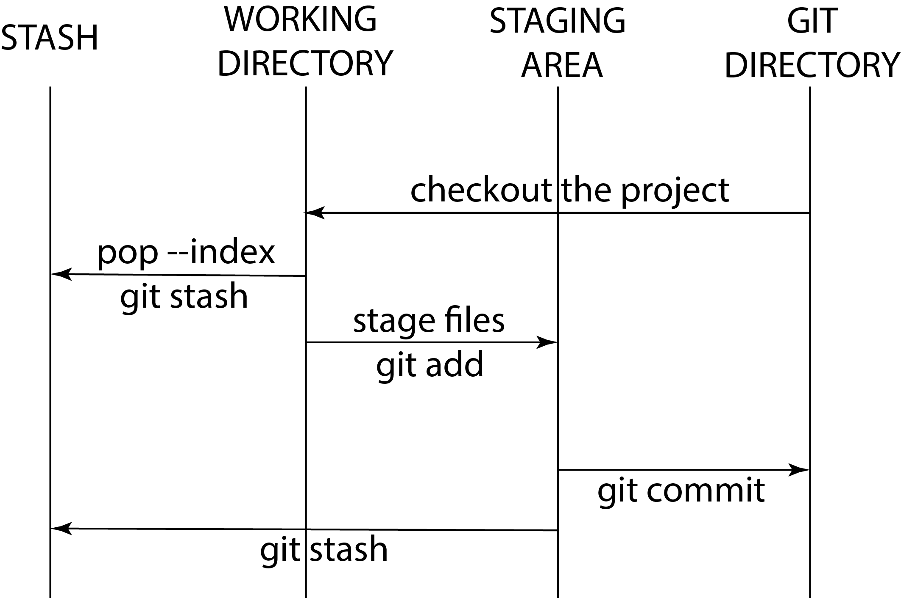
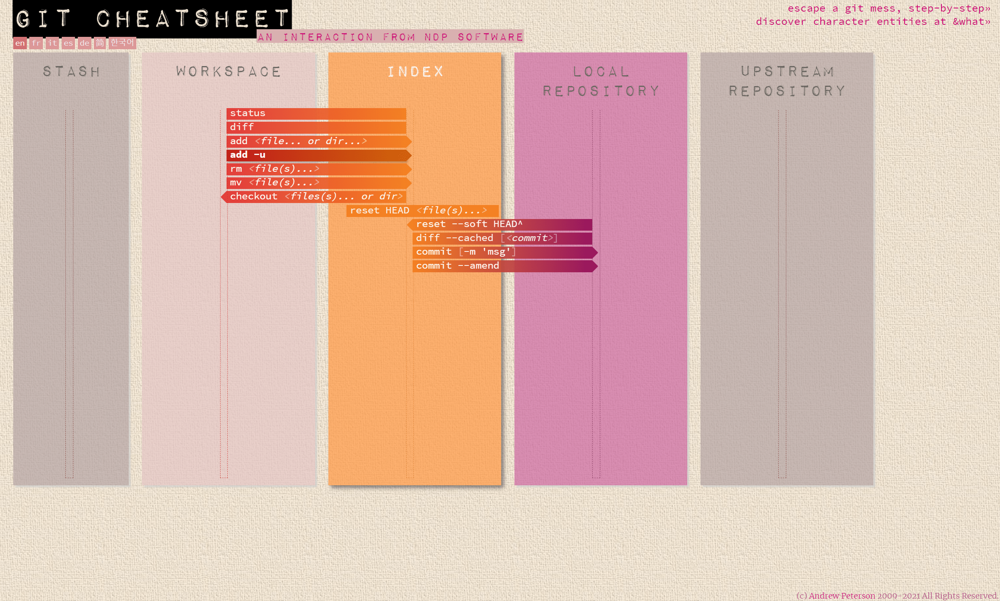
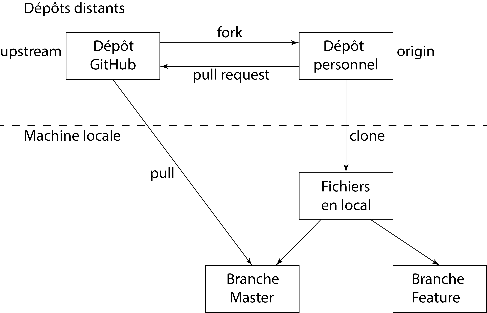

# `Git`

`Git` est un outil de gestion de versions écrit en `Linux`. En 2018, `GitHub` a été acheté par `Microsoft`®, ce qui provoqua un départ massif pour `GitLab`. `Git` est le moteur de l'outil. Il existe d'autres dépôts distants :

- `SWN` ;

-  `Mercure` ;

- `Subversion` ;

- `SVS` (très lent).

Votre rendu final doit être déposé sur votre `GitHub` personnel sous la forme d'un portfolio. Vous devez juste m'envoyer son lien pour être évalué. Voici quelques éléments pour vous apprendre à utiliser efficacement `GitHub`. Pourquoi utiliser `Git` plutôt que `Moodle` ? La réponse est simple. Vous devez me transmettre des fichiers `Python`, or `Moodle` va les considérer comme des attaques au niveau de son serveur. Vous n'avez pas le choix. Vous devez maîtriser très rapidement `Git` afin de me rendre votre travail.

Le deuxième intérêt de `Git` est que le moteur tend à être utilisé de plus en plus dans les organisations professionnelles. C'est un atout important à mettre dans votre C.V. si vous allez au-delà de ce qui vous est demandé pour effectuer le dépôt de votre portfolio.

Le troisième intérêt de `Git` est le dépôt en lui-même des travaux que vous avez effectués en université. Vous pouvez envoyer un lien à l'entreprise dans laquelle vous voulez avoir un stage ou être recruté avec vos réalisations démontrant ainsi votre savoir faire. Au-delà du cde, vous pouvez par exemple l'utiliser pour gérer les versions de votre mémoire, vos rapports, *etc*. Il vous faudra être stratégique dans vos choix afin de prouver vos savoir-faire. Par ailleurs, vous montrez également votre maîtrise de la plateforme.

> [!NOTE]
> Il est possible de créer dans la version gratuite de `GitHub` trois dossiers (`repository`) confidentiels. Si votre mémoire est confidentiel, il est parfaitement possible de déposer sans aucune vue publique. Tout comme, il vous sera possible de le rendre public quand bon vous semble.

## Objectifs

- Créer son compte `GitHub`

- Comprendre la différence entre `Git` et `GitHub`

- Comprendre la philosophie et l'intérêt de `Git`

- Savoir cloner un dépôt sur son compte `Git`

- Savoir lier son ordinateur local avec son dépôt `Git` distant avec `git init`, `git remote add` et `git branch`

- Savoir alimenter son dépôt avec `git add`, `git commit` et `git push`

- Savoir gérer son dépôt sur la plateforme et en lignes de commande, notamment les commandes permettant de revenir en arrière

> [!NOTE]
> `Git` est un outil `Linux`. Il fonctionne de manière optimale avec ce système d'exploitation. Si vous installez `Git` sur un P.C. tournant sur `Windows`, l'installateur de `Git` va installer un noyau `Linux` afin de faire fonctionner un terminal de type `bash`. Dans n'importe quel dossier de `Windows`, vous pourrez y accéder simplement en faisant un clic droit de votre souris et de cliquer sur `Open Git Bash here`.

> [!NOTE]
> Avec W.S.L., il vous est possible d'installer un terminal `Linux` en tant que sous-noyau de votre système d'exploitation `Windows`.
> - [Installer un terminal `Linux` sur `Windows` avec WSL en quelques clics](https://www.youtube.com/watch?v=VuXpOXhn2Hk)
> - [Maîtrisez le terminal `Linux` : commandes essentielles pour débutants](https://www.youtube.com/watch?v=GHPxJ7kPCcI)
> - [Cours sur W.S.L.](https://www.youtube.com/watch?v=uLbyhmpnbnE&list=PLSuzYIVSEUT4LyB66TpKeCUmbTteLYrXz) (Approfondissement sur W.S.L.)

## Tutoriels

Tous les tutoriels ne sont pas à visualiser. Idéalement, à partir des vidéos d'introduction des cours, vous choisissez le cours qui vous convient le mieux. Si ces ressources ne vous conviennent pas, pour vous aider à juger le sérieux d'un cours `YouTube`, sachez qu'un cours `Git` dure entre 1h30 et 2h00 pour que vous deveniez autonome sur la plateforme et dans votre apprentissage régulier de nouvelles commandes.

- [Tutoriel `Git` pour ceux qui ne veulent apprendre uniquement ce qui est nécessaire pour ce cours](https://www.youtube.com/watch?v=Fc9CQVF4vwE&list=PLuMW20nBgcbp43oYXRwWo0jTffeS5-oWV&index=2)

- [`Git` expliqué simplement : tutoriel complet pour débutants](https://www.youtube.com/watch?v=anP0LBVhUzA)

- [`Git` et `GitHub` pour le *data science* : le guide complet pour débutants](https://www.youtube.com/watch?v=xwFj6WCJW0I)

- [Cours sur `Git` et `GitHub`](https://www.youtube.com/watch?v=rcsqG0ZXXNk&list=PLLBWkn1N0gl7AO56vpDPWsKeDfYjEaZWT)

- [Formation `Git`](https://www.youtube.com/watch?v=rP3T0Ee6pLU&list=PLjwdMgw5TTLXuY5i7RW0QqGdW0NZntqiP)

- [Apprendre `Git`](https://www.youtube.com/watch?v=PjTilX5DeyM&list=PLtAnN3kwIVucWlr1pyfnmw8qCNaq0tusi)

- [Apprendre à utiliser `Git`](https://www.youtube.com/watch?v=A5_kJps4qjc&list=PLsm134NGfeYP67pmUoKSWb53lqVqA7oTg)

- [`Git`](https://www.youtube.com/watch?v=0sGQgfUdCAY&list=PLn6POgpklwWpUfM8BaIU1deH6peqHdmWL) (Approfondissement des notions de base)

- [`Git` et `GitLab`](https://www.youtube.com/watch?v=q5E-scBPYFA&list=PLn6POgpklwWrRoZZXv0xf71mvT4E0QDOF) (Approfondissement des notions de base)

## Ressources

- [Site officiel (en anglais)](https://git-scm.com/)

- [Documentation en français](https://docs.github.com/fr/get-started/start-your-journey/about-github-and-git)

- [Guide simplifié de `Git`](./PDF/Pardo-Julen-2016-Git-Tutorial.pdf)

- [`Git` *Cheat Sheet*](./PDF/Git-Cheat-Sheet.pdf)

## Installation de `Git`

Il existe deux versions de `Git` : une gratuite pour les particuliers, une payante pour les entreprises.

Il faut télécharger et installer `Git` en local.

- [https://git-scm.com/downloads](https://git-scm.com/downloads)

L'exécutable installe notamment l'invite de commande `GitBash`, indispensable pour gérer les versions d'un projet.

Il faut également créer un compte sur le site [https://github.com](https://github.com) dans l'onglet `Sign up`. Il est demandé un courriel, un mot de passe et un nom d'utilisateur.

> [!NOTE]
> Il est vivement conseillé de mettre un nom d'utilisateur explicite tel que MaximeForriez. Si vous le souhaitez, vous pourrez héberger un site web gratuit utilisant ce nom d'utilisateur par défaut.

Pour accéder à son profil `GitHub`, il existe une icône spécifique. Il faut **bien renseigner** son profil. L'objectif est d'être identifié et identifiable par les recruteurs qui peuvent se servir de `GitHub` dans leur recrutement.

Sous `Windows`, il est possible d'installer pour `PowerShell` :

- [https://tortoisegit.org](https://tortoisegit.org)

Pour `Windows` et `MAC/OS`, il existe également :

- [https://www.sourcetreeapp.com](https://www.sourcetreeapp.com)

## Interface en ligne de `GitHub`

Cinq éléments sont fondamentaux :

- `Pull Requests` signifie « demandes de tirage ». Il s'agit d'une demande de fusion d'une série de modifications d'une branche à une autre.

- `Branches` permet de créer des branches pour travailler sur une copie d'un projet.

- `Issues` sont des éléments que l'on peut créer dans un référentiel pour planifier, discuter et suivre le travail.

- `Setting project` paramètre le projet.

- `Setting profile` paramètre le profil `GitHub`.

## Configuration de son compte `GitHub`

Il faut créer un dépôt avec le nom du compte.

- `Repository`

    - `New`

        - nommer le dépôt `MaximeForriez`

Cela permet de créer une page d'accueil avec ses compétences.

> [!TIP]
> Pour créer des icônes sympathiques, on peut utiliser [https://shields.io./badges](https://shields.io./badges)

- `https://shields.io/badge/-` *text* `-` *couleur* `?logo=` *nom du logo s'il existe*

Sur la page d'accueil, il faut changer l'option par défaut de `Contributing settings`, et choisir `Activity overview`.

## Configuration de `Git` à partir de `GitBash`

### Présentation de `GitBash`

`Bash` rappelle le système de commande `Linux`. On y retrouve les principales commandes du système d'exploitation.

- `ls -a` liste les fichiers du dossier courant.

- `cd` *chemin du dossier* change le dossier courant.

- `pwd` renvoie le nom du dossier dans lequel `GitBash` lit les données.

- `mkdir` permet de créer un dossier dans le dossier dans lequel se trouve `GitBash`.

- `touch` *fichier.extension* crée un fichier dans le dossier dans lequel se trouve `GitBash`.

- `mv` déplace un fichier d'un dossier à l'autre, ou modifie le nom du fichier dans le même dossier.

- `rm` supprime un fichier.

- `help` *nom de la commande* permet d'obtenir l'aide d'une commande. Son appel nécessite une connexion.

- *etc*.

### Initialisation de `Git` à partir de `GitBash`

Dans le dossier de liaison, il faut donner le nom de l'utilisateur.

```
	$ git config –global user.name "MaximeForriez"
```

Il faut donner le courriel de l'utilisateur.

```
    $ git config –global user.email maxime.forriez@sorbonne-universite.fr
```

Il faut donner l'éditeur de code que l'on utilise.

- `$ git config –global core.editor` *chemin local et nom de l'éditeur de code*

Par exemple, pour `NotePad++` :

```
    $ git config –global core.editor "C:\Program Files\Notepad\Notepad.exe" -multiInst -notabbar -nosession -noPlugin
```

Par exemple, pour `Visual Studio Code` :

```
	$ git config –global core.editor "code –wait"
```

> [!NOTE]
> Il est possible de remplacer `–global` par `–local`. `–global` gère les paramètres d'un compte utilisateur, tandis que `–local` paramètre un dossier `Git` particulier.

Il est possible de visualiser la configuration.

```
    $ git config –list
```

Pour en savoir plus : [https://git-scm.com/book/fr/v2/Personnalisation-de-Git-Configuration-de-Git](https://git-scm.com/book/fr/v2/Personnalisation-de-Git-Configuration-de-Git)

Dans n'importe quel dossier de l'ordinateur, sauf les dossiers systèmes, un clic droit de la souris suffit pour accéder à `GitBash`.

## Fonctionnement de Git

`Git` est composé de quatre grandes zones (Fig. 1 ; Fig. 2) :

- *stash* (ou remisage) ;

- *working directory* (ou copie de travail locale) ;

- *staging area* (ou *caching area*, ou *index*) ; elle correspond à la zone de préparation des `commit` ;

- *git directory* (ou *local repository* ou *remote repository*).

Tout part du *working directory*.

> [!NOTE]
> Il existe une cinquième zone, *upstream repository* (Fig. 2). Elle est peu sollicitée au quotidien, puisqu'il s'agit du dépôt distant.



**Figure 1. Fonctionnement des zones de `Git`**



**Figure 2. Fonctionnement des zones de `Git` selon Andrew Peterson**

Techniquement, `Git` met en place un système de **pointeurs**, les **références**, c'est-à-dire une zone mémoire stocke les informations de manière immuable. Cela signifie qu'il est impossible de supprimer *stricto sensu* une information stockée par `Git`. Lorsqu'on opère les opérations de suppression, en réalité, on supprime les liens entre les zones mémoires, mais la zone mémoire allouée existe toujours. De fait, va-t-on saturer la mémoire ? La réponse est négative, car, tous les 30 jours, `Git` supprime par l'intermédiaire d'un processus, appelé `Garbage collector`, les anciennes références non utilisées. On peut visualiser le journal des références avec la commande `git reflog`, prononcée « ref », puis « log ».

## `Git` en local

> [!NOTE]
> La branche principale par défaut `master` a été renommée `main`. Il faut faire attention à ce détail dans les deux projets.

### Versionner son code

Dans le dossier de dépôt, il faut initialiser un dépôt avec la commande `GitBash` suivante :

```
	$ git init
```

Celle-ci crée un dossier caché qui assure la gestion des versions d'un projet.

> [!NOTE]
> Le fichier texte `.gitsource` permet de stocker tous les fichiers qui ne doivent pas être déposés.

Après avoir produit un code, il faut déposer la version produite dans `Git` à partir du dossier de dépôt créé avec `GitBash`. Cela s'exécute en deux étapes.

1. Ajouter toutes les modifications du dossier en zone d'attente

```
	$ git add .
```

`add` a plusieurs options : `.` pour déposer tous les fichiers, `*.` *extension* pour cibler les fichiers ayant cette extension, ou `–all` pour tout déposer. On peut également déposer un simple fichier avec `fichier.extension`.

2.  Ajouter une sauvegarde de version dans le dépôt

```
	$ git commit -m "Description"
```

Il est impératif de décrire le plus précisément possible le dépôt.

On peut exécuter les deux commandes `add` et `commit` en une seule.

```
    $ git commit -a -m "Description"
```

> [!NOTE]
> Le nom du `commit` n'est pas conventionnel.

### Décrire un dépôt

Selon une convention, un `commit` ne doit pas :

- dépasser 80 lignes ;

- concerner plus de 5 fichiers.

L'objectif de cette convention est double :

1. éviter les conflits ;

2. éviter de rechercher trop d'erreurs en cas de régression.

- [https://github.com/angular/angular/blob/main/CONTRIBUTING.md#commit-message-format](https://github.com/angular/angular/blob/main/CONTRIBUTING.md#commit-message-format)

- [https://www.conventionalcommits.org/fr/v1.0.0](https://www.conventionalcommits.org/fr/v1.0.0{)

Parmi les bonnes habitudes, il faut créer une **branche alternative pour le travail**.

Une description standardisée d'un dépôt permet aux robots d'opérer un tri. Le modèle est le suivant :

```
	<type> (<portée>) : <sujet>
	<description>
	<footer>
```

#### <type> (ou *type*)

- `build` : construction

- `ci` : intégration continue

- `docs` : documentation

- `feat` : ajout d'une fonctionnalité

- `fix` : correction d'un bogue

- `perf` : amélioration des performances

- `refactor` : changement du code sans changer son fonctionnement

- `style` : changement du style de code sans changer sa logique

- `test` : modification des tests unitaires

#### <portée> (ou *scope*)

- `animations`

- `auth`

- `bazel`

- `benchpress`

- `common`

- `compiler`

- `compiler-cli`

- `contact`

- `core`

- `elements`

- `forms`

- `forum`

- `http`

- `language-service`

- `localize`

- `platform-browser`

- `platform-browser-dynamic`

- `router`

- `service-worker`

- `tutoriel`

- `upgrade`

- `zone.js`

#### <sujet> (ou *short summary*)

Le sujet doit être écrit en impératif présent, sans majuscule, et ne pas finir par un point.

Les mots-clés sont :

- `MUST` ;

- `MUST NOT` ;

- `REQUIRED` ;

- `SHALL` ;

- `SHALL NOT` ;

- `SHOULD` ;

- `SHOULD NOT` ;

- `RECOMMENDED` ;

- `MAY` ;

- `OPTIONAL`.

cf. [https://www.ietf.org/rfc/rfc2119.txt](https://www.ietf.org/rfc/rfc2119.txt)

#### <description> (ou *description*)

On commence par le sujet et on décrit la motivation du changement.

#### <footer>

`<footer>` est optionnel.

```
	closes # Nom_du-point-affecté
```

### Gérer les dépôts

#### Lister les dépôts

```
	$ git remote -v
```

#### Gérer les log

```
	$ git log
```

La commande permet de visualiser le `commit`. Il fournit son code SHA-1, la date et la description de la version. `HEAD` $\rightarrow$ `MAIN` signifie que le code se localise dans la branche principale du projet.

Les options sont :

1. `–oneline`

2. `–oneline –graph`

3. `–oneline –graph –name-status`

Pour lister les deux derniers `commit`, on tape la commande :

```
	$ git log n2
```

Pour obtenir la liste de tous les dépôts concernant un `commit`, on tape la commande :

```
	$ git log -p "nom du fichier"
```

Ainsi, `git log` sert à afficher une plage de `commit`.

#### Afficher un commit

La commande `show` *option* *objet* affiche les différents types d'objets (blobs, arbres, étiquettes, et `commit`).

Les options possibles sont :

- `–pretty=` *format* ;

- `–format=` *format* ;

- `–abbrev-commit` ;

- `–no-abbrev-commit` ;

- `–oneline` ;

- `–encoding=` *encodage* ;

- `–expand-tabs=` *nombre* ;

- `–no-expand-tabs` ;

- `–notes=` *référence* ;

- `–no-notes` ;

- `–show-notes=` *référence* ;

- `–standard-notes` ;

- `–no-standard-notes` ;

- `–show-signature`.

Les formats possibles sont :

- `oneline` ;

- `short` ;

- `medium` ;

- `full` ;

- `fuller` ;

- `reference` ;

- `email` ;

- `raw` ;

- `format:` *chaîne* ;

- `tformat` *chaîne*.

Pour afficher le `commit` parent de `HEAD`, on tape la commande

```
	$ git show HEAD^
```

ou

```
	$ git show HEAD 
```

Si on ajoute un nombre après `^` ou ` `, il va chercher le `commit` parent + 1. Par exemple, `HEAD 3` renvoie le quatrième parent. On peut également écrire `HEAD   `.

Pour afficher un `commit` spécifique à partir d'un code `SHA `, on tape la commande :

```
	$ git show "sha-1"
```

Ainsi, `git show` sert à afficher un seul `commit`. Il renvoie :

- un affichage détaillé avec l'intégralité des différences ;

- un affichage des objets non validés.

#### Recharger la version d'un fichier
	
Pour recharger la version d'un fichier à partir de son code SHA, on tape la commande :

```
	$ git checkout "sha-1" "Nom du fichier"
```

Pour recharger la version d'un fichier la plus récente, on tape :

```
	$ git checkout main
```

#### Obtenir l'état des sauvegardes

Pour obtenir l'état des sauvegardes du dépôt, on tape la commande :

```
	$ git status
```

#### Afficher les modifications

Pour afficher les modifications du `commit` avant le dépôt, on tape :

```
	$ git diff "SHA-1" "SHA-2"
```

La commande équivaut à :

```
	$ git log –graph -p
```

Pour modifier la description effectuée avec l'option `-m`, on tape la commande :

```
	$ git commit -amend "Description"
```
	
Un éditeur apparaît afin de corriger la description.

Pour obtenir toutes les modifications d'un `commit`, on tape la commande :

```
	$ git diff "nom de la branche 1".."nom de la branche 2"
```
## Création d'un fichier ignorant des fichiers lors de l'action de dépôt

À la racine du projet, on crée un fichier `.gitignore`.

- Le fichier indique les fichiers et les répertoires à ignorer lorsque l'on fait un `commit`.

- Il faut partager les règles d'omission avec les autres utilisateurs qui cloneront le projet en faisant un `commit` du fichier `.gitignore`.

Règles syntaxiques du fichier `.gitignore` :

- `#` en début de ligne crée un commentaire.

- `.`*extension* permet d'ignorer tous les fichiers ayant cette extension.

- *nom du fichier*`.`*extension* permet d'ignorer ce fichier.

- En général, on classe les fichiers par classe.

```
	##########
	#Packages#
	##########
	#Description
	liste des fichiers à ignorer
```

## Création d'un fichier de configuration

Il existe trois fichiers `.gitconfig` :

- le fichier local qui concerne le dossier local, le dépôt seul ;

- le fichier global qui concerne seulement un utilisateur ;

- le fichier système qui concerne la machine entière, quel que soit le compte.

> [!NOTE]
> Plus le niveau est spécifique, plus il est prioritaire. Par exemple, le local est prioritaire sur le système.

Le fichier se situant dans `.git/config` surcharge le fichier se trouvant dans :

- `/etc/config` sous `Linux` ;

- `C:\Documents and Settings\` *nom de l'utilisateur* sous `Windows` ;

Pour visualiser toutes les paramétrages, on tape la commande :

```
	$ git config –list –show-origin
```

## Interface de `GitHub`

Il existe cinq onglets sur un compte `GitHub` :
	\begin{enumerate}
		\item `Overview`$\rightarrow$page d'accueil ;
		\item `Repositories`$\rightarrow$page des dépôts ;
		\item `Projects`$\rightarrow$page permettant de faire de la gestion de projets ;
		\item `Packages`$\rightarrow$page gérant les paquets ;
		\item `Stars`$\rightarrow$page permettant de créer des listes.
	\end{enumerate}

### *Repositories* : Créer un dépôt distant

Onglet `Repository`

- `Create a repository`

	- L'option `Repository Template` permet de choisir un modèle.
	
	- L'option `Create Template` permet de créer un modèle.

### *Repositories* : *Code*

On peut synchroniser un dépôt dont on a fait le `fork` avec `Sync fork` pour mettre à jour les modifications.

On peut déclencher un `pull request` avec `Contribute`, à côté de `Sync fork`.

### *Repositories* : *Issues*

L'onglet permet de créer et de gérer des tickets de tâches.

### *Repositories* : *Pull Requests*

L'onglet permet de gérer les `pull requests` reçues.

Il faut faire le `review` des `pull requests` :

- Dans `Merge branch develop`, cliquer sur `Files changed`

	- `Review changes`

		- `Comment` : soumettre des commentaires généraux sans approbation explicite

		- `Approve` : soumettre des commentaires et approuver la fusion de ces modifications

		- `Request changes` : soumettre des commentaires qui doivent être traités avant la fusion

	- `Submit Review`

Règles concernant les `review` :

- Ne pas refuser un `pull request`

- Ne pas valider un mauvais `pull request`

### *Repositories* : *Actions*

L'onglet permet de créer un *workflow*.

### *Repositories* : *Projects*

L'onglet permet de faire de la gestion de projet.

### *Repositories* : *Wiki*

L'onglet permet de faire un wiki.

### *Repositories* : *Security*

Il existe six niveaux de sécurité :

1. `Security policy`$\rightarrow$définir de quelle manière les utilisateurs doivent signaler les vulnérabilités de sécurité pour ce référentiel ;

2. `Security advisories`$\rightarrow$afficher ou divulguer les avis de sécurité pour ce référentiel ;

3. `Private vulnerability reporting`$\rightarrow$afficher les avis autoriser les utilisateurs à signaler en privé les vulnérabilités de sécurité potentielles ;

4. `Dependabot alerts`$\rightarrow$recevoir une notification lorsqu'une de des dépendances présente une vulnérabilité ;

5. `Code scanning alerts`$\rightarrow$détecter automatiquement les vulnérabilités courantes et les erreurs de codage ;

6. `Secret scanning alerts`$\rightarrow$recevoir une notification lorsqu'un secret est envoyé vers ce référentiel.

### *Repositories* : *Insights*

Il existe onze vues possibles :

- `Pulse` ;

- `Contributors` ;

- `Community` ;

- `Community Standards` ;

- `Traffic` ;

- `Commits` ;

- `Code frequency` ;

- `Dependency graph` ;

- `Network` ;

- `Forks` ;

- `Actions Usage Metrics`.

### *Repositories* : *Settings*

Les paramètres sont :

- `General` ;

- `Collaborators` ;

- `Moderations` :

	- `Interaction limits` ;

	- `Code review limits`.

- `Branches` permet de créer des branches avec des règles :

	- `Add branch ruleset` ;

	- `Add classic branch protection rule`.

- `Rules`$\rightarrow$ `Rulesets` $\rightarrow$ `New ruleset` permet de créer des rôles ;

	- `New branch ruleset` ;

	- `New tag ruleset` ;

	- `Import a ruleset`.

- `Tags` ;

- `Actions` ;

	- `General` ;

	- `Rumers`.

- `Webhooks` pour se connecter à `Jenkins` ;

- `Environments`$\rightarrow$`New environment` ;

- `Codespaces`$\rightarrow$`Set up prebuild` ;

- `Code security` ;

- `Deploy keys` ;

- `Secrets and variables` :

	- `Actions` ;

	- `Codespaces` ;

	- `Dependabot`.

- `GitHub Apps` ;

- `Email notifications`.

## `Git` en distant

### Versionner son code

Dans le site web `GitHub`, aller dans l'onglet `Repository` afin de créer un nouveau dépôt avec le bouton `New`. Il faut choisir entre un dépôt public et un dépôt privé.

Comme le dépôt local, il faut initialiser `Git`.

```
	$ git init
```

Pour mettre les fichiers sur le *cloud* de `GitHub`, il faut effectuer trois étapes successives.

1. Ajouter toutes les modifications

```
	$ git add .
```
> [!NOTE]
 >`.` peut être remplacé par un ou plusieurs fichiers, ce qui est d'ailleurs **vivement** conseillé.

2. Ajouter une sauvegarde de version dans le dépôt

```
	$ git commit -m "Description"
```

3. Pousser les modifications vers le serveur sur la branche `main`

```
	$ git push -u origin main
```

> [!NOTE]
> Il est possible, même s'il faut l'éviter, de pousser de force les modifications vers le serveur sur la branche `main` avec la commande :

```
	git push -f origin main
```

> [!NOTE]
> Cela arrive lorsque l'on pousse sur le serveur sans clé SSH.

### Gérer ses dépôts

#### Gérer les *Fork*

`fork` copie le dépôt repéré sur le dépôt du développeur souhaitant intégré le projet `GitHub` (Fig. 3). `pull request` est une demande au propriétaire du dépôt effectuée par le développeur contributeur afin de participer à son projet (Fig. 3). Si la modification est validée, il faut changer le `fork` effectué avant toute modification.



**Figure 3. Fonctionnement des flux avec `GitHub`**

Il est possible de récupérer uniquement les fichiers modifiés depuis un dépôt distant. On remplace `clone` par `fetch`. Leur récupération s'effectue avec la branche `upstream`.

- `$ git remote add origin` *adresse I.P. / H.T.T.P.S. ou  SSH du dépôt personnel*

- `$ git remote add upstream` *adresse I.P. / H.T.T.P.S. du dépôt principal*

- `$ git fetch upstream` *nom de la branche* $\rightarrow$ La commande permet de mettre à jour le dépôt personnel à rapport aux `Pull Request`.

- `$ git push origin main`

Le dépôt génère un lien H.T.T.P.S. Il est possible de récupérer les fichiers depuis un dépôt distant en donnant l'autorisation de lier le dépôt avec ce dossier (Fig. 3).

- `$ git clone` *lien du dépôt* `github.com`

- `$ git push -u origin main`

Pour créer un `fork` à partir d'un autre dépôt distant, il suffit de se rendre sur la page `GitHub` de ce dépôt, de se rendre sur l'onglet `Fork`, puis `Create a new fork`, puis `Create fork`.

Pour mettre à jour un `fork` sur le dépôt personnel  distant contenant le dépôt ayant subi un `fork`, il suffit de cliquer sur `Sync fork`, puis `update`. Sur la machine locale, en ligne de commande, il suffit exécuter la commande :

```
	git push origin main
```

pour mettre à jour le dépôt local.

#### Gérer les *Pull Request*

Un `Pull Request` consiste à demander l'approbation par ses pairs du travail effectué.

En ligne sur `GitHub`, cela consiste à cliquer sur `Contribute`, puis sur `Pull Request`.

#### Gérer les *upstream*

`upstream` est le dépôt distant quelconque. `origin` est le dépôt distant personnel.

`$ git remote add upstream` *lien du dépôt distant quelconque*

`$ git remote add origin` *lien du dépôt distant personnel qui a effectué un* `fork` de dépôt distant précédent

`$ git fetch upstream` permet de récupérer les mises à jour effectuées sur le dépôt distant `upstream`.

Désormais, tout `pull` met à jour à partir du dépôt distant quelconque.

`$ git push` met à jour le dépôt distant personnel.

Pour ajouter le `push` dans l'`upstream`, il faut faire un `Pull request`.

#### Gérer le projet

Sur le site web de `GitHub` dans l'onglet `Projects`, il existe tous les outils permettant de gérer un projet informatique.

Pour supprimer un dépôt, il faut se rendre sur le site web de `GitHub` dans l'onglet `Settings` et cliquer sur `delete`.

## `Git` et vos travaux en analyse de données

Dès la première semaine de cours, vous devez commencer à déposer des éléments sur la plateforme. Ce n'est pas forcément votre travail final, j'espère que vous l'avez compris après avoir vu quelques vidéos et lu quelques guides. Il faut vous entraîner régulièrement de sorte que le dépôt final se passe bien. Lors de votre évaluation, seule la dernière version de vos fichiers sera prise en compte pour votre évaluation. Cela étant, l'horodatage pris en compte sera celui de la date limite. Si vous m'avez déposé de nouveaux éléments après la date du dépôt final, même de quelques secondes, ce sera l'ancienne version qui sera évaluée, d'où la nécessité de déposer régulièrement même des bouts de code qui ne sont pas terminés. Vous devez acquérir le réflexe suivant : "Je viens de changer une dizaine de lignes de code. Je dépose." Comme dit dans la plupart des tutoriels, il ne faut pas faire des dépôts avec des milliers de lignes transformées ou nouvelles. N'oubliez jamais que, en plus d'être la plateforme sur laquelle je vais vous évaluer, elle vous permet de revenir à une ancienne version de projet si la nouvelle ne fonctionne pas par exemple.

## [`Git`- Approfondissement](./Git-Avance.md)
