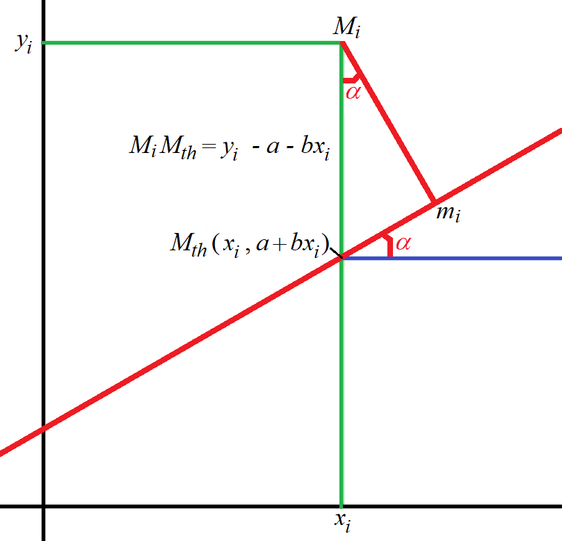
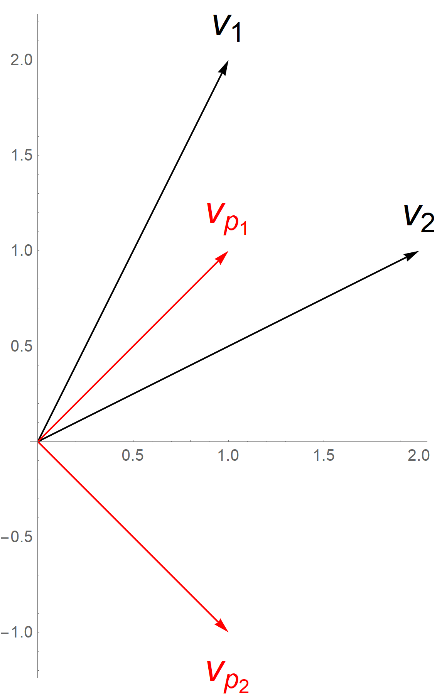
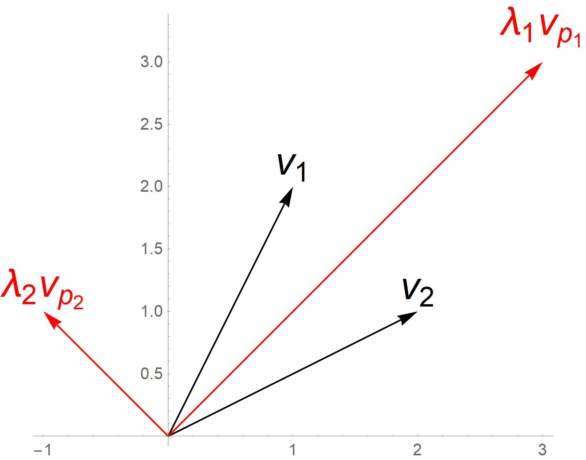
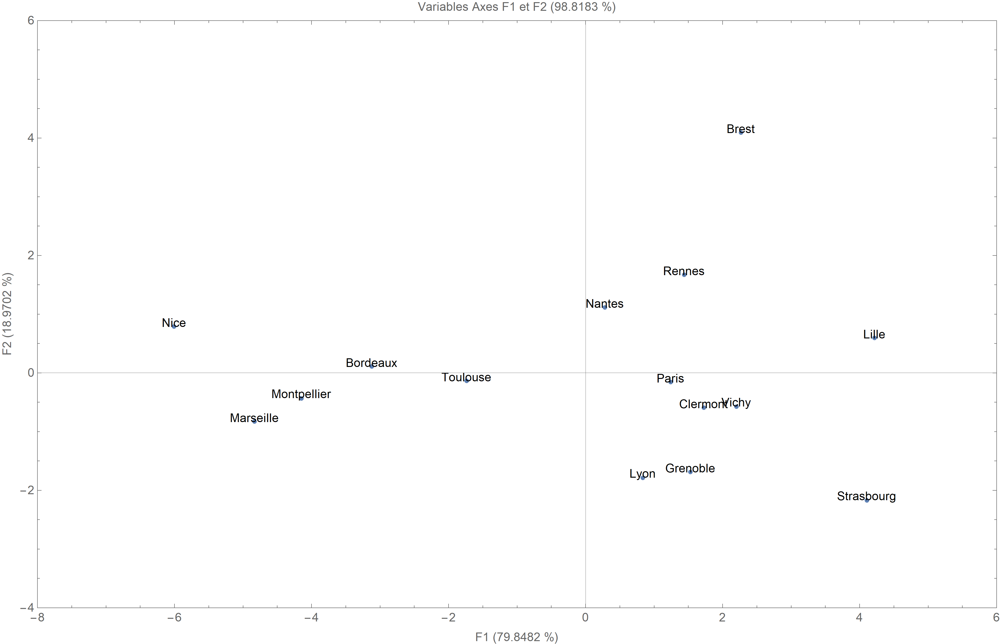
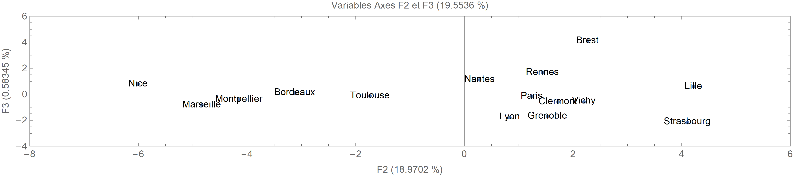
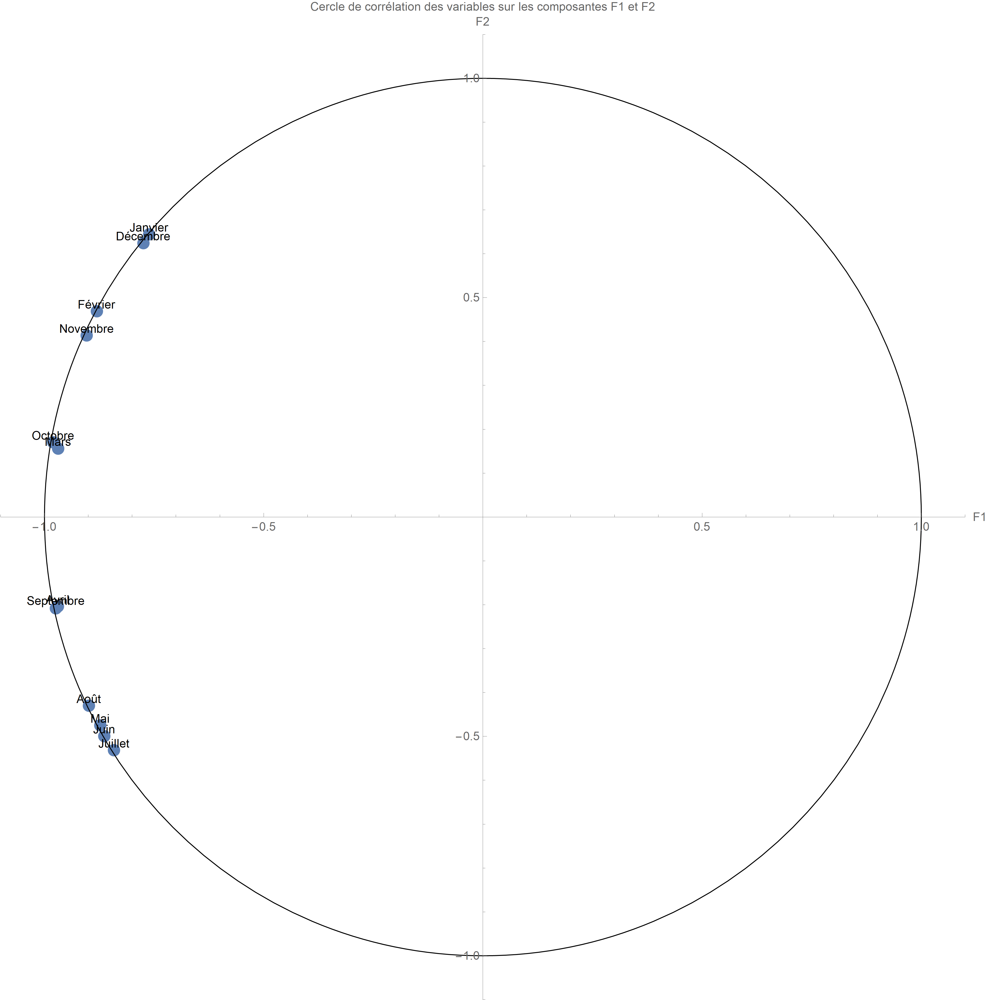
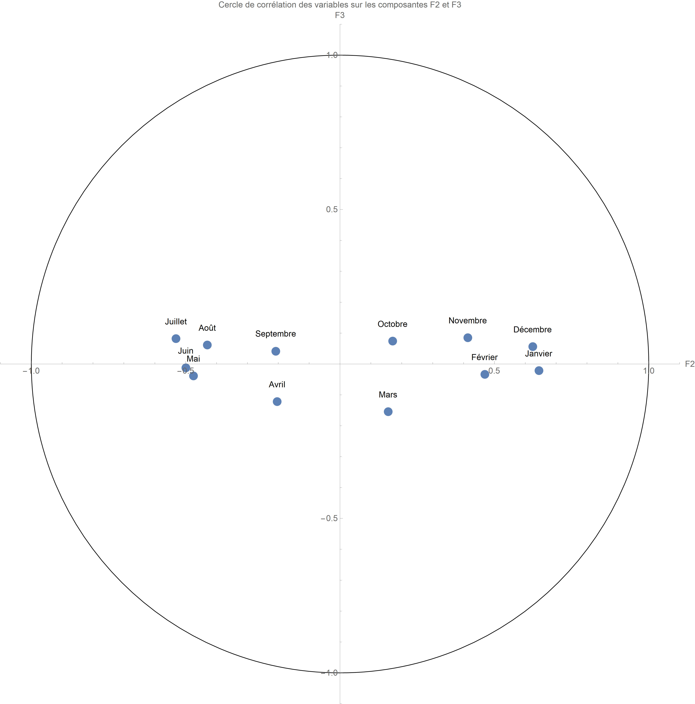
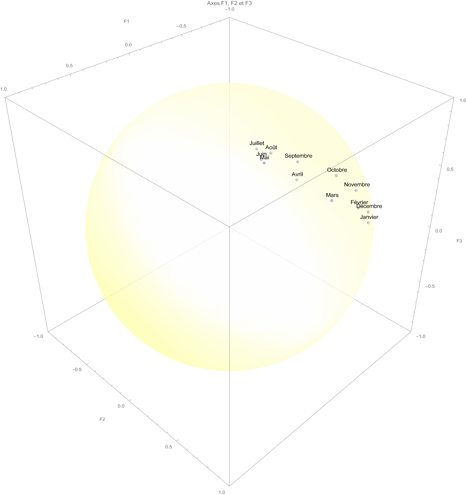

# L'analyse factorielle en composantes principales (A.C.P.)

L'analyse factorielle en composantes principales (A.C.P.) est une **statistique exploratoire multidimensionnelle**. Elle concerne les variables quantitatives. Dans ce cadre, les individus sont caractérisés par beaucoup de variables. L'objectif est de décrire les données. De fait, il n'y a pas de questions sous-jacentes. La méthode s'oppose à la statistique inférentielle.

Cela étant l'analyse factorielle nécessite la double connaissance préalable de la notion d'[espace vectoriel](../../Formulaire-mathematique/Seance-09/03-Generalisation%20de%20la%20notion%20de%20vecteurs.md) et du [calcul matriciel](../../Formulaire-mathematique/Seance-09/04-Calcul%20matriciel.md). Ce chapitre en fournit quelques éléments indispensables à la compréhension des calculs menées en analyse factorielle. Néanmoins, afin de ne pas surcharger le chapitre déjà bien, un certain nombre de notions sont détaillées en annexes (le produit scalaire).

## Méthode de l'analyse factorielle expliquée par une approche bivariée : de la régression orthogonale aux composantes principales

Il est curieux de revenir à une approche bivariée dans un chapitre consacré au multivarié. Cela permet de proposer une visualisation simple de ce qu'est une analyse factorielle en composantes principales[^1], car, au-delà de trois dimensions, la visualisation des points ou des vecteurs devient impossible. Pourtant, les résultats multivariés ne sont que la généralisation des notions qui vont être expliquées sous une forme bivariée.

Néanmoins, avant de procéder à l'explication détaillée de l'analyse factorielle de deux variables quantitatives, il faut expliciter la régression orthogonale.

### Régression orthogonale de deux variables quantitatives

Lors de l'explication de la méthode des moindres carrés, l'idée de bien distinguer la méthode de la notion de régression a été lourdement mise en avant. Ce paragraphe va expliquer les bases d'une autre droite de régression possible pour un nuage de points : la droite de régression orthogonale.

Pour comprendre la méthode d'estimation, on travaille sur la position de l'un des points du nuage de points (Fig. 1). On recherche la droite de régression orthogonale (en rouge) sur le schéma (Fig. 1) qui possède une équation de la forme $y = a + bx$. Le point $M_i \left( x_i, y_i \right)$ est le point empirique observé. Par opposition, $M_{\textrm{th}} \left( x_i, a + bx_i \right)$ est le point théorique obtenu sur la droite de régression. $m_i$ est le projeté orthogonal de $M_i$ sur la droite de régression orthogonale. Dit autrement, on recherche $m_i$ sur la droite de régression tel que les vecteurs $\overrightarrow{M_i m_i}$ et $\overrightarrow{M_{\textrm{th}} m_i}$ sont orthogonaux. L'angle $\alpha = \left( \overrightarrow{M_i M_{\textrm{th}}}, \overrightarrow{M_i m_i} \right)$ est par définition l'angle entre la droite et l'axe des abscisses, donc on sait que $\tan \alpha = b$.

**Figure 1. Schéma de la régression orthogonale**

La norme $\left| \left| \overrightarrow{M_i M_{\textrm{th}}} \right| \right|$ est la distance à optimiser avec la méthode des moindres carrés, mais ce n'est pas la distance que l'on recherche : $\left| \left| \overrightarrow{M_i m_i} \right| \right|$. Pour la calculer, il suffit d'appliquer le théorème de Pythagore.
        
$\left| \left| \overrightarrow{M_i M_{\textrm{th}}} \right| \right|^2 = \left| \left| \overrightarrow{M_{\textrm{th}} m_i} \right| \right|^2 + \left| \left| \overrightarrow{M_i m_i} \right| \right|^2$
        
$\Leftrightarrow \left| \left| \overrightarrow{M_{\textrm{th}} m_i} \right| \right|^2 = \left| \left| \overrightarrow{M_i M_{\textrm{th}}} \right| \right|^2 - \left| \left| \overrightarrow{M_i m_i} \right| \right|^2$

Cela étant, on peut calculer directement $\left| \left| \overrightarrow{M_{\textrm{th}} m_i} \right| \right|^2$ en utilisant les relations trigonométriques dans un triangle rectangle.

$\cos \alpha = \frac{\left| \left| \overrightarrow{M_i m_i} \right| \right|}{\left| \left| \overrightarrow{M_i M_{\textrm{th}}} \right| \right|} \Leftrightarrow \left| \left| \overrightarrow{M_i m_i} \right| \right| = \left| \left| \overrightarrow{M_i M_{\textrm{th}}} \right| \right| \cos\alpha$

$\left| \left| \overrightarrow{M_i m_i} \right| \right| = \left[ \sqrt{\left( x_i - x_i \right)^2 + \left( y_i - a - bx_i \right)^2} \right] \cos \alpha = \left( y_i - a - bx_i \right) \cos \alpha$

$\left| \left| \overrightarrow{M_i m_i} \right| \right|^2 = \left( y_i - a - bx_i \right)^2 {\cos}^2 \alpha = \frac{1}{1 + b^2} \left( y_i - a - bx_i \right)^2$

car ${\cos}^2 \alpha = \frac{1}{{\tan}^2 \alpha + 1}$.

Si l'on introduit le point moyen du nuage de points $\left( \bar{X}, \bar{Y} \right)$, la distance recherchée devient :

$\left| \left| \overrightarrow{M_i m_i} \right| \right|^2 = \frac{1}{1 + b^2} \left[ \left( y_i - \bar{Y} \right) - b \left( x_i - \bar{X} \right) + \left( \bar{Y} - a - b\bar{X} \right) \right]^2$

Dit autrement, cette opération est valable pour le critère à optimiser dans le cadre d'une régression orthogonale, à savoir $\frac{1}{n} \sum_{i = 1}^{n} \left| \left| \overrightarrow{M_i m_i} \right| \right|^2$ dans un nuage contenant $n$ points.

$\begin{array}{l} \frac{1}{n} \sum_{i = 1}^{n} \left| \left| \overrightarrow{M_i m_i} \right| \right|^2 = \frac{1}{n} \left( \frac{1}{1 + b^2} \right) \sum_{i = 1}^{n} \left[ \left( y_i - \bar{Y} \right) - b \left( x_i - \bar{X} \right) + \left( \bar{Y} - a - b \bar{Y} \right)\right]^2 \\ = \frac{1}{n} \left( \frac{1}{1 + b^2} \right) \left[ \sum_{i = 1}^{n} \left[ \left( y_i - \bar{Y} \right) - b \left( x_i - \bar{X} \right) \right]^2 + \sum_{i = 1}^{n} \left( \bar{Y} - a - b \bar{X} \right)^2 + \right.  \\ \left. + 2 \sum_{i = 1}^{n} \left[ \left( y_i - \bar{Y} \right) - b \left( x_i - \bar{X} \right) \right] \left[ \bar{Y} - a - b \bar{X} \right] \right] \\ \textrm{or } 2 \sum_{i = 1}^{n} \left[ \left( y_i - \bar{Y} \right) - b \left( x_i - \bar{X} \right) \right] \left[ \bar{Y} - a - b \bar{X} \right] = 0 \\ \textrm{donc } \frac{1}{n} \sum_{i = 1}^{n} \left| \left| \overrightarrow{M_i m_i} \right| \right|^2 = \frac{1}{n} \left( \frac{1}{1 + b^2} \right) \left[ \sum_{i = 1}^{n} \left[ \left( y_i - \bar{Y} \right) - b \left( x_i - \bar{X} \right) \right]^2 + n \left( \bar{Y} - a - b \bar{X} \right)^2 \right] \end{array}$

Quelle que soit la valeur de $b$, cette somme sera **la plus petit possible** lorsque $n \left( \bar{Y} - a - b \bar{X} \right)^2 = 0$, c'est-à-dire lorsque $a = \bar{Y} - b \bar{X}$. Dit autrement, le **point moyen** est **sur** la droite de régression orthogonale. Ainsi, il est pratique de le prendre comme origine dans $\mathbb{R}^2$.

Une droite de régression orthogonale a par conséquent une équation de la forme $y_0 = b x_0$ avec $y_0 = y - \bar{Y}$ et $x_0 = x - \bar{X}$. Le problème est que cette forme est presque semblablement à celle de la méthode de régression linéaire par les moindres carrés. L'A.C.P. développe une méthode permettant d'optimiser la régression orthogonale.

### Analyse factorielle en composantes principales (A.C.P.) de deux variables quantitatives

La **composante** d'un vecteur permet de ramener les calculs vectoriels à des calculs sur des tableaux de nombres ($n$-uplets, matrices, vecteurs colonnes). Dans le cadre d'une A.C.P., les individus sont placés en lignes, notées $i$. Les variables quantitatives (ou les descripteurs) sont placées en colonnes, notées $k$. Le tableau compte $n$ individus et $m$ variables.

On note la moyenne et l'écart type comme dans le cadre d'un échantillon : ${\bar{x}}_k$ et $s_k$. Néanmoins, dans une analyse factorielle, il ne s'agit pas de généraliser une population à partir d'un échantillon. De fait, on utilise le vrai écart type, et non l'écart type estimé.

${\bar{x}}_k = \frac{1}{m} \sum_{k = 1}^{m} x_k$

$s_k = \frac{1}{m} \sqrt{\sum_{k = 1}^{m} \left( x_k - {\bar{x}}_k \right)^2}$

Le calcul s'opère en colonnes uniquement ; en lignes, cela n'aurait aucun sens.

Dans cette présentation bivariée, il y aura bien $n$ individus, mais $m = 2$ variables.

À partir de là, l'étude de la régression orthogonale peut être reprise. La forme de la régression orthogonale $y_0 = b x_0$ fait disparaître la symétrie initiale entre les rôles de $X$ et de $Y$. Il faut par conséquent chercher une autre forme pour exprimer la droite $\left( D \right)$ de la régression orthogonale de vecteur directeur $u$. Les variables $x_0$ et $y_0$ étant centrée, la droite recherchée $\left( D \right)$ passe par l'origine $G \left( \bar{X}, \bar{Y} \right)$. On considère le vecteur unitaire de $\mathbb{R}^2$ orthogonal à la droite $\left( D \right)$, $u_1 \left( \begin{array}{c} \alpha \\ \beta \end{array} \right)$ avec pour contrainte ${\alpha}^2 + {\beta}^2 = 1$. Le vecteur unitaire $u$ porté par la droite $\left( D \right)$ est alors trivialement $u = \left( \begin{array}{c} -\beta \\ \alpha \end{array} \right)$.

La droite $\left( D \right)$ est l'ensemble des points $M \left( x, y \right)$ tel que $\left\langle u_1 | \overrightarrow{G{M_0}} \right\rangle = 0 \Leftrightarrow \alpha x_0 + \beta y_0 = 0$.

Étant donné un point $M_i \left( x_{i0}, y_{i0} \right)$ du nuage de points et sa projection orthogonale $m_i$ sur la droite $\left( D \right)$, le vecteur $\overrightarrow{G{m_i}}$ est le projeté orthogonal de $\overrightarrow{G{M_i}}$ sur le vecteur $u$, c'est-à-dire :

$\overrightarrow{G{m_i}} = \left\langle \overrightarrow{G{M_i}} | u \right\rangle . u = \left( {\beta} x_{i0} - {\alpha} y_{i0} \right) \left( \begin{array}{c} \beta \\ \alpha \end{array} \right)$

$\left( {\beta} x_{i0} - {\alpha} y_{i0} \right)$ est un scalaire. L'opération est un produit d'une matrice par un scalaire.

$\overrightarrow{G{m_i}} = \left( \begin{array}{c} {\beta}^2 x_{i0} - {\alpha}{\beta}{y_{i0}} \\ - {\alpha}{\beta} x_{i0} + {\alpha}^2 {y_{i0}} \end{array} \right)$

Ainsi, $\overrightarrow{{m_i}{M_i}} = \overrightarrow{{G}{M_i}} - \overrightarrow{G{m_i}} = \left( \begin{array}{c} x_{i0} \\ y_{i0} \end{array} \right) - \left( \begin{array}{c} {\beta}^2 x_{i0} - {\alpha}{\beta} y_{i0} \\ - {\alpha}{\beta} x_{i0} + {\alpha}^2 {y_{i0}} \end{array} \right)$

$\overrightarrow{{m_i}{M_i}} = \left( \begin{array}{c} x_{i0} \left( 1 - {\beta}^2 \right) - {\alpha}{\beta} y_{i0} \\ {\alpha}{\beta} x_{i0} + y_{i0} \left( 1 + {\alpha}^2 \right) \end{array} \right)$

or ${\alpha}^2 = 1 - {\beta}^2$ et ${\beta}^2 = 1 - {\alpha}^2$ – on comprend alors l'intérêt de la contrainte fixée –, donc

$\overrightarrow{{m_i}{M_i}} = \left( \begin{array}{c} {\alpha}^2 x_{i0} - {\alpha}{\beta} y_{i0} \\ {\alpha}{\beta} x_{i0} + {\beta}^2 y_{i0} \end{array} \right)$

$\overrightarrow{{m_i}{M_i}} = \left( {\alpha} x_{i0} + {\beta} y_{i0} \right) \left( \begin{array}{c} \alpha \\ \beta \end{array} \right)$

On peut alors calculer la norme de $\overrightarrow{{m_i}{M_i}}$.

$\begin{array}{l} \left| \left| \overrightarrow{{m_i}{M_i}} \right| \right|^2 = \left( {\alpha}^2 x_{i0} + {\alpha}{\beta} y_{i0} \right)^2 + \left( {\alpha}{\beta} x_{i0} + {\beta}^2 y_{i0} \right)^2 \\  \left| \left| \overrightarrow{{m_i}{M_i}} \right| \right|^2 = {\alpha}^2 \left( \alpha x_{i0} + \beta y_{i0} \right)^2 + {\beta}^2 \left( \alpha x_{i0} + \beta y_{i0} \right)^2 \\ \left| \left| \overrightarrow{{m_i}{M_i}} \right| \right|^2 = \left( \alpha x_{i0} + \beta y_{i0} \right)^2 \left( {\alpha}^2 + {\beta}^2 \right) \end{array}$

or ${\alpha}^2 + {\beta}^2 = 1$ donc

$\left| \left| \overrightarrow{{m_i}{M_i}} \right| \right|^2 = \left( \alpha x_{i0} + \beta y_{i0} \right)^2$

Le critère à optimiser vaut alors :

$\frac{1}{n} \sum_{i = 1}^{n} \left| \left| \overrightarrow{{m_i}{M_i}} \right| \right|^2 = \frac{1}{n} \sum_{i = 1}^{n} \left( \alpha x_{i0} + \beta y_{i0} \right)^2$

Cette forme est plus simple à utiliser, car la recherche de la droite de régression orthogonale se ramène à une question que l'on peut envisager d'un double point de vue :

1. soit recherche, dans l'espace des individus $\mathbb{R}^n$, un vecteur unitaire $u_1 = \left( \begin{array}{c} \alpha \\ \beta \end{array} \right)$ avec ${\alpha}^2 + {\beta}^2 = 1$ qui minimise la somme

${S_{\perp}}^2 = \frac{1}{n} \sum_{i = 1}^{n} \left| \left| \overrightarrow{{m_i}{M_i}} \right| \right|^2$

2. soit rechercher, dans l'espace des variables $\mathbb{R}^2$, un vecteur $\alpha X_0 + \beta Y_0$, combinaison linéaire fictive des deux variables centrées $X_0$ et $Y_0$ avec ${\alpha}^2 +{\beta}^2 = 1$ minimisant ${{\left| \left| \alpha X_0 + \beta Y_0 \right| \right|}_{D_{\frac{1}{n}}}}^2$, c'est-à-dire un vecteur de l'hyperplan défini par $X_0$ et $Y_0$ de norme minimale pour le produit scalaire défini par la matrice diagonale $D_{\frac{1}{n}}$ sous la contrainte ${\alpha}^2 + {\beta}^2 = 1$. C'est sous cette forme que la résolution du problème est appelé **analyse en composantes principales**.

#### Définitions de base pour effectuer une A.C.P.

Soit $Z = \left[ \begin{array}{cc} x_{10} & y_{10} \\ \ldots{} & \ldots{} \\ x_{n0}  & y_{n0} \end{array}\right]$ la matrice des variables centrées.

##### Inertie par rapport à un point $a$

Soit une variable (ou une colonne) $X^k = \left[ \begin{array}{c} X_1^k \\ \ldots{} \\ X_n^k \end{array} \right]$ dans un espace vectoriel $\mathbb{R}^n$. Soit la moyenne $\bar{X} = \left[ \begin{array}{c} {\bar{X}}_1 \\ \ldots{} \\ {\bar{X}}_m \end{array} \right]$. On appelle **inertie** d'une variable $X^k$ par rapport à un point $a = \left[ \begin{array}{c} a_1 \\ \ldots{} \\ a_m \end{array} \right]$, la moyenne du carré de la distance de $X^k$ au point $a$.

$I_a \left( X^k \right) = \frac{1}{n} \sum_{i = 1}^{n} \left[ d \left( X^k, a \right) \right]^2$

avec $d \left( ., . \right)$ la distance euclidienne dans l'espace euclidien $\mathbb{R}^n$, c'est-à-dire $d \left( X^k, a \right) = \sqrt{\left( X_i^k - a_1 \right)^2 + \ldots{} + \left( X_n^k - a_1 \right)^2}$ pour $a_1$.

- **Propriété 1.** L'inertie de $X^k$ par rapport à $a$ est minimale lorsque $a = \bar{X}$.

- **Propriété 2.** L'inertie de $X^k$ par rapport à $\bar{X}$ est la variance $X^k$.

- **Propriété 3.** La valeur minimale de l'inertie est la variance de $X^k$

$I_a \left( X^k \right) = s^2 \left( X^k \right) + d^2$

avec $s^2 \left( X^k \right)$ un nombre réel positif ne dépendant pas de $a$, et $d^2$ un nombre réel positif dont la valeur minimale est nulle. $I_a \left( X^k \right)$ est minimale lorsque $d^2 = 0$, c'està-dire lorsque $a = \bar{X}$.

##### Inertie totale

On appelle **inertie totale** du nuage de points $\mathbb{R}^2$ par rapport à l'origine $G$ des axes, la quantité $I_T$ :

$I_T = \frac{1}{n} \sum_{i = 1}^{n} \left| \left| \overrightarrow{G{M}_i} \right| \right|^2 = \frac{1}{n} \sum_{i = 1}^{n} \left( {x_{i0}}^2 + {y_{i0}}^2 \right) = s^2 \left( X \right) + s^2 \left( Y \right)$

##### Inertie statistique

On appelle **inertie statistique** du nuage de points de $\mathbb{R}^2$ par rapport à une direction $\Delta$ de $\mathbb{R}^2$ définie par un vecteur unitaire $u$, la quantité $I_S \left( u \right)$ :

$I_S \left( u \right) = \frac{1}{n} \sum_{i = 1}^{n} \left| \left| \overrightarrow{G{m}_i} \right| \right|^2$

avec $\overrightarrow{G{m}_i}$ le projeté orthogonal de $\overrightarrow{G{M}_i}$ sur $u$.

Le rapport $\frac{I_S \left( u \right)}{I_T} \times 100$ est le **taux d'inertie totale expliquée par la direction de $u$**.

- **Exemple 1.** L'inertie statistique du nuage de points par rapport à l'axe des $x$ est la variance de $X$.

- **Exemple 2.** L'inertie statistique du nuage de points par rapport à l'axe des $y$ est la variance de $Y$.

- **Exemple 3.** Dans un espace des individus dans lequel $n > 2$, l'inertie statistique correspond aux valeurs propres des vecteurs de l'espace des individus.

##### Inertie mécanique

On appelle **inertie mécanique** du nuage de points de $\mathbb{R}^2$ par rapport à une direction $\Delta$ définie par un vecteur unitaire $u$, la quantité $I_M \left( u \right)$ :

$I_M \left( u \right) = \frac{1}{n} \sum_{i = 1}^{n} \left| \left| \overrightarrow{{m_i}{M_i}} \right| \right|^2$

avec $\overrightarrow{G{m_i}}$ le projeté orthogonal de $\overrightarrow{G{M_i}}$ sur $u$.

- **Exemple 1.** L'inertie mécanique du nuage de points par rapport à l'axe des $x$ est la variance de $Y$.

- **Exemple 2.** L'inertie mécanique du nuage de points par rapport à l'axe des $y$ est la variance de $X$.

Le théorème de Pythagore $\left| \left| \overrightarrow{G{M_i}} \right| \right|^2 = \left| \left| \overrightarrow{G{m_i}} \right| \right|^2  + \left| \left| \overrightarrow{{m_i}{M_i}} \right| \right|^2$ entraîne :

$I_M \left( u \right) = I_T - I_S \left( u \right)$

##### Axes factoriels (ou axes principaux)

Quelle est la meilleure représentation axiale du nuage de points $N_I$ ? Pour cela, il faut projeter tous les points sur un axe unique matérialisé par un vecteur $u$. Comment trouver $u$ ? Il faut que, en projetant les points du nuage sur l'axe recherché, il ne soit pas déformé. On appelle $m_i$ le projété orthogonal de $M_i$ le point initial du nuage sur l'axe recherché. La projection ne peut que réduire la longueur $O{m_i}$ par rapport à la longueur initiale $O{M_i}$. De fait,

$O{M_i} \geq O{m_i}$

Par conséquent, pour ne pas trop déformer le nuage par sa projection, il faut le réduire le moins possible. Pour cela, on exige que les longueurs entre l'origine $G$ et le point projeté $m_i$ sur l'axe recherché $u$ soient les plus grandes possibles. De fait, on peut noter que $u$ et $O{m_i}$ sont colinéaires, donc, pour déterminer $u$, il faut avoir $\sum_{i = 1}^{n} \frac{1}{n} {O{m_i}}^2$ maximale. Cette somme correspond au carré du poids moyens, c'est-à-dire qu'il s'agit d'une variance. Il est à noter que $\frac{1}{n}$ est un poids uniforme $p_i$, mais on pourrait imaginer des poids différents ; l'unique contrainte sur les poids est que leur somme totale doit être égale à un $\sum_{i = 1}^{n} p_i = 1$. Le problème posé revient à déterminer une direction de variance maximale, ou plus exactement de la variabilité maximale. Dit autrement, on cherche un axe pour lequel les points sont les plus étalés possibles sur l'axe recherché.

> [!NOTE]
> Le poids uniforme n'est valable que si les individus jouent le même rôle.

> [!NOTE]
>  On utilise des poids différents lorsque les individus représentant une sous-population. Dans ce cas, le poids est proportionnel à l'effectif de la sous-population.

> [!NOTE]
>  On appelle souvent la variance maximale de l'axe l'**inertie** de l'axe.

L'analyse en composantes principales cherche à minimiser la somme des carrés des distances (ou normes) $e_i$ perpendiculaires (ou orthogonaux) à la droite (ou hyperdroite) de régression orthogonale recherchée. Cela revient à déterminer l'axe d'inertie maximale du nuage de points.

On appelle **premier axe factoriel** du nuage de points de $\mathbb{R}^2$, l'axe dont la direction définie par un vecteur unitaire $u$ maximise l'inertie statistique $I_S \left( u \right)$. La direction définie par le vecteur $u$ est appelée la **direction principale** (ou la direction factorielle, ou plus simplement facteur). Le premier axe factoriel maximise $I_S \left( u \right)$, mais il minimise $I_M \left( u \right)$. Il donne la solution pour définir une droite de régression orthogonale.

$I_S \left( u \right) = {\beta}^2 s^2 \left( X \right) + {\alpha}^2 s^2 \left( Y \right) - 2 \alpha \beta \mathrm{cov} \left( X, Y \right) = {{}^t u} . A . u$

avec $A$ la matrice de covariance, et $I_T \left( A \right) = \mathrm{Tr} \left( A \right)$.

Pour finir, l'inertie mécanique $I_M \left( u \right)$ correspond à l'inertie du nuage de points des individus.

**Dans le cadre d'une A.C.P., la matrice de covariance correspond à une matrice d'inertie**.

Par extension, quelle est la meilleure représentation plane $\left( u_1, u_2 \right)$ de $N_I$, c'est-à-dire le **plan d'inertie maximale** ? Pour l'obtenir, le même critère est à maximiser. De par le critère d'optimisation retenu, le meilleur plan contient le meilleur axe $u_1 \in P$, donc $u = u_1$. Dit autrement, les deux solutions sont emboîtées. Par ailleurs, on exige que $u_2$ d'inertie maximale soit orthogonal à $u_1$. En généralisant la recherche de tous les axes possibles, il faut trouver une suite d'axes orthogonaux d'inertie maximale par un vecteur unitaire $u_e$ de l'axe de rang $s$ accueillant la projection ${m_i}^s$ du point $M_i$ du nuage sur $u_s$ dont la somme $\sum_{i = 1}^{n} \frac{1}{n} {O{m_i}}^2$ est maximale avec la contrainte que $u_s \bot u_t$ pour $t < s$. De fait, dans la méthode de l'analyse factorielle, le plus important est de comprendre le critère d'optimisation mis en œuvre.

À $n$ dimensions, il s'agit de déterminer une suite d'axes orthogonaux d'inertie maximale. La solution consiste à trouver les vecteurs propres du nuage de points qui correspondent aux axes factoriels, tandis que les valeurs propres associées correspondent aux quantités maximisées, c'est-à-dire l'inertie projetée sur le vecteur propre associé. De fait, les axes factoriels rendent minimum l'écart entre le nuage des individus et sa projection.

###### Les valeurs propres

La matrice de covariance $A$ est symétrique réelle. Une **valeur propre de $A$** est un nombre réel $\lambda$ tel qu'il existe un vecteur $v$ non nul vérifiant $A v = \lambda v$. Les valeurs propres de $A$ sont les nombres réels $\lambda$ tels que l'application linéaire de $\mathbb{R}^2$ dans $\mathbb{R}^2$ défini par la matrice $A - \lambda I_2$ ne soit pas réduite à $0$. Cela signifie que l'application linéaire n'est pas injective, or, comme dans $\mathbb{R}^2$, être injectif est équivalent à être bijectif, l'application linéaire n'est pas bijective. Pour qu'elle le soit, il faut et il suffit que son déterminant soit nul. Les valeurs propres sont par conséquent solutions de l'équation :

$\begin{array}{l} \det \left( A - \lambda I_2 \right) = 0 \\ {\lambda}^2 - \left( s^2 \left( X \right) + s^2 \left( Y \right) \right) \lambda + s^2 \left( X \right) s^2 \left( Y \right) - \left( \mathrm{cov} \left( X, Y \right) \right)^2 = 0 \end{array}$

Le discriminant de cette équation du second degré, appelée **polynôme caractéristique**, est :

$\begin{array}{l} \Delta = s^2 \left( X \right) + s^2 \left( Y \right) - 4 \left[ s^2 \left( X \right) s^2 \left( Y \right) - \left( \mathrm{cov} \left( X, Y \right) \right)^2 \right] \\ \Delta = \left( s^2 \left( X \right) + s^2 \left( Y \right) \right)^2 + 4 \left( \mathrm{cov} \left( X, Y \right) \right)^2 \\ \Delta \geq 0 \end{array}$

La matrice $A$ possède, comme pour toute matrice symétrique réelle, deux valeurs propres réelles ${\lambda}_1$ et ${\lambda}_2$.

- La somme de ces valeurs propres est la trace de la matrice, somme des éléments de la première diagonale :

$\mathrm{Tr} \left( A \right) = {\lambda}_1 + {\lambda}_2 = s^2 \left( X \right) + s^2 \left( Y \right) \geq 0$

- Le produit de ces valeurs propres est le déterminant de la matrice :

${\lambda}_1 {\lambda}_2 = s^2 \left( X \right) s^2 \left( Y \right) - \left( \mathrm{cov} \left( X, Y \right) \right)^2 \geq 0$

d'après l'inégalité de Schwarz[^2].

Les deux valeurs propres de la matrice de covariance sont des nombres réels positifs. Il est très improbable que l'une soit nulle ou que les deux valeurs propres soient égales.

Les deux valeurs propres ${\lambda}_1$ et ${\lambda}_2$ sont rangées par ordre décroissant :

${\lambda}_1 > {\lambda}_2 > 0$

et

${\lambda}_1 = \frac{1}{2} \left( s^2 \left( X \right) + s^2 \left( Y \right) + \sqrt{\left( s^2 \left( X \right) - s^2 \left( Y \right) \right)^2 + 4 \left( \mathrm{cov} \left( X, Y \right) \right)^2} \right)$

${\lambda}_2 = \frac{1}{2} \left( s^2 \left( X \right) + s^2 \left( Y \right) - \sqrt{\left( s^2 \left( X \right) - s^2 \left( Y \right) \right)^2 + 4 \left( \mathrm{cov} \left( X, Y \right) \right)^2} \right)$

> [!NOTE]
> Les valeurs propres d'une matrice symétrique sont réelles.

> [!NOTE]
>  La matrice de corrélation et la matrice de covariance sont liées. La matrice de covariance $A$ permet de déduire la matrice de corrélation $R$. Il est possible d'opérer une A.C.P. sur l'une ou l'autre de ces matrices si les variables sont centrées réduites. Si $s \left( X \right) = s \left( Y \right) = 1$ et que les variables ne sont pas pondérées, alors le matrice de covariance et de corrélation possèdent les mêmes polynômes caractéristiques. Les deux matrices sont identiques.

###### Les vecteurs propres

En algèbre linéaire, $\mathbb{R}^2$ possède une **base orthonormée propre**, c'est-à-dire une base $\left( u_1, u_2 \right)$ pour le produit scalaire canonique, formée de vecteurs propres de la matrice $A$.

$A u_1 = {\lambda}_1 u_1$

et

$A u_2 = {\lambda}_2 u_2$

avec $\left| \left| u_1 \right| \right|^2 = 1$, $\left| \left| u_2 \right| \right|^2 = 1$ et $\left\langle u_1 | u_2 \right\rangle = 0$.

Pour toute valeur propre $\lambda$, le vecteur propre peut se déduire :

$v = \left[ \begin{array}{c} s^2 \left( Y \right) - \lambda \\ - \mathrm{cov} \left( X, Y \right) \end{array} \right]$

Le carré de la norme de ce vecteur pour le produit scalaire canonique est donné par :

$\begin{array}{l} \left| \left| v \right| \right|^2 = s^2 \left( Y \right) - \lambda - \mathrm{cov} \left( X, Y \right) \left[ \begin{array}{c} s^2 \left( Y \right)  - \lambda \\ - \mathrm{cov} \left( X, Y \right) \end{array} \right] \\ \left| \left| v \right| \right|^2 = \left( s^2 \left( Y \right) - \lambda \right)^2 + \left( \mathrm{cov} \left( X, Y \right) \right)^2 \end{array}$

De fait, on peut prendre pour vecteur normé relatif à la valeur propre $\lambda$ le vecteur $u$ :

$u = \frac{1}{\sqrt{\left( s^2 \left( Y \right) - \lambda \right)^2 + \left( \mathrm{cov} \left( X, Y \right) \right)^2}} \left[  \begin{array}{c} s^2 \left( Y \right) - \lambda \\ - \mathrm{cov} \left( X, Y \right) \end{array} \right]$

Le produit scalaire des deux vecteurs propres obtenus est nul, car la relation ${\lambda}_1 + {\lambda}_2 = s^2 \left( X \right) + s^2 \left( Y \right)$ entraîne :

$\begin{array}{l} s^2 \left( Y \right) - {\lambda}_1 - \mathrm{cov} \left( X, Y \right) \left[ \begin{array}{c} s^2 \left( Y \right)  - {\lambda}_2 \\ - \mathrm{cov} \left( X, Y \right) \end{array} \right] \\ = \left( {\lambda}_2 - s^2 \left( X \right) - \mathrm{cov} \left( X, Y \right) \right) \left[ \begin{array}{c} s^2 \left( Y \right)  - {\lambda}_2 \\ - \mathrm{cov} \left( X, Y \right) \end{array} \right] \\ = -\det \left( A - {\lambda}_2 I_2 \right) = 0 \end{array}$

Les deux vecteurs $v_1 = \left[ \begin{array}{c} s^2 \left( Y \right) - {\lambda}_1 \\ - \mathrm{cov} \left( X, Y \right) \end{array} \right]$ et $v_2 = \left[ \begin{array}{c} s^2 \left( Y \right) - {\lambda}_2 \\ - \mathrm{cov} \left( X, Y \right) \end{array} \right]$ forment une base de $\mathbb{R}^2$, car le déterminant de leurs coordonnées n'est pas nul :

$\begin{array}{l} \mathrm{cov} \left( X, Y \right) \left( s^2 \left( Y \right) - {\lambda}_1 \right) + \mathrm{cov} \left( X, Y \right) \left( s^2 \left( Y \right) - {\lambda}_2 \right) \\ = \mathrm{cov} \left( X, Y \right) \left( {\lambda}_1 - {\lambda}_2 \right) \neq 0  \end{array}$

Ainsi, les deux vecteurs ne sont pas proportionnels.

Les deux vecteurs

$u_1 = \frac{1}{\sqrt{\left( s^2 \left( Y \right) - {\lambda}_1 \right)^2 + \left( \mathrm{cov} \left( X, Y \right) \right)^2}} v_1$

et

$u_2 = \frac{1}{\sqrt{\left( s^2 \left( Y \right) - {\lambda}_2 \right)^2 + \left( \mathrm{cov} \left( X, Y \right) \right)^2}} v_2$

forment une **base orthonormée propre de $\mathbb{R}^2$**.

> [!NOTE]
>  Ici, on aurait pu prendre le vecteur $\left(  \begin{array}{c} - \mathrm{cov} \left( X, Y \right) \\ s^2 \left( X \right) - \lambda \end{array} \right)$ pour la valeur propre $\lambda$.

###### Illustration en deux dimensions des valeurs et des vecteurs propres

Soit la matrice $M = \left[ \begin{array}{cc} 1 & 2 \\ 2 & 1 \end{array} \right]$ avec $v_1 = \left[ \begin{array}{c} 1 \\ 2 \end{array} \right]$ et $v_2 = \left[ \begin{array}{c} 2 \\ 1 \end{array} \right]$.

Le déterminant de $M$ vaut :

$\det \left( M \right) = -3$

Les valeurs propres $\lambda$ sont ${\lambda}_1 = 3$ et ${\lambda}_2 = -1$, dont les vecteurs propres associés sont respectivement $v_{p_1} = \left[ \begin{array}{c} 1 \\ 1 \end{array} \right]$ et $v_{p_2} = \left[ \begin{array}{c} 1 \\ -1 \end{array} \right]$.

On diagonalise $M$ en faisant :

${{}^t v_{p_1}} . M . v_{p_1} = \left[ 1, 1 \right] . \left[ \begin{array}{cc} 1 & 2 \\ 2 & 1 \end{array} \right] . \left[ \begin{array}{c} 1 \\ 1 \end{array} \right] = 6$

et

${{}^t v_{p_2}} . M . v_{p_2} = \left[ 1, -1 \right] . \left[ \begin{array}{cc} 1 & 2 \\ 2 & 1 \end{array} \right] . \left[ \begin{array}{c} 1 \\ -1 \end{array} \right] = -2$

Dans ces formules, chaque vecteur propre $v_{p_i}$ représente la **matrice de passage** $P$.

On note $D$ la matrice diagonale regroupant les valeurs propres.

$D = \left[ \begin{array}{cc} 6 & 0 \\ 0 & -2 \end{array} \right]$

Le produit scalaire entre les deux vecteurs propres est nul.

$\left[ 1, -1 \right] . \left[ \begin{array}{c} 1 \\ 1 \end{array} \right] = 2 - 2 = 0$

Par contre, le produit scalaire entre $v_1$ et $v_2$ vaut :

${{}^t v_1} . v_2 = \left[ 1, 2 \right] . \left[ \begin{array}{c} 2 \\ 1 \end{array} \right] = 2 + 2 = 4$

$v_1$ et $v_2$ ne sont pas orthogonaux.

**Figure 2. Exemple de vecteurs et de leurs vecteurs propres dans un espace à deux dimensions**

**Figure 3. Exemple de vecteurs et de leurs vecteurs propres pondérés par leurs valeurs propres dans un espace à deux dimensions**

###### Décomposition en valeurs singulières

Soient $\mathbf{X} \in \mathbb{R}^{n \times p}$ de rang $r$, $\mathbf{M}$ une métrique sur $\mathbb{R}^{p}$ et $\mathbf{D}$ une métrique sur $\mathbb{R}^{n}$. Il existe :

- $\mathbf{U_{n \times p}}$ $\mathbf{D}$-orthonormée avec ${{}^t}\mathbf{U}.\mathbf{D}.\mathbf{U} = \mathbf{I_T}$, dont les colonnes sont les **vecteurs propres** associés aux **valeurs propres** $\left\lbrace {\lambda}_1, \ldots{}, {\lambda}_r \right\rbrace$ non nulles de $\mathbf{X}.\mathbf{M}.{{}^t}\mathbf{X}.\mathbf{D}$ ;

- $\mathbf{V_{p \times r}}$ $\mathbf{M}$-orthonormée avec ${{}^t}\mathbf{V}.\mathbf{M}.\mathbf{V} = \mathbf{I_T}$, dont les colonnes sont les **vecteurs propres** associés aux **valeurs propres** $\left\lbrace {\lambda}_1, \ldots{}, {\lambda}_p \right\rbrace$ non nulles de ${{}^t}\mathbf{X}.\mathbf{D}.\mathbf{X}.\mathbf{M}$ ;

- une matrice diagonale $\sqrt{\mathbf{{\Lambda}_r}} = \mathrm{diag} \left( \sqrt{{\lambda}_1}, \ldots{}, \sqrt{{\lambda}_r} \right)$ représentant les **valeurs singulières** $\left\lbrace \sqrt{{\lambda}_r} \right\rbrace$ du triplet $\left( \mathbf{X}, \mathbf{M}, \mathbf{D} \right)$ telle que :

$\mathbf{X} = \mathbf{U}.\mathbf{{\Lambda}_r}.{{}^t}\mathbf{V} = \sum_{i = 1}^{r} \sqrt{{\lambda}_r} {\mathbf{U}}^i.{{}^t}{\mathbf{V}}^i$

On appelle **valeurs singulières** de la matrice $\mathbf{A}$ les racines carrées des valeurs propres **non nulles** de ${{}^t}\mathbf{A}.\mathbf{A}$ ou de $\mathbf{A}.{{}^t}\mathbf{A}$.

${\mu}_i = \sqrt{{\lambda}_i \left( {{}^t}\mathbf{A}.\mathbf{A} \right)} = \sqrt{{\lambda}_i \left( \mathbf{A}.{{}^t}\mathbf{A} \right)}$

> [!NOTE]
> Si ${{}^t}\mathbf{A} = \mathbf{A}$, alors les matrices sont dites **hermitiennes**[^3], c'est-à-dire symétriques.

La décomposition en valeurs singulières usuelle $\mathbf{X}$ est celle du triplet :

$\left( \mathbf{X}, \mathbf{M} = \mathbf{I_m}, \mathbf{D} = \mathbf{I_n} \right)$

##### La diagonalisation de la matrice de covariance

L'objectif d'une A.C.P. est de tourner le nuage de points pour bien **visualiser** les directions dans lesquelles il est **le plus étendu**, étalé. Ce sont les directions les plus pertinentes permettant de projeter les données. La solution mathématique est connue : il s'agit de calculer les valeurs et vecteurs propres de la matrice de covariances. Dans le cadre d'une variable centrée réduite, il est équivalent de travailler avec la matrice de corrélation qui, ayant ces valeurs comprises en $- 1$ et $+ 1$, permet de soulager l'ordinateur lors des calculs.

On note $V$ la matrice des coordonnées des vecteurs propres $u_1$ et $u_2$.

$V = \left[ u_1, u_2 \right] = \left[  \begin{array}{cc}  \frac{s^2 \left( Y \right) - {\lambda}_1}{\sqrt{\left( s^2 \left( Y \right) - {\lambda}_1 \right)^2 + \left( \mathrm{cov} \left( X, Y \right) \right)^2}} & \frac{s^2 \left( Y \right) - {\lambda}_2}{\sqrt{\left( s^2 \left( Y \right) - {\lambda}_2 \right)^2 + \left( \mathrm{cov} \left( X, Y \right) \right)^2 }} \\ \frac{-\mathrm{cov} \left( X, Y \right)}{\sqrt{\left( s^2 \left( Y \right) - {\lambda}_1 \right)^2 + \left( \mathrm{cov} \left( X, Y \right) \right)^2}} & \frac{-\mathrm{cov} \left( X, Y \right)}{\sqrt{\left( s^2 \left( Y \right) - {\lambda}_2 \right)^2 + \left( \mathrm{cov} \left( X, Y \right) \right)^2}} \end{array}  \right]$

De fait, $V$ donne par produits, pour image d'une base orthonormée, une base orthonormée.

$\left\lbrace  \begin{array}{c} V.e_1 = u_1 \\ V.e_2 = u_2 \end{array} \right.$

avec $e_1 = \left[ \begin{array}{c} 1 \\ 0 \end{array} \right]$ et $e_2 = \left[ \begin{array}{c} 0 \\ 1 \end{array} \right]$. L'équation permet de sélectionner l'une des colonnes de $V$. Une telle matrice est orthogonale, ce qui signifie que son inverse est égale à sa transposée.

$V^{-1} = {{}^t}V$

**Démonstration.** Puisque les bases $\left\lbrace e_1, e_2 \right\rbrace$ et $\left\lbrace u_1, u_2 \right\rbrace$ sont orthonormées, les coordonnées des vecteurs s'obtiennent par produits scalaires :

$\begin{array}{l} u_1 = \left\langle u_1 | e_1 \right\rangle e_1 + \left\langle u_1 | e_2 \right\rangle e_2 \\  u_2 = \left\langle u_2 | e_1 \right\rangle e_1 + \left\langle u_2 | e_2 \right\rangle e_2 \end{array}$

Ainsi, la matrice $V$ ayant pour colonnes les vecteurs $u_1$ et $u_2$ dans la base $\left\lbrace e_1, e_2 \right\rbrace$ vaut :

$V = \left[  \begin{array}{ll} \left\langle u_1 | e_1 \right\rangle & \left\langle u_1 | e_2 \right\rangle \\  \left\langle u_2 | e_2 \right\rangle & \left\langle u_2 | e_2 \right\rangle \end{array} \right]$

Les relations inverses

$\begin{array}{l} e_1 = \left\langle e_1 | u_1 \right\rangle u_1 + \left\langle e_1 | u_2 \right\rangle u_2 \\  e_2 = \left\langle e_2 | u_1 \right\rangle u_1 + \left\langle e_2 | u_2 \right\rangle u_2 \end{array}$

montrent que la matrice inverse de $V$ est la matrice :

$V^{-1} = \left[  \begin{array}{cc} \left\langle e_1 | u_1 \right\rangle & \left\langle e_1 | u_2 \right\rangle \\  \left\langle e_2 | u_1 \right\rangle & \left\langle e_2 | u_2 \right\rangle \end{array} \right]$

qui, compte tenu de la symétrie du produit scalaire, est la transposée de $V$.

$V^{-1} = {{}^t}V$

Il résultat alors des relations $V.e_1 = u_1$ et $V.e_2 = u_2$ que l'on a :

$\begin{array}{l} {{}^t}V u_1 = V^{-1} u_1 = e_1 \\ {{}^t}V u_2 = V^{-1} u_2 = e_2 \end{array}$

Soit la matrice $\Lambda = \left[ \begin{array}{cc} {\lambda}_1 & 0 \\ 0 & {\lambda}_2 \end{array} \right]$, la matrice diagonale des valeurs propres de $A$. Il faut noter que $A$ est la matrice, dans la base canonique $\left\lbrace e_1, e_2 \right\rbrace$, d'un endomorphisme[^4] $f$ qui se réduit à deux homothéties, de rapport ${\lambda}_1$ selon le vecteur $u_1$, et le rapport ${\lambda}_2$ selon le vecteur $u_2$, de l'endomorphisme $f$.

La matrice de l'application identique de $\mathbb{R}^n$ muni de la base $\left\lbrace e_1, e_2 \right\rbrace$ donne, par produits, pour image du vecteur $u_1 = \left[ \begin{array}{c} 1 \\ 0 \end{array} \right]$ le vecteur $u_1 = \frac{1}{\sqrt{\left( s^2 \left( Y \right) - {\lambda}_1 \right)^2 + \left( \mathrm{cov} \left( X, Y \right) \right)^2}} \left[ \begin{array}{c} s^2 \left( Y \right) - {\lambda}_1 \\ - \mathrm{cov} \left( X, Y \right) \end{array} \right]$, et, pour image du vecteur $u_2 = \left[ \begin{array}{c} 0 \\ 1 \end{array} \right]$ le vecteur $u_2 = \frac{1}{\sqrt{\left( s^2 \left( Y \right) - {\lambda}_2 \right)^2 + \left( \mathrm{cov} \left( X, Y \right) \right)^2}} \left[ \begin{array}{c} s^2 \left( Y \right) - {\lambda}_2  \\ - \mathrm{cov} \left( X, Y \right) \end{array} \right]$, c'est-à-dire la matrice $V$ des vecteurs propres.

$V = \left[ {\mathrm{Id}}_{\mathbb{R}^2}, \left\lbrace u_1, u_2 \right\rbrace, \left\lbrace e_1, e_2 \right\rbrace \right]$

Réciproquement, la matrice de l'application identique de $\mathbb{R}^2$ muni de la base $\left\lbrace e_1, e_2 \right\rbrace$ dans $\mathbb{R}^2$ muni de la base $\left\lbrace u_1, u_2 \right\rbrace$ donne, par produits, pour l'image du vecteur $e_1 = \left[ \begin{array}{c} 1 \\ 0 \end{array} \right]$ le vecteur $e_1 = \left[ \begin{array}{c} \frac{s^2 \left( Y \right) - {\lambda}_1}{\sqrt{\left( s^2 \left( Y \right) - {\lambda}_1 \right)^2 + \left( \mathrm{cov} \left( X, Y \right) \right)^2}} \\ \frac{s^2 \left( Y \right) - {\lambda}_2}{\sqrt{\left( s^2 \left( Y \right) - {\lambda}_2 \right)^2 + \left( \mathrm{cov} \left( X, Y \right) \right)^2}} \end{array} \right]$ et, pour image du vecteur $e_2 = \left[ \begin{array}{c} 0 \\ 1 \end{array} \right]$ le vecteur $e_2 = \left[ \begin{array}{c} \frac{-\mathrm{cov} \left( X, Y \right)}{\sqrt{\left( s^2 \left( Y \right) - {\lambda}_1 \right)^2 + \left( \mathrm{cov} \left( X, Y \right) \right)^2}} \\ \frac{-\mathrm{cov} \left( X, Y \right)}{\sqrt{\left( s^2 \left( Y \right) - {\lambda}_2 \right)^2 + \left( \mathrm{cov} \left( X, Y \right) \right)^2}} \end{array} \right]$ c'est-à-dire la matrice ${{}^t}V$ transposée et inverse de la matrice $V$ des vecteurs propres.

${{}^t}V = \left[ {\mathrm{Id}}_{\mathbb{R}^2}, \left\lbrace e_1, e_2 \right\rbrace, \left\lbrace u_1, u_2 \right\rbrace \right]$

On obtient le **diagramme commutatif**[^5] suivant :

$\begin{array}{ccc} \mathbb{R}^2, \left\lbrace e_1, e_2 \right\rbrace & \xrightarrow[A]{f} & \mathbb{R}^2, \left\lbrace e_1, e_2 \right\rbrace \\ \mathrm{Id} \uparrow {{}^t}V &  & \mathrm{Id} \downarrow V \\ \mathbb{R}^2, \left\lbrace u_1, u_2 \right\rbrace & \xrightarrow[\Lambda]{f} & \mathbb{R}^2, \left\lbrace u_1, u_2 \right\rbrace \\ \end{array}$

Il met en évident la relation $f = \mathrm{Id} \circ f \circ \mathrm{Id}$. Elle s'écrit de manière matricielle :

$\Lambda = V.A.{{}^t}V$

ce qui permet de déduire que :

$A = {{}^t}V.{\Lambda}.V$

On dit que l'on a **diagonalisé la matrice $A$**. Cela permet de décrire l'endomorphisme $f$ à l'aide d'une matrice diagonale. Ce procédé se ramène à une réduction maximale de l'endomorphisme, c'est-à-dire à une décomposition de l'espace vectoriel en somme directe de droites vectorielles stables par l'endomorphisme. Sur chacune des droites, l'endomorphisme se réduit à une homothétie.

> [!NOTE]
> Jamais valeurs propres et vecteurs propres ne seront calculés à la main, mais il est bon de réviser ces deux notions d'algèbre linéaire pour bien comprendre le changement de coordonnées dans un plan factoriel.

##### La recherche des axes principaux

Pour un vecteur normé $u$, on pose $v = V.u$. On obtient ${{}^t}v = {{}^t}u.{{}^t}V$, c'est-à-dire que la norme de $v$ vaut :

$\left| \left| v \right| \right|^2 = {{}^t}v.v = {{}^t}u.{{}^t}V.V.u = {{}^t}u.u = \left| \left| u \right| \right|^2 = 1$

Dit autrement, $v$ est normé lui aussi.

L'inertie statistique par rapport à $u$ s'écrit :

$I_S \left( u \right) = {{}^t}u.A.u = {{}^t}u.{{}^t}V. \Lambda .V.u = {{}^t}v.A.v$

Dans $\mathbb{R}^2$ rapporté à la base $\left\lbrace u_1, u_2 \right\rbrace$, on note $v = \left[ \begin{array}{c} v_1 \\ v_2 \end{array} \right]$.

$I_S \left( u \right) = {{}^t}v. \Lambda .v = \left[ v_1 + v_2 \right] . \left[ \begin{array}{cc} {\lambda}_1 & 0 \\ 0 & {\lambda}_2 \end{array} \right] . \left[ \begin{array}{cc} v_1 \\ v_2 \end{array} \right] = {{\lambda}_1} {v_1}^2 + {{\lambda}_2} {v_2}^2$

avec ${v_1}^2 + {v_2}^2 = 1$.

Le problème de la recherche de la droite de régression orthogonale se ramène à la résolution d'un problème plus facile à résoudre : **maximiser** ${{\lambda}_1} {v_1}^2 + {{\lambda}_2} {v_2}^2$ **sous la contrainte** ${v_1}^2 + {v_2}^2 = 1$ avec ${\lambda}_1 > {\lambda}_2 > 0$.

$I_S \left( u \right) = {{\lambda}_1} {v_1}^2 + {{\lambda}_2} {v_2}^2 = {{\lambda}_1} \left( 1 - {v_2}^2 \right) + {{\lambda}_2} {v_2}^2 = {{\lambda}_1} - \left( {{\lambda}_1} - {{\lambda}_2} \right) {v_2}^2$

La quantité ${\lambda}_1 - \left( {\lambda}_1 - {\lambda}_2 \right) {v_2}^2$ avec ${\lambda}_1 > {\lambda}_2$ atteint sa valeur maximale ${\lambda}_1$ lorsque l'on prend $v_2 = 0$, donc $\left| v_1 \right| = 1$. En conséquence, la direction du premier axe factoriel est définie par le vecteur $v$ de coordonnées $\left[ \begin{array}{c} 1 \\ 0 \end{array} \right]$ dans la base $\left\lbrace u_1, u_2 \right\rbrace : v = v_1$

$I_S \left( u_1 \right) = {\lambda}_1$

**Théorème.** La direction du premier axe factoriel est définie par le vecteur propre associé à la plus grande valeur propre de la matrice de covariance.

Le premier axe factoriel est la **droite de régression orthogonale**.

**Corollaire.** La direction perpendiculaire au premier axe factoriel définit le deuxième axe factoriel. Elle est définie par le vecteur propre associé à la plus petite valeur propre de la matrice de covariance.

Le deuxième axe factoriel minimise l'inertie statistique $I_S \left( u \right)$ : $I_S \left( u \right) = {\lambda}_2$ lorsque $\left| v_2 \right| = 1$, donc lorsque $v_1 = 0$ et $v = \left[ \begin{array}{c} 0 \\ 1 \end{array} \right] = u_2$.

> [!NOTE]
> On peut choisir $v = - u_2$. La direction définie serait la même.
> $I_S \left( u_2 \right) = {\lambda}_2$

Le **taux d'inertie totale expliquée** par le premier axe factoriel est le rapport $\frac{I_S \left( u_1 \right)}{I_T}$.

$\frac{I_S \left( u_1 \right)}{I_T} = \frac{{\lambda}_1}{s^2 \left( X \right) s^2 \left( Y \right)} = \frac{{\lambda}_1}{{\lambda}_1 + {\lambda}_2}$

Le **taux d'inertie totale expliquée** par le second axe factoriel est le rapport $\frac{I_S \left( u_2 \right)}{I_T}$.

$\frac{I_S \left( u_2 \right)}{I_T} = \frac{{\lambda}_2}{s^2 \left( X \right) s^2 \left( Y \right)} = \frac{{\lambda}_2}{{\lambda}_1 + {\lambda}_2}$

La somme des valeurs propres est la trace de la matrice de covariance :

${\lambda}_1 + {\lambda}_2 = s^2 \left( X \right) s^2 \left( Y \right) = I_S \left( u_1 \right) + I_S \left( u_2 \right) = I_T$

Dit autrement, la somme des inerties statistiques par rapport aux deux axes factoriels est l'inertie totale du nuage de points.

**Chaque valeur propre de la matrice de covariance correspond à l'inertie expliquée par l'axe factoriel correspondant**.

##### Les coordonnées factorielles

Dans $\mathbb{R}^2$ rapporté à la base propre orthonormée $\left\lbrace u_1, u_2 \right\rbrace$, les coordonnées des vecteurs $\overrightarrow{G{M_i}}$ s'appelle les **coordonnées factorielles**. Comme la base utilisée est orthonormée, les coordonnées factorielles s'obtiennent par produit scalaire :

$\overrightarrow{G{M_i}} = \left\langle \overrightarrow{G{M_i}} | u_1 \right\rangle u_1 + \left\langle \overrightarrow{G{M_i}} | u_2 \right\rangle u_2$

De plus, la base canonique $\left\lbrace e_1, e_2 \right\rbrace$ est, elle-même, orthonormée, donc :

$\overrightarrow{G{M_i}} = \left\langle \overrightarrow{G{M_i}} | e_1 \right\rangle e_1 + \left\langle \overrightarrow{G{M_i}} | e_2 \right\rangle e_2 = x_{i0} e_1 + y_{i0} e_2$

avec $x_{i0}$ et $y_{i0}$ les coordonnées **centrées** (mais pas réduites), d'où :

$\begin{array}{l} \left\langle \overrightarrow{G{M_i}} | u_1 \right\rangle = x_{i0} \left\langle e_1 | u_1 \right\rangle + y_{i0} \left\langle e_2 | u_1 \right\rangle \\ \left\langle \overrightarrow{G{M_i}} | u_2 \right\rangle = x_{i0} \left\langle e_1 | u_2 \right\rangle + y_{i0} \left\langle e_2 | u_2 \right\rangle  \end{array}$

De manière matricielle, les coordonnées factorielles correspondent à :

$\begin{array}{l} \left[ \begin{array}{c} \left\langle \overrightarrow{G{M_i}} | u_1 \right\rangle \\ \left\langle \overrightarrow{G{M_i}} | u_2 \right\rangle \end{array} \right] = \left[ \begin{array}{cc} \left\langle e_1 | u_1 \right\rangle & \left\langle e_2 | u_1 \right\rangle \\ \left\langle e_1 | u_2 \right\rangle & \left\langle e_2 | u_2 \right\rangle \end{array} \right] . \left[ \begin{array}{c} x_{i0} \\ y_{i0} \end{array} \right] \\ \left[ \begin{array}{c} \left\langle \overrightarrow{G{M_i}} | u_1 \right\rangle \\ \left\langle \overrightarrow{G{M_i}} | u_2 \right\rangle \end{array} \right] = {{}^t}V. \left[ \begin{array}{c} \left\langle \overrightarrow{G{M_i}} | e_1 \right\rangle \\ \left\langle \overrightarrow{G{M_i}} | e_2 \right\rangle \end{array} \right] \\ \left[ \begin{array}{c} \left\langle \overrightarrow{G{M_i}} | u_1 \right\rangle \\ \left\langle \overrightarrow{G{M_i}} | u_2 \right\rangle \end{array} \right] = {{}^t}V. \left[ \begin{array}{c} x_{i0} \\ y_{i0} \end{array} \right] \end{array}$

La matrice ${{}^t}V$ est la **matrice de changement de base**. Elle fournit les nouvelles coordonnées sur la base $\left\lbrace u_1, u_2 \right\rbrace$ en fonction des anciennes sur la base $\left\lbrace e_1, e_2 \right\rbrace$. Cette matrice correspond à la matrice de l'application identique de $\mathbb{R}^2$ muni de la base $\left\lbrace u_1, u_2 \right\rbrace$ dans $\mathbb{R}^2$ muni de la base $\left\lbrace e_1, e_2 \right\rbrace$.

##### Les composantes principales

On pose $L = \left[ \begin{array}{cc} \left\langle \overrightarrow{G{M_i}} | u_1 \right\rangle & \left\langle \overrightarrow{G{M_i}} | u_2 \right\rangle 
\end{array} \right]$, et $Z = \left[ \begin{array}{cc} x_{i0} & y_{i0} \end{array} \right]$.

$\begin{array}{l} \left[ \begin{array}{cc} \left\langle \overrightarrow{G{M_i}} | u_1 \right\rangle & \left\langle \overrightarrow{G{M_i}} | u_2 \right\rangle  \end{array} \right] = {{}^t}\left[ \begin{array}{c} \left\langle \overrightarrow{G{M_i}} | u_1 \right\rangle \\ \left\langle \overrightarrow{G{M_i}} | u_2 \right\rangle \end{array} \right] \\ \left[ \begin{array}{cc} \left\langle \overrightarrow{G{M_i}} | u_1 \right\rangle & \left\langle \overrightarrow{G{M_i}} | u_2 \right\rangle \end{array} \right] = {{}^t}\left[ \begin{array}{c} {{}^t}V . \left[ \begin{array}{c} x_{i0} \\ y_{i0} \end{array} \right] \end{array} \right] \\ \left[ \begin{array}{cc} \left\langle \overrightarrow{G{M_i}} | u_1 \right\rangle & \left\langle \overrightarrow{G{M_i}} | u_2 \right\rangle  \end{array} \right] = Z.V \end{array}$

d'où la formule matricielle plus condensée :

$L = Z.V$

$L$ est la matrice à $n$ lignes et deux colonnes, dont les lignes sont les coordonnées factorielles du nuage de points dans $\mathbb{R}^2$ muni de la base $\left\lbrace u_1, u_2 \right\rbrace$. $Z$ est la matrice à $n$ lignes et deux colonnes des variables centrées. $V$ est la matrice des coordonnées des vecteurs propres orthonormés $\left\lbrace u_1, u_2 \right\rbrace$ de la matrice de covariance, dans la base canonique $\left\lbrace e_1, e_2 \right\rbrace$.

Les deux colonnes de la matrice $L$ sont des éléments de l'espace des variables $\mathbb{R}^n$. On les appelle les **composantes principales** de la variable statistique $\left( X, Y \right)$.

La première colonne de la matrice $V$ est le vecteur propre $u_1$. La première colonne de la matrice $L$ est le vecteur :

$L_1 = Z.u_1$

La deuxième colonne de la matrice $V$ est le vecteur 

$L_2 = Z.u_2$

Les deux composantes principales $L_1$ et $L_2$ de la variable statistique $\left( X, Y \right)$ s'obtiennent avec les valeurs propres ${\lambda}_1$ et ${\lambda}_2$.

$L_1 = Z.u_1 = \frac{1}{\sqrt{\left( s^2 \left( Y \right) - {\lambda}_1 \right)^2 + \left( \mathrm{cov} \left( X, Y \right) \right)^2}}.Z. \left[ \begin{array}{c} s^2 \left( Y \right) - {\lambda}_1 \\ -\mathrm{cov} \left( X, Y \right) \end{array} \right]$

$L_2 = Z.u_2 = \frac{1}{\sqrt{\left( s^2 \left( Y \right) - {\lambda}_2 \right)^2 + \left( \mathrm{cov} \left( X, Y \right) \right)^2}}.Z. \left[ \begin{array}{c} s^2 \left( Y \right) - {\lambda}_2 \\ -\mathrm{cov} \left( X, Y \right) \end{array} \right]$

La matrice de covariance vaut :

$A = \frac{1}{n} {{}^t}Z.Z = {{}^t}Z.{D_{\frac{1}{n}}}.Z = \left[ \begin{array}{cc} s^2 \left( X \right) & \mathrm{cov} \left( X, Y \right) \\ \mathrm{cov} \left( X, Y \right) & s^2 \left( X \right) \end{array} \right]$

Les valeurs propres valent :

$\begin{array}{l} {\lambda}_1 = \frac{1}{2} \left[ s^2 \left( X \right) + s^2 \left( Y \right) + \sqrt{\left( s^2 \left( X \right) - s^2 \left( Y \right) \right)^2 + 4 \left( \mathrm{cov} \left( X, Y \right) \right)^2} \right] \\ {\lambda}_2 = \frac{1}{2} \left[ s^2 \left( X \right) + s^2 \left( Y \right) - \sqrt{\left( s^2 \left( X \right) - s^2 \left( Y \right) \right)^2 + 4 \left( \mathrm{cov} \left( X, Y \right) \right)^2} \right]  \end{array}$

###### Les composantes principales sont centrées

$\begin{array}{l} \bar{L_1} = \left\langle L_1 | D_{\frac{1}{2}} | **1**_n \right\rangle \\ \bar{L_1} = \frac{1}{n} \left\langle Z.u_1 | **1**_n \right\rangle \\ \bar{L_1} = \frac{1}{n} {{}^t} \left(  Z.u_1 \right) . **1**_n \\ \bar{L_1} = \frac{1}{n} {{}^t}u_1 {{}^t}Z . **1**_n  \end{array}$

avec ${{}^t}Z.{**1**_1} = \left[ \begin{array}{ccc} x_{10} & \ldots{} & x_{n0} \\ 1_{10} & \ldots{} & y_{n0} \end{array} \right] . \left[ \begin{array}{c} 1 \\ \ldots{} \\ 1 \end{array} \right]$, d'où :

$\begin{array}{l} \bar{L_1} = \left[ \begin{array}{c} \sum_{i = 1}^{n} x_{i0} \\ \sum_{i = 1}^{n} y_{i0} \end{array} \right] \\ \bar{L_1} = \left[ \begin{array}{c} 0 \\ 0 \end{array} \right]  \end{array}$

puisque les variables $X_0$ et $Y_0$ sont centrées et réduites. Il reste alors :

$\bar{L_1} = \frac{1}{n} . {{}^t}u_1 . \left[ \begin{array}{c} 0 \\ 0 \end{array} \right] = 0$

de même

$\bar{L_2} = \frac{1}{n} . {{}^t}u_2 . \left[ \begin{array}{c} 0 \\ 0 \end{array} \right] = 0$

###### La variance d'une composante principale est la valeur propre correspondance

Comme les composantes principales centrées, leur variance est le carré de leur norme pour le produit scalaire défini par $D_{\frac{1}{n}}$.

$\begin{array}{l} s^2 \left( L_1 \right) = {{\left| \left| L_1 \right| \right|}_{D_{\frac{1}{n}}}}^2 = \left\langle L_1 | D_{\frac{1}{n}} | L_1 \right\rangle  \\ s^2 \left( L_1 \right) = \frac{1}{n} {{}^t}L_1 . L_1 \\ s^2 \left( L_1 \right) = \frac{1}{n} {{}^t}u_1 . {{}^t}Z.Z.u_1 \end{array}$

or $\frac{1}{n} {{}^t}Z.Z = A$, donc

$\begin{array}{l} s^2 \left( L_1 \right) = {{}^t}u_1 . A . u_1  \\ s^2 \left( L_1 \right) = {{}^t}u_1 . {\lambda}_1 . u_1 \\ s^2 \left( L_1 \right) = {\lambda}_1 \left| \left| u \right| \right|^2 \\ s^2 \left( L_1 \right) = {\lambda}_1 \end{array}$

De même

$s^2 \left( L_2 \right) = {\lambda}_2$

###### Les composantes principales sont corrélées

$\begin{array}{l} \mathrm{cov} \left( L_1, L_2 \right) = \left\langle D_1 | D_{\frac{1}{n}} | D_1 \right\rangle \\ \mathrm{cov} \left( L_1, L_2 \right) = \frac{1}{n} {{}^t}u_1 .{{}^t}Z.Z.u_2 \\ \mathrm{cov} \left( L_1, L_2 \right) = \frac{1}{n} {{}^t}u_1 .A.u_2 \\ \mathrm{cov} \left( L_1, L_2 \right) = \frac{{\lambda}_2}{n} \left\langle u_1 | u_2 \right\rangle  \\ \mathrm{cov} \left( L_1, L_2 \right) = 0 \end{array}$

puisque les vecteurs $u_1$ et $u_2$ sont orthogonaux pour le produit scalaire canonique.

###### La reconstruction des données

Les points du nuage centré sont définis par les vecteurs :

$\overrightarrow{G{M_i}} = x_{i0} e_1 + y_{i0} e_2 = \left\langle \overrightarrow{G{M_i}} | u_1 \right\rangle  u_1 + \left\langle \overrightarrow{G{M_i}} | u_2 \right\rangle  u_2$

Les projetés orthogonaux de ces vecteurs sur l'axe principal défini par $v_1$ sont les vecteurs :

$\overrightarrow{G{m_i}} = \left\langle \overrightarrow{G{M_i}} | u_1 \right\rangle u_1 = \left\langle \overrightarrow{G{M_i}} | u_1 \right\rangle \left( \left\langle u_1 | e_1 \right\rangle  e_1 + \left\langle u_1 | e_2 \right\rangle  e_2 \right)$

Les points $m_i$ sont les projections orthogonales des points $M_i$ sur la droite de régression orthogonale. Les vecteurs $\overrightarrow{O{m_i}} = \overrightarrow{OG} + \overrightarrow{G{m_i}}$ forment l'**approximation de rang 1 du nuage de points** dans $\mathbb{R}^2$.

L'**équation de la droite de régression orthogonale** sur laquelle se situe l'approximation de rang 1 du nuage de points, peut prendre l'une des formes équivalentes :

$\begin{array}{l} \left\langle \overrightarrow{GM} | u_2 \right\rangle = 0 \\ \left( x - \bar{X} \right) \left( s^2 \left( Y \right) - {\lambda}_2 \right) = \left( y - \bar{Y} \right) \mathrm{cov} \left( X, Y \right) \\  \left( x - \bar{X} \right) \left( {\lambda}_1 - s^2 \left( X \right) \right) = \left( y - \bar{Y} \right) \mathrm{cov} \left( X, Y \right) \\  \left( x - \bar{X} \right) \mathrm{cov} \left( X, Y \right) = \left( y - \bar{Y} \right) \left( s^2 \left( Y \right) - {\lambda}_1 \right) \\ \left( x - \bar{X} \right) \mathrm{cov} \left( X, Y \right) = \left( y - \bar{Y} \right) \left( {\lambda}_2 - s^2 \left( X \right) \right) \end{array}$

##### La qualité de représentation globale (par axes)

La qualité globale de la représentation correspond à la variance expliquée par axe. Elle s'obtient pour $q$ valeurs prises parmi $n$ valeurs propres est la proportion de l'inertie expliquée

$\frac{\sum_{i = 1}^{q} {\lambda}_q}{\sum_{i = 1}^{n} {\lambda}_n}$

**Cette valeur sert uniquement à évaluer la projection retenue, et non à choisir le nombre d'axes à conserver**.

##### Les qualités de représentation et contributions locales

###### Au niveau du nuage des individus

La qualité de représentation des individus $i$ au carré du cosinus de l'angle ${\alpha}_{ij}$ entre $\overrightarrow{G{M_i}}$ et $\overrightarrow{G{m_i}}$ qui correspond au carré du rapport entre le produit scalaire du vecteur propre de l'axe $j$ concerné $v_j$ et de $\overrightarrow{G{M_i}}$ et la norme euclidienne du vecteur $\overrightarrow{G{M_i}}$ :

${\cos}^2 {\alpha}_{ij} = \frac{{\left\langle v_j | \overrightarrow{G{M_i}} \right\rangle}^2}{{\left| \left| \overrightarrow{G{M_i}} \right| \right| }^2}$

Il est à noter que l'on a choisi le carré du cosinus ${\alpha}_{ij}$ pour éviter d'avoir une racine carrée au dénominateur du rapport. On abrège souvent ${\cos}^2 {\alpha}_{ij}$ par ${\mathrm{QLT}}_{ij}$.

La contribution des individus ${\mathrm{CTR}}_{ij}$ à l'axe $j$ est le rapport entre le carré du produit scalaire du vecteur propre de l'axe $j$ concerné $v_j$ et de $\overrightarrow{G{M_i}}$ et la variance de l'axe $j$ associé ${\lambda}_j$, pondéré par l'effectif des individus $n$.

${\mathrm{CTR}}_{ij} = \frac{1}{n} \frac{{\left\langle v_j | \overrightarrow{G{M_i}} \right\rangle}^2}{{\lambda}_j}$

Il est à noter que la pondération peut être différenciée en fonction d'un poids attribué aux variables. Comme la qualité, on utilise le carré du rapport pour éliminer la racine carrée du dénominateur portée par l'écart type.

> [!NOTE]
> Souvent, on note $F_{ij} = \left\langle v_j | \overrightarrow{G{M_i}} \right\rangle$.

###### Au niveau du nuage des variables

La qualité de représentation des variables $k$ au carré du cosinus de l'angle ${\alpha}_{kj}$ entre $\overrightarrow{G{M_k}}$ et $\overrightarrow{G{m_k}}$ qui correspond au carré du rapport entre le produit scalaire du vecteur propre de l'axe $j$ concerné $v_j$ et de $\overrightarrow{G{M_k}}$ et la norme euclidienne du vecteur $\overrightarrow{G{M_k}}$ :

${\cos}^2 {\alpha}_{kj} = \frac{{\left\langle v_j | \overrightarrow{G{M_k}} \right\rangle}^2}{{\left| \left| \overrightarrow{G{M_k}} \right| \right| }^2}$

Il est à noter que l'on a choisi le carré du cosinus ${\alpha}_{kj}$ pour éviter d'avoir une racine carrée au dénominateur du rapport. On abrège souvent ${\cos}^2 {\alpha}_{kj}$ par ${\mathrm{QLT}}_{kj}$.

La contribution des variables ${\mathrm{CTR}}_{kj}$ à l'axe $j$ est le rapport entre le carré du produit scalaire du vecteur propre de l'axe $j$ concerné $v_j$ et de $\overrightarrow{G{M_k}}$ et la variance de l'axe $j$ associé ${\lambda}_j$, pondéré par l'effectif des variables $m$.

${\mathrm{CTR}}_{kj} = \frac{1}{n} \frac{{\left\langle v_j | \overrightarrow{G{M_k}} \right\rangle}^2}{{\lambda}_j}$

Il est à noter que la pondération peut être différenciée en fonction d'un poids attribué aux variables. Comme la qualité, on utilise le carré du rapport pour éliminer la racine carrée du dénominateur portée par l'écart type. 

> [!NOTE]
> Souvent, on note $G_{kj} = \left\langle v_j | \overrightarrow{G{M_k}} \right\rangle$.

### Conclusion

L'objectif d'une A.C.P. est d'obtenir des variables synthétisant le moins de perte d'information. On en dénombre trois : les **facteurs principaux** (les valeurs propres du nuage de points) qui synthétisent la variance expliquée par l'axe de régression orthogonale ; les **axes principaux** (les vecteurs propres du nuage de points) pour le nuage de points des individus ; les **composantes principales** pour le nuage de points des variables.

D'une part, il s'agit de faire un bilan des ressemblances entre individus en répondant à une série de questions. Quels sont les individus qui se ressemblent entre eux ? Quels sont les individus qui diffèrent entre eux ? Comment décrire la variabilité des individus ? L'objectif de mettre en évidence des **groupes homogènes d'individus**, c'est-à-dire de construire une typologie.

D'autre part, il s'agit de faire un bilan des liaisons entre variables en répondant à une série de questions. Quelles sont les variables corrélées positivement entre elles (donc semblables) ? Quelles sont les variables corrélées négativement entre elles (donc différentes) ? Existe-t-il des groupes de variables corrélées entre elles ?

L'objectif final est de tenter de relier les typologies des individus et des variables. Dans une condition idéale, les groupes d'individus et de variables peuvent être superposés.

## Généralisation de l'analyse factorielle à $m$ variables illustrée par un exemple

Il est plus simple de proposer un exemple pour la généralisation à $m$ variables, plutôt que de développer à $m$ dimensions ce qui a été présenté précédemment.

### Présentation de l'exemple

Pour illustrer une A.C.P. dans le cadre multivarié, cette partie utilise un tableau de données correspondant à la température normale observée pour quinze villes de France, proposé par J. Pagès[^6]. Il contient 15 individus en lignes : les villes de France, 12 variables en colonnes correspondant aux mois de l'année. 

|  | **Janvier** | **Février** | **Mars** | **Avril** | **Mai** | **Juin** | **Juillet** | **Août** | **Septembre** | **Octobre** | **Novembre** | **Décembre** |
| :-- | :-: | :-: | :-: | :-: | :-: | :-: | :-: | :-: | :-: | :-: | :-: | :-: |
| **Bordeaux** | 5,6 | 6,6 | 10,3 | 12,8 | 15,8 | 19,3 | 20,9 | 21,0 | 18,6 | 13,8 | 9,1 | 6,2 |
| **Brest** | 6,1 | 5,8 | 7,8 | 9,2 | 11,6 | 14,4 | 15,6 | 16,0 | 14,7 | 12,0 | 9,0 | 7,0 |
| **Clermont** | 2,6 | 3,7 | 7,5 | 10,3 | 13,8 | 17,3 | 19,4 | 19,1 | 16,2 | 11,2 | 6,6 | 3,6 |
| **Grenoble** | 1,5 | 3,2 | 7,7 | 10,6 | 14,5 | 17,8 | 20,1 | 19,5 | 16,7 | 11,4 | 6,5 | 2,3 |
| **Lille** | 2,4 | 2,9 | 6,0 | 8,9 | 12,4 | 15,3 | 17,1 | 17,1 | 14,7 | 10,4 | 6,1 | 3,5 |
| **Lyon** | 2,1 | 3,3 | 7,7 | 10,9 | 14,9 | 18,5 | 20,7 | 20,1 | 16,9 | 11,4 | 6,7 | 3,1 |
| **Marseille** | 5,5 | 6,6 | 10,0 | 13,0 | 16,8 | 20,8 | 23,3 | 22,8 | 19,9 | 15,0 | 10,2 | 6,9 |
| **Montpellier** | 5,6 | 6,7 | 9,9 | 12,8 | 16,2 | 20,1 | 22,7 | 22,3 | 19,3 | 14,6 | 10,0 | 6,5 |
| **Nantes** | 5,0 | 5,3 | 8,4 | 10,8 | 13,9 | 17,2 | 18,8 | 18,6 | 16,4 | 12,2 | 8,2 | 5,5 |
| **Nice** | 7,5 | 8,5 | 10,8 | 13,3 | 16,7 | 20,1 | 22,7 | 22,5 | 20,3 | 16,0 | 11,5 | 8,2 |
| **Paris** | 3,4 | 4,1 | 7,6 | 10,7 | 14,3 | 17,5 | 19,1 | 18,7 | 16,0 | 11,4 | 7,1 | 4,3 |
| **Rennes** | 4,8 | 5,3 | 7,9 | 10,1 | 13,1 | 16,2 | 17,9 | 17,8 | 15,7 | 11,6 | 7,8 | 5,4 |
| **Strasbourg** | 0,4 | 1,5 | 5,6 | 9,8 | 14,0 | 17,2 | 19,0 | 18,3 | 15,1 | 9,5 | 4,9 | 1,3 |
| **Toulouse** | 4,7 | 5,6 | 9,2 | 11,6 | 14,9 | 18,7 | 20,9 | 20,9 | 18,3 | 13,3 | 8,6 | 5,5 |
| **Vichy** | 2,4 | 3,4 | 7,1 | 9,9 | 13,6 | 17,1 | 19,3 | 18,8 | 16,0 | 11,0 | 6,6 | 3,4 |
 
**Tableau 1. Tableau de données sur les températures mensuelles normales en degrés Celsius[^6]**

La technique de l'A.C.P. étudie de fait deux nuages de points : le nuage des individus $N_I$ composé de $n$ vecteurs lignes du tableau de données initial, ici les villes de France, et le nuage des variables $N_J$ composé de $m$ vecteurs colonnes du tableau de données initial, ici les mois de l'année.

### Centrage et réduction des données

Le processus de l'A.C.P. ne s'applique pas directement au tableau de données. Il faut centrer les données, c'est-à-dire placer l'origine du repère projetant les données au centre de gravité du nuage de points, dont le vecteur correspond aux moyennes de chaque variable, de chaque colonne. Le point $\mathbf{G_I}$ représente le vecteur moyen d'individus.

$\mathbf{G_I} = \left( {\bar{x}}_1, \ldots{}, {\bar{x}}_k, \ldots{}, {\bar{x}}_m \right) = \bar{X}$

Les centres de gravité des deux nuages sont identiques. Le problème du centrage est que les mesures restent sensibles au choix des unités de mesure. Pour éviter cette difficulté, les données sont également réduites par l'écart type de la variable correspondante, c'est-à-dire de la colonne. La transformation de la matrice des données $X$ en $Z$ est la suivante pour chacune des cellules :

$z_{ik} = \frac{x_{ik} - {\bar{x}}_k}{{\sigma}_k}$

avec $i = \left\lbrace 1, \ldots{}, n \right\rbrace$ et $k = \left\lbrace 1, \ldots{}, m \right\rbrace$, $z$ la variable centrée réduite, $x$ la variable initiale, ${\bar{x}}_k$ la moyenne de la colonne et $s_k$ l'écart type de la colonne. On dit alors que les **variables** sont **homogénéisées**. Par sécurité, il faut toujours opérer un centrage et une réduction des données (Tab. 2).

|  | **Janvier** | **Février** | **Mars** | **Avril** | **Mai** | **Juin** | **Juillet** | **Août** | **Septembre** | **Octobre** | **Novembre** | **Décembre** |
| :-- | :-: | :-: | :-: | :-: | :-: | :-: | :-: | :-: | :-: | :-: | :-: | :-: |
| **Bordeaux** | 0,8388 | 0,9787 | 1,3990 | 1,3315 | 0,9402 | 0,8465 | 0,5186 | 0,7374 | 0,9036 | 0,8371 | 0,6733 | 0,7153 |
| **Brest** | 1,0967 | 0,5355 | -0,2933 | -1,3023 | -1,9492 | -1,9815 | -2,0583 | -1,8349 | -1,2807 | -0,1810 | 0,6159 | 1,1381 |
| **Clermont** | -0,7082 | -0,6279 | -0,4964 | -0,4975 | -0,4357 | -0,3078 | -0,2107 | -0,2401 | -0,4406 | -0,6335 | -0,7613 | -0,6589 |
| **Grenoble** | -1,2754 | -0,9049 | -0,3610 | -0,2780 | 0,0459 | -0,0192 | 0,1297 | -0,0343 | -0,1606 | -0,5204 | -0,8187 | -1,3460 |
| **Lille** | -0,8113 | -1,0711 | -1,5118 | -1,5218 | -1,3988 | -1,4621 | -1,3290 | -1,2690 | -1,2807 | -1,0860 | -1,0482 | -0,7118 |
| **Lyon** | -0,9660 | -0,8494 | -0,3610 | -0,0585 | 0,3210 | 0,3848 | 0,4214 | 0,2744 | -0,0485 | -0,5204 | -0,7039 | -0,9232 |
| **Marseille** | 0,7873 | 0,9787 | 1,1959 | 1,4779 | 1,6282 | 1,7122 | 1,6855 | 1,6634 | 1,6317 | 1,5159 | 1,3046 | 1,0852 |
| **Montpellier** | 0,8388 | 1,0341 | 1,1282 | 1,3315 | 1,2154 | 1,3082 | 1,3938 | 1,4062 | 1,2957 | 1,2896 | 1,1898 | 0,8738 |
| **Nantes** | 0,5294 | 0,2585 | 0,1128 | -0,1317 | -0,3669 | -0,3655 | -0,5024 | -0,4973 | -0,3286 | -0,0679 | 0,1569 | 0,3453 |
| **Nice** | 1,8186 | 2,0313 | 1,7375 | 1,6973 | 1,5594 | 1,3082 | 1,3938 | 1,5091 | 1,8557 | 2,0815 | 2,0506 | 1,7723 |
| **Paris** | -0,2956 | -0,4063 | -0,4287 | -0,2049 | -0,0917 | -0,1924 | -0,3565 | -0,4459 | -0,5526 | -0,5204 | -0,4744 | -0,2889 |
| **Rennes** | 0,4263 | 0,2585 | -0,2256 | -0,6438 | -0,9173 | -0,9427 | -0,9400 | -0,9089 | -0,7206 | -0,4073 | -0,0727 | 0,2925 |
| **Strasbourg** | -1,8427 | -1,8467 | -1,7826 | -0,8633 | -0,2981 | -0,3655 | -0,4052 | -0,6517 | -1,0567 | -1,5951 | -1,7369 | -1,8746 |
| **Toulouse** | 0,3747 | 0,4247 | 0,6544 | 0,4536 | 0,3210 | 0,5002 | 0,5186 | 0,6860 | 0,7356 | 0,5543 | 0,3864 | 0,3453 |
| **Vichy** | -0,8113 | -0,7941 | -0,7672 | -0,7901 | -0,5733 | -0,4232 | -0,2593 | -0,3944 | -0,5526 | -0,7466 | -0,7613 | -0,7646 |
 
**Tableau 2. Tableau de données sur les températures mensuelles normales centrées et réduites**
Signet : tab55

D'un poids de vue matriciel, il faut dans un premier temps calculé la **matrice des poids** $\mathbf{D_p}$ (qui est une matrice diagonale) à partir de l'inverse du nombre d'individus $\frac{1}{n}$ et la matrice d'identité $\mathbf{I_n}$.

$\mathbf{D_p} = \frac{1}{n} \mathbf{I_n} = \frac{1}{12} \left(  \begin{array}{cccccccccccc} 1 & 0 & 0 & 0 & 0 & 0 & 0 & 0 & 0 & 0 & 0 & 0 \\ 0 & 1 & 0 & 0 & 0 & 0 & 0 & 0 & 0 & 0 & 0 & 0 \\ 0 & 0 & 1 & 0 & 0 & 0 & 0 & 0 & 0 & 0 & 0 & 0 \\ 0 & 0 & 0 & 1 & 0 & 0 & 0 & 0 & 0 & 0 & 0 & 0 \\ 0 & 0 & 0 & 0 & 1 & 0 & 0 & 0 & 0 & 0 & 0 & 0 \\ 0 & 0 & 0 & 0 & 0 & 1 & 0 & 0 & 0 & 0 & 0 & 0 \\ 0 & 0 & 0 & 0 & 0 & 0 & 1 & 0 & 0 & 0 & 0 & 0 \\ 0 & 0 & 0 & 0 & 0 & 0 & 0 & 1 & 0 & 0 & 0 & 0 \\ 0 & 0 & 0 & 0 & 0 & 0 & 0 & 0 & 1 & 0 & 0 & 0 \\ 0 & 0 & 0 & 0 & 0 & 0 & 0 & 0 & 0 & 1 & 0 & 0 \\ 0 & 0 & 0 & 0 & 0 & 0 & 0 & 0 & 0 & 0 & 1 & 0 \\ 0 & 0 & 0 & 0 & 0 & 0 & 0 & 0 & 0 & 0 & 0 & 1 \end{array} \right)$

$\mathbf{D_p} =  \left(  \begin{array}{cccccccccccc} \frac{1}{12} & 0 & 0 & 0 & 0 & 0 & 0 & 0 & 0 & 0 & 0 & 0 \\ 0 & \frac{1}{12} & 0 & 0 & 0 & 0 & 0 & 0 & 0 & 0 & 0 & 0 \\ 0 & 0 & \frac{1}{12} & 0 & 0 & 0 & 0 & 0 & 0 & 0 & 0 & 0 \\ 0 & 0 & 0 & \frac{1}{12} & 0 & 0 & 0 & 0 & 0 & 0 & 0 & 0 \\ 0 & 0 & 0 & 0 & \frac{1}{12} & 0 & 0 & 0 & 0 & 0 & 0 & 0 \\ 0 & 0 & 0 & 0 & 0 & \frac{1}{12} & 0 & 0 & 0 & 0 & 0 & 0 \\ 0 & 0 & 0 & 0 & 0 & 0 & \frac{1}{12} & 0 & 0 & 0 & 0 & 0 \\ 0 & 0 & 0 & 0 & 0 & 0 & 0 & \frac{1}{12} & 0 & 0 & 0 & 0 \\ 0 & 0 & 0 & 0 & 0 & 0 & 0 & 0 & \frac{1}{12} & 0 & 0 & 0 \\ 0 & 0 & 0 & 0 & 0 & 0 & 0 & 0 & 0 & \frac{1}{12} & 0 & 0 \\ 0 & 0 & 0 & 0 & 0 & 0 & 0 & 0 & 0 & 0 & \frac{1}{12} & 0 \\ 0 & 0 & 0 & 0 & 0 & 0 & 0 & 0 & 0 & 0 & 0 & \frac{1}{12} \end{array} \right)$

Dans un second temps, on calcule $\mathbf{G_I}$.

$\mathbf{G_I} = {{}^t}\mathbf{X}.\mathbf{D_p}.\mathbf{1_n}$

avec $\mathbf{1_n}= \left( \begin{array}{c} 1 \\ 1 \\ 1 \\ 1 \\ 1 \\ 1 \\ 1 \\ 1 \\ 1 \\ 1 \\ 1 \\ 1 \end{array} \right)$

À partir de la matrice $\mathbf{G_I}$, il est possible de centrer le tableau en matrice $\mathbf{Y}$ :

$\mathbf{Y} = \mathbf{X} - \mathbf{1_n}.{{}^t}\mathbf{G_I}$

et de le réduire en la matrice $\mathbf{Z}$ :

$\mathbf{Z} = \mathbf{Y}.\mathbf{D_{\frac{1}{\sigma}}}$

avec $\mathbf{D_{\frac{1}{\sigma}}}$ la matrice diagonale du rapport $\frac{1}{{\sigma}_i}$.

$\mathbf{D_{\frac{1}{\sigma}}} = \left(  \begin{array}{cccccccccccc} 0,52 & 0,00 & 0,00 & 0,00 & 0,00 & 0,00 & 0,00 & 0,00 & 0,00 & 0,00 & 0,00 & 0,00 \\ 0,00 & 0,55 & 0,00 & 0,00 & 0,00 & 0,00 & 0,00 & 0,00 & 0,00 & 0,00 & 0,00 & 0,00 \\ 0,00 & 0,00 & 0,68 & 0,00 & 0,00 & 0,00 & 0,00 & 0,00 & 0,00 & 0,00 & 0,00 & 0,00 \\ 0,00 & 0,00 & 0,00 & 0,73 & 0,00 & 0,00 & 0,00 & 0,00 & 0,00 & 0,00 & 0,00 & 0,00 \\ 0,00 & 0,00 & 0,00 & 0,00 & 0,69 & 0,00 & 0,00 & 0,00 & 0,00 & 0,00 & 0,00 & 0,00 \\ 0,00 & 0,00 & 0,00 & 0,00 & 0,00 & 0,58 & 0,00 & 0,00 & 0,00 & 0,00 & 0,00 & 0,00 \\ 0,00 & 0,00 & 0,00 & 0,00 & 0,00 & 0,00 & 0,49 & 0,00 & 0,00 & 0,00 & 0,00 & 0,00 \\ 0,00 & 0,00 & 0,00 & 0,00 & 0,00 & 0,00 & 0,00 & 0,51 & 0,00 & 0,00 & 0,00 & 0,00 \\ 0,00 & 0,00 & 0,00 & 0,00 & 0,00 & 0,00 & 0,00 & 0,00 & 0,56 & 0,00 & 0,00 & 0,00 \\ 0,00 & 0,00 & 0,00 & 0,00 & 0,00 & 0,00 & 0,00 & 0,00 & 0,00 & 0,57 & 0,00 & 0,00 \\ 0,00 & 0,00 & 0,00 & 0,00 & 0,00 & 0,00 & 0,00 & 0,00 & 0,00 & 0,00 & 0,57 & 0,00 \\ 0,00 & 0,00 & 0,00 & 0,00 & 0,00 & 0,00 & 0,00 & 0,00 & 0,00 & 0,00 & 0,00 & 0,53 \end{array} \right)$

> [!NOTE]
> Les notations matricielles seront les suivantes :
> - $\mathbf{X}$ pour les données brutes ;
> -  $\mathbf{Y}$ pour les données centrées ;
> -  $\mathbf{Z}$ pour les données centrées réduite.

### Calcul de la matrice de covariance

On peut ainsi calculer la matrice de covariance des $m$ variables centrées réduites (Tab. 3). Elle se calcule à partir du tableau initial :

$\mathbf{V} = {{}^t}\mathbf{X}.\mathbf{D_p}.\mathbf{X} - \mathbf{G_I}{{}^t}\mathbf{G_I}$

ou le tableau centré réduit.

$\mathbf{V} = {{}^t}\mathbf{Y}.\mathbf{D_p}.\mathbf{Y}$	

|  | **Janvier** | **Février** | **Mars** | **Avril** | **Mai** | **Juin** | **Juillet** | **Août** | **Septembre** | **Octobre** | **Novembre** | **Décembre** |
| :-- | :-: | :-: | :-: | :-: | :-: | :-: | :-: | :-: | :-: | :-: | :-: | :-: |
| **Janvier** | 1,07143 | 1,04300 | 0,89497 | 0,65515 | 0,38854 | 0,36316 | 0,31812 | 0,43407 | 0,64684 | 0,91124 | 1,01883 | 1,06485 |
| **Février** | 1,04300 | 1,07143 | 0,99766 | 0,81555 | 0,58567 | 0,56189 | 0,52531 | 0,63002 | 0,81398 | 1,00745 | 1,05655 | 1,03939 |
| **Mars** | 0,89497 | 0,99766 | 1,07143 | 0,98521 | 0,82142 | 0,81077 | 0,77307 | 0,85515 | 0,97566 | 1,03766 | 0,99355 | 0,89309 |
| **Avril** | 0,65515 | 0,81555 | 0,98521 | 1,07143 | 1,02066 | 1,00945 | 0,97745 | 1,01679 | 1,04829 | 0,97000 | 0,83782 | 0,66354 |
| **Mai** | 0,38854 | 0,58567 | 0,82142 | 1,02066 | 1,07143 | 1,06474 | 1,05133 | 1,05033 | 1,00943 | 0,82523 | 0,63326 | 0,40793 |
| **Juin** | 0,36316 | 0,56189 | 0,81077 | 1,00945 | 1,06474 | 1,07143 | 1,06236 | 1,05929 | 1,00752 | 0,81075 | 0,61334 | 0,38710 |
| **Juillet** | 0,31812 | 0,52531 | 0,77307 | 0,97745 | 1,05133 | 1,06236 | 1,07143 | 1,06141 | 0,99953 | 0,79145 | 0,58626 | 0,34704 |
| **Août** | 0,43407 | 0,63002 | 0,85515 | 1,01679 | 1,05033 | 1,05929 | 1,06141 | 1,07143 | 1,03944 | 0,87008 | 0,68205 | 0,46095 |
| **Septembre** | 0,64684 | 0,81398 | 0,97566 | 1,04829 | 1,00943 | 1,00752 | 0,99953 | 1,03944 | 1,07143 | 0,99168 | 0,85300 | 0,66688 |
| **Octobre** | 0,91124 | 1,00745 | 1,03766 | 0,97000 | 0,82523 | 0,81075 | 0,79145 | 0,870081 | 0,99168 | 1,07143 | 1,03318 | 0,92752 |
| **Novembre** | 1,01883 | 1,05655 | 0,99355 | 0,83782 | 0,63326 | 0,61334 | 0,58626 | 0,68205 | 0,85300 | 1,03318 | 1,07143 | 1,02952 |
| **Décembre** | 1,06485 | 1,03939 | 0,89309 | 0,66354 | 0,40793 | 0,38710 | 0,34704 | 0,46095 | 0,66688 | 0,92752 | 1,02952 | 1,07143 |

**Tableau 3. Matrice de covariance**

Chacune des cellules correspond à une analyse bivariée, de même pour la matrice de corrélation.

### Calcul de la matrice de corrélation

La matrice de covariance calculée, il est maintenant possible de calculer la matrice de corrélation $\mathbf{R}$ :

$\mathbf{R} = \mathbf{D_{\frac{1}{\sigma}}}.\mathbf{V}.\mathbf{D_{\frac{1}{\sigma}}}$

$\mathbf{R} = \frac{1}{n} {{}^t}\mathbf{Z}.\mathbf{Z}$

\multicolumn: 24
\cline: 1
\textcolor: 0
\ldots: 0
|  | **Janvier** | **Février** | **Mars** | **Avril** | **Mai** | **Juin** | **Juillet** | **Août** | **Septembre** | **Octobre** | **Novembre** | **Décembre** |
| :-- | :-: | :-: | :-: | :-: | :-: | :-: | :-: | :-: | :-: | :-: | :-: | :-: |
| **Janvier** | 1,0000 | 0,9735 | 0,8353 | 0,6115 | 0,3626 | 0,3389 | 0,2969 | 0,4051 | 0,6037 | 0,8505 | 0,9509 | 0,9939 |
| **Février** | 0,9735 | 1,0000 | 0,9311 | 0,7612 | 0,5466 | 0,5244 | 0,4903 | 0,5880 | 0,7597 | 0,9403 | 0,9861 | 0,9701 |
| **Mars** | 0,8353 | 0,9311 | 1,0000 | 0,9195 | 0,7667 | 0,7567 | 0,7215 | 0,7981 | 0,9106 | 0,9685 | 0,9273 | 0,8336 |
| **Avril** | 0,6115 | 0,7612 | 0,9195 | 1,0000 | 0,9526 | 0,9422 | 0,9123 | 0,9490 | 0,9784 | 0,9053 | 0,7820 | 0,6193 |
| **Mai** | 0,3626 | 0,5466 | 0,7667 | 0,9526 | 1,0000 | 0,9938 | 0,9812 | 0,9803 | 0,9421 | 0,7702 | 0,5910 | 0,3807 |
| **Juin** | 0,3389 | 0,5244 | 0,7567 | 0,9422 | 0,9938 | 1,0000 | 0,9915 | 0,9887 | 0,9404 | 0,7567 | 0,5725 | 0,3613 |
| **Juillet** | 0,2969 | 0,4903 | 0,7215 | 0,9123 | 0,9812 | 0,9915 | 0,1000 | 0,9906 | 0,9329 | 0,7387 | 0,5472 | 0,3239 |
| **Août** | 0,4051 | 0,5880 | 0,7981 | 0,9490 | 0,9803 | 0,9887 | 0,9906 | 1,0000 | 0,9701 | 0,8121 | 0,6366 | 0,4302 |
| **Septembre** | 0,6038 | 0,7597 | 0,9106 | 0,9784 | 0,9421 | 0,9404 | 0,9329 | 0,9701 | 0,1000 | 0,9256 | 0,7961 | 0,6224 |
| **Octobre** | 0,8505 | 0,9403 | 0,9685 | 0,9053 | 0,7702 | 0,7567 | 0,7387 | 0,8121 | 0,9256 | 1,0000 | 0,9643 | 0,8657 |
| **Novembre** | 0,9509 | 0,9861 | 0,9273 | 0,7820 | 0,5910 | 0,5725 | 0,5472 | 0,6366 | 0,7961 | 0,9643 | 1,0000 | 0,9609 |
| **Décembre** | 0,9939 | 0,9701 | 0,8336 | 0,6193 | 0,3808 | 0,3613 | 0,3239 | 0,4302 | 0,6224 | 0,8657 | 0,9609 | 1,0000 |

**Tableau 4. Matrice de corrélation**

Le nouveau repère bâti à partir des vecteurs propres, peut être calculé.

### Calcul des valeurs et vecteurs propres

Valeurs et vecteurs propres définissent la nouvelle base de projection des individus et des variables respectivement dans $\mathbb{R}^n$ et $\mathbb{R}^m$ au sein des plans factoriels formés par les vecteurs propres correspondant au nuage de points. Ils fournissent une base orthonormée propre aux vecteurs du nuage de points étudié. On calcule valeurs et vecteurs propres à partir de la matrice de corrélation $\mathbf{R}$.

#### Calcul des valeurs propres

Les valeurs propres (ou facteurs principaux) ne renvoient à aucun individu, ou aucune variable (Tab. 5). Les premiers facteurs contient un « maximum d'information », c'est-à-dire, dans le cadre d'une A.C.P., disperser le plus possible les individus avec pour contrainte que la somme des variances expliquées valent un. Du fait que les vecteurs propres sont orthogonaux deux à deux, le premier et le deuxième facteur ne peuvent pas être corrélés entre eux. Les valeurs propres représentent la variance d'un axe factoriel.

| **Ordre $j$** | **${\lambda}_j$** |
| :-: | --: |
|  1 | 9,58177958 |
|  2 | 2,27641840 |
|  3 | 0,07001440 |
|  4 | 0,03967473 |
|  5 | 0,01404529 |
|  6 | 0,00798154 |
|  7 | 0,00604926 |
|  8 | 0,00174689 |
|  9 | 0,00149218 |
| 10 | 0,00049213 |
| 11 | 0,00028584 |
| 12 | 0,00001976 |
 
**Tableau 5. Valeurs propres**

Un « histogramme » des valeurs propres permet de visualiser les poids de chacune des variances expliquées par chaque facteur (Fig. \ref{fig52}).

**Figure 4. Histogramme des valeurs propres**

Pour choisir le nombre d'axes factoriels, on peut utiliser plusieurs critères :

1. la somme des $k$ valeurs propres retenues doit représenter environ 80 % de la variance expliquée :

$\left( \sum_{k = 1}^{p} \left( \frac{{\lambda}_k}{\sum_{i = 1}^{n} {\lambda}_i } \right) \right) \times 100 \geq 80 %$

2. le critère de Kaiser[^7] dans le cadre d'une A.C.P. normée exige que tout axe de valeur propre ${\lambda}_k \geq1$ doit être retenu.

Ici, les deux premiers axes factoriels correspondant aux deux premières valeurs propres sont suffisants pour caractériser les données. Pour fixer les choses, il est utile de synthétiser les informations de la variance expliquée par axe (Tab. 6).

|  | **Facteur 1** | **Facteur 2** | **Facteur 3** | **Facteur 4** | **Facteur 5** | **Facteur 6** | **Facteur 7** | **Facteur 8** | **Facteur 9** | **Facteur 10** | **Facteur 11** | **Facteur 12** |
| :-: | --: | --: | --: | --: | --: | --: | --: | --: | --: | --: | --: | --: |
| **Valeur propre** | 9,58177958 | 2,27641840 | 0,07001440 | 0,03967473 | 0,01404529 | 0,00798154 | 0,00604926 | 0,00174689 | 0,00149218 | 0,00049213 | 0,00028584 | 0,00001976 |
| **Variance expliquée** (ou inertie statistique expliquée) | 0,798482 | 0,189702 | 0,005835 | 0,003306 | 0,001170 | 0,000665 | 0,000504 | 0,000146 | 0,000124 | 0,000041 | 0,000024 | 0,000002 |
| **Variance (%)** | 79,8482 | 18,9702 | 0,5835 | 0,3306 | 0,1170 | 0,0665 | 0,0504 | 0,0146 | 0,0124 | 0,0041 | 0,0024 | 0,0002 |
| **Variance cumulée (%)** | 79,8482 | 98,8183 | 99,4018 | 99,7324 | 99,8494 | 99,9159 | 99,9664 | 99,9809 | 99,9934 | 99,9975 | 99,9998 | 100,0000 |
 
**Tableau 6. Synthèse de la variance**

Les vecteurs propres associés constituent les **axes factoriels**.

#### Calcul des vecteurs propres

Les vecteurs propres matérialisent les axes de projection des variables. La base des vecteurs propres permet de représenter la manière dont se comporte l'application linéaire (Tab. 7). Elle ne modifie pas les orientations des vecteurs propres. Elle rétrécit ou agrandit les vecteurs propres en fonction d'un certain facteur d'ajustement $\lambda$ correspondant à ses valeurs propres. Les tailles des vecteurs vont être démultipliées par les valeurs propres. Les directions associées aux plus grandes valeurs propres vont être celles qui vont beaucoup augmentées vis-à-vis des autres directions. Les vecteurs propres correspondent aux directions inchangées par l'application linéaire calculée. Les directions associées aux plus grandes valeurs propres sont celles qui vont **persister** au niveau du nuage de points.  Dans le cadre d'une A.C.P. normée, les vecteurs propres constituent une base orthonormée de norme $1$, ce qui simplifie considérablement les calculs.

|  | **Facteur 1** | **Facteur 2** | **Facteur 3** | **Facteur 4** | **Facteur 5** | **Facteur 6** | **Facteur 7** | **Facteur 8** | **Facteur 9** | **Facteur 10** | **Facteur 11** | **Facteur 12** |
| :-- | :-: | :-: | :-: | :-: | :-: | :-: | :-: | :-: | :-: | :-: | :-: | :-: |
| **Janvier** | -0,24592 | 0,42706 | -0,08094 | -0,25597 | 0,26554 | -0,28478 | 0,09381 | -0,16858 | 0,55104 | -0,42909 | -0,09165 | 0,009160 |
| **Février** | -0,28444 | 0,31090 | -0,12683 | 0,05850 | -0,04503 | -0,53581 | 0,38389 | 0,14132 | -0,35647 | 0,30758 | 0,2169 | -0,27884 |
| **Mars** | -0,31297 | 0,10340 | -0,58333 | 0,54832 | 0,10499 | 0,36985 | 0,07900 | 0,22969 | 0,02212 | -0,12410 | -0,16548 | 0,01855 |
| **Avril** | -0,31315 | -0,13499 | -0,46010 | -0,27147 | -0,12624 | -0,03898 | -0,19459 | -0,58265 | -0,24859 | 0,09577 | 0,09576 | 0,35125 |
| **Mai** | -0,28195 | -0,31463 | -0,14572 | -0,46484 | -0,40687 | -0,08562 | -0,015530 | 0,50260 | 0,03796 | -0,11756 | -0,36654 | -0,09418 |
| **Juin** | -0,27898 | -0,33096 | -0,04694 | -0,24532 | 0,29857 | 0,33325 | 0,07035 | 0,005260 | 0,24634 | 0,16020 | 0,51161 | -0,44383 |
| **Juillet** | -0,27186 | -0,35222 | 0,31035 | 0,05915 | 0,22018 | -0,01691 | 0,54037 | 0,07410 | -0,14878 | -0,25011 | 0,08407 | 0,51401 |
| **Août** | -0,29030 | -0,28496 | 0,23257 | 0,20169 | 0,32888 | -0,17355 | -0,18197 | -0,30613 | -0,18816 | -0,0199 | -0,52685 | -0,40158 |
| **Septembre** | -0,31467 | -0,13793 | 0,15587 | 0,32160 | -0,06732 | -0,31479 | -0,37650 | 0,16738 | 0,45494 | 0,40565 | 0,12245 | 0,30713 |
| **Octobre** | -0,31665 | 0,11298 | 0,28036 | 0,20121 | -0,40474 | 0,05238 | -0,30283 | -0,0327 | -0,18897 | -0,54574 | 0,38345 | -0,16727 |
| **Novembre** | -0,29196 | 0,27434 | 0,32157 | -0,01505 | -0,40718 | 0,41641 | 0,33342 | -0,28446 | 0,18091 | 0,33004 | -0,24943 | -0,026500 |
| **Décembre** | -0,25015 | 0,41378 | 0,21271 | -0,30354 | 0,39374 | 0,26357 | -0,35326 | 0,31228 | -0,33456 | 0,15155 | -0,05505 | 0,21000 |
 
**Tableau 7. Vecteurs propres**

Dans le nouveau repère formé par les axes factoriels, il faut comprendre que chacun d'entre eux ne véhiculent pas la même information. Selon leur rang, leur capacité à résumer le nuage se détériore au fur et à mesure que l'on observe des axes de rang élevé. Chaque axe factoriel représente une nouvelle variable, construite comme étant une combinaison linéaire des variables de départ. La coordonnée d'une variable projetée sur un axe factoriel correspond à la valeur de la **coordonnée factorielle** pour le nuage des individus $N_I$.

### Nuage des individus $N_I$

On note $I$ l'ensemble des individus. Le nuage de points des individus correspond à un espace vectoriel $\mathbb{R}^n$, c'est-à-dire un nuage de $m$ points dans un espace vectoriel à $n$ dimensions. Il correspond aux vecteurs lignes du tableau initial $\mathbf{X}$, ou celui qui a été centré réduit $\mathbf{Z}$. L'objectif est de trouver les **ressemblances entre individus**, c'est-à-dire des profils de réponse par individus semblables, différents ou neutres. Elle est mesurée par la distance entre les individus.

L'ensemble des points projetés sur un axe factoriel $F_n$ forme un nouveau vecteur à $m$ dimensions qu'il est possible de croiser avec les vecteurs non projetés (Tab. 8). Il est alors possible d'étudier la corrélation entre un vecteur individu composé de $m$ variables avec le vecteur composé de l'ensemble des points ordonnés projetés sur le premier axe factoriel, par exemple, $F_1$. Il en va de même pour l'ensemble des variables et l'ensemble des vecteurs composés de l'ensemble des points ordonnés projetés sur un axe factoriel que l'on appelle **composantes principales**. On les calcule de manière suivante :

$c_{i_k} = \mathbf{Z}.v_k$

avec $c_{i_k}$ la composante principale de l'axe $k$, $\mathbf{Z}$ la matrice des valeurs centrées réduites, et $v_k$ le vecteur propre associé à l'axe.

|  | **Facteur 1** | **Facteur 2** | **Facteur 3** | **Facteur 4** | **Facteur 5** | **Facteur 6** | **Facteur 7** | **Facteur 8** | **Facteur 9** | **Facteur 10** | **Facteur 11** | **Facteur 12** |
| :-- | :-: | :-: | :-: | :-: | :-: | :-: | :-: | :-: | :-: | :-: | :-: | :-: |
| **Bordeaux** | -3,12071 | 0,10930 | -0,72084 | 0,01467 | -0,00784 | -0,00462 | -0,12503 | -0,01218 | -0,02302 | 0,01602 | -0,00073 | 0,00451 |
| **Brest** | 2,26801 | 4,09331 | 0,114880 | 0,04060 | -0,09771 | 0,15299 | -0,00843 | -0,02694 | 0,00225 | 0,02388 | -0,00863 | -0,00060 |
| **Clermont** | 1,72594 | -0,59253 | -0,01911 | 0,16685 | 0,14756 | -0,03134 | 0,00172 | 0,00155 | -0,06760 | -0,00003 | 0,00353 | 0,00285 |
| **Grenoble** | 1,52926 | -1,68795 | -0,13749 | 0,39974 | -0,28305 | 0,04638 | 0,05333 | 0,01196 | -0,00747 | -0,00842 | 0,01518 | -0,00232 |
| **Lille** | 4,21683 | 0,59520 | 0,35588 | 0,00493 | -0,03882 | -0,097480 | -0,165960 | 0,00112 | -0,02613 | -0,03225 | -0,00453 | 0,00245 |
| **Lyon** | 0,83494 | -1,78823 | -0,02298 | 0,02264 | 0,05552 | 0,09657 | 0,03326 | 0,02544 | 0,02746 | -0,00246 | -0,05062 | 0,00308 |
| **Marseille** | -4,83272 | -0,82880 | 0,35658 | -0,150640 | 0,04362 | 0,14512 | -0,06203 | 0,05356 | -0,00738 | 0,01424 | 0,02417 | 0,00161 |
| **Montpellier** | -4,1473 | -0,43535 | 0,18326 | -0,02385 | 0,04236 | 0,02212 | 0,08581 | -0,11228 | -0,04739 | -0,01734 | -0,00338 | -0,00121 |
| **Nantes** | 0,28129 | 1,11456 | -0,22819 | -0,11908 | 0,04507 | 0,01819 | 0,05703 | -0,01095 | 0,07535 | -0,04627 | 0,01914 | 0,00565 |
| **Nice** | -6,00703 | 0,78931 | 0,20481 | -0,06692 | -0,18564 | -0,16701 | 0,03236 | 0,03524 | 0,01357 | 0,00121 | -0,01491 | 0,00122 |
| **Paris** | 1,24194 | -0,15635 | -0,21819 | -0,33633 | 0,00260 | 0,05146 | 0,00819 | 0,04551 | -0,03281 | -0,02703 | -0,00253 | -0,01031 |
| **Rennes** | 1,43865 | 1,67112 | -0,15232 | -0,02560 | 0,10312 | -0,12791 | 0,11917 | 0,03527 | -0,02025 | 0,02322 | 0,00409 | -0,00178 |
| **Strasbourg** | 4,10560 | -2,17225 | 0,03457 | -0,37225 | -0,08979 | -0,05602 | -0,01212 | -0,05508 | 0,03322 | 0,03652 | 0,00759 | 0,00012 |
| **Toulouse** | -1,73617 | -0,13613 | 0,04337 | 0,29915 | 0,15507 | -0,04917 | -0,09069 | -0,02179 | 0,07024 | 0,00684 | 0,00059 | -0,00919 |
| **Vichy** | 2,20149 | -0,57521 | 0,20574 | 0,14607 | 0,10794 | 0,00074 | 0,0734 | 0,02959 | 0,00997 | 0,01188 | 0,01105 | 0,00393 |
 
**Tableau 8. Coordonnées factorielles des variables**

Il est par la suite envisageable de croiser les points projetés sur $F_1$, $F_2$, $\ldots{}$, $F_n$ avec des variables supplémentaires telles que le vecteur des moyennes des variables, celui de l'étendue des variables, *etc*. Dit autrement, les variables projetées sur chaque axe factoriel correspondent ainsi aux **variables synthétiques recherchées**. Toutefois, la richesse des interprétations dépend des connaissances sur les données. Dit autrement, il faut être un expert des données que l'on décrit, ici la climatologie.

Du fait que les données soient centrées et réduites, les effets de taille sont devenus négligeables. Il est possible de mesurer la ressemblance (ou non) de deux individus. S'ils ont des coordonnées à peu près identiques, deux individus sont considérés comme proches. Le calcul de la distance $d \left( i, l \right)$ entre deux individus $i$ et $l$ est de fait l'unique moyen de percevoir le nuage avec des visualisations partielles (Tab. 9).

$d^2 \left( i, l \right) = \sum_{k = 1}^{m} \left( x_{ik} - x_{lk} \right)^2$

|  | **Bordeaux** | **Brest** | **Clermont** | **Grenoble** | **Lille** | **Lyon** | **Marseille** | **Montpellier** | **Nantes** | **Nice** | **Paris** | **Rennes** | **Strasbourg** | **Toulouse** | **Vichy** |
| :-- | :-: | :-: | :-: | :-: | :-: | :-: | :-: | :-: | :-: | :-: | :-: | :-: | :-: | :-: | :-: |
| **Bordeaux** | 0,00000 | 6,75701 | 4,95394 | 5,04507 | 7,43295 | 4,44757 | 2,24353 | 1,49294 | 3,59098 | 3,12147 | 4,41651 | 4,86224 | 7,62712 | 1,63734 | 5,45215 |
| **Brest** | 6,75701 | 0,00000 | 4,73133 | 5,84928 | 4,02365 | 6,05803 | 8,64715 | 7,85690 | 3,60795 | 8,91789 | 4,40400 | 2,60205 | 6,54651 | 5,84038 | 4,67919 |
| **Clermont** | 4,95394 | 4,73133 | 0,00000 | 1,226770 | 2,80216 | 1,51088 | 6,58534 | 5,88487 | 2,27281 | 7,87093 | 0,86564 | 2,30011 | 2,91954 | 3,49922 | 0,54054 |
| **Grenoble** | 5,04507 | 5,84928 | 1,22677 | 0,00000 | 3,60069 | 0,87795 | 6,47241 | 5,84804 | 3,13150 | 7,95769 | 1,750090 | 3,41443 | 2,74918 | 3,65287 | 1,42431 |
| **Lille** | 7,43295 | 4,02365 | 2,80216 | 3,60069 | 0,00000 | 4,16587 | 9,16672 | 8,43499 | 4,02443 | 10,23048 | 3,14916 | 3,04003 | 2,82068 | 6,01783 | 2,35938 |
| **Lyon** | 4,44757 | 6,05803 | 1,51088 | 0,87795 | 4,16587 | 0,00000 | 5,76510 | 5,17042 | 2,96853 | 7,32430 | 1,73443 | 3,52374 | 3,32593 | 3,07804 | 1,85048 |
| **Marseille** | 2,24353 | 8,64715 | 6,58534 | 6,47241 | 9,16672 | 5,76510 | 0,00000 | 0,85940 | 5,50615 | 2,04663 | 6,14306 | 6,77984 | 9,05131 | 3,22991 | 7,04979 |
| **Montpellier** | 1,49294 | 7,8569 | 5,88487 | 5,84804 | 8,43499 | 5,17042 | 0,8594 | 0,00000 | 4,71387 | 2,25328 | 5,42350 | 5,98367 | 8,44492 | 2,46954 | 6,35496 |
| **Nantes** | 3,59098 | 3,60795 | 2,27281 | 3,13150 | 4,02443 | 2,96853 | 5,50615 | 4,71387 | 0,00000 | 6,31954 | 1,61451 | 1,30717 | 5,05973 | 2,43413 | 2,61056 |
| **Nice** | 3,12147 | 8,91789 | 7,87093 | 7,95769 | 10,23048 | 7,32430 | 2,04663 | 2,25328 | 6,31954 | 0,00000 | 7,33352 | 7,51263 | 10,54477 | 4,40554 | 8,33091 |
| **Paris** | 4,41651 | 4,40400 | 0,86564 | 1,75009 | 3,14916 | 1,73443 | 6,14306 | 5,42350 | 1,61451 | 7,33352 | 0,00000 | 1,88062 | 3,51694 | 3,06614 | 1,23714 |
| **Rennes** | 4,86224 | 2,60205 | 2,30011 | 3,41443 | 3,04003 | 3,52374 | 6,77984 | 5,98367 | 1,30717 | 7,51263 | 1,88062 | 0,00000 | 4,70213 | 3,68159 | 2,40945 |
| **Strasbourg** | 7,62712 | 6,54651 | 2,91954 | 2,74918 | 2,82068 | 3,32593 | 9,05131 | 8,44492 | 5,05973 | 10,54477 | 3,51694 | 4,70213 | 0,00000 | 6,22837 | 2,55580 |
| **Toulouse** | 1,63734 | 5,84038 | 3,49922 | 3,65287 | 6,01783 | 3,07804 | 3,22991 | 2,46954 | 2,43413 | 4,40554 | 3,06614 | 3,68159 | 6,22837 | 0,00000 | 3,97315 |
| **Vichy** | 5,45215 | 4,67919 | 0,54054 | 1,42431 | 2,35938 | 1,850480 | 7,04979 | 6,35496 | 2,61056 | 8,33091 | 1,237140 | 2,40945 | 2,5558 | 3,97315 | 0,00000 |
 
**Tableau 9. Distance entre les individus**

Les deux premiers axes factoriels représentent à eux deux 98,82 % des variables. Leur projection permet de visualiser la proximité entre les variables (Fig. 5).

**Figure 5. Projection des coordonnées des individus sur les axes factoriels 1 et 2**

Les deux axes suivants représentent seulement 19,55 % des variables (Fig. 6).

**Figure 6. Projection des coordonnées des individus sur les axes factoriels 2 et 3**

De manière plus détaillée, il est possible de mesurer la qualité de représentation des individus sur les axes factoriels ${\cos}^2 \left( {\theta}_{ik} \right)$ (Tab. 10), ainsi que la contribution des individus aux axes $CTR$ (Tab. 11). Pour en faciliter leur lecture, les tableaux sont exprimés en pourcentage. Pour la qualité, on obtient 100 % en faisant le total par ligne, tandis que, pour la contribution, il faut faire le total par colonne.

${\cos}^2 \left( {\theta}_{ik} \right) = \frac{{c_{ik}}^2}{\| z_i \|^2}$

avec $c_{ik}$ la composante principale de l'individu $i$ sur l'axe $k$ et $z_i$ le vecteur ligne de l'individu $i$ avec les valeurs centrées réduites. Par exemple, la contribution de Bordeaux vaut :

${\cos}^2 \left( {\theta}_{11} \right) = \frac{\left( -3,12071 \right) ^2}{10,2870^2} = 0,946688$

avec $\| z_1 \| = 0,8388^2 + 0,9787^2 + 1,3990^2 + 1,3315^2 + 0,9402^2 + 0,8465^2 + 0,5186^2 + 0,7374^2 + 0,9036^2 + 0,8371^2 + 0,6733^2 + 0,7153^2 = 10,2870$.

La contribution de l'individu à la construction des axes vaut :

$CTR \left( i, k \right) = P_i \frac{{c_{ik}}^2}{{\lambda}_k}$

avec $P_i$ le poids de chaque individu, par défaut $P_i = \frac{1}{n}$,  $c_{ik}$ la composante principale de l'individu $i$ sur l'axe $k$ et ${\lambda}_k$ la valeur propre associée à l'axe $k$.

|  | **Facteur 1** | **Facteur 2** | **Facteur 3** | **Facteur 4** | **Facteur 5** | **Facteur 6** | **Facteur 7** | **Facteur 8** | **Facteur 9** | **Facteur 10** | **Facteur 11** | **Facteur 12** |
| :-- | :-: | :-: | :-: | :-: | :-: | :-: | :-: | :-: | :-: | :-: | :-: | :-: |
| **Bordeaux** | 94,668773 | 0,116122 | 5,050943 | 0,002093 | 0,000597 | 0,000208 | 0,151971 | 0,001442 | 0,005152 | 0,002496 | 0,000005 | 0,000197 |
| **Brest** | 23,436246 | 76,339381 | 0,060131 | 0,007510 | 0,043503 | 0,106635 | 0,000324 | 0,003307 | 0,000023 | 0,002598 | 0,000340 | 0,000002 |
| **Clermont** | 87,988441 | 10,370511 | 0,010782 | 0,822338 | 0,643173 | 0,029006 | 0,000087 | 0,000071 | 0,134983 | 0,00000 | 0,000369 | 0,000239 |
| **Grenoble** | 42,894041 | 52,258100 | 0,346716 | 2,930774 | 1,469480 | 0,039449 | 0,052168 | 0,002622 | 0,001024 | 0,001302 | 0,004225 | 0,000098 |
| **Lille** | 97,152116 | 1,935571 | 0,691977 | 0,000133 | 0,008232 | 0,051919 | 0,150487 | 0,000007 | 0,003730 | 0,005684 | 0,000112 | 0,000033 |
| **Lyon** | 17,813711 | 81,712727 | 0,013488 | 0,013100 | 0,078765 | 0,238279 | 0,028271 | 0,016533 | 0,019262 | 0,000155 | 0,065466 | 0,000243 |
| **Marseille** | 96,419529 | 2,835856 | 0,524934 | 0,093681 | 0,007854 | 0,086937 | 0,015884 | 0,011841 | 0,000225 | 0,000837 | 0,002411 | 0,000011 |
| **Montpellier** | 98,575843 | 1,086220 | 0,192469 | 0,003260 | 0,010286 | 0,002804 | 0,042203 | 0,072249 | 0,012869 | 0,001723 | 0,000066 | 0,000008 |
| **Nantes** | 5,645333 | 88,632419 | 3,715059 | 1,011754 | 0,144919 | 0,023611 | 0,232035 | 0,008555 | 0,405130 | 0,152782 | 0,026128 | 0,002274 |
| **Nice** | 98,005143 | 1,692084 | 0,113931 | 0,012162 | 0,093598 | 0,075755 | 0,002843 | 0,003373 | 0,000500 | 0,000004 | 0,000604 | 0,000004 |
| **Paris** | 88,935998 | 1,409454 | 2,745069 | 6,522425 | 0,000390 | 0,152671 | 0,003867 | 0,119408 | 0,062085 | 0,042131 | 0,000370 | 0,006132 |
| **Rennes** | 41,985296 | 56,650217 | 0,470640 | 0,013296 | 0,215690 | 0,331904 | 0,288069 | 0,025236 | 0,008315 | 0,010934 | 0,000340 | 0,000065 |
| **Strasbourg** | 77,565410 | 21,713785 | 0,005500 | 0,637648 | 0,037101 | 0,014441 | 0,000676 | 0,013961 | 0,005077 | 0,006138 | 0,000265 | 0,000000 |
| **Toulouse** | 95,255524 | 0,585586 | 0,059451 | 2,828124 | 0,759894 | 0,076415 | 0,259923 | 0,015011 | 0,155914 | 0,001481 | 0,000011 | 0,002667 |
| **Vichy** | 92,150642 | 6,291042 | 0,804847 | 0,405687 | 0,221513 | 0,000010 | 0,102428 | 0,016645 | 0,001890 | 0,002682 | 0,002322 | 0,000293 |
 
**Tableau 10. Qualité de représentation des individus par axes (en %)**

|  | **Facteur 1** | **Facteur 2** | **Facteur 3** | **Facteur 4** | **Facteur 5** | **Facteur 6** | **Facteur 7** | **Facteur 8** | **Facteur 9** | **Facteur 10** | **Facteur 11** | **Facteur 12** |
| :-- | :-: | :-: | :-: | :-: | :-: | :-: | :-: | :-: | :-: | :-: | :-: | :-: |
| **Bordeaux** | 6,775925 | 0,034984 | 49,475833 | 0,036185 | 0,029172 | 0,017832 | 17,229220 | 0,566090 | 2,368019 | 3,478476 | 0,012484 | 6,847071 |
| **Brest** | 3,578909 | 49,068789 | 1,256669 | 0,276969 | 4,532064 | 19,548912 | 0,078269 | 2,770109 | 0,022605 | 7,725634 | 1,738271 | 0,123351 |
| **Clermont** | 2,072583 | 1,028207 | 0,034759 | 4,678091 | 10,335452 | 0,820228 | 0,003258 | 0,009157 | 20,416914 | 0,000010 | 0,291154 | 2,732651 |
| **Grenoble** | 1,627137 | 8,344012 | 1,799950 | 26,849843 | 38,028254 | 1,796489 | 3,134573 | 0,545506 | 0,249466 | 0,961455 | 5,372262 | 1,811159 |
| **Lille** | 12,371825 | 1,037492 | 12,059574 | 0,004091 | 0,715156 | 7,937127 | 30,354533 | 0,004818 | 3,050151 | 14,093463 | 0,479322 | 2,026533 |
| **Lyon** | 0,485035 | 9,364883 | 0,050262 | 0,086143 | 1,463082 | 7,788686 | 1,219278 | 2,469141 | 3,367811 | 0,081996 | 59,753178 | 3,210098 |
| **Marseille** | 16,249730 | 2,011682 | 12,107218 | 3,812964 | 0,903006 | 17,589251 | 4,240315 | 10,945745 | 0,243546 | 2,745543 | 13,621938 | 0,874958 |
| **Montpellier** | 11,967237 | 0,555054 | 3,197732 | 0,095570 | 0,851890 | 0,408701 | 8,115476 | 48,109942 | 10,032317 | 4,072964 | 0,266984 | 0,490226 |
| **Nantes** | 0,055051 | 3,638030 | 4,957972 | 2,382795 | 0,964096 | 0,276411 | 3,584077 | 0,457605 | 25,368788 | 29,007836 | 8,541111 | 10,750613 |
| **Nice** | 25,106310 | 1,824526 | 3,994250 | 0,752420 | 16,357410 | 23,297178 | 1,153756 | 4,739268 | 0,822223 | 0,019937 | 5,183406 | 0,505611 |
| **Paris** | 1,073154 | 0,071586 | 4,533113 | 19,007536 | 0,003207 | 2,211575 | 0,073906 | 7,903130 | 4,810572 | 9,897949 | 0,149854 | 35,875535 |
| **Rennes** | 1,440040 | 8,178488 | 2,209149 | 0,110135 | 5,046888 | 13,666251 | 15,650127 | 4,747553 | 1,831262 | 7,301480 | 0,390453 | 1,074447 |
| **Strasbourg** | 11,727779 | 13,819021 | 0,113797 | 23,284165 | 3,826882 | 2,621181 | 0,161825 | 11,578246 | 4,929433 | 18,068267 | 1,343582 | 0,004626 |
| **Toulouse** | 2,097225 | 0,054268 | 0,179131 | 15,037840 | 11,413624 | 2,019717 | 9,064505 | 1,812759 | 22,042677 | 0,634448 | 0,008246 | 28,470786 |
| **Vichy** | 3,372059 | 0,968977 | 4,030592 | 3,585254 | 5,529816 | 0,000461 | 5,936882 | 3,340929 | 0,444217 | 1,910539 | 2,847756 | 5,202337 |

**Tableau 11. Contribution des individus aux axes (en %)**

Les variables ont servi à l'étude des individus, mais qu'en est-il de la liaison entre les variables, c'est-à-dire le nuage $N_K$  ? Les matrices représentant les individus et les variables sont duales. En conséquence, les axes factoriels du nuage des variables passent par la même origine que le nuage des individus, et ce sont les mêmes valeurs et vecteurs propres.

### Nuage des variables $N_J$

On note $K$ l'ensemble des variables. Le nuage de points des variables correspond à un espace vectoriel $\mathbb{R}^m$. Cet espace est dual à l'espace des individus. Il est principalement utilisé pour définir le **cercle de corrélation** avec deux axes factoriels. L'objectif est de déterminer les **liaisons entre les variables**. Pour cela, il suffit de calculer :

$r_{ik} = v_{ik} \times \sqrt{{\lambda}_k}$

avec $r_{ik}$ la corrélation entre les variables initiales de la ligne $i$ et les composantes principales de l'axe $k$, $v_{ik}$ l'élément $i$ du vecteur propre associé à l'axe $k$. Cela correspond à l'angle entre les vecteurs formés par les deux points comparés mesure cette corrélation. 

|  | **Axe 1** | **Axe 2** | **Axe 3** | **Axe 4** | **Axe 5** | **Axe 6** | **Axe 7** | **Axe 8** | **Axe 9** | **Axe 10** | **Axe 11** | **Axe 12** |
| :-- | :-: | :-: | :-: | :-: | :-: | :-: | :-: | :-: | :-: | :-: | :-: | :-: |
| **Janvier** | -0.76124 | 0.64434 | -0.02142 | -0.05099 | 0.03147 | -0.02544 | 0.007300 | -0.007050 | 0.02129 | -0.00952 | -0.00155 | 0.00004 |
| **Février** | -0.88046 | 0.46908 | -0.03356 | 0.01165 | -0.00534 | -0.04787 | 0.02986 | 0.00591 | -0.01377 | 0.00682 | 0.00367 | -0.00124 |
| **Mars** | -0.96877 | 0.15601 | -0.15435 | 0.10922 | 0.01244 | 0.03304 | 0.00614 | 0.00960 | 0.00085 | -0.00275 | -0.00280 | 0.00008 |
| **Avril** | -0.96934 | -0.20367 | -0.12174 | -0.05407 | -0.01496 | -0.00348 | -0.01513 | -0.02435 | -0.00960 | 0.00212 | 0.00162 | 0.00156 |
| **Mai** | -0.87276 | -0.47471 | -0.03856 | -0.09259 | -0.04822 | -0.00765 | -0.00121 | 0.02101 | 0.00147 | -0.00261 | -0.00620 | -0.00042 |
| **Juin** | -0.86357 | -0.49935 | -0.01242 | -0.04886 | 0.03538 | 0.02977 | 0.00547 | 0.00022 | 0.00952 | 0.00355 | 0.00865 | -0.00197 |
| **Juillet** | -0.84153 | -0.53142 | 0.08212 | 0.01178 | 0.02609 | -0.00151 | 0.04203 | 0.00310 | -0.00575 | -0.00555 | 0.00142 | 0.00228 |
| **Août** | -0.89861 | -0.42994 | 0.06154 | 0.04017 | 0.03898 | -0.01551 | -0.01415 | -0.0128 | -0.00727 | -0.00044 | -0.00891 | -0.00179 |
| **Septembre** | -0.97403 | -0.2081 | 0.04124 | 0.06406 | -0.00798 | -0.02812 | -0.02928 | 0.00700 | 0.01757 | 0.00900 | 0.00207 | 0.00137 |
| **Octobre** | -0.98016 | 0.17046 | 0.07418 | 0.04008 | -0.04797 | 0.00468 | -0.02355 | -0.00137 | -0.00730 | -0.01211 | 0.00648 | -0.00074 |
| **Novembre** | -0.90375 | 0.41393 | 0.08509 | -0.00300 | -0.04826 | 0.0372 | 0.02593 | -0.01189 | 0.00699 | 0.00732 | -0.00422 | -0.00012 |
| **Décembre** | -0.77433 | 0.62430 | 0.05628 | -0.06046 | 0.04666 | 0.02355 | -0.02748 | 0.01305 | -0.01292 | 0.00336 | -0.00093 | 0.00093 |
 
**Tableau 12. Corrélation entre les variables et les axes factoriels**

De fait, les projections obtenus sur les deux premières composantes principales permettent de visualiser les corrélations entre les variables (Fig. 7 ; Fig. 8). Plus les points projetés sont proches, plus les variables correspondantes sont corrélées entre elles. La valeur du coefficient de corrélation étant compris entre $-1$ et $+1$, toutes les valeurs possibles sont incluses à l'intérieur d'un cercle de corrélation, ou une sphère (Fig. 9), ou une hypersphère, selon le nombre de composantes retenu.

**Figure 7. Cercle de corrélation entre les axes 1 et 2**

\clearpage

**Figure 8. Cercle de corrélation entre les axes 2 et 3**

**Figure 9. Sphère de corrélation entre les axes 1, 2 et 3**

L'A.C.P. permet d'obtenir des variables synthétiques, ainsi que des individus synthétiques, mais si la matrice de données est plus importantes, il est envisageable que toutes ne sont pas pertinentes dans la construction d'un axe factoriel ou d'une composante principale. C'est pour cela qu'il faut distinguer les individus ou variables actifs des illustratifs.

### Individus et variables illustratifs

Lors d'une analyse avec un nombre important d'individus et de variables, il peut être judicieux, souvent après une première analyse, de supprimer certains individus ou certaines variables, dont on ne souhaite pas la participation au calcul des axes factoriels ou des composantes principales, mais dont on souhaite une visualisation par rapport aux individus et variables dits **actifs**. Dans ce cadre, de tels individus ou variables ne font qu'illustrer l'analyse en composantes principales, d'où leur nom : « individus illustratifs » et « variables illustratives ».

## A.C.P. d'une matrice de distance

Soient $D = \left( d_{ij} \right)$ avec $1 \leq i, j \leq n$ la matrice des distances, $A$ une matrice telle que $a_{ij} = - \frac{1}{2} {d_{ij}}^2$, et $E$ la matrice sur laquelle on père les calculs, alors :

$e_{ij} = a_{ij} - {\bar{a}}_{i.} - {\bar{a}}_{.j} - \bar{a}$

avec ${\bar{a}}_{i.}$ la moyenne de la ligne $i$, ${\bar{a}}_{.j}$ la moyenne de la ligne $j$ et $\bar{a}$ la moyenne de la matrice $A$.

Les valeurs et les vecteurs propres sont calculées à partir de la matrice $E$.

## Comparaison A.C.P. et A.F.C.

Pour finir, avant de reprendre l'analyse factorielle des correspondances, et de la généraliser, il est bon de comparer les deux méthodes (Tab. 13).

|  | **A.F.C.** | **A.C.P.** |
| --- | :-: | :-: |
| **Nature des données** | Données catégorielles | Données métriques |
| **Décomposition appliquée** | Situation d'uniformité, d'équiprobabilité $T - T_0 = T_1 + T_2$ | Décomposition directe : $T = T_1 = T_2 + T_3$ |
| **Métrique utilisée** | ${\chi}^2$ pondéré | ${\chi}^2$ brut |

**Tableau 13. Comparaison entre l'A.C.P. et l'A.F.C.**

Si l'on a une A.F.C., peut-on faire une A.C.P. ? Non

Si l'on a une A.C.P., peut-on faire une A.F.C. ? Oui. Dans ce cadre, les données quantitatives deviennent des catégories.

Pour les variables ordinales, il est possible de faire une A.F.C. en tant que catégories, et une A.C.P. en tant que nombres. Dans ce cas, les points du *mapping* suivent une parabole, correspondant à un **effet Guttman**[^8].

## Conclusion

Une A.C.P. n'est pas une régression linéaire multiple telle qu'elle sera définie plus loin dans cette partie. Elle ne permet que la description de corrélation dans un plan formé par les axes principaux retenus. Elle considère uniquement la totalité de la dispersion des variables. Cela étant, les valeurs propres sont estimées grâce à une telle régression proche de la méthode des moindres carrés, la régression orthogonale.

Une A.C.P. avec $n$ individus et $m$ variables se résumé en :

- une matrice de données centrées réduites $\mathbf{Z}$ ;

- une métrique $\mathbf{M} = \mathbf{I_m}$ ;

- une pondération $\mathbf{D} = \frac{1}{n} \mathbf{I_n}$.

## Liens

- [Topo en format P.D.F.](./PDF/Seance-09-Chapitre-16.pdf)

## Notes de bas de page

[^1]: Ce chapitre reprend largement les informations du cours de Henri Immediato datant de 2008 et intitulé *Cours de licence – Statistique 1*, mis en ligne à l'adresse suivante : [https://studylibfr.com/doc/9246307/bienvenue-sur-le-site-de-henri-immediato-enseignement–1-...](https://studylibfr.com/doc/9246307/bienvenue-sur-le-site-de-henri-immediato-enseignement–1-...)}

[^2]: Hermann Amandus Schwarz (1843-1921)

[^3]: Charles Hermite (1822-1901)

[^4]: On appelle **endomorphisme d'un espace vectoriel $E$** une application linéaire de $E$ dans lui-même. Ici, $E = \mathbb{R}^2$. De fait, « application linéaire de $E$ » est équivalent à « endomorphisme de $E$ ».

> [!NOTE]
> Soient $f$ et $g$ deux endomorphismes de $E$. En général, $g \circ f$ et $f \circ g$ ne sont pas égaux, sauf cas particulier.

[^5]: Le diagramme commutatif décrit la composition des morphismes.

[^6]: Escofier, Brigitte & Pagès, Jérôme, 2016, *Analyses factorielles simples et multiples. Cours et études de cas*, Paris, Dunod, VIII-392 p. [Sciences sup]

[^7]: Henry Felix Kaiser (1927-1992)

[^8]: Louis Guttman (1916-1987)
