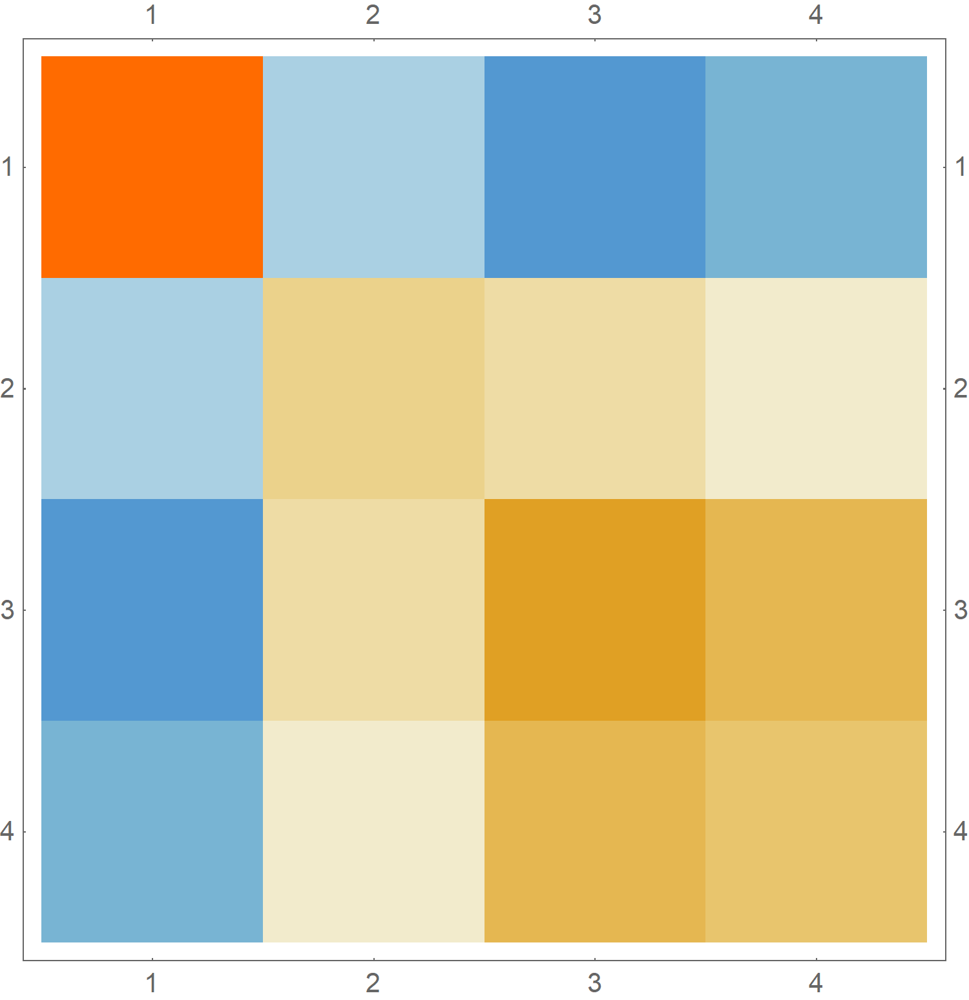
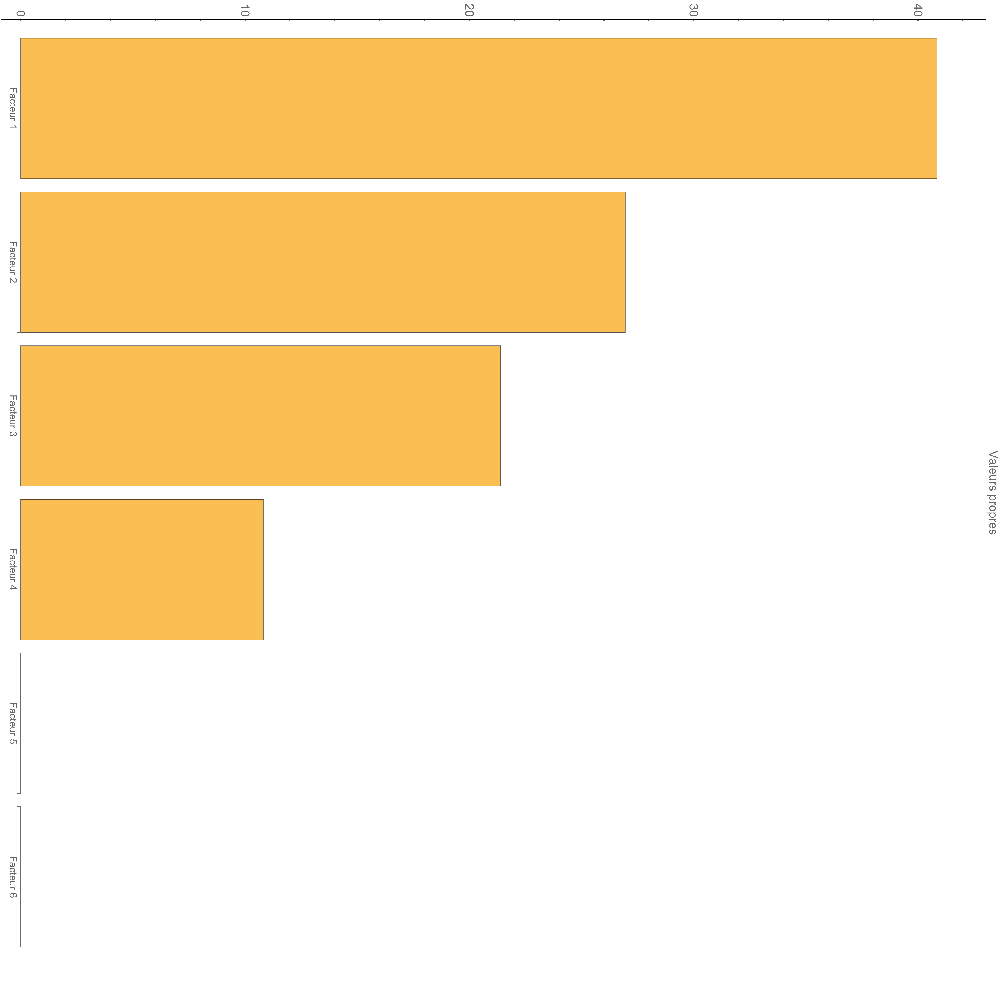

# L'analyse factorielle des correspondances multiples (A.C.M.)

L'A.C.M. étant une généralisation de l'A.F.C., il convient de reprendre ce qu'est une A.F.C. au travers un exemple simple. Dans les deux cas, il s'agit d'analyser la **correspondance** entre deux (A.F.C.) ou plusieurs (A.C.M.) variables qualitatives. On opère ce genre d'étude, en général, après une enquête.

> [!NOTE]
> La lecture de ce cours suppose de suffisamment connaître l'[algèbre linéaire](../../Formulaire-mathematique/Seance-09/05-Algebre%20lineaire.md) et le [calcul matriciel](../../Formulaire-mathematique/Seance-09/04-Calcul%20matriciel.md).

## Analyse factorielle des correspondances (A.F.C.)

Lors de la première approche d'un chapitre précédent, il n'était pas possible d'introduire la notion d'analyse factorielle à proprement. L'A.F.C. est une A.C.P. non centrée.

À l'origine, l'A.F.C. fut conçue pour étudier des **tableaux de contingence** (ou tableaux croisés). Il s'agit de tableaux d'effectifs obtenus en croisant les **modalités de deux variables qualitatives** sur une même population de $n$ individus.

Pour exposer la méthode, on reprend un exercice connu [^1].

**Exercice**. Après la publication des résultats d'une enquête nationale sur le tabagisme, le directeur des ressources humaines d'une entreprise a décidé de mener une enquête à l'intérieur de son établissement.

Il décida de créer cinq catégories au sein de son personnel :

1. *senior management* ;

2. *junior management* ;

3. *senior employees* ;

4. *junior employees* ;

5. *secretarial staff*.

Un échantillon aléatoire de 10 % est tiré au sort à l'intérieur de chaque groupe, et chacune des personnes est interrogée pour savoir si il ou elle :

- ne fume pas (*None*) ;

- fume entre 1 et 10 cigarettes par jour (*Light*) ;

- fume entre 11 et 20 cigarettes par jour (*Medium*) ;

- fume plus de 20 cigarettes par jour (*Heavy*) ;

L'enquête porte sur 193 individus. Un **tableau de contingence** est dressé (Tab. 1).

|  | **Smoking None** | **Smoking Light** | **Smoking Medium** | **Smoking Heavy** | **Alcohol No** | **Alcohol Yes** |
| :-: | :-: | :-: | :-: | :-: | :-: | :-: |
| **Senior management** | 4 | 2 | 3 | 2 | 0 | 11 |
| **Junior management** | 4 | 3 | 7 | 4 | 1 | 17 |
| **Senior employees** | 25 | 10 | 12 | 4 | 5 | 46 |
| **Junior employees** | 18 | 24 | 33 | 13 | 10 | 78 |
| **Secretarial staff** | 10 | 6 | 7 | 2 | 7 | 18 |
| **Pourcentage national** | 42 | 29 | 20 | 0 | - | - |
 
**Tableau 1. Tableau de contingence de l'enquête**

### Analyse des informations par rapport à l'exercice demandé

La tableau n°1 contient des données parasites : le pourcentage national et la consommation d'alcool. Pour mener à bien l'analyse de données, il faut supprimer ses informations du tableau de contingence (Tab. 2)

|  | **None** | **Light** | **Medium** | **Heavy** |
| :-: | :-: | :-: | :-: | :-: |
| **Senior management** | 4 | 2 | 3 | 2 |
| **Junior management** | 4 | 3 | 7 | 4 |
| **Senior employees** | 25 | 10 | 12 | 4 |
| **Junior employees** | 18 | 24 | 33 | 13 |
| **Secretarial staff** | 10 | 6 | 7 | 2 |
 
**Tableau 2. Tableau de contingence ciblé**

Les données sont composées de **deux variables qualitatives** :

1. le type de personnel ;

2. les catégories de fumeurs.

Les conditions sont remplies pour effectuer une  A.F.C.

### Informations basiques du tableau de contingence

L'A.F.C. étudie simultanément les lignes et les colonnes du tableau de contingence.

Le nombre de lignes correspond au nombre de modalité $m_1$ du type de personnel.

$m_1 = 5$

Le nombre de colonnes correspond au nombre de modalité $m_2$ des catégories de fumeurs.

$m_2 = 4$
    
Le nombre de modalités total $m$ est :

$m = m_1 \times m_2$
    
On dénombre l'effectif total $n$ tel que :

$n = \sum_{i = 1}^{m} n_i = 193$
    
avec $n_i$ l'effectif d'une modalité, soit la valeur d'une des cases du tableau de contingence (Tab. 2).

Comment lire un tableau de contingence ?

- La ressemblance entre deux lignes (ou colonnes) s'exprime de manière **totalement symétrique**.

- Deux lignes (ou colonnes) sont considérées comme proches si elles s'associent de la même manière à l'ensemble des colonnes (ou lignes). Cela est mesurée par la **référence qu'est la situation indépendante**.

- La ressemblance permet d'étudier la liaison entre les deux variables, c'est-à-dire l'**écart du tableau à l'hypothèse d'indépendance**.

### Analyse détaillée du tableau de contingence

Le tableau de contingence correspond à la matrice $\mathbf{N}$.

$\mathbf{N} = \left(  \begin{array}{cccc} 4 & 2 & 3 & 2 \\ 4 & 3 & 7 & 4 \\ 25 & 10 & 12 & 4 \\ 18 & 24 & 33 & 13 \\ 10 & 6 & 7 & 2  \end{array} \right)$

Tout le long de cette section, le tableau de contingence sera désigné par $\mathbf{N}$.

Le tableau de contingence est un tableau croisant deux caractères qualitatifs. L'individu disparaît en se fondant dans l'effectif correspondant au croisement d'une modalité de la première variable et d'une modalité de la seconde.

**L'objectif est d'obtenir une typologie des lignes et une typologie des colonnes**. Puis, il faut relier ces deux typologies entre elles. Toutefois, la notion de ressemblance entre deux lignes, ou entre deux colonnes, se distingue de celle mise en œuvre par une A.C.P.

#### Calcul des marges du tableau de contingence

Dans une A.F.C., une marge correspond simplement à la somme des effectifs d'une ligne ou d'une colonne. De fait, on parlera de **marge-ligne** et de **marge-colonne**.

Avant de poursuivre, une nouvelle notation doit être introduite. Couramment les lignes et les colonnes sont représentées mathématiquement et respectivement par les indices $i$ et $j$. Dans la plupart des manuels, on utilise les notations $n_{i.}$, $n_{.j}$, ou $n_{ij}$. La première signifie que la ligne retenue est fixe, tandis que l'indice de la colonne $j$ est variable. La deuxième signifie que la colonne retenue est fixe, tandis que l'indice de la ligne $j$ est variable. La troisième signifie que lignes et colonnes variées en même temps. Toutefois, il existe une autre façon d'écrire les idées des deux premières notations avec respectivement $n^{i}_{j}$, $n_{i}^{j}$. La valeur en exposant indique un indice fixant une ligne ou une colonne, tandis que la valeur en indice indique la variabilité d'une ligne ou d'une colonne. En résumé, en utilisant le calcul des marges, on obtient :

$n_{i.} = n^{i}_{j} = \sum_{j = 1}^{m_2} n_{ij}$

$n_{.j} = n_{i}^{j} = \sum_{i = 1}^{m_1} n_{ij}$

$n = \sum_{i = 1}^{m_1} \sum_{j = 1}^{m_2} n_{ij}$

Ce qui matérialise un nouveau tableau de synthèse (Tab. 3).

|  | **None** | **Light** | **Medium** | **Heavy** | **Marges lignes** |
| :-: | :-: | :-: | :-: | :-: | :-: |
| **Senior management** | 4 | 2 | 3 | 2 | **11** |
| **Junior management** | 4 | 3 | 7 | 4 | **18** |
| **Senior employees** | 25 | 10 | 12 | 4 | **51** |
| **Junior employees** | 18 | 24 | 33 | 13 | **88** |
| **Secretarial staff** | 10 | 6 | 7 | 2 | **25** |
| **Marges colonnes** | **61** | **45** | **62** | **25** | **193** |
 
**Tableau 3. Tableau de contingence avec les marges**

> [!NOTE]
> La liste de la marge-ligne forme un vecteur colonne, tandis que la liste de la marge-colonne forme un vecteur ligne.

#### Calcul des fréquences

Le calcul des fréquences correspond à l'**ensemble des probabilités**. On désigne la matrice des fréquences par $\mathbf{F}$. Pour l'obtenir, il suffit de calculer :

$\mathbf{F} = \frac{1}{n} \mathbf{T}$

ou

$f_{ij} = \frac{n_{ij}}{n}$

On calcule également les **fréquences marginales** pour les lignes :

$f_{i.} = \sum_{j = 1}^{m_2} \frac{n_{ij}}{n}$

et pour les colonnes :

$f_{.j} = \sum_{i = 1}^{m_1} \frac{n_{ij}}{n}$
    
On obtient un tableau de fréquences (Tab. 4).

|  | **None** | **Light** | **Medium** | **Heavy** | **Marges lignes** |
| :-: | :-: | :-: | :-: | :-: | :-: |
| **Senior management** | 0,02 | 0,01 | 0,02 | 0,01 | **0,06** |
| **Junior management** | 0,02 | 0,02 | 0,04 | 0,02 | **0,09** |
| **Senior employees** | 0,13 | 0,05 | 0,06 | 0,02 | **0,26** |
| **Junior employees** | 0,09 | 0,12 | 0,17 | 0,07 | **0,46** |
| **Secretarial staff** | 0,05 | 0,03 | 0,04 | 0,01 | **0,13** |
| **Marges colonnes** | **0,32** | **0,23** | **0,32** | **0,13** | **1** |
 
**Tableau 4. Tableau de fréquence avec les marges**

On note que :

$\sum_{i = 1}^{m_1} \sum_{j = 1}^{m_2} f_{ij} = 1$

> [!NOTE]
> Il est également possible de calculer les **variances marginales**.

> [!NOTE]
>  Il est possible de calculer les caractéristiques conditionnelles (moyennes et variances).

> [!NOTE]
>  Il existe des relations entre les caractéristiques marginales et les caractéristiques conditionnelles.

### Analyse détaillée des profils

L'A.F.C. s'effectue à partir d'un **profil-ligne** ou d'un **profil-colonne**. Chaque d'eux correspond à un tableau de fréquences conditionnelles en sachant les lignes ou les colonnes.

Le profil-ligne est la matrice des fréquences calculées à partir des marges de chaque ligne sur chaque case de la ligne correspondante.

$f^{i}_{j} = \frac{n_{ij}}{n_{i.}}$

On obtient le profil-ligne (Tab. 5).

|  | **None** | **Light** | **Medium** | **Heavy** |
| :-: | :-: | :-: | :-: | :-: |
| **Senior management** | 0,364 | 0,182 | 0,273 | 0,182 |
| **Junior management** | 0,222 | 0,167 | 0,389 | 0,222 |
| **Senior employees** | 0,490 | 0,196 | 0,235 | 0,375 |
| **Junior employees** | 0,205 | 0,273 | 0,375 | 0,148 |
| **Secretarial staff** | 0,400 | 0,240 | 0,280 | 0,080 |
 
**Tableau 5. Profil-ligne**

Le profil-colonne est la matrice des fréquences calculées à partir des marges de chaque colonne sur chaque case de la colonne correspondante.

$f_{i}^{j} = \frac{n_{ij}}{n_{.j}}$

On obtient le profil-colonne (Tab. 6).

|  | **None** | **Light** | **Medium** | **Heavy** |
| :-: | :-: | :-: | :-: | :-: |
| **Senior management** | 0,066 | 0,044 | 0,048 | 0,080 |
| **Junior management** | 0,066 | 0,067 | 0,113 | 0,160 |
| **Senior employees** | 0,410 | 0,222 | 0,194 | 0,160 |
| **Junior employees** | 0,295 | 0,533 | 0,532 | 0,520 |
| **Secretarial staff** | 0,164 | 0,133 | 0,113 | 0,080 |
 
**Tableau 6. Profil-colonne**

De manière matricielle, pour calculer les profils, il faut utiliser les marges-ligne et colonne en le diagonalisant. La diagonale de la marge-ligne est notée $\mathbf{D_1}$. La diagonale de la marge-colonne est notée $\mathbf{D_2}$.

$\mathbf{D_1} = \left(  \begin{array}{ccccc} 11 & 0 & 0 & 0 & 0 \\ 0 & 18 & 0 & 0 & 0 \\ 0 & 0 & 51 & 0 & 0 \\ 0 & 0 & 0 & 88 & 0 \\ 0 & 0 & 0 & 0 &  25 \end{array} \right)$

$\mathbf{D_2} = \left(  \begin{array}{cccc} 61 & 0 & 0 & 0 \\ 0 & 45 & 0 & 0 \\ 0 & 0 & 62 & 0 \\ 0 & 0 & 0 & 25 \end{array} \right)$

Les deux profils s'obtiennent en calculant pour les lignes[^2] :

$\mathbf{D_1}^{-1}.\mathbf{N}$

et pour les colonnes[^3] :

$\mathbf{D_2}^{-1}.{{}^t}\mathbf{N}$

avec $\mathbf{N}$ le tableau de contingence.

Mathématiquement, on dit que l'espace vectoriel $\mathbb{R}^{m_2}$ des lignes est muni de la la **métrique diagonale** $\mathbf{D_1}$. De même, l'espace vectoriel $\mathbb{R}^{m_1}$ des colonnes est muni de la la métrique diagonale $\mathbf{D_2}$.

### Analyse du nuage de points

On est en présence de deux nuages de points **pesants**. Le nuage du profil-ligne est muni des poids $f_{i.}$. Le nuage du profil-colonne est muni des poids $f_{.j}$. La pondération $\frac{n}{f_{i.}}$ ou $\frac{n}{f_{.j}}$ permet de donner des importances comparables aux différentes valeurs.

Pour comparer les profils, on utilise la distance du ${\chi}^2$. La masse des individus est **relativisée**, mais pas annulée comme pour l'A.C.P. La symétrie entre individus et variables est **conservée**. Avec la métrique du ${\chi}^2$, la distance entre deux lignes **ne dépend pas des poids respectifs** des colonnes. Ainsi, toute surreprésentation est neutralisée. De plus, la métrique du ${\chi}^2$ possède la **propriété d'équivalence distributionnelle**, ce qui signifie que, si on regroupe deux modalités lignes, les distances entre les profil-colonne et ligne restent inchangées. Par exemple, si deux colonnes $j$ et $j'$ de $\mathbf{N}$ ont le même profil, il est logique de les regrouper en une seule d'effectif $f_{ij} + f_{ij'}$. De fait, lorsque $\frac{f_{ij}}{f_{.j}} = \frac{f_{ij'}}{f_{.j'}}$, on obtient alors :

$\frac{n}{f_{.j}} \left( \frac{f_{ij}}{f_{i.}} - \frac{f_{.j}}{n} \right)^2 + \frac{n}{f_{.j'}} \left( \frac{f_{ij'}}{f_{i.}} - \frac{f_{.j'}}{n} \right)^2 = \frac{n}{f_{.j} + f_{.j}} \left( \frac{f_{ij} + f_{ij'}}{f_{i.}} - \frac{f_{.j} - f_{.j'}}{n} \right)^2$

> [!NOTE]
>  Lorsque toutes les lignes d'un profil sont identiques, les variables qualitatives sont indépendantes. La connaissance de l'une ne change pas la répartition de l'autre.

#### Analyse de l'indépendance avec la distance statistique du ${\chi}^2$

La distance statistique du ${\chi}^2$ est notée $d^2$. Elle permet d'opérer un test statistique d'indépendance sur l'ensemble des données.

$d^2 = \sum_{i = 1}^{m_1} \sum_{j = 1}^{m_2} \left( \frac{\left(n_{ij} - \frac{n_{i.} n_{.j}}{n} \right)^2}{\frac{n_{i.} n_{.j}}{n}} \right)$

Il s'agit de la différence entre l'effectif observé et l'effectif théorique, élevée au carré, et divisé par l'effectif théorique. On remarque que l'effectif théorique $n_{th}$ vaut :

$n_{th} = \frac{n_{i.} n_{.j}}{n}$
    
ou

$n_{th} = n f_{i.} f_{.j} = n \left( \frac{{n_{ij}}^2}{n_{i.} n_{.j}} \right)$

En remarquant deux propriétés :

$\sum_{i = 1}^{m_1} \sum_{j = 1}^{m_2} \left( n_{i.} n_{.j} \right) = n^2$

et

$\sum_{i = 1}^{m_1} \sum_{j = 1}^{m_2} n_{ij} = n$
    
on peut démontrer que :

$d^2 = n \left[ \left( \sum_{i = 1}^{m_1} \sum_{j = 1}^{m_2} \frac{\left( n_{ij}\right)^2}{n_{i.} n_{.j}} \right) - 1\right]$

ici la contribution au ${\chi}^2$ vaut $d^2 = 16,4416$.

> [!NOTE]
>  La distance du ${\chi}^2$ est une distance euclidienne.

La distance du ${\chi}^2$ permet de tester l'indépendance des deux variables qualitatives. Si $d^2 = 0$, les variables sont indépendantes. $d^2$ suit une distribution du ${\chi}^2$ avec $\left( m_1 - 1 \right) \left( m_2 - 1 \right)$ degrés de liberté, ici $12$. Dans ce cadre, $d^2$ est une réalisation d'une variable aléatoire $D^2$ qui suit une loi ${\chi}^2_{12}$. Elle permet d'établir la significativité de $d^2$ avec un test statistique avec une valeur ${{\chi}_c}^2$.

$\left\lbrace  \begin{array}{c} \textrm{H}_{0} : d^2 > {{\chi}_c}^2\\ \textrm{H}_{1} : d^2 < {{\chi}_c}^2 \end{array} \right.$
    
Les deux variables sont indépendantes si $\textrm{H}_{0}$ est vérifiée.

- Pour un risque $\alpha = 5$ %, ${{\chi}_c}^2 = 21,0261$

- Pour un risque $\alpha = 2,5$ %, ${{\chi}_c}^2 = 23,3367$

- Pour un risque $\alpha = 1$ %, ${{\chi}_c}^2 = 26,2170$

- Pour un risque $\alpha = 0,5$ %, ${{\chi}_c}^2 = 28,2995$

- Pour un risque $\alpha = 0,1$ %, ${{\chi}_c}^2 = 32,9095$

Ici, on choisit un risque à 5 %, soit $\Pr \left( d^2 < {{\chi}_c}^2 \right) = \alpha$. Dans ce cas, l'hypothèse $\textrm{H}_{0}$ est rejetée : $d^2 < 21,0261$. **L'indépendance est non significatif ; les deux variables sont dépendantes**. On peut calculer l'A.F.C.

> [!NOTE]
> Si le degré de liberté $d_L$ est strictement supérieur à $30$, $\sqrt{{\chi}^2} - \sqrt{2 \times d_L - 1}$ est distribué comme une variable centrée et réduite par une loi normale.

#### L'inertie totale ${\phi}^2$

L'inertie totale ${\phi}^2$ du nuage de points se calcule à partir de $d^2$.

${\varphi}^2 = \frac{d^2}{n}$

Ici, ${\phi}^2 = 0,0852$. Elle mesure l'écart à l'indépendance. Sa valeur doit être inférieure à $\min \left( m_1 - 1, m_2 - 1 \right)$, ici $3$. On vérifie bien que $d^2 < 3$.

Si ${\phi}^2 = \max \left( m_1 - 1, m_2 - 1 \right)$, ici si ${\phi}^2 = m_2 - 1 = 4$, alors, pour chaque ligne $i$, soit $n_{ij} = n_{i.}$, soit $n_{ij} = 0$, il existe une unique case non nulle par ligne, les colonnes sont liées de manière fonctionnelle aux lignes, mais cela signifie pas que les lignes sont liées de manière fonctionnelle aux colonnes, sauf si $m_1 = m-2$. On peut représenter le tableau comme une **matrice diagonale**.

Par conséquent, la variable ${\phi}^2$ de Pearson vaut ici :

${\phi}^2 = \frac{m}{p} - 1$

avec $m$ le nombre total de modalités et $p$ le nombre de variables qualitatives.

#### Analyse de la ressemblance avec la distance du ${\chi}^2$ entre les lignes et les colonnes

La distance du ${\chi}^2$ définit la **ressemblance** entre les lignes ou les colonnes d'un profil.

Pour le profil ligne, il est possible de comparer chaque ligne entre elles en construisant une distance du ${\chi}^2$. Soient $i_1$ et $i_2$ deux lignes du profil-ligne, alors :

${\chi}^2 \left(i_1, i_2 \right) = \sum_{j = 1}^{m_2} \frac{1}{f_{.j}} \left( \frac{f_{i_1 j}}{f_{i_1 .}} - \frac{f_{i_2 j}}{f_{i_2 .}} \right)^2$

On obtient ainsi une matrice carrée symétrique dans laquelle la comparaison de la ligne avec elle-même est nulle, et la valeur de la ressemblance entre la ligne et les autres est donnée (Tab. 7).

|  | **Senior managers** | **Juniors managers** | **Senior employees** | **Junior employees** | **Secretaries** |
| :-: | :-: | :-: | :-: | :-: | :-: |
| **Senior managers** | 0,00000 | 0,11886 | 0,13843 | 0,15706 | 0,09890 |
| **Junior managers** | 0,11886 | 0,00000 | 0,46397 | 0,09268 | 0,31612 |
| **Senior employees** | 0,13843 | 0,46397 | 0,00000 | 0,38119 | 0,04025 |
| **Junior employees** | 0,15706 | 0,09268 | 0,38119 | 0,00000 | 0,18897 |
| **Secretaries** | 0,09890 | 0,31612 | 0,04025 | 0,18897 | 0,00000 |
 
**Tableau 7. Distance du ${chi}^2$ entre les lignes**

En divisant la matrice par l'effectif total $n$, ici $n = 193$, on obtient l'indice $\varphi$ de Karl Pearson, permettant de mesurer l'intensité de l'association existante entre deux variables. L'avantage de la valeur obtenue est qu'elle ne dépend de l'effectif total de la table. Le résultat est une seconde matrice carrée (Tab. 8).

|  | **No Smoking** | **Light Smoking** | **Medium Smoking** | **Heavy Smoking** |
| :-: | :-: | :-: | :-: | :-: |
| **No Smoking** | 0,00000 | 0,27277 | 0,34971 | 0,50080 |
| **Light Smoking** | 0,27277 | 0,00000 | 0,02953 | 0,15258 |
| **Medium Smoking** | 0,34971 | 0,02953 | 0,00000 | 0,05326 |
| **Heavy Smoking** | 0,50080 | 0,15258 | 0,05326 | 0,00000 |
 
**Tableau 8. Distance du ${chi_}^2$ entre les colonnes**

Pour le profil colonne, il est possible de comparer chaque colonne entre elles en construisant une distance du ${\chi}^2$. Soient $j_1$ et $j_2$ deux colonnes du profil-ligne, alors :

${\chi}^2 \left(j_1, j_2 \right) = \sum_{i = 1}^{m_1} \frac{1}{f_{i.}} \left( \frac{f_{i j_1}}{f_{. j_1}} - \frac{f_{i j_2}}{f_{. j_2}} \right)^2$

On obtient ainsi une matrice carrée symétrique dans laquelle la comparaison de la colonne avec elle-même est nulle, et la valeur de la ressemblance entre la colonne et les autres est donnée (Tab. 9).

|  | **Senior managers** | **Juniors managers** | **Senior employees** | **Junior employees** | **Secretaries** |
| :-: | :-: | :-: | :-: | :-: | :-: |
| **Senior managers** | 0,00000 | 0,00062 | 0,00072 | 0,00081 | 0,00051 |
| **Junior managers** | 0,00062 | 0,00000 | 0,00240 | 0,00048 | 0,00164 |
| **Senior employees** | 0,00072 | 0,00240 | 0,00000 | 0,00015 | 0,00079 |
| **Junior employees** | 0,00081 | 0,00048 | 0,00015 | 0,00000 | 0,00028 |
| **Secretaries** | 0,00051 | 0,00164 | 0,00079 | 0,00028 | 0,00000 |
 
**Tableau 9. Distance du ${phi}^2$ entre les colonnes**

En divisant la matrice par l'effectif total $n$, ici $n = 193$, on obtient la seconde matrice carrée symétrique de l'indice $\varphi$ de Karl Pearson (Tab. 10).

|  | **No Smoking** | **Light Smoking** | **Medium Smoking** | **Heavy Smoking** |
| :-: | :-: | :-: | :-: | :-: |
| **No Smoking** | 0,00000 | 0,00141 | 0,00181 | 0,00259 |
| **Light Smoking** | 0,00141 | 0,00000 | 0,00015 | 0,00079 |
| **Medium Smoking** | 0,00181 | 0,00015 | 0,00000 | 0,00028 |
| **Heavy Smoking** | 0,00259 | 0,00079 | 0,00028 | 0,00000 |
 
**Tableau 10. Distance du ${phi}^2$ entre les colonnes**

Plus les valeurs sont proches de 1, plus la ligne (ou la colonne) ressemble à celle qui lui est comparée. Pour le profil-ligne, la ligne *Juniors managers* ressemble beaucoup aux lignes *Senior employees* et *Secretaries*. Pour le profil-colonne, la colonne *No Smoking* ressemblent beaucoup aux colonnes *Heavy Smoking*.

> [!NOTE]
> Pour chaque profil, la totalité des valeurs de la distance du ${\chi}^2$ et de l'indice $\varphi$ est différente.

#### Les centres de gravité

Le profil-ligne forment un nuage de $m_1$ points de $\mathbb{R}^{m_2}$. Chaque point est affecté d'un poids égal à sa fréquence marginale $\frac{n_{i.}}{n}$. La matrice des poids est $\frac{1}{n} \mathbf{D_1}$.

$\frac{1}{n} \mathbf{D_1} = \left(  \begin{array}{ccccc} \frac{11}{193} & 0 & 0 & 0 & 0 \\ 0 & \frac{18}{193} & 0 & 0 & 0 \\ 0 & 0 & \frac{51}{193} & 0 & 0 \\ 0 & 0 & 0 & \frac{88}{193} & 0 \\ 0 & 0 & 0 & 0 & \frac{25}{193} \end{array} \right)$

Le centre de gravité $\mathbf{g_L}$ correspond au profil marginal des lignes :

$\mathbf{g_L} = \frac{1}{n} {{}^t}\left( {\mathbf{D_1}}^{-1} \mathbf{N} \right) \mathbf{D_1} \mathbf{1}_{m_2}$

avec $\mathbf{1}_{m_2} = \left( \begin{array}{c} 1 \\ 1 \\ 1 \\ 1 \\ 1 \end{array} \right)$, ici

$\mathbf{g_L} = \left(  \begin{array}{c} 0,31606 \\ 0,23316 \\ 0,32124 \\ 0,12953  \end{array} \right)$

Cela correspond simplement à la marge-ligne divisée par $n$.

Le profil-colonne forment un nuage de $m_2$ points de $\mathbb{R}^{m_1}$. Chaque point est affecté d'un poids égal à sa fréquence marginale $\frac{n_{.j}}{n}$. La matrice des poids est $\frac{1}{n} \mathbf{D_2}$.

$\frac{1}{n} \mathbf{D_2} = \left(  \begin{array}{cccc} \frac{61}{193} & 0 & 0 & 0 \\ 0 & \frac{45}{193} & 0 & 0 \\ 0 & 0 & \frac{62}{193} & 0 \\ 0 & 0 & 0 & \frac{25}{193} \end{array} \right)$

Le centre de gravité $\mathbf{g_C}$ correspond au profil marginal des lignes :

$\mathbf{g_C} = \frac{1}{n} {{}^t}\left( {\mathbf{D_2}}^{-1} {{{}^t}\mathbf{N}} \right) \mathbf{D_2} \mathbf{1}_{m_1}$

avec $\mathbf{1}_{m_1} = \left( \begin{array}{c} 1 \\ 1 \\ 1 \\ 1 \end{array} \right)$, ici

$\mathbf{g_C} = \left(  \begin{array}{c} 0,05699 \\ 0,09326 \\ 0,26425 \\ 0,45596 \\ 0,12953  \end{array} \right)$

Cela correspond simplement à la marge-colonne divisée par $n$.

#### La distance du ${\chi}^2$ et le nuage des poids

En cas d'indépendance empirique,

$\frac{n_{ij}}{n_{i.}} = \frac{n_{.j}}{n}$

et

$\frac{n_{ij}}{n_{.j}} = \frac{n_{i.}}{n}$

Ainsi les deux nuages sont réduis à leurs centres de gravité respectifs $\mathbf{g_L}$ et $\mathbf{g_C}$.

L'étude de la forme des nuages de points au moyen de l'analyse en composantes principales permettra de rendre compte de la structure des écarts à l'indépendance.

> [!WARNING]
> « L'analyse des correspondances met en relief la structure des écarts à l'indépendance, **non leur intensité** »[^4] (p. 121). Dans les programmes, « ce n'est pas visible graphiquement puisque quelle que soit la faible valeur des vecteurs propres, un changement d'échelle fait que le graphique occupe toute la page [des résultats] »[^2] (p. 122).

### Représentation graphiques des profils

L'A.F.C. est une méthode utilisant les tableaux de contingences au niveau des profils. Si l'indépendance n'est pas rejetée, l'information contenue dans le tableau des fréquences $\mathbf{F}$ est résumée par les **marges** en ligne et en colonne que l'on visualise par des **diagrammes en bâtons**. Les marges de points des profils ligne et colonne sont dans le cas de l'indépendance empirique confondus avec leurs points moyens respectifs.

L'objectif de l'A.F.C. est de visualiser dans des plans factoriels les nuages de points des profils en ligne et en colonne, ainsi que de situer ces nuages par rapport à leurs profils moyens respectifs.

#### Le profil ligne

Comme les données sont qualitatives, il est possible présenter les lignes du profil avec des diagrammes en bâtons (Fig. 1 ; Fig. 2 ; Fig. 3 ; Fig. 4 ; Fig. 5 ; Fig. 6) et en tuyaux d'orgue (Fig. 7).

**Figure 1. Ligne n°1 du profil avec la valeur de fréquence marginale de la colonne**

**Figure 2. Ligne n°2 du profil avec la valeur de fréquence marginale de la colonne**

**Figure 3. Ligne n°3 du profil avec la valeur de fréquence marginale de la colonne**

**Figure 4. Ligne n°4 du profil avec la valeur de fréquence marginale de la colonne**

**Figure 5. Ligne n°5 du profil avec la valeur de fréquence marginale de la colonne**

**Figure 6. Profil moyen des lignes**

**Figure 7. Diagramme en tuyaux d'orgue des données**

#### Le profil colonne

Comme les données sont qualitatives, il est possible présenter les colonnes du profil avec des diagrammes en bâtons (Fig. 8 ; Fig. 9 ; Fig. 10 ; Fig. 11 ; Fig. 12) et en tuyaux d'orgue (Fig. 13).

**Figure 8. Ligne n°1 du profil avec la valeur de fréquence marginale de la colonne**

**Figure 9. Ligne n°2 du profil avec la valeur de fréquence marginale de la colonne**

**Figure 10. Ligne n°3 du profil avec la valeur de fréquence marginale de la colonne**

**Figure 11. Ligne n°4 du profil avec la valeur de fréquence marginale de la colonne**

**Figure 12. Profil moyen des colonnes**

**Figure 13. Diagramme en tuyaux d'orgue des données**

#### Remarques

> [!NOTE]
> Le point ligne moyen du profil-ligne est la marge colonne du profil-colonne. De façon duale, le point colonne moyen du profil-colonne est la marge ligne du profil-ligne.

> [!NOTE]
> Dans le cas de l'indépendance empirique, les lignes sont égales à la marge colonne du profil-colonne. Les colonnes sont égales à la marge ligne du profil-ligne.

En cas d'**indépendance empirique**, on observe

$\frac{f_{ij}}{f_{i.}} = \frac{f_{.j}}{n}$

et

$\frac{f_{ij}}{f_{.j}} = \frac{f_{i.}}{n}$

Cela signifie que les deux nuages sont réduits à leurs centres de gravité respectifs. L'étude de la forme des nuages au moyen d'une analyse en composantes principales permettra de rendre compte de la **structure des écarts à l'indépendance**.

### Synthèse des calculs matriciels

Les analyses factorielles fonctionnent avec un triplet $\left( \mathbf{X}, \mathbf{M}, \mathbf{P} \right)$ correspondant respectivement aux tableaux de données, la métrique et le poids. Pour calculer l'ensemble de ces matrices, il suffit de connaître la matrice $\mathbf{N}$ contenant les données initiale, et les matrices diagonales des marges $\mathbf{D_1}$ pour les lignes et $\mathbf{D_2}$ pour les colonnes (Tab. 11).

|  | **Profil-ligne** | **Profil-colonne** |
| :-: | :-: | :-: |
| **Tableau de données** $X$ | ${\mathbf{D_1}}^{-1}.\mathbf{N}$ | ${\mathbf{D_2}}^{-1}.\mathbf{N}^T$ |
| **Métrique** $M$ | $n {\mathbf{D_2}}^{-1}$ | $n {\mathbf{D_1}}^{-1}$ |
| **Poids** $P$ | $\frac{1}{n} \mathbf{D_1}$ | $\frac{1}{n} \mathbf{D_2}$ |
 
**Tableau 11. Synthèse des calculs matriciels**

Pour calculer le centre de gravité $\mathbf{g}$, on utilise les trois matrices définies :

$\mathbf{g} = {{{}^t}\mathbf{X}}.\mathbf{D}.\mathbf{1}$

### Matrice de covariance

La matrice de covariance est notée $\mathbf{V}$.

$\mathbf{V} = {{{}^t}\mathbf{X}}.\mathbf{D}.\mathbf{X} - \mathbf{g}.{{{}^t}\mathbf{g}}$

ou

$\mathbf{V} = {{}^t}\left( \mathbf{X} - \mathbf{1}.{{}^t}\mathbf{g} \right) .\mathbf{D}. \left( \mathbf{X} - \mathbf{1}.{{{}^t}\mathbf{g}} \right)$

Dans l'analyse, la matrice de covariance $\mathbf{V_L}$ du profil-ligne (Fig. 14) vaut :

$\mathbf{V_L} = \left(  \begin{array}{cccc} 0,01555 & -0,00320 & -0,00786 & -0,00448 \\ -0,0032 & 0,00165 & 0,0015 & 0,00006 \\ -0,00786 & 0,0015 & 0,00405 & 0,00231 \\ -0,00448 & 0,00006 & 0,00231 & 0,00212 \end{array} \right)$

**Figure 14. Intensité de la matrice de covariance du profil-ligne**

La matrice de covariance $\mathbf{V_C}$ du profil-colonne (Fig. 15) vaut :

$\mathbf{V_C} = \left(  \begin{array}{ccccc} 0,00015 & 0,00015 & 0,0004 & -0,00068 & -0,00002 \\ 0,00015 & 0,00111 & -0,00236 & 0,00196 & -0,00086 \\ 0,0004 & -0,00236 & 0,01012 & -0,01076 & 0,00259 \\ -0,00068 & 0,00196 & -0,01076 & 0,01198 & -0,00250 \\ -0,00002 & -0,00086 & 0,00259 & -0,00250 & 0,00078 \end{array} \right)$

**Figure 15. Intensité de la matrice de la covariance du profil-colonne**

La trace des matrices de covariances est l'ensemble des variances.

$\textrm{trace} \left( \mathbf{V_L} \right) = 0.02336$

et

$\textrm{trace} \left( \mathbf{V_C} \right) = 0.02415$

Si on calcule les vecteurs propres des matrices $\mathbf{V}.\mathbf{M}$, on peut trouver une liaison avec les centres de gravité du nuage $\mathbf{g}$.

$\mathbf{V_L}.\mathbf{M_L} = \left(  \begin{array}{cccc} 0,04919 & -0,01373 & -0,02447 & -0,03462 \\ -0,01013 & 0,00706 & 0,00466 & 0,00044 \\ -0,02487 & 0,00642 & 0,01261 & 0,01784 \\  -0,01419 & 0,00025 & 0,0072 & 0,01633 \end{array} \right)$

et

$\mathbf{V_C}.\mathbf{M_C} = \left(  \begin{array}{ccccc} 0,00267 & 0,00158 & 0,00152 & -0,0015 & -0,00015 \\ 0,00258 & 0,01188 & -0,00893 & 0,00431 & -0,00662 \\ 0,00706 & -0,02531 & 0,03831 & -0,0236 & 0,02001 \\ -0,01198 & 0,02105 & -0,04071 & 0,02627 & -0,01929 \\ -0,00034 & -0,0092 & 0,00981 & -0,00548 & 0,00605 \end{array} \right)$

$\mathbf{g_L}$ est le vecteur propre de $\mathbf{V_L}.\mathbf{M_L}$ associé à la valeur propre 0. $\mathbf{g_C}$ est le vecteur propre de $\mathbf{V_C}.\mathbf{M_C}$ associé à la valeur propre 0. Ainsi :

$\mathbf{V_L}.\mathbf{M_L}.\mathbf{g_L} = 0$

et

$\mathbf{V_C}.\mathbf{M_C}.\mathbf{g_C} = 0$

Le centrage des valeurs est inutile. L'A.F.C. est une **A.C.P. non centrée**. On élimine juste la valeur propre 1 associée à l'axe principal $\mathbf{g}$ et au facteur principal :
    $\mathbf{M}.\mathbf{g} = 1$

### Calcul des A.C.P. non centrées sur les profils

L'A.F.C. opère **deux A.C.P. généralisées** sur chaque profil, dont les composantes principales fournissent respectivement les représentations en projection des deux nuages de points.

1. L'A.C.P. du profil-ligne consiste la probabilité par rapport à la somme marginale des lignes.

2. L'A.C.P. du profil-colonne consiste la probabilité par rapport à la somme marginale des colonnes.

> [!NOTE]
> Le centrage et la réduction des données est inutile en A.F.C., puisque la valeur propre 1 est associée à l'axe principal.

#### Profil-ligne

On pose $\mathbf{A} = \mathbf{M}.{{{}^t}{\mathbf{X}}}.\mathbf{D}.\mathbf{X}$.

$\mathbf{A} = n {\mathbf{D_2}}^{-1}.{{}^t}\left( {\mathbf{D_1}}^{-1}.\mathbf{N} \right).\frac{\mathbf{D_1}}{n}.{\mathbf{D_1}}^{-1}.\mathbf{N} = {\mathbf{D_2}}^{-1}.{{{}^t}\mathbf{N}}.{\mathbf{D_1}}^{-1}.\mathbf{N}$

Ici,

$\mathbf{A} = \left(  \begin{array}{cccc} 0,36525 & 0,22303 & 0,29637 & 0,11534 \\ 0,30233 & 0,24022 & 0,32767 & 0,12978 \\ 0,29259 & 0,23782 & 0,33385 & 0,13673 \\ 0,28144 & 0,23360 & 0,33909 & 0,14587  \end{array} \right)$

> [!NOTE]
> Si on pose $\mathbf{L}$ le profil-ligne et $\mathbf{C}$ le profil-colonne, alors $\mathbf{A} = {{}^t}\mathbf{C}.\mathbf{L}$.

On calcule les axes principaux $k$ avec la formule suivante :

$\mathbf{A}.\mathbf{u_k} = {\lambda}_{k}.{\mathbf{u_k}}$

avec $\mathbf{A}$ une matrice carrée, $\mathbf{u_k}$ un vecteur propre colonne (ou axe) et ${\lambda}_{k}$ une valeur propre associée (ou un facteur) avec $k$, donc un scalaire. Ici,

$\mathbf{\lambda} = \left(  \begin{array}{c} 1,00000 \\ 0,07476 \\ 0,01002 \\ 0,00041  \end{array} \right)$
    
et

$\mathbf{u} = \left(  \begin{array}{cccc} 1,00000 & -1,3388 & 0,15418 & -0,03397 \\ 1,00000 & 0,33854 & -0,71329 & 0,83927 \\ 1,00000 & 0,66827 & -0,03721 & -0,97895 \\ 1,00000 & 1,00000 & 1,00000 & 1,00000  \end{array} \right)$

On retire la première ligne de $\mathbf{\lambda}$ et la première colonne de $\mathbf{u}$.

$\mathbf{\lambda} = \left(  \begin{array}{c} 0,07476 \\ 0,01002 \\ 0,00041  \end{array} \right)$

et

$\mathbf{u} = \left(  \begin{array}{ccc} -1,33880 & 0,15418 & -0,03397 \\ 0,33854 & -0,71329 & 0,83927 \\ 0,66827 & -0,03721 & -0,97895 \\ 1,00000 & 1,00000 & 1,00000  \end{array} \right)$

On peut alors calculer la variance expliquée en pourcentage.

$\frac{1}{T} \mathbf{\lambda} \times 100 = \left(  \begin{array}{c} 87,79 \\ 11,74 \\ 0,47  \end{array} \right)$

La variance expliquée totale $T$ vaut $T = \sum_{k = 1}^{m_1 - 1} {\lambda}_k = 0,0852$. On la représente par un diagramme en bâtons (Fig. 16).

**Figure 16. Valeurs propres du profil ligne**

La composante principale associée $\mathbf{a_k}$ au facteur $\mathbf{u_k}$ est :

$\mathbf{a_k} = \mathbf{X}.\mathbf{u_k} = {\mathbf{D_1}}^{-1}.\mathbf{N}.\mathbf{u_k}$

Elle est vecteur propre de la matrice $\mathbf{B} = {\mathbf{D_1}}^{-1}.\mathbf{N}.{\mathbf{D_2}}^{-1}.{{{}^t}\mathbf{N}}$ :

$\mathbf{B}.\mathbf{a_k} = {\mathbf{D_1}}^{-1}.\mathbf{N}.{\mathbf{D_2}}^{-1}.{{{}^t}\mathbf{N}}.\mathbf{a_k} = {\mathbf{D_1}}^{-1}.\mathbf{N}.{\mathbf{D_2}}.{{}^t}{N}.{\mathbf{D_1}}^{-1}.\mathbf{N}.\mathbf{u_k} = {{\lambda}_k}.{\mathbf{D_1}}^{-1}.\mathbf{N}.\mathbf{u_k} = {{\lambda}_k}.\mathbf{a_k}$

avec $\mathbf{a_k}$ un vecteur propre et ${\lambda}_{k}$ une valeur propre associée avec $k$.

$\mathbf{a} = \left(  \begin{array}{ccccc} 1,00000 & -0,06121 & 0,09804 & 0,055074 \\ 1,00000 & 0,24102 & 0,12313 & -0,026151 \\ 1,00000 & -0,35422 & 0,00539 & -0,003999 \\ 1,00000 & 0,21681 & -0,02922 & 0,00256 \\ 1,00000 & -0,18716 & -0,03993 & -0,00627 \end{array} \right)$

- **Rappel 1**. Lorsque l'on recherche des valeurs propres et des vecteurs propres, on établit une application linéaire orthogonale.

- **Rappel 2**. Il existe un ensemble infini de vecteurs propres possibles. D'un logiciel à l'autre, les résultats de l'A.F.C. ne seront pas les mêmes. En fait, l'équation $\mathbf{A}.\mathbf{u_k} = {\lambda}_{k}.{\mathbf{u_k}}$ conduit par définition à un **système homogène**, condition de l'orthogonalité.

#### Profil-colonne

On pose $\mathbf{A} = \mathbf{M}.{{{}^t}{\mathbf{X}}}.\mathbf{D}.\mathbf{X}$.

$\mathbf{A} = n {\mathbf{D_1}}^{-1}.{{}^t}\left( {\mathbf{D_2}}^{-1}.\mathbf{N} \right).\frac{\mathbf{D_2}}{n}.{\mathbf{D_2}}^{-1}.\mathbf{N} = {\mathbf{D_1}}^{-1}.{\mathbf{N}}.{\mathbf{D_2}}^{-1}.{{{}^t}\mathbf{N}}$

Ici,

$\mathbf{A} = \left(  \begin{array}{ccccc} 0,05967 & 0,09585 & 0,27131 & 0,44398 & 0,12919 \\ 0,05857 & 0,10515 & 0,23894 & 0,47701 & 0,12034 \\ 0,05852 & 0,08433 & 0,30256 & 0,41524 & 0,13934 \\ 0,05550 & 0,09757 & 0,24065 & 0,48223 & 0,12405 \\ 0,05684 & 0,08664 & 0,28426 & 0,43667 & 0,13559  \end{array} \right)$

> [!NOTE]
> Si on pose $\mathbf{L}$ le profil-ligne et $\mathbf{C}$ le profil-colonne, alors $\mathbf{A} = \mathbf{C}.{{}^t}\mathbf{L}$.

On calcule les axes principaux $k$ avec la formule suivante :

$\mathbf{A}.\mathbf{v_k} = {\lambda}_{k}.{\mathbf{v_k}}$

avec $\mathbf{v_k}$ un vecteur propre (ou axe) et ${\lambda}_{k}$ une valeur propre associée (ou un facteur) avec $k$. Ici,

$\mathbf{\lambda} = \left(  \begin{array}{c} 1,00000 \\ 0,07476 \\ 0,01002 \\ 0,00041 \\ 0,00000 \end{array} \right)$

et

$\mathbf{v} = \left(  \begin{array}{ccccc} 1,00000 & 0,32706 & -2,45513 & -8,78361 & 0,32155 \\ 1,00000 & -1,28778 & -3,08327 & 4,17088 & 0,17680 \\ 1,00000 & 1,89267 & -0,13509 & 0,63800 & -0,37790 \\ 1,00000 & -1,15845 & 0,73176 & -0,40903 & -0,14144 \\ 1,00000 & 1,00000 & 1,00000 & 1,00000 & 1,00000  \end{array} \right)$

On retire la première ligne de $\mathbf{\lambda}$ et la première colonne de $\mathbf{v}$.

$\mathbf{\lambda} = \left(  \begin{array}{c} 0,07476 \\ 0,01002 \\ 0,00041 \\ 0,00000 \end{array} \right)$
    
et

$\mathbf{v} = \left(  \begin{array}{cccc} 0,32706 & -2,45513 & -8,78361 & 0,32155 \\ -1,28778 & -3,08327 & 4,17088 & 0,17680 \\ 1,89267 & -0,13509 & 0,63800 & -0,37790 \\ -1,15845 & 0,73176 & -0,40903 & -0,14144 \\ 1,00000 & 1,00000 & 1,00000 & 1,00000  \end{array} \right)$
    
On peut alors calculer la variance expliquée en pourcentage.

$\frac{1}{T} \mathbf{\lambda} \times 100 = \left(  \begin{array}{c} 87,79 \\ 11,74 \\ 0,47 \\ 0,00 \end{array} \right)$
    
La variance expliquée totale $T$ vaut $T = \sum_{k = 1}^{m_2 - 1} {\lambda}_k = 0,0852$. On la représente par un diagramme en bâtons (Fig. 17).
    

**Figure 17. Valeurs propres du profil colonne**

La composante principale associée $\mathbf{b_k}$ au facteur $\mathbf{v_k}$ est :

$\mathbf{b_k} = \mathbf{X}.\mathbf{v_k} = {\mathbf{D_2}}^{-1}.{{{}^t}\mathbf{N}}.\mathbf{v_k}$
    
Elle est vecteur propre de la matrice $\mathbf{B} = {\mathbf{D_2}}^{-1}.{{{}^t}\mathbf{N}}.{\mathbf{D_1}}^{-1}.{\mathbf{N}}$ :

$\mathbf{B}.\mathbf{b_k} =  {\mathbf{D_2}}^{-1}.{{{}^t}\mathbf{N}}.{\mathbf{D_1}}^{-1}.{\mathbf{N}}.\mathbf{b_k} = {\mathbf{D_2}}^{-1}.{{{}^t}\mathbf{N}}.{\mathbf{D_1}}.{\mathbf{N}}.{\mathbf{D_2}}^{-1}.{\mathbf{N}}.\mathbf{v_k} = {{\lambda}_k}.{\mathbf{D_2}}^{-1}.{{{}^t}\mathbf{N}}.\mathbf{v_k} = {{\lambda}_k}.\mathbf{v_k}$
    
avec $\mathbf{b_k}$ un vecteur propre et ${\lambda}_{k}$ une valeur propre associée avec $k$.

$\mathbf{b} = \left(  \begin{array}{ccccc} 1,00000 & 0,534783 & -0,038675 &  0,0022384 & -0,0000003 \\ 1,00000 & -0,135229 &  0,178917 & -0,0553622 & -0,0000013 \\ 1,00000 & -0,266937 &  0,009334 &  0,0645700 & -0,0000011 \\ 1,00000 & -0,399447 & -0,250833 & -0,0659636 & -0,0000008 \end{array} \right)$

**On obtient les mêmes facteurs et les mêmes valeurs propres que le profil-ligne**. Les facteurs principaux du profil considéré sont les composantes de l'autre, à un facteur près.

#### Synthèse des matrices calculées

On peut synthétiser l'ensemble des calculs par un tableau de synthèse (Tab. 12).

|  | **Profil-ligne** | **Profil-colonne** |
| :-: | :-: | :-: |
| **Facteurs principaux** | Vecteurs propres de : ${\mathbf{D_2}}^{-1}.{\mathbf{N}}^{T}.{\mathbf{D_1}^{-1}.\mathbf{N}}$ | Vecteurs propres de : ${\mathbf{D_1}}^{-1}.{\mathbf{N}}.{\mathbf{D_2}^{-1}.{\mathbf{N}}^{T}}$ |
| **Composantes principales** | Vecteurs propres de : ${\mathbf{D_1}}^{-1}.{\mathbf{N}}.{\mathbf{D_2}^{-1}.{\mathbf{N}}^{T}}$ normalisés par :$\textrm{var} \left( a_k \right) = {a_k}^T \frac{\mathbf{D_1}}{n} {a_k} = {\lambda}_k$ | Vecteurs propres de : ${\mathbf{D_2}}^{-1}.{\mathbf{N}}^{t}.{\mathbf{D_1}^{-1}.\mathbf{N}}$ normalisés par : $\textrm{var} \left( b_k \right) = {b_k}^T \frac{\mathbf{D_1}}{n} {b_k} = {\lambda}_k$ |

**Tableau 12. Synthèses sur les facteurs et composantes principales**

> [!NOTE]
> L'inertie totale ${\varphi}^2$ est lié aux valeurs propres calculées. Soit $q = \min \left( m_1 - 1, m_2 - 1 \right)$ :
> ${\varphi}^2 = \sum_{k = 1}^{q} {\lambda}_k$

#### Conclusion

Les deux analyses conduisent aux **mêmes valeurs propres**, et **les facteurs principaux de l'une sont les composantes principales de l'autre** à un facteur près.

Le centre de gravité des nuages de points est un facteur principal associé à la valeur propre nulle. C'est la **valeur triviale**.

Les traces de $\mathbf{M}.{{{}^t}{\mathbf{X}}}.\mathbf{D}.\mathbf{X}$ (profil-ligne) et $\mathbf{M}.{{{}^t}{\mathbf{X}}}.\mathbf{D}.\mathbf{X}$ (profil-colonne) représente l'inertie totale. Elles doivent être identiques. Ici, dans les deux cas, elle vaut $1,08519$.

Si on pose $m = \min \left( m_1 - 1, m_2 - 1 \right)$, alors il existe une relation entre ${\varphi}^2$ et les valeurs propres ${\lambda}_k$.

${\varphi}^2  \sum_{k = 1}^{m} {\lambda}_k$

### Les contributions à l'inertie des axes

En A.F.C., on recherche les **contributions** au ${\chi}^2$ de chaque facteur de manière :

1. globale avec la distance du ${\chi}^2$ ;

2. locale par composantes principales. Pour ce, il suffit d'appliquer le pourcentage de la variance expliquée par le facteur à la ligne ou la colonne du tableau du ${\chi}^2$ correspondante.

Pour le profil-ligne, l'inertie vérifie :

${\lambda}_k = \sum_{i = 1}^{m_1} \frac{n_{i.}}{n} \left( a_{ik} \right)^2$

Pour le profil-colonne, l'inertie vérifie :

${\lambda}_k = \sum_{j = 1}^{m_2} \frac{n_{.j}}{n} \left( b_{ik} \right)^2$

Pour le profil-ligne, la contribution $CTR$ entre une ligne et une composante factorielle (Tab. 13) vérifie :

$CTR \left( i, k \right) = \frac{n_{i.}}{n} \frac{\left( b_{ik} \right)^2}{{\lambda}_k}$

|  | **CTR1** | **CTR2** | **CTR3** | **CTR4** |
| :-: | :-: | :-: | :-: | :-: |
| **Senior managers** | 0,333611 | 193,248000 | 24375,000000 | 0,000000 |
| **Junior managers** | 5,172130 | 304,782000 | 5496,100000 | 0,000000 |
| **Seniors employees** | 11,172100 | 0,580577 | 128,600000 | 0,000000 |
| **Junior employees** | 4,185430 | 17,167400 | 52,857800 | 0,000000 |
| **Secretaries** | 3,118790 | 32,060200 | 315,936000 | 0,000000 |
 
**Tableau 13. Contribution des lignes aux axes factoriels**

Pour le profil-colonne, la contribution $CTR$ entre une colonne et une composante factorielle (Tab. 14) vérifie :

$CTR \left( j, k \right) = \frac{n_{.j}}{n} \frac{\left( b_{jk} \right)^2}{{\lambda}_k}$

|  | **CTR1** | **CTR2** | **CTR3** |
| :-: | :-: | :-: | :-: |
| **No Smoking** | 1,366460 | 0,135215 | 0,160414 |
| **Light Smoking** | 0,142977 | 4,735650 | 160,227000 |
| **Medium Smoking** | 1,578510 | 0,036514 | 617,661000 |
| **Heavy Smoking** | 6,098960 | 45,504800 | 1112,09000 |
 
**Tableau 14. Contribution des colonnes aux axes factoriels**

### La qualité de la représentation

La qualité de la représentation est toujours donnée par les cosinus carré entre $$ et $$.

Pour le profil-ligne, la qualité de la représentation entre une ligne et une composante principale (Tab. 15) vérifie :

${\cos}^2 \left( i, k \right) = \frac{\sum_{k = 1}^{q} \left( a_{ik} \right)^2}{\sum_{k = 1}^{m_1} \left( a_{ik} \right)^2}$

avec $q$ le nombre d'axes utilisés.

|  | **COS1** | **COS2** | **COS3** | **COS4** |
| :-: | :-: | :-: | :-: | --- |
| **Senior managers** | 1,391090 | 35,27440 | 80,264100 | 7,968950 |
| **Junior managers** | 21,566600 | 55,633100 | 18,098000 | 2,409180 |
| **Seniors employees** | 46,585300 | 0,106796 | 0,423464 | 11,006700 |
| **Junior employees** | 17,452300 | 3,133630 | 0,174055 | 1,541870 |
| **Secretaries** | 13,004700 | 5,852080 | 1,040340 | 77,073300 |
 
**Tableau 15. Qualité des axes factoriels par rapport aux lignes**

Pour le profil-colonne, la qualité de la représentation entre une colonne et une composante principale (Tab. 16) vérifie :

${\cos}^2 \left( j, k \right) = \frac{\sum_{k = 1}^{q} \left( b_{jk} \right)^2}{\sum_{k = 1}^{m_2} \left( b_{jk} \right)^2}$

avec $q$ le nombre d'axes utilisés.

|  | **COS1** | **COS2** | **COS3** |
| :-: | :-: | :-: | :-: |
| **No Smoking** | 53,4469 | 1,549700 | 0,043319 |
| **Light Smoking** | 3,417520 | 33,168400 | 26,441700 |
| **Medium Smoking** | 13,3167 | 0,090263 | 35,975600 |
| **Heavy Smoking** | 29,818900 | 65,191700 | 37,539400 |
 
**Tableau 16. Qualité des axes factoriels par rapport aux colonnes**

Si la qualité de la représentation est entre $0,8$ et $1$, la ligne ou la colonne est bien représentée.

Si la qualité de la représentation est inférieur à $0,5$, la ligne ou la colonne est bien représentée.

### Le *mapping* des deux profils obtenus

Comment choisir le nombre d'axes ?

1. La règle de Henry Felix Kaiser[^5] s'applique mal :

${\lambda}_k > \frac{{\varphi}^2}{m}$

avec $m = \min \left( m_1 - 1, m_2 - 1 \right)$.

2. La règle du coude reste valable, mais très subjective.

Il existe deux formules de transition entre les vecteurs $\mathbf{a_k}$ et $\mathbf{b_k}$ dans le but d'éviter deux diagonalisations. De nos jours, la puissance des ordinateurs est suffisante pour qu'on ne s'en serve plus.

$\mathbf{a_k} = \frac{1}{{\lambda}_k} {\mathbf{D_1}}^{-1}.{\mathbf{N}}.\mathbf{b_k}$

avec $b_{jk} = \frac{1}{\sqrt{{\lambda}_k}} \sum_{i = 1}^{m_1} \frac{n_{ij}}{n_{.j}} a_{ik}$, et

$\mathbf{b_k} = \frac{1}{{\lambda}_k} {\mathbf{D_2}}^{-1}.{{{}^t}\mathbf{N}}.\mathbf{a_k}$

avec $a_{ik} = \frac{1}{\sqrt{{\lambda}_k}} \sum_{j = 1}^{m_2} \frac{n_{ij}}{n_{i.}} b_{jk}$. La normalisation s'effectue à un facteur près.

**Figure 18. Mapping* du profil-ligne**

**Figure 19. *Mapping* du profil-colonne**

\clearpage

**Figure 20. *Mapping* des deux profils**

Lors de l'interprétation, il faut bien faire attention à l'**effet L. Guttman**[^6] ou « fer à cheval ». Il est la conséquence d'une forte liaison entre les variables. Il existe de fait une **redondance** entre les deux variables étudiées. Le nuage prend une forme parabolique. Il peut s'expliquer par l'existence d'un facteur beaucoup plus important que les autres. Mathématiquement, cela signifie qu'un des facteurs dépend de manière quadratique du premier, c'est-à-dire avec un polynôme du second degré.

### Ouverture : le codage binaire des variables qualitatives

Soit une enquête portant sur une population de $n$ individus consistant pour un individu $i$ à choisir une réponse à chaque question. Les $m$ réponses possibles par question correspondent à $m$ modalités.

La contrainte rend possible le **codage booléen** de l'appartenance ou non d'un individu à telle modalité de telle variable.

**Exemple**. Quelle est la couleur des yeux ? (Tab. 17)

| **Individu** | **Couleur** |
| :-: | :-: |
| 1 | Noisette |
| 2 | Noir |
| 3 | Bleu |
| 4 | Vert |
| 5 | Noisette |
| 6 | Bleu |
 
**Tableau 17. Tableau de résultats**

Dans le cadre d'un codage binaire, il ne faut pas regrouper les deux variables qualitatives « bleu » et « noisette ». Par contre, il faut compter le nombre de variables possible, ici il y a quatre : « noisette », « noir », « bleu » et « vert ». Cela permet de construire le tableau contenant le codage binaire (Tab. 18).

|  | **Noisette** | **Noir** | **Bleu** | **Vert** |
| :-: | :-: | :-: | :-: | :-: |
| **Noisette** | 1 | 0 | 0 | 0 |
| **Noir** | 0 | 1 | 0 | 0 |
| **Bleu** | 0 | 0 | 1 | 0 |
| **Vert** | 0 | 0 | 0 | 1 |
| **Noisette** | 1 | 0 | 0 | 0 |
| **Bleu** | 0 | 0 | 1 | 0 |
 
**Tableau 18. Codage binaire des résultats**

> [!WARNING]
> Par le codage binaire, il est possible de transformer une variable quantitative en variable qualitative.
\end{description}

La codage binaire permet de définir la **matrice de codage disjonctif complet** $\mathbf{U}$ d'une variable qualitative à $n$ observations et $m$ modalités est la matrice $n \times m$.

$\mathbf{U} = \left[ U_{ij} \right]$

avec $U_{ij} = 1$ si le i-ème individu est dans la modalité $j$, ou $U_{ij} = 0$ sinon. Ici

$\mathbf{U} = \left(  \begin{array}{cccc} 1 & 0 & 0 & 0 \\ 0 & 1 & 0 & 0 \\ 0 & 0 & 1 & 0 \\ 0 & 0 & 0 & 1 \\ 1 & 0 & 0 & 0 \\ 0 & 0 & 1 & 0  \end{array} \right)$

Les $n$ individus de la population sont munis de **poids statistiques égaux** $\frac{1}{n}$. On note $\mathbf{P} = \frac{1}{n} \mathbf{1}_{n}$ la métrique de l'espace $\mathbb{R}^n$ des colonnes de $\mathbf{U}$.

$\mathbf{P} = \left(  \begin{array}{cccccc} \frac{1}{6} & 0 & 0 & 0 & 0 & 0 \\ 0 & \frac{1}{6} & 0 & 0 & 0 & 0 \\ 0 & 0 & \frac{1}{6} & 0 & 0 & 0 \\ 0 & 0 & 0 & \frac{1}{6} & 0 & 0 \\ 0 & 0 & 0 & 0 & \frac{1}{6} & 0 \\ 0 & 0 & 0 & 0 & 0 & \frac{1}{6} \end{array} \right)$

À partir de là, on peut réaliser une A.F.C., mais c'est également l'une des bases de l'A.C.M.

### Conclusion

L'A.F.C. permet de visualiser les **écarts des deux nuages des profils** par rapport à leurs moyennes respectives (les marges des fréquences). Il est, de fait, important d'analyser avant tout les deux distributions marginales des profils. Une fois analysées les marges, on peut se poser le problème du choix du nombre de $k$ axes factoriels à retenir.

L'A.F.C. possède deux particularités.

1. Les axes principaux sont centrés. Dit autrement, le premier axe principal de l'A.F.C. ne peut être un axe de taille.

2. Les points lignes et colonnes sont représentés simultanément.

    1. Les profils lignes sont les barycentres des profils colonnes.

    2. Les profils colonnes sont les barycentres des profils lignes.

Comme toute analyse factorielle, l'A.F.C. a pour objectif de réduire la dimension des données en conservant le plus d'information possible. Il s'agit de la première étape d'un traitement statistique ultérieur tel que la classification, la régression, l'analyse discriminante, *etc*.

## Analyse factorielle des correspondances multiples (A.C.M.)

L'A.C.M. est l'analyse des correspondances la plus utilisée. Elle est issue des travaux précurseurs de Louis Guttman[^7] et Cyril Lodowic Burt[^8].

La méthode de l'A.C.M. s'emploie dès lors qu'il existe un nombre de **variables qualitatives** supérieur ou égal à deux. Elle étudie trois éléments : les individus, les variables et les modalités des variables.

- Comme pour une A.C.P., l'un des objectifs de l'A.C.M. consiste à réaliser une **typologie des individus**.

- Comme pour une A.C.P., l'étude des variables permet, d'une part, de faire le bilan des liaisons entre variables, et, d'autre part, de résumer l'ensemble des variables qualitatives par un petit nombre de variables numériques.

- Dresser un bilan des ressemblances des modalités entre elles revient soit à les utiliser comme des variables indicatrices définies sur l'ensemble des individus, soit à les utiliser pour définir une classe d'individus dont on connaît la répartition sur l'ensemble des modalités.

### La préparations des données

En général, chaque individu est décrit par les numéros des modalités qu'il possède pour chacune des $p$ variables. Néanmoins, il est impossible de faire des calculs sur ces données, car les valeurs sont arbitraires. Pour le résoudre, l'A.C.M. s'applique à un tableau de fréquences issu d'une matrice de codage, le **tableau disjonctif complet** (ou tableau disjonctif joint ou tableau logique) ou le **tableau de Burt**, et non un tableau de contingence.

> [!NOTE]
> Il est possible d'analyses les correspondances de variables quantitatives, à condition qu'elles deviennent des catégories.

#### Du tableau de données brutes au tableau disjonctif complet (T.D.C.)

Après une collecte de données, on dresse un tableau de données (Tab. 19).

| **Individu** | **Sexe** | **Yeux** |
| :-: | :-: | :-: | :-: | :-: |
| **Père** | Masculin | Marron |
| **Mère** | Féminin | Bleu |
| **Enfant** | Masculin | Vert |
 
**Tableau 19. Tableau de données**

Le tableau disjonctif complet associé se construit rendant indépendante chaque modalité (Tab. 20). Ici, il en existe cinq : deux liées au sexe et trois liées à la couleur des yeux. On obtient un résultat analogue au codage binaire (Tab. 18). Cela revient à joindre des matrices de données qualitatives en codage binaire. Sa matrice est notée $X$.

\multicolumn: 4
\cline: 0
\textcolor: 0
\ldots: 0
|  titre 1 | titre 2 | titre 3 | titre 4 | titre 5 | titre 6 | 
| :-: | :-: | :-: | :-: | :-: | :-: |
| **Individu** | **Sexe_Féminin** | **Sexe_Masculin** | **Yeux_Bleu** | **Yeux_Marron** | **Yeux_Vert** |
 | \multicolumn{1}{|c|}{**Père**} | 0 | 1 | 0 | 1 | 0 |
 | \multicolumn{1}{|c|}{**Mère**} | 1 | 0 | 1 | 0 | 0 |
 | \multicolumn{1}{|c|}{**Enfant**} | 0 | 1 | 0 | 0 | 1 |
 | \multicolumn{1}{|c|}{**Marge**} | **1** | **2** | **1** | **1** | **1** |
 
**Tableau 20. Tableau disjonctif complet**
Signet : tab86

#### Du tableau disjonctif complet au tableau de Burt

La matrice $\mathbf{B}$ de Burt[^9] se calcule à partir du T.D.C.
    $\mathbf{B} = {{}^t}\mathbf{X}.\mathbf{X}$

Elle correspond uniquement à des variables qualitatives dénombrées et contenues dans une matrice symétrique (Tab. 21). Le tableau de Burt $\mathbf{B}$ est un **super-tableau de contingence** des variables qualitatives créées par le T.D.C. Il est formé de tableaux de contingence et de matrices d'effectifs marginaux.

|  | **Sexe_Féminin** | **Sexe_Masculin** | **Yeux_Bleu** | **Yeux_Marron** | **Yeux_Vert** |
| :-: | :-: | :-: | :-: | :-: | :-: |
| **Sexe_Féminin** | 1 | 0 | 1 | 0 | 0 |
| **Sexe_Masculin** | 0 | 2 | 0 | 1 | 1 |
| **Yeux_Bleu** | 1 | 0 | 1 | 0 | 0 |
| **Yeux_Marron** | 0 | 1 | 0 | 1 | 0 |
| **Yeux_Vert** | 0 | 1 | 0 | 0 | 1 |
 
**Tableau 21. Tableau de Burt**

> [!NOTE]
> La diagonale du tableau de Burt correspond aux marges du T.D.C. (Tab. 20).
> $\mathbf{D_m} = \left(  \begin{array}{ccccc} 1 & 0 & 0 & 0 & 0 \\ 0 & 2 & 0 & 0 & 0 \\ 0 & 0 & 1 & 0 & 0 \\ 0 & 0 & 0 & 1 & 0 \\ 0 & 0 & 0 & 0 & 1 \end{array} \right)$

#### T.D.C. ou Burt ?

L'A.C.M. est l'analyse des correspondances d'un T.D.C. des individus. L'analyse s'opère en trois temps :

1. transformer le tableau de données en profil-ligne (individus) et en profil-colonne (modalités) ;

2. utiliser la pondération des points par leurs profils marginaux comme critère d'ajustement ;

3. calculer la distance ${\chi}^2$.

L'A.C.M. avec un tableau de Burt peut se déduire de l'A.C.M. du T.D.C.

### La généralisation de l'A.F.C.

Comment utiliser l'A.F.C. pour analyser $p$ variables qualitatives ? Il s'agit de représenter les $m = m_1 + \ldots{} + m_p$ catégories comme points d'un espace de faible dimension.

Pour y parvenir, on opère une A.F.C. soit sur le T.D.C. $\mathbf{X}$, soit sur le tableau de Burt $\mathbf{B}$.

### L'analyse factorielle des correspondances multiples à partir d'un T.D.C.

Pour opérer une A.C.M., on va prendre un T.D.C. avec davantage de variables. En général, les individus $n$ sont simplement numérotés (Tab. 22), ici $n = 7$.

1. Pour les lignes, on calcule les marges de chaque ligne. On constate que chaque ligne vaut le nombre de modalités $p$. Ici, $p = 3$ (Sexe, Nationalité et Yeux), ce qui est également le nombre de blocs initiaux. Toutefois, il existe $m = m_1 + m_2 + m_3 = 2 + 2 + 3 = 7$ catégories Le profil-ligne est :

$\frac{1}{p} \mathbf{X}$

2. Pour les colonnes, la somme des éléments de chaque colonne de $\mathbf{X}$ correspond à l'effectif marginal de la catégorie correspondante. Le tableau du profil-colonne est :

$\mathbf{X}.{\mathbf{D}}^{-1}$

avec $\mathbf{D} = \left( \begin{array}{ccccccc} 4 & 0 & 0 & 0 & 0 & 0 & 0 \\ 0 & 3 & 0 & 0 & 0 & 0 & 0 \\ 0 & 0 & 3 & 0 & 0 & 0 & 0 \\ 0 & 0 & 0 & 4 & 0 & 0 & 0 \\ 0 & 0 & 0 & 0 & 3 & 0 & 0 \\ 0 & 0 & 0 & 0 & 0 & 2 & 0 \\ 0 & 0 & 0 & 0 & 0 & 0 & 2 \end{array} \right)$.

|  | **1** | **2** | **3** | **4** | **5** | **6** | **7** | **Total des colonnes** |
| :-: | :-: | :-: | :-: | :-: | :-: | :-: | :-: | :-: |
| **Sexe_Féminin** | 0 | 1 | 0 | 1 | 1 | 0 | 0 | **3** |
| **Sexe_Masculin** | 1 | 0 | 1 | 0 | 0 | 1 | 0 | **3** |
| **Nationalité_Étranger** | 1 | 0 | 1 | 0 | 0 | 0 | 1 | **3** |
| **Nationalité_Français** | 0 | 1 | 1 | 0 | 1 | 0 | 0 | **3** |
| **Yeux_Bleu** | 1 | 0 | 0 | 1 | 0 | 1 | 0 | **3** |
| **Yeux_Marron** | 0 | 1 | 0 | 1 | 0 | 0 | 1 | **3** |
| **Yeux_Vert** | 1 | 0 | 0 | 1 | 1 | 0 | 0 | **3** |
| **Marge** | **4** | **3** | **3** | **4** | **3** | **2** | **2** | **21** |
 
**Tableau 22. Tableau disjonctif complet**

> [!NOTE]
> $p \leq n - m$ avec $p$ le nombre de variables, $n$ le nombre d'individu et $m$ le nombre de modalités.

#### Les fréquences

La somme de tous les éléments de $\mathbf{X}$ vaut :

$np = {{}^t}\mathbf{1}_n.\mathbf{X}.\mathbf{1}_n$

Ici, $np = 21$ et le calcul s'écrit :

$np = \left(  \begin{array}{c} 1 \\ 1 \\ 1 \\ 1 \\ 1 \\ 1 \\ 1 \end{array} \right).\mathbf{X}.\left( \begin{array}{ccccccc} 1 & 1 & 1 & 1 & 1 & 1 & 1 \end{array} \right)$

La matrice $\mathbf{F}$ des fréquences associée à $\mathbf{X}$ vaut :

$\mathbf{F} = \frac{1}{np} \mathbf{X}$

Ici $\mathbf{F}$ vaut :

$\mathbf{F} = \left(  \begin{array}{ccccccc} 0 & \frac{1}{21} & 0 & \frac{1}{21} & \frac{1}{21} & 0 & 0 \\ \frac{1}{21} & 0 & \frac{1}{21} & 0 & 0 & \frac{1}{21} & 0 \\ \frac{1}{21} & 0 & \frac{1}{21} & 0 & 0 & 0 & \frac{1}{21} \\ 0 & \frac{1}{21} & \frac{1}{21} & 0 & \frac{1}{21} & 0 & 0 \\ \frac{1}{21} & 0 & 0 & \frac{1}{21} & 0 & \frac{1}{21} & 0 \\ 0 & \frac{1}{21} & 0 & \frac{1}{21} & 0 & 0 & \frac{1}{21} \\ \frac{1}{21} & 0 & 0 & \frac{1}{21} & \frac{1}{21} & 0 & 0 \end{array} \right)$

La fréquence marginale ligne $\mathbf{F_L}$ vaut :

$\mathbf{F_L} = \mathbf{F}.\mathbf{1_m}$

ou

$\mathbf{F_L} = \frac{1}{n} \mathbf{1_n}$

Ici,

$\mathbf{F_L} = \left(  \begin{array}{c} \frac{1}{7} \\ \frac{1}{7} \\ \frac{1}{7} \\ \frac{1}{7} \\ \frac{1}{7} \\ \frac{1}{7} \\ \frac{1}{7} \end{array} \right)$

La fréquence marginale colonne $\mathbf{F_C}$ vaut :

$\mathbf{F_C} = \frac{1}{np} \mathbf{M_C}$

avec $\mathbf{M_C}$ l'effectif marginal de la colonne. Ici,

$\mathbf{F_C} = \left(  \begin{array}{ccccccc} \frac{4}{21} & \frac{1}{7} & \frac{1}{7} & \frac{4}{21} & \frac{1}{7} & \frac{2}{21} & \frac{2}{21} \end{array} \right)$

> [!NOTE]
> La marge ligne de $\mathbf{F}$ vérifie :
> $\frac{1}{n} \mathbf{1_n} = \mathbf{D_1}.\mathbf{1_m}$

> [!NOTE]
> La marge colonne de $\mathbf{F}$ vérifie :
> ${{}^t}\mathbf{1_n}.\mathbf{F} = {{}^t}\mathbf{1_m}.\mathbf{D_2}$

> [!NOTE]
> Le rang de la matrice $\mathbf{F_C}$ doit être inférieur ou égal à $\min \left( n - 1, m - p \right)$.

#### Les métriques

L'espace ${\mathbb{R}}^n$ des colonnes de la matrice $\mathbf{F}$ est muni de la métrique diagonale $\mathbf{D_1}$ des poids statistiques des individus.

$\mathbf{D_1} = \frac{1}{n}.{\mathbf{I_n}}$

avec $\mathbf{I_n}$ la matrice identité de dimension $n$.

L'espace ${\mathbb{R}}^m$ des lignes de la matrice $\mathbf{F}$ est muni de la métrique diagonale $\mathbf{D_2}$ des poids statistiques puisées dans la marge-colonne de $\mathbf{F}$.

$\mathbf{D_2} = \frac{1}{np}.\textrm{diag} \left( {\mathbf{M_C}} \right)$

#### L'inertie totale

L'inertie totale du nuage de points ${\phi}^2$ peut s'obtenir de plusieurs manières.

${\phi}^2 = \frac{m}{p} - 1$

ou

${\phi}^2 = \sum_{i = 1}^{m} \frac{m_i}{m} - 1$

avec $m_i$ le nombre de modalités de la variable $i$, ou

${\phi}^2 = \sum_{j = 1}^{n} \left( \frac{1}{p} - \frac{n_j}{np} \right)$

avec $n_j$ la marge de la colonne. Ici ${\phi}^2 = \frac{4}{3}$.

**La valeur** ${\phi}^2$ **ne dépend pas des données**, c'est-à-dire des modalités des individus.

##### Calcul de l'inertie par individu

On obtient l'inertie de chaque individu en faisant le calcul suivant :

$\phi \left( i, j \right) = \frac{{x_{ij}}^2}{p n_j}$

avec $x_{ij}$ la valeur du tableau disjonctif et $n_j$ la marge de la colonne. On obtient :

$\mathbf{\phi} = \left(  \begin{array}{ccccccc} 0 & \frac{1}{9} & 0 & \frac{1}{12} & \frac{1}{9} & 0 & 0\\ \frac{1}{12} & 0 & \frac{1}{9} & 0 & 0 & \frac{1}{6} & 0\\ \frac{1}{12} & 0 & \frac{1}{9} & 0 & 0 & 0 & \frac{1}{6}\\ 0 & \frac{1}{9} & \frac{1}{9} & 0 & \frac{1}{9} & 0 & 0\\ \frac{1}{12} & 0 & 0 & \frac{1}{12} & 0 & \frac{1}{6} & 0\\ 0 & \frac{1}{9} & 0 & \frac{1}{12} & 0 & 0 & \frac{1}{6}\\ \frac{1}{12} & 0 & 0 & \frac{1}{12} & \frac{1}{9} & 0 & 0 \end{array} \right)$

avec en ligne les individus, et en colonne les modalités des différentes variables.

Plus un individu a choisi des modalités rares, plus il est éloigné du point moyen $G$, et plus il contribue à l'inertie du nuage. Il faut rechercher les individus à contribution prédominante en regardant les individus isolés extrêmes sur les graphiques factoriels.

##### Contribution absolue des modalités à l'inertie

La contribution absolue des modalités à l'inertie vaut :

$ICTA \left( j \right) = \frac{1}{p} \left( 1 - \frac{n_j}{n} \right)$

avec $n_j$ la marge de la colonne.

On obtient le tableau (Tab. 23).

|  |  |
| --- | :-: |
| Sexe_Femme | $\frac{1}{7}$ |
| Sexe_Homme | $\frac{4}{21}$ |
| Nationalité_Étranger | $\frac{4}{21}$ |
| Nationalité_Français | $\frac{1}{7}$ |
| Yeux_Bleu | $\frac{4}{21}$ |
| Yeux_Marron | $\frac{5}{21}$ |
| Yeux_Noir | $\frac{5}{21}$ |
 
**Tableau 23. Contribution absolue des modalités à l'inertie**

Une modalité contribue davantage à l'inertie lorsqu'elle est rare. 

##### Contribution relative des modalités à l'inertie

La contribution relative des modalités à l'inertie vaut :

$ICTR \left( j \right) = 1 - \frac{n_j}{n \left( m - p \right)}$

avec $n_j$ la marge de la colonne.

On obtient le tableau (Tab. 24).

|  |  | 
| --- | :-: |
| Sexe_Femme | $\frac{3}{28}$ |
| Sexe_Homme | $\frac{1}{7}$ |
| Nationalité_Étranger | $\frac{1}{7}$ |
| Nationalité_Français | $\frac{3}{28}$ |
| Yeux_Bleu | $\frac{1}{7}$ |
| Yeux_Marron | $\frac{5}{28}$ |
| Yeux_Noir | $\frac{5}{28}$ |
 
**Tableau 24. Contribution relative des modalités à l'inertie**

Lorsqu'une modalité est rare, sa contribution à l'inertie de sa variable est **prédominante**. On peut envisager de la regrouper avec une autre modalité de la variable.

##### Contribution absolue des variables à l'inertie

La contribution absolue des variables à l'inertie vaut :

$ICTA \left( j \right) = \frac{n_j - 1}{p}$

avec $n_j$ la marge de la colonne.

On obtient le tableau (Tab. 25).

|  |  | 
| --- | :-: |
| Sexe | $\frac{1}{3}$ |
| Nationalité | $\frac{1}{3}$ |
| Yeux | $\frac{2}{3}$ |
 
**Tableau 25. Contribution relative des variables à l'inertie**

La contribution d'une variable à l'inertie du nuage ne dépend pas des données. Elle est d'autant plus important que le nombre de modalités de cette variable est plus élevé. Lorsque les variables ont **toutes** le **même** nombre de modalités, elles contribuent **également** à l'inertie du nuage. Dit autrement, si l'A.C.M. est réalisée avec un questionnaire d'enquête, on cherche à donner le plus souvent la même importance aux questions en formulant le même nombre de réponses possibles.

##### Contribution absolue des individus à l'inertie

La contribution absolue des individus à l'inertie vaut :

$ICTA \left( i, i' \right) = \frac{{\chi}^2 \left( i, i' \right)}{2 n^2}$

avec $d_{{\chi}^2} \left( i, i' \right) =$ la distance $d_{{\chi}^2} \left( i, i' \right) = \frac{n}{p} \sum_{j = 1}^{m} \frac{\left( x_{i, j} - x_{i', j} \right)^2}{n_j}$ (avec $n_j$ la marge de la colonne) entre deux individus.

On obtient le tableau (Tab. 26).

|  |  | 
| --- | :-: |
| 1 | $\frac{89}{504}$ |
| 2 | $\frac{103}{504}$ |
| 3 | $\frac{103}{504}$ |
| 4 | $\frac{4}{21}$ |
| 5 | $\frac{4}{21}$ |
| 6 | $\frac{103}{504}$ |
| 7 | $\frac{41}{252}$ |
 
**Tableau 26. Contribution absolue des modalités à l'inertie**

On peut mesurer l'inertie $I$ d'un individu $i_1$.

$I \left( i_1 \right) = \frac{1}{2{n^2}} \sum_{i = 1}^{n} d_{{\chi}^2}^2 \left( i_1 \right)$

##### Remarque

La somme de toutes les inerties obtenues doit être égale à l'inertie totale.

#### Les individus

Le profil-ligne $\frac{1}{p} \mathbf{X}$ correspond aux individus.

$\mathbf{P} = \frac{1}{p} \mathbf{X} = \left(  \begin{array}{ccccccc} 0 & \frac{1}{3} & 0 & \frac{1}{3} & \frac{1}{3} & 0 & 0 \\ \frac{1}{3} & 0 & \frac{1}{3} & 0 & 0 & \frac{1}{3} & 0 \\ \frac{1}{3} & 0 & \frac{1}{3} & 0 & 0 & 0 & \frac{1}{3} \\ 0 & \frac{1}{3} & \frac{1}{3} & 0 & \frac{1}{3} & 0 & 0 \\ \frac{1}{3} & 0 & 0 & \frac{1}{3} & 0 & \frac{1}{3} & 0 \\ 0 & \frac{1}{3} & 0 & \frac{1}{3} & 0 & 0 & \frac{1}{3} \\ \frac{1}{3} & 0 & 0 & \frac{1}{3} & \frac{1}{3} & 0 & 0 \\ \end{array} \right)$

On établit le profil-ligne moyen $G$ :

$\sum_{j = 1}^{m} \frac{n_j}{np} = \left( \begin{array}{ccccccc} \frac{4}{21} & \frac{1}{7} & \frac{1}{7} & \frac{4}{21} & \frac{1}{7} & \frac{2}{21} & \frac{2}{21} \end{array} \right)$

Le profil-ligne moyen correspond à la fréquence marginale colonne.

Il est possible de calculer une distance du $d_{{\chi}^2} \left( i_1, i_2 \right)$ entre les individus $i_1$ et $i_2$.

$d_{{\chi}_2} \left( i_1, i_2 \right) = \frac{n}{p} \sum_{j = 1}^{m} \frac{\left( x_{i_1, j} - x_{i_2, j} \right)^2}{n_j}$

avec $n_j$ la marge de la colonne, ou

$d_{{\chi}^2}^2 \left( i_1, i_2 \right) = \sum_{j = 1}^{m} \frac{1}{\frac{n_j}{np}} \left( \frac{x_{{i_1}j}}{p} - \frac{x_{{i_2}j}}{p} \right)^2$

avec $\sum_{j = 1}^{m} \frac{n_j}{np}$ le profil-ligne moyen (barycentre du nuage des individus), ou

$d_{{\chi}_2} \left( i_1, i_2 \right) = \sum_{j = 1}^{m} \frac{1}{\sum_{j = 1}^{m} \frac{n_j}{np}} \left( P \left( i_1 , j \right) - P \left( i_2 , j \right) \right)^2$
    
On divise la distance du ${\chi}^2$ par le profil-ligne moyen afin d'exacerber les écarts entre modalités rares.

Si on le fait sur l'ensemble des individus, on obtient la matrice symétrique suivante :

$\left( \begin{array}{ccccccc} 0 & \frac{14}{3} & \frac{14}{3} & \frac{49}{36} & \frac{119}{36} & \frac{35}{18} & \frac{49}{36}\\ \frac{14}{3} & 0 & \frac{7}{3} & \frac{119}{36} & \frac{49}{36} & \frac{91}{18} & \frac{119}{36}\\ \frac{14}{3} & \frac{7}{3} & 0 & \frac{119}{36} & \frac{133}{36} & \frac{49}{18} & \frac{119}{36}\\ \frac{49}{36} & \frac{119}{36} & \frac{119}{36} & 0 & \frac{14}{3} & \frac{119}{36} & \frac{49}{18}\\ \frac{119}{36} & \frac{49}{36} & \frac{133}{36} & \frac{14}{3} & 0 & \frac{133}{36} & \frac{35}{18}\\ \frac{35}{18} & \frac{91}{18} & \frac{49}{18} & \frac{119}{36} & \frac{133}{36} & 0 & \frac{119}{36}\\ \frac{49}{36} & \frac{119}{36} & \frac{119}{36} & \frac{49}{18} & \frac{35}{18} & \frac{119}{36} & 0 \end{array} \right)$
    
On obtient la distance du ${\chi}^2$ totale en additionnant toutes les valeurs de la matrice, soit pour les individus, $130,66667$.

Le poids correspond à la fréquence marginale du profil-ligne, ici $\left( \begin{array}{ccccccc} \frac{1}{7} & \frac{1}{7} & \frac{1}{7} & \frac{1}{7} & \frac{1}{7} & \frac{1}{7} & \frac{1}{7} \end{array} \right)$.

La distance du ${\chi}^2$ entre un individu $i$ et le profil-ligne moyen $G$ vaut :

$d_{{\chi}^2}^2 \left( i, G \right)  = \frac{1}{\frac{n_j}{np}} \left( \frac{x_{{i}j}}{p} - \frac{1}{\frac{n_j}{np}} \right)^2$

Ici, l'écart vaut : $\left( \begin{array}{ccccccc} \frac{41}{36} & \frac{55}{36} & \frac{55}{36} & \frac{4}{3} & \frac{4}{3} & \frac{55}{36} & \frac{17}{18} \end{array} \right)$.

On peut faire le test de la distance du ${\chi}^2$ pour vérifier l'indépendance.

#### Les modalités

Le profil-colonne $\mathbf{X}.{\mathbf{D}}^{-1}$ correspond aux modalités.

$\mathbf{X}.{\mathbf{D}}^{-1} = \left(  \begin{array}{ccccccc} 0 & \frac{1}{3} & 0 & \frac{1}{4} & \frac{1}{3} & 0 & 0 \\ \frac{1}{4} & 0 & \frac{1}{3} & 0 & 0 & \frac{1}{2} & 0 \\ \frac{1}{4} & 0 & \frac{1}{3} & 0 & 0 & 0 & \frac{1}{2} \\ 0 & \frac{1}{3} & \frac{1}{3} & 0 & \frac{1}{3} & 0 & 0 \\ \frac{1}{4} & 0 & 0 & \frac{1}{4} & 0 & \frac{1}{2} & 0 \\ 0 & \frac{1}{3} & 0 & \frac{1}{4} & 0 & 0 & \frac{1}{2} \\ \frac{1}{4} & 0 & 0 & \frac{1}{4} & \frac{1}{3} & 0 & 0 \end{array} \right)$

Le profil-colonne est le symétrique du profil-ligne. Plus une modalité est rare, plus elle est éloignée du point moyen $G$. La distance entre deux modalités $j_1$ et $j_2$ est d'autant plus grande que le nombre d'individus qui ont sélectionné $j_1$ et non $j_2$, ou $j_2$ et non $j_1$, est plus grand. Le nuage des modalités est **entièrement** défini par les effectifs conjoints des modalités prises deux à deux. Le nuage des modalités fournies une représentation synthétique du T.D.C. et du tableau de Burt.

> [!WARNING]
> Une modalité à effectif faible aura relativement plus d'influence qu'une modalité à fort effectif.

Il est possible de calculer une distance du $d_{{\chi}^2}$ entre deux modalités $j_1$ et $j_2$.

$d_{{\chi}^2}^2 \left( j_1, j _2 \right) = \sum_{i = 1}^{n} \frac{1}{\frac{1}{n}} \left( \frac{n_{ij_1}}{n_{.j_1}} - \frac{n_{ij_2}}{n_{.j_2}} \right)^2$

avec $\frac{p}{np} = \frac{1}{n}$ le profil-colonne moyen (barycentre du nuage des modalités). Il correspond à la fréquence marginale ligne. On divise la distance du ${\chi}^2$ par le profil-colonne moyen afin d'exacerber les écarts entre modalités rares.

$\sum_{j = 1}^{m} \frac{n_j}{np} = \left( \begin{array}{ccccccc} \frac{1}{7} & \frac{1}{7} & \frac{1}{7} & \frac{1}{7} & \frac{1}{7} & \frac{1}{7} & \frac{1}{7} \end{array} \right)$

Si on le fait sur l'ensemble des modalités, on obtient la matrice symétrique suivante :

$\left(  \begin{array}{ccccccc} 0 & \frac{49}{12} & \frac{7}{4} & \frac{7}{4} & \frac{35}{12} & \frac{7}{4} & \frac{7}{2}\\ \frac{49}{12} & 0 & \frac{28}{9} & \frac{7}{4} & \frac{14}{9} & \frac{35}{6} & \frac{7}{2}\\ \frac{7}{4} & \frac{28}{9} & 0 & \frac{49}{12} & \frac{28}{9} & \frac{7}{2} & \frac{7}{2}\\ \frac{7}{4} & \frac{7}{4} & \frac{49}{12} & 0 & \frac{7}{4} & \frac{7}{2} & \frac{7}{2}\\ \frac{35}{12} & \frac{14}{9} & \frac{28}{9} & \frac{7}{4} & 0 & \frac{35}{6} & \frac{35}{6}\\ \frac{7}{4} & \frac{35}{6} & \frac{7}{2} & \frac{7}{2} & \frac{35}{6} & 0 & 7\\ \frac{7}{2} & \frac{7}{2} & \frac{7}{2} & \frac{7}{2} & \frac{35}{6} & 7 & 0\\ \end{array} \right)$

On obtient la distance du $d_{{\chi}^2}$ totale en additionnant toutes les valeurs de la matrice, soit pour les modalités, $146,222$.

Le poids correspond à la fréquence marginale du profil-colonne, ici\\ $\left( \begin{array}{ccccccc} \frac{4}{21} & \frac{1}{7} & \frac{1}{7} & \frac{4}{21} & \frac{1}{7} & \frac{2}{21} & \frac{2}{21} \end{array} \right)$.

La distance du ${\chi}^2$ entre une modalités $j$ et le profil-colonne moyen $G$ vaut :

$d_{{\chi}^2}^2 \left( j, G \right)  =  \sum_{i = 1}^{n} \frac{1}{\frac{1}{n}} \left( \frac{n_{ij}}{n_{.j}} - \frac{1}{n} \right)^2$

Ici, l'écart vaut : $\left( \begin{array}{ccccccc} \frac{3}{4} & \frac{4}{3} & \frac{4}{3} & \frac{3}{4} & \frac{4}{3} & \frac{5}{2} & \frac{5}{2} \end{array} \right)$.

On peut faire le test de la distance du ${\chi}^2$ pour vérifier l'indépendance.

#### L'analyse factorielle

On opère l'analyse factorielle sur les $m$ modalités possibles, ce qui correspond au produit matriciel entre le profil-colonne et le profil-ligne.

${{}^t}\left( \mathbf{X}.{\mathbf{D}}^{-1} \right).\left( \frac{1}{p} \mathbf{X}\right) = \frac{1}{p} {\mathbf{D}}^{-1}.{{}^t}\mathbf{X}.\mathbf{X} = \frac{1}{p} {\mathbf{D}}^{-1}.\mathbf{B}$

On pose $\mathbf{A} = \frac{1}{p} {\mathbf{D}}^{-1}.\mathbf{B}$. Le calcul des vecteurs propres de cette matrice permet d'obtenir les axes factoriels. Toutefois, dans la pratique, il est possible de projeter directement les profils sur l'axe factoriel *ad hoc* avec les matrices suivantes :

- pour le profil-ligne : $\mathbf{L} = \frac{1}{p} \mathbf{X} {\mathbf{D}}^{-1} {{}^t}\mathbf{X}$ ;

- pour le profil-colonne : $\mathbf{C} = \frac{1}{p} \mathbf{B} {\mathbf{D}}^{-1}$

Cela permet de calculer les coordonnées factorielles ${\varphi}_k$ pour le profil-ligne et ${\psi}_k$ pour le profil-colonne.

- $\mathbf{L} {\varphi}_k = {\lambda}_k {\varphi}_k$

- $\mathbf{C} {\psi}_k = {\lambda}_k {\psi}_k$

avec ${\lambda}_k$ la valeur propre associée à la colonne. Il est à noter que, peu importe la matrice utilisée pour le calcul ($\mathbf{A}$, $\mathbf{L}$ ou $\mathbf{C}$), on obtient les mêmes valeurs propres ${\lambda}_k$.

$\mathbf{\lambda} = \left(  \begin{array}{c} 1,00000\\ 0,54453\\ 0,35934\\ 0,28516\\ 0,14431\\ 0,00000\\ 0,00000 \end{array} \right)$

Comme en A.F.C., la première valeur propre $1$ est triviale, et elles sont comprises entre 0 et 1. Le nombre de valeurs propres non nulles $q$ vérifie :

$q \leqq \min \left( n - 1, m - p \right)$

ici

$q \leqq \min \left( 7 - 1, 7 - 3 \right)$

c'est-à-dire $q \leqq 4$. L'inégalité est vérifiée si on prend les valeurs propres de la matrice $\mathbf{A}$ avec $q = 4$ en excluant la valeur triviale $1$.

La somme des valeurs propres correspond à l'inertie $I$ des deux nuages de points, celui des modalités (colonnes) et celui des individus (lignes).

$I = \left[ \textrm{trace} \left( \mathbf{A} \right)\right]  - 1 = \frac{m}{p} - 1 = \left( \sum_{k = 1}^{q} {\lambda}_k \right) - 1$

avec $q$ le nombre de valeurs propres. De plus, l'inertie peut être obtenue en calculant la somme des inerties partielles représentant la part de chaque variable $p$

$I = \sum_{k = 1}^{p} \frac{m_k - 1}{p}$

L'inertie peut se calculer à partir des marges des modalités $\mathbf{M_C}$ (colonnes).

$I = \sum_{k = 1}^{m} \left( \frac{1}{p} - \frac{m_{C_k}}{np} \right)$

avec $m_{C_k}$ la valeur $k$ de la matrice $\mathbf{M_C}$. Ici $I = \frac{2 - 1}{3} + \frac{2 - 1}{3} + \frac{3 - 1}{3} = \frac{4}{3}$.

> [!NOTE]
> L'inertie imputée au nombre de variables est d'autant plus importante que la variable possède de modalités. Il faut faire très attention lors de la rédaction d'un questionnaire d'enquête de ne pas associer trop de modalités à une variable.

La moyenne des valeurs propres $\frac{1}{n} \left( \sum_{k = 1}^{q} {\lambda}_k \right)$ vaut $\frac{1}{p}$.

**Figure 21. Diagramme en bâtons des valeurs propres**

Pour permettre une meilleure interprétation de la figure 21, il est conseillé d'utiliser le **critère de J.-P. Benzécri**. Il consiste à pondérer les valeurs propres avec le nombre de variables.

${\lambda}' = \left( \frac{p}{p - 1} \right)^2 \left( \lambda - \frac{1}{p} \right)^2$

##### Coordonnées factorielles des individus (profil-ligne)

On calcule les coordonnées factorielles ${\varphi}$ (vecteurs propres de la matrice $\mathbf{L}$).

$\mathbf{\varphi} = \left( \begin{array}{ccccccc} 5,57894 & 0,72569 & -0,78766 & -0,14854 & -2,00000 & -1,00000\\ -6,52718 & 0,07417 & -5,44335 & -0,41943 & 0,00000 & -1,00000\\ -2,91373 & -1,68400 & 0,74132 & 0,59324 & -1,00000 & 0,00000\\ 3,43393 & -0,31691 & -12,55470 & -0,24654 & 1,00000 & 1,00000\\ -4,38218 & 1,11676 & 6,32368 & -0,32143 & 0,00000 & 1,00000\\ 3,81021 & -0,91571 & 10,72070 & -0,45730 & 1,00000 & 0,00000\\ 1,00000 & 1,00000 & 1,00000 & 1,00000 & 1,00000 & 0,00000 \end{array} \right)$

Par dualité, pour obtenir une projection simultanée, on utilise la formule barycentrique suivante pour calculer les coordonnées des modalités :

${\psi}_k = \frac{1}{p \sqrt{{\lambda}_k}} \mathbf{X}.{\varphi}_k$

Pour éviter des échelles trop élevées dans la représentation graphique, on normalise les vecteurs propres par $\frac{1}{np}$. On obtient la figure 22;

**Figure 22. *Mapping* des individus et des modalités à partir du profil-ligne**

##### Coordonnées factorielles des modalités (profil-colonne)

On calcule les coordonnées factorielles ${\psi}_k$ (vecteurs propres de la matrice $\mathbf{C}$).

$\mathbf{\psi} = \left( \begin{array}{ccccccc} -14,30370 & -0,19500 & 0,22873 & 6,27000 & -2,00000 & -1,00000\\ 14,30370 & 0,19500 & -0,22873 & -6,27000 & -1,50000 & -0,75000\\ -6,70058 & 0,74114 & -1,50556 & -0,53500 & 0,00000 & 0,75000\\ 6,70058 & -0,74114 & 1,50556 & 0,53500 & 0,00000 & 1,00000\\ 11,16900 & -0,54190 & -1,07680 & 4,44967 & 1,50000 & 0,00000\\ -12,16900 & -0,45810 & 0,07680 & -5,44967 & 1,00000 & 0,00000\\ 1,00000 & 1,00000 & 1,00000 & 1,00000 & 1,00000 & 0,00000 \end{array} \right)$

Par dualité, pour obtenir une projection simultanée, on utilise la formule barycentrique suivante pour calculer les coordonnées des individus :

${\varphi}_k = \frac{1}{\sqrt{{\lambda}_k}} {\mathbf{D}}^{-1}.{{}^t}\mathbf{X}.{\psi}_k$

Pour éviter des échelles trop élevées dans la représentation graphique, on normalise les vecteurs propres par $\frac{1}{np}$.  On obtient la figure 23

**Figure 23. *Mapping* des individus et des modalités à partir du profil-colonne**

#### Les contributions aux axes factoriels

À partir de l'un ou l'autre des calculs, on choisit les coordonnées factorielles ${\varphi}_k$ et ${\psi}_k$ sur l'axe $k$.

##### Les contributions absolues des modalités à l'axe $k$

La contribution absolue $CTA \left( h, k \right)$ des modalités à l'axe $k$ vaut :

$CTA \left( h, k \right) = p_k {{\psi}_{hk}}^2$

avec $p_k$ le poids des modalités. Ici $\mathbf{P} = \left( \begin{array}{ccccccc} \frac{4}{21} & \frac{1}{7} & \frac{1}{7} & \frac{4}{21} & \frac{1}{7} & \frac{2}{21} & \frac{2}{21} \end{array} \right)$.

On obtient :

$CTA = \left( \begin{array}{cccccc} 3,59488 & 0,00851 &  0,28693 & 0,05994 & 0,00000 & 0,00000\\ 4,79316 & 0,01135 &  0,38258 & 0,07992 & 0,00000 & 0,00000\\ 1,05184 & 0,16398 & 16,57630 & 0,00058 & 0,00000 & 0,00000\\ 0,78888 & 0,12299 & 12,43220 & 0,00044 & 0,00000 & 0,00000\\ 2,92250 & 0,08767 &  8,47943 & 0,04025 & 0,00000 & 0,00000\\ 5,20388 & 0,09398 &  0,06471 & 0,09058 & 0,00000 & 0,00000\\ 0,03514 & 0,44781 & 10,96940 & 0,00305 & 0,00000 & 0,00000 \end{array} \right)$

avec en lignes, les modalités, et en colonnes, les axes.

##### Les contributions relatives des modalités à l'axe $k$

Soit $CTA \left( h, k \right)$ la contribution absolue des coordonnées factorielles ${\psi}_{hk}$ des modalités à l'axe $k$, alors la contribution relative des modalités $CTR \left( h, k \right)$ vaut :

$CTR \left( h, k \right) = \frac{CTA \left( h, k \right)}{{{\lambda}_k}^2}$

On obtient :

$CTR = \left( \begin{array}{cccccc} 12,12390 & 0,06593 & 3,52862 & 2,87805 & 0,00000 & 0,00000 \\ 16,16510 & 0,08791 & 4,70486 & 3,83740 & 0,00000 & 0,00000 \\ 3,54737 & 1,26996 & 203,85000 & 0,02794 & 0,00000 & 0,00000 \\ 2,66052 & 0,95247 & 152,88700 & 0,02095 & 0,00000 & 0,00000 \\ 9,85624 & 0,67894 & 104,27700 & 1,93271 & 0,00000 & 0,00000 \\ 17,55030 & 0,72779 & 0,79575 & 4,34844 & 0,00000 & 0,00000 \\ 0,11851 & 3,46804 & 134,89800 & 0,14641 & 0,00000 & 0,00000 \end{array} \right)$

En général, comme les vecteurs propres sont infinis, on va normaliser chaque colonne en pourcentage :

$CTR = \left( \begin{array}{cccccc} 19,5477 & 0,90929 & 0,5833 & 21,8168 & 0, & 0, \\ 26,0636 & 1,21238 & 0,77774 & 29,0891 & 0, & 0, \\ 5,71955 & 17,5142 & 33,6974 & 0,21178 & 0, & 0, \\ 4,28964 & 13,1356 & 25,273 & 0,15884 & 0, & 0, \\ 15,8916 & 9,36331 & 17,2376 & 14,6507 & 0, & 0, \\ 28,2969 & 10,0371 & 0,13154 & 32,963 & 0, & 0, \\ 0,19108 & 47,8282 & 22,2994 & 1,10981 & 0, & 0, \end{array} \right)$

Elle est intéressante si elle est supérieure à la fréquence-colonne $\frac{n_{.j}}{np}$, ici $\left( \begin{array}{ccccccc} 0,19048 & 0,14286 & 0,14286 & 0,19048 & 0,14286 & 0,09524 & 0,09524 \end{array} \right)$.

##### Le rapport de corrélation de la variable à l'axe $k$

B. Escoffier et J. Pagès ont proposé un **rapport de corrélation** ${\eta}^2$[^10] (p. 100-102).

${\eta}^2 = \frac{\textrm{Inertie entre groupes}}{\textrm{inertie totale}}$

avec ${\eta}^2 \in \left[ 0, 1\right]$.

Pour obtenir le rapport de corrélation, on utilise la contribution relative des modalités **exprimées en pourcentage**, Elle permet de calculer la contribution relative des variables à l'axe $k$, La contribution de chaque variable correspond à la somme des contributions relatives de ses modalités, On obtient la matrice :

$CTR = \left( \begin{array}{cccccc} 0,45611 & 0,02122 & 0,01361 & 0,50906 & 0,00000 & 0,00000 \\ 0,10009 & 0,30650 & 0,58970 & 0,00371 & 0,00000 & 0,00000 \\ 0,44380 & 0,67229 & 0,39668 & 0,48724 & 0,00000 & 0,00000  \end{array} \right)$

À partir de là, il est possible de calculer le **rapport de corrélation** ${\eta}^2 \left( j, k \right)$ avec $j$ une ligne de la matrice précédente. On obtient :

${\eta}^2 = \left( \begin{array}{cccccc} 0,74510 & 0,02287 & 0,01164 & 0,22039 & 0,00000 & 0,00000 \\ 0,16351 & 0,33041 & 0,50448 & 0,00160 & 0,00000 & 0,00000 \\ 0,72498 & 0,72474 & 0,33936 & 0,21094 & 0,00000 & 0,00000 \end{array} \right)$

Si ${\eta}^2$ est proche de $1$, les individus sont très regroupés. Si ${\eta}^2$ est proche de 0, les individus sont dispersés.

**L'A.C.M. vise à maximiser la moyenne des rapports de corrélation**. Les rapports de corrélation servent à représenter les **variables**. Ils sont utiles lorsqu'il existe beaucoup de variables, et que la représentation des modalités est difficile à interpréter.

##### La valeur test de la modalité

Soit la matrice $\mathbf{E}$ l'effectif total de chaque modalité, ici

$\mathbf{E} = \left( \begin{array}{ccccccc} 4 & 3 & 3 & 4 & 3 & 2 & 2 \end{array} \right)$

alors la valeur test $z$ vaut :

$z \left( h, k \right) = {\psi}_{hk} \sqrt{\frac{\left( n - 1 \right) e_k}{n - e_k}}$

La valeur test est peu utilisée, car elle dépend des vecteurs propres calculés ${\psi}_{hk}$.

##### Les contributions absolues des individus à l'axe $k$

La contribution absolue $CTA \left( h, k \right)$ des modalités à l'axe $k$ vaut :

$CTA \left( h, k \right) = \frac{1}{n} {{\varphi}_{hk}}^2$

On obtient :

$CTA = \left( \begin{array}{cccccc} 4,44637 & 0,07523 & 0,08863 & 0,00315 & 0,57143 & 0,14286\\ 6,08630 & 0,00079 & 4,23287 & 0,02513 & 0,00000 & 0,14286\\ 1,21283 & 0,40512 & 0,07851 & 0,05028 & 0,14286 & 0,00000\\ 1,68455 & 0,01435 & 22,51720 & 0,00868 & 0,14286 & 0,14286\\  2,74336 & 0,17817 & 5,71270 & 0,01476 & 0,00000 & 0,14286\\ 2,07396 & 0,11979 & 16,41900 & 0,02987 & 0,14286 & 0,00000\\ 0,14286 & 0,14286 & 0,14286 & 0,14286 & 0,14286 & 0,00000 \end{array} \right)$

avec en lignes, les individus, et en colonnes, les axes,

##### Les contributions relatives des individus à l'axe $k$

Soit $CTA \left( h, k \right)$ la contribution absolue des coordonnées factorielles ${\psi}_{hk}$ des individus à l'axe $k$, alors la contribution relative des individus $CTR \left( h, k \right)$ vaut :

$CTR \left( h, k \right) = \frac{CTA \left( h, k \right)}{{{\lambda}_k}^2}$

On obtient :

$CTR = \left( \begin{array}{cccccc} 14,99550 & 0,58263 & 1,08994 & 0,15135 & 0,00000 & 0,00000 \\ 20,52630 & 0,00609 & 52,05440 & 1,20678 & 0,00000 & 0,00000 \\ 4,09032 & 3,13744 & 0,96546 & 2,41418 & 0,00000 & 0,00000 \\ 5,68121 & 0,11111 & 276,90900 & 0,41695 & 0,00000 & 0,00000 \\ 9,25207 & 1,37978 & 70,25290 & 0,70873 & 0,00000 & 0,00000 \\ 6,99449 & 0,9277 & 201,91600 & 1,43454 & 0,00000 & 0,00000 \\ 0,48179 & 1,10635 & 1,75681 & 6,85976 & 0,00000 & 0,00000 \end{array} \right)$

En général, comme les vecteurs propres sont infinis, on va normaliser chaque colonne en pourcentage afin de pouvoir évaluer la contribution aux axes :

$CTR = \left( \begin{array}{cccccc} 24,17790 & 8,035070 & 0,18017 & 1,14730 & 0,00000 & 0,00000 \\ 33,09530 & 0,08394 & 8,60482 & 9,14761 & 0,00000 & 0,00000 \\ 6,59498 & 43,26850 & 0,15960 & 18,29990 & 0,00000 & 0,00000 \\ 9,16005 & 1,53235 & 45,77430 & 3,16056 & 0,00000 & 0,00000 \\ 14,91750 & 19,02860 & 11,61310 & 5,37232 & 0,00000 & 0,00000 \\ 11,27750 & 12,79390 & 33,37760 & 10,87400 & 0,00000 & 0,00000 \\ 0,77681 & 15,25760 & 0,29041 & 51,99820 & 0,00000 & 0,00000 \end{array} \right)$

#### Les qualités de représentation

##### La qualité de représentation des modalités à l'axe $k$

La qualité de représentation des modalités à l'axe $k$ vaut :

$COS^2 \left( h, k \right) = \frac{{{\psi}_{hk}}^2}{{d_k}^2}$

avec ${d_k}^2$ l'écart entre la modalité et le profil-colonne moyen. Ici $\mathbf{D^2} = \left( \begin{array}{ccccccc} \frac{3}{4} & \frac{4}{3} & \frac{4}{3} & \frac{3}{4} & \frac{4}{3} & \frac{5}{2} & \frac{5}{2} \end{array}\right)$.

On obtient la matrice :

$COS^2 \left( h, k \right) = \left( \begin{array}{cccccc} 25,16420 & 0,03352 & 1,12980 & 0,41955 & 0,00000 & 0,00000 \\ 44,73620 & 0,05959 & 2,00855 & 0,74588 & 0,00000 & 0,00000 \\ 9,81718 & 0,86091 & 87,02550 & 0,00543 & 0,00000 & 0,00000 \\ 5,52215 & 0,48426 & 48,95180 & 0,00305 & 0,00000 & 0,00000 \\ 27,27670 & 0,46026 & 44,51700 & 0,37566 & 0,00000 & 0,00000 \\ 72,85440 & 0,74006 & 0,50957 & 1,26781 & 0,00000 & 0,00000 \\ 0,49197 & 3,52651 & 86,38420 & 0,04269 & 0,00000 & 0,00000  \end{array} \right)$

En général, comme les vecteurs propres sont infinis, on va normaliser chaque colonne en pourcentage afin de pouvoir évaluer la qualité de la représentation par rapport aux axes :

$COS^2 \left( h, k \right) = \left( \begin{array}{cccccc} 13,53910 & 0,54374 & 0,41763 & 14,66940 & 0,00000 & 0,00000 \\ 24,06950 & 0,96665 & 0,74246 & 26,07890 & 0,00000 & 0,00000 \\ 5,28195 & 13,9643 & 32,16900 & 0,18987 & 0,00000 & 0,00000 \\ 2,97109 & 7,85489 & 18,09500 & 0,10680 & 0,00000 & 0,00000 \\ 14,6757 & 7,46548 & 16,45570 & 13,13470 & 0,00000 & 0,00000 \\ 39,1979 & 12,004 & 0,18836 & 44,32790 & 0,00000 & 0,00000 \\ 0,26470 & 57,201 & 31,93190 & 1,49245 & 0,00000 & 0,00000 \end{array} \right)$

##### La qualité de représentation des individus à l'axe $k$

La qualité de représentation des modalités à l'axe $k$ vaut :

$COS^2 \left( h, k \right) = \frac{{{\varphi}_{hk}}^2}{{d_k}^2}$

avec ${d_k}^2$ l'écart entre l'individu et le profil-ligne moyen. Ici $\mathbf{D^2} = \left( \begin{array}{ccccccc} \frac{41}{36} & \frac{55}{36} & \frac{55}{36} & \frac{4}{3} & \frac{4}{3} & \frac{55}{36} & \frac{17}{18} \end{array}\right)$.

On obtient la matrice :

$COS^2 \left( h, k \right) = \left( \begin{array}{cccccc} 27,32890 & 0,34470 & 0,40609 & 0,01655 & 3,00000 & 0,65455 \\ 37,40850 & 0,00360 & 19,39420 & 0,13194 & 0,00000 & 0,65455 \\ 7,45448 & 1,85620 & 0,35971 & 0,26395 & 0,75000 & 0,00000 \\ 10,35380 & 0,06574 & 103,17000 & 0,04559 & 0,75000 & 0,65455 \\ 16,86160 & 0,81632 & 26,17460 & 0,07749 & 0,00000 & 0,65455 \\ 12,74730 & 0,54885 & 75,22900 & 0,15684 & 0,75000 & 0,00000 \\ 0,87805 & 0,65455 & 0,65455 & 0,75000 & 0,75000 & 0,00000  \end{array} \right)$

En général, comme les vecteurs propres sont infinis, on va normaliser chaque colonne en pourcentage afin de pouvoir évaluer la qualité de la représentation par rapport aux axes :

$COS^2 \left( h, k \right) = \left( \begin{array}{cccccc} 24,17790 & 8,03507 & 0,18017 & 1,14730 & 50,00000 & 25,00000 \\ 33,09530 & 0,08394 & 8,60482 & 9,14761 & 0,00000 & 25,00000 \\ 6,59498 & 43,26850 & 0,15960 & 18,29990 & 12,50000 & 0,00000 \\ 9,16005 & 1,53235 & 45,77430 & 3,16056 & 12,50000 & 25,00000 \\ 14,91750 & 19,02860 & 11,61310 & 5,37232 & 0,00000 & 25,00000 \\ 11,27750 & 12,79390 & 33,37760 & 10,87400 & 12,50000 & 0,00000 \\ 0,77681 & 15,25760 & 0,29041 & 51,99820 & 12,5000 & 0,00000 \end{array} \right)$

### Les règles d'interprétation

1. Deux individus se ressemblent s'ils ont choisi globalement les mêmes modalités.

2. Les modalités de variables différentes correspondent aux points moyens des individus qui les ont choisies et sont proches parce qu'elles concernent globalement les mêmes individus semblables.

3. Les modalité d'une même variable s'excluent. Si elles sont proches, cette proximité s'interprète en termes de ressemblance entre les groupes d'individus qui les ont choisies.

4. **On calcule la contribution et la qualité de représentation de chaque modalité et de chaque individu**.

5. **La notion de variable doit être prise en compte au moment de l'interprétation**. On calcule la contribution d'une variable au facteur ${\lambda}$ en sommant les contributions de ses modalités sur ce facteur. On obtient un indicateur de liaison entre la variable et le facteur (le rapport de corrélation).

> [!WARNING]
> Valeurs propres et taux d'inertie sont différents. La trace n'a plus d'interprétation statistique.

### L'analyse factorielle des correspondances multiples à partir d'un tableau de Burt

L'A.C.M. peut être menée soit à partir du T.D.C., soit à partir du tableau de Burt. Les deux méthodes conduisent à des résultats analogues non identiques.

Le profil-ligne et le profil-colonne sont identiques, puisque le tableau de Burt est symétrique. De fait, on choisit l'un des deux pour poursuivre les calculs. Toutefois, il n'est pas directement interprétable.

L'analyse du nuage des barycentres s'obtient par une A.F.C. du tableau de Burt.

En résumé, il est à noter qu'il est préférable de réaliser l'A.C.M. à partir du T.D.C. plutôt que le tableau de Burt.

### L'analyse factorielle de données mixtes (A.F.D.M.)

Comme cela a déjà été évoquée, il est facile de transformer une variable quantitative en une variable qualitative. Il suffit de fixer un nombre de classes et de les choisir.

Si on croise des variables quantitatives avec des variables qualitatives, on parlera d'**analyse factorielle de données mixtes** (A.F.D.M.).

## Conclusion générale sur les analyses de correspondances

L'analyse des correspondances (simple ou multiple) souffre deux effets : l'effet d'homothétie et l'effet de distinction.

- L'« **effet d'homothétie** peut avoir des conséquences dangereuses : si au vu des résultats d'une analyse on se contente de regarder et la décroissance des valeurs propres, on risque de faire des commentaires savants d'un tableau où les écarts à l'indépendance sont si minimes qu'ils pourraient tout aussi bien être dus au hasard. Pour éviter ce piège, il suffit de considérer aussi la valeur du ${\phi}^2$, somme des valeurs propres, et de calculer le ${\chi}^2$ correspondant »[^4] (p. 123-124) De fait, il faut toujours se fier aux valeurs propres.

- « L'analyse des correspondances, du fait de la distance du ${\chi}^2$ qu'elle utilise, pondère les petits effectifs, et les prend ainsi en compte : c'est même là une de ses qualités reconnues. Cependant cette qualité peut se transformer en piège : il suffit pour cela, en analyse des correspondances multiples pour le traitement d'enquêtes, que quelques modalités soient prises en même temps par un petit nombre d'individus pour que ce regroupement apparaisse dans le premier facteur de l'analyse »[^11] (p. 309). C'est l'**effet de distinction**. « Le signal d'alarme de cet effet de distinction est ici la **distance au centre** : on sait que des points qui contribuent bien à un axe mais qui sont de faible effectif sont de ce fait éloigné du centre de gravité (effet de levier). En général quand un seul point est dans ce cas, le chercheur considère qu'il s'agit d'un phénomène perturbateur et le met en élément supplémentaire »[^11] (p. 312).

Toute analyse factorielle (A.C.P., A.F.C., A.C.M. ou A.F.D.M.) est souvent le prélude d'une classification. En effet, « Tout « objet » scientifique est déjà le résultat d'une catégorisation préalable. L'observation étant déjà le fruit d'une construction, les régularités qu'un facteur discerne entre ces observations dépendent à la fois de la théorie sous-jacente à leur recueil et du champ d'observation dont elles sont issues »[^4] (p. 125)

## Liens

- [Topo en format P.D.F.](./PDF/Seance-09-Chapitre-17.pdf)

## Notes de bas de page

[^1]: Greenacre, Michael J., 1984, *Theory and Applications of Correspondence Analysis*, London, Academic Press, XXII-364 p.

[^2]: Pour les lignes, il est également possible de calculer avec ${{}^t}\mathbf{N}.\mathbf{D_1}^{-1}$. Le tableau obtenu inverse le sens original du tableau de contingence. On obtient sa transposée en profil-ligne.

[^3]: Pour les colonnes, il est également possible de calculer avec $\mathbf{N}.\mathbf{D_2}^{-1}$. Le tableau obtenu inverse le sens original du tableau de contingence. On obtient sa transposée en profil-colonne.

[^4]: Cibois, Philippe, 2000, *L'analyse factorielle. Analyse en composantes principales et analyse factorielle des correspondances*, Paris, P.U.F., 128 p. [Que sais-je ?]

[^5]: Henry Felix Kaiser (1927-1992)

[^6]: Louis Guttman (1916-1987)

[^7]: Guttman, Louis, 1941, "The Quantification of a Class of Attributes: A Theory and Method for Scale Construction", *in* Horst, Paul (s.d.), *The Quantification of a Class of Attributes: A Theory and Method for Scale Construction, The Prediction of Social Adjustment*, New York, Social Science Research Council, p. 321-348

[^8]: Burt, Cyril Lodowic, 1950, "The Factorial Analysis of Qualitative Data", *British Journal of Psychology*, vol. 3, p. 166-185

[^9]: Cyril Ludovic Burt (1883-1971)

[^10]: Escofier, Brigitte & Pagès, Jérôme, 2016, *Analyses factorielles simples et multiples. Cours et études de cas*, Paris, Dunod, VIII-392 p. [Sciences sup]

[^11]: Cibois, Philippe, 1997, « Les pièges de l'analyse des correspondances », *Histoire & Mesure*, 12., 3-4, 299-320. [Penser et mesurer la structure]
