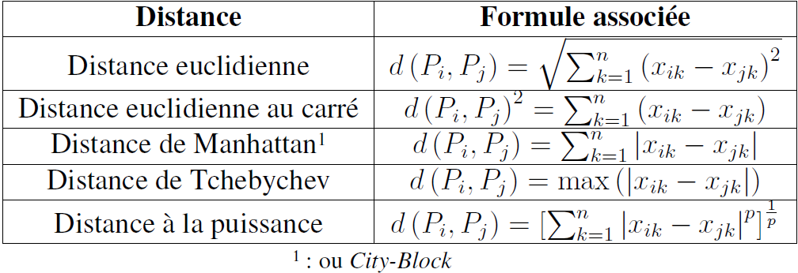
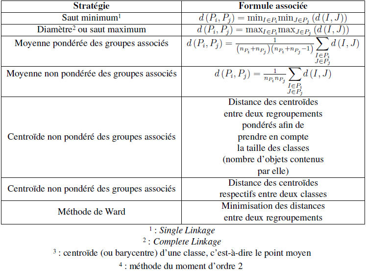
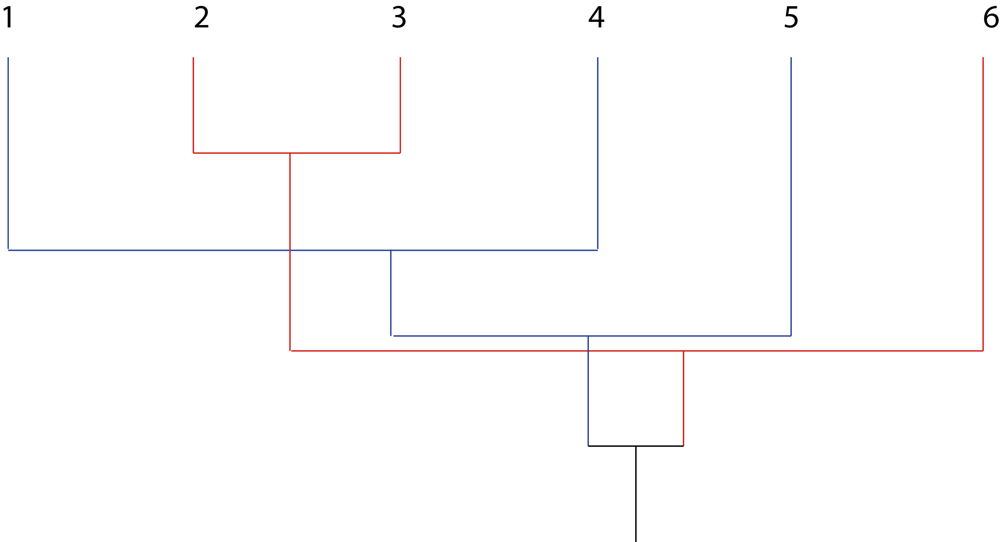

# Les classifications automatiques

Une classification automatique[^1] est une **analyse factorielle d'un tableau de dissimilarité**[^2] [^3] [^4] [^5] [^6] [^7]. Elle sert à recherche une partition d'un ensemble d'individus en **groupes homogènes et distincts**[^8]. Elle permet de :

1. mettre en évidence une structure simple (partitionnement ou hiérarchie de groupes) dans un ensemble de données ;

2. résumer un ensemble de données par les représentants des groupes (prototypes), éventuellement à plusieurs niveaux hiérarchiques.

Une méthode de classification est une méthode permettant de créer des typologie. De fait, elle fait partie d'une science beaucoup plus large, appelée la **taxinomie**.

Pour une classification, les données possibles sont :

- les données quantitatives (ou numériques) ;

- les données qualitatives (ou catégorielles) ;

> [!NOTE]
> Elles nécessitent souvent, au préalable, une A.C.M.

- les données mixtes (binaires, nominales, ordinales et continues).

Il existe deux types de tableau de données :

1. soit un tableau des distances ou des dissimilarités entre $n$ individus ;

2. soit un tableau des coordonnées factorielles des individus sur $p$ axes.

On parle de classification automatique si aucune information n'est disponible concernant l'appartenance de certaines classes connues *a priori*.

On peut distinguer les méthodes de classification automatique en fonction de leur objectif.

1. Obtenir un **partitionnement des données**. « Les **méthodes non hiérarchiques** [...] produisent directement une **partition** en un nombre fixé de classes »[^9] (p. 48).

2. Obtenir une **hiérarchie de regroupement**. « Les **méthodes hiérarchiques** [...] produisent des suites de partitions en classes de plus en plus vastes à l'image des célèbres classifications des zoologistes en espèces, genres, familles, ordre, *etc*. »[^9] (p. 48)

    - Elle fournit une information plus riche concernant la structure de similarité des données.
    
    - À partir de la hiérarchie, il est facile d'extraire plusieurs partitionnements à des niveaux de granularité différents.

On peut distinguer les méthodes de classification automatique en fonction de la représentation des données :

1. les partitions dans lesquelles chaque individu est affecté à une classe et une seule ;

2. les hiérarchies dans lesquelles une classe se divise en sous-classes. Il s'agit d'un ensemble de partitions emboîtées ;

3. les représentations vectorielles ;

4. les représentations par un arbre indicé ;

5. les arbres additifs. Ce sont des structures dont les nœuds terminaux sont les individus classés et les nœuds intérieurs, les classe ;

6. les pyramides qui permettent des empiétements entre les classes.

On peut distinguer les méthodes de classification automatique en fonction de la nature des groupes recherchés.

1. Sont-ils mutuellement exclusifs ou non ,

2. Sont-ils « nets » ou « flous » ?

    - « Net[^10] » signifie qu'une observation appartient ou n'appartient pas à un groupe.
    
    - « Flou[^11] » signifie qu'une observation peut appartenir à différents degrés à plusieurs groupes.

> [!NOTE]
> Les extensions floues peuvent avoir une convergence plus robuste vers une solution que les méthodes nettes de départ. Il est possible de passer des groupes flous nets en affectant chaque donnée (ou observation) au groupe auquel elle appartient **le plus**.

On peut distinguer les méthodes de classification automatique en fonction du **critère de regroupement**.

1. Rechercher des groupes compacts relativement éloignés entre eux.

2. Rechercher des groupes denses, non nécessairement compacts, séparés par des régions moins denses.

> [!NOTE]
> Le critère de regroupement peut être **implicite**. Pourtant, son impact est majeur sur les résultats obtenus.

## Principes généraux

Soit un tableau de données, soit centrées, soit centrées réduites, comportant $n$ individus et $p$ variables, faire une classification automatique consiste à **rechercher une typologie** (ou une segmentation). On obtient ainsi une partition (ou répartition) des $n$ individus dans des **classes** sur la base de l'observation de $p$ **descripteurs**.

> [!NOTE]
> Le nombre de groupes recherché peut être connu *a priori* ou non.

Pour y parvenir, il faut que chaque classe soit la plus **homogène possible**, mais, entre chacune des classes, elles doivent être les plus **distinctes possibles** par rapport à un **critère à définir**. En général, on choisit une **distance**[^12] ou une **dissimimarité**. Mathématiquement, une distance $d$ entre deux éléments dans un ensemble $E$ vérifie trois conditions :

1. $d \left( a, b \right) = 0 \Leftrightarrow a = b$ ;

2. $d \left( a, b \right) = d \left( b, a \right)$ (relation de symétrie) ;

3. $d \left( a, b \right) \leq d \left( a, c \right) + d \left( b, c \right)$ (inégalité triangulaire).  

Si la condition de l'inégalité triangulaire n'est pas respectée, alors $d$ est une dissimilarité.

Il est possible d'ajouter une quatrième condition. On parle alors de **distance ultramétrique**.

$d \left( x, y \right) = \max \left\lbrace d \left( x, y \right), d \left( y, z \right)  \right\rbrace$

**Il est équivalent de munir un ensemble fini** $E$ **d'une ultramétrique ou de définir une hiérarchie indicée de parties de cet ensemble**.

Toute classification[^13] cherche à classer $n$ éléments.

1. On recherche les deux éléments les plus proches au sens de la distance $d$ de l'espace considéré, c'est-à-dire construire une **mesure d'éloignement** (Tab 1).

 
**Tableau 1. Principales distances utilisées lors de la mise en oeuvre des méthodes de classification**

2. On fixe la **stratégie d'agrégation** en choisissant la distance $d$ la plus pertinente, c'est-à-dire le **critère d'homogénéité** (Tab 2).

**Tableau 2. Principales stratégies utilisées lors de la mise en œuvre des méthodes de classification**

3. Un **algorithme** va regrouper deux à deux les éléments les plus proches et faire tourner une boucle jusqu'à ce que tous les éléments soient hiérarchisés en une classe unique. Ce regroupement peut être visualisé sous la forme d'un **dendrogramme**, c'est-à-dire d'un arbre indicé.

4. Pour finir, il faut choisir le **nombre de classes** afin de parvenir à une interprétation.

Si, pour les méthodes factorielles en composantes principales ou de correspondances, le détail des calculs a pu être mis en avant. Ici, hormis quelques éléments, il est impossible de détailler l'intégralité des calculs présents dans tel ou tel algorithme, car chacun d'eux nécessiterait un cours très détaillé. Il faut retenir le nom des méthodes et des algorithmes qui leur sont associés.

### La mesure d'éloignement

Sans surprise, le choix d'une mesure d'éloignement dépend de la nature des descripteurs. La mesure la plus utilisée reste la distance euclidienne.

### Le critère d'homogénéité

Le critère d'homogénéité le plus utilisé est la variance (ou l'inertie) des classes. On calcule les inerties intra-classes et inter-classes. À partir d'elles, on retient un critère d'optimisation.

### L'algorithme de partitionnement

Soit une partition arbitraire en $k$ classes, $k$ choisi, l'algorithme de partitionnement améliore **itérativement** jusqu'à la **convergence du critère retenu**.

Dans le cadre des classifications non hiérarchiques, il existe plusieurs algorithmes possibles :

- la méthode des centres mobiles (1965) ;

- la méthode des $k$-moyennes (1967) ;

- la méthode des nuées dynamiques (1971) ;

- la méthode des $k$-médoïdes (1990).

Dans le cadre des classifications hiérarchiques, il existe plusieurs algorithmes possibles :

- la méthode du saut minimum ;

- la méthode du diamètre ;

- la méthode de J. H. Ward.

## Classifications non hiérarchiques

### La méthode de la classification autour de centres mobiles (C.C.M.)

La méthode de la classification autour de centres mobiles (C.C.M.) a été inventée en 1965 par E. W. Forgy[^14] [^15].

On initialise l'algorithme par un choix aléatoire de $k$ points de l'espace correspondant aux centres des classes.

Le critère à minimiser est l'inertie intra-classe.

Il faut itérer les deux étapes suivantes jusqu'à ce que le critère à minimiser ne décroisse plus de manière significative (minimum local), ou bien jusqu'à atteindre un nombre d'itérations fixées. \begin{inparaenum} \item Tous les individus sont affectés à la classe dont le centre est le plus proche au sens de la distance d'éloignement choisie. On construit ainsi $k$ classes d'individus. \item On calcule les barycentres des classes créées qui deviennent les $k$ nouveaux centres. \end{inparaenum}

Dans le détail, à partir d'un ensemble de $n$ individus $x_i$ de masses respectives $m_i$ telles que $\sum_{i = 1}^{n} m_i = 1$ d'un ensemble $E$ muni d'une distance $d$, on cherche à constituer des groupes en classes d'individus (homogènes et distinctes) en nombre $k$ que l'on se fixe *a priori*.

- **Étape 0** On tire $k$ individus au hasard et sans remise dans l'ensemble $E$. Les individus déterminés représentent $k$ centres provisoires de classes qui forment l'ensemble :

$C^{\left( 0 \right)} = \left\lbrace C_1^0, C_2^0, \ldots{}, C_k^0 \right\rbrace$

Ces $k$ centres induisent, par affectation des individus au centre le plus proche, une partition $P^{\left( 0 \right)}$ de $E$ en $k$ classes : $P_1^0$, $P_2^0$, \ldots{}, $P_k^0$

- **Étape 1** On calcule les centres de gravité des différentes classes de $P$. Ils constituent un ensemble de $k$ nouveaux centres de classes :

$C^{\left( 1 \right)} = \left\lbrace C_1^1, C_2^1, \ldots{}, C_k^1 \right\rbrace$

En utilisant le même principe que pour $P^{\left( 0 \right)}$, on obtient une nouvelle partition $P^{\left( 1 \right)}$ de l'ensemble $E$ :

$P^{\left( 1 \right)} = \left\lbrace P_1^1, P_2^1, \ldots{}, P_k^1 \right\rbrace$

- **Étape** $m$ À cette étape, on détermine les $k$ centres $C_1^m$, $C_2^m$, \ldots{}, $C_k^m$ des classes respectives de la partition de $E$ obtenues à l'étape $m - 1$ soit :

$P^{\left( m - 1 \right)} = \left\lbrace P_1^{m - 1}, P_2^{m - 1}, \ldots{}, P_k^{m - 1} \right\rbrace$

Ces nouveaux centres induisent la partition $P^{\left( m \right)}$, et ainsi de suite... On arrête l'algorithme lorsque deux itérations successives fournissent la même partition.

À chaque étape $m$, on calcule la variance intra-classe $V_m$ de la partition $P^{\left( m \right)}$ obtenue :

$V_m = \sum_{r = 1}^{k} \left\lbrace \sum_{x \in P_i^m}^{} m_i d^2 \left( x_i, C_r^{m + 1} \right) \right\rbrace$

À chaque nouvelle itération, la variance intra-classe $V_m$ ne peut que décroître, c'est-à-dire $\forall m \in \mathbb{N}, V_m \geqslant V_{m + 1}$. Le processus itératif construit une suite de nombre positifs décroissants. Il converge vers une partition sub-optimale.

En pratique, l'algorithme est arrêté lorsque le critère $v_m$ cesse de décroître de façon sensible, ou après un nombre d'itérations fixé *a priori*.

En général, la partition finale constitue un optimum local, car elle dépend du choix initial des centres.

La méthode de la C.C.M. cumule deux inconvénients.

1. Le nombre de classes doit être fixées.

2. La partition obtenue dépend du tirage au hasard des individus au départ de la procédure.

Pour conclure, **on ne peut pas se contenter des classes issues d'une C.C.M.** Pour éviter l'instabilité des résultats, il est nécessaire d'ajouter une étape.

### La méthode des $k$-moyennes

La méthode des $k$-moyennes a été inventée en 1967 par James MacQueen[^16] [^17].

Dans ce cadre, les barycentres des classes ne sont pas recalculés à la fin des affectations, mais à la fin de chaque allocation d'un individu à une classe.

> [!NOTE]
> L'ordre des apparitions des individus n'est pas neutre.

De manière plus mathématique, soit un ensemble $E$ de $n$ données décrites par $p$ variables à valeurs dans $\mathbb{R}$ et d'une distance sur ${\mathbb{R}}^p$.

Pour regrouper ces données en $k$ groupes disjoints $E_1$, $E_2$, \ldots{}, $E_k$, inconnus *a priori*, on utilise le critère correspondant à la somme des inerties intra-classes des groupes ${\phi}_E \left( \mathcal{C} \right)$

${\phi}_E \left( \mathcal{C} \right) = \sum_{j = 1}^{k} \sum_{x_i \in E_j}^{} d^2 \left( x_i, m_j \right)$

avec $\mathcal{C} = \left\lbrace m_j, 1 \leq j \leq k \right\rbrace$ l'ensemble des centres de gravité des $k$ groupes.

Pour $E$ et $k$ donnés, plus la valeur de ${\phi}_E \left( \mathcal{C} \right)$ est faible, plus les groupes sont compacts autour de leurs centres, donc **la qualité du partitionnement obtenu est meilleur**.

La somme des inerties intra-classes peut également s'écrire :

${\phi}_E \left( \mathcal{C} \right) = \sum_{1 \leq l \leq n}^{} d^2 \left( x_{\mathcal{l}}, m_{\mathcal{C} \left( \mathcal{l} \right)} \right)$

avec $\mathcal{C} \left( \mathcal{l} \right)$ l'indice du groupe dont fait partie $x_{\mathcal{l}}$. Elle permet de comprendre que, pour un ensemble $E$ donné, les variables dont dépend la valeur du critère sont les positions des centres $\left\lbrace m_j, 1 \leq j \leq k \right\rbrace$.

Trouver le minimum global de la fonction ${\phi}_E \left( \mathcal{C} \right)$ est un problème NP-difficile, mais on dispose d'algorithmes de complexité polynomiale dans le nombre de données $n$ qui produisent une solution générale sous-optimale. L'algorithme utilisé est celui des centres mobiles.

1. Initialisation aléatoire des centres $\left\lbrace m_j, 1 \leq j \leq k \right\rbrace$

2. Recherche d'un centre stable
    
    1. Affectation de chaque donnée au groupe du centre le plus proche
    
    2. Remplacement des centres de gravité des groupes

La valeur ${\phi}_E \left( \mathcal{C} \right)$ diminue lors de chacune des étapes du processus itératif.

1. Affectation de chaque donnée au groupe du centre le plus proche : $x_i$ passe du groupe de centre $m_p$ au groupe de centre $m_q$ si $d^2 \left( x_i, m_p \right) > d^2 \left( x_i, m_q \right)$, donc :

$d^2 \left( x_i, m_p \right) + \sum_{\mathcal{l} \neq i}^{} d^2 \left( x_{\mathcal{l}}, m_{\mathcal{C} \left( \mathcal{l} \right)} \right) > d^2 \left( x_i, m_q \right) + \sum_{\mathcal{l} \neq i}^{} d^2 \left( x_{\mathcal{l}}, m_{\mathcal{C} \left( \mathcal{l} \right)} \right)$

2. Remplacement des anciens centres par les centres de gravité des groupes : si ${\hat{m}}_j$ est l'ancien centre du groupe $j$ et $m_j$ le nouveau alors :

$\sum_{x_i \in E_j}^{} d^2 \left( x_i, {\hat{m}}_j \right) \geq \sum_{x_i \in E_j}^{} d^2 \left( x_i, m_j \right)$

Comme ${\phi}_E \left( \mathcal{C} \right) \geq 0$, le processus itératif doit converger. La solution obtenue sera un minimum local, dépendant de l'initialisation, bien plus élevé que la valeur correspondant au minimum global inconnu.

### La méthode des nuées dynamiques

La méthode des nuées dynamiques[^18] a été inventée en 1971 par Edwin Diday[^19] [^20].

Dans ce cadre, ce n'est plus un seul point qui représente une classe, mais un noyau de points constitués d'éléments représentatifs de la classe. Cela a pour objectif de corriger l'influence d'éventuelles valeurs extrêmes sur le calcul du barycentre.

Mathématiquement, il s'agit de déterminer une partition d'un ensemble $E$ en $k$ parties homogènes et distinctes. $E$ est un ensemble fini d'éléments de cardinal $n$ muni d'une distance $d$ mesurant la ressemblance entre éléments deux à deux.

On suppose que :

$D \left( A, B \right) = \sum_{x \in A}^{} \sum_{y \in B}^{} d \left( x, y \right)$

avec $A$ et $B$ deux parties de $E$. Le nombre $k$ de classes à former est fixé *a priori* tel que $k < n$.

On choisit au hasard dans $E$ de $k$ sous-ensembles $N_1^0$, $N_2^0$, \ldots{}, $N_k^0$ tels que :

$\forall r = 1, \ldots{}, k, \mathrm{card } \left( N_r^0 \right) = q$

avec $q \approx \frac{n}{k}$, et

$\forall r \neq s = 1, \ldots{}, k, N_r^0 \cup N_s^0 = \varnothing$

avec $k$ et $q$ des entiers fixés.

$\left\lbrace N_1^0, N_2^0, \ldots{}, N_k^0 \right\rbrace$ constitue une famille de noyaux de $E$.

La méthode des nuées dynamiques commence par définir deux fonctions : la fonction d'affectation $f$ et la fonction de représentation $g$. Par la suite, on peut appliquer l'algorithme des nuées dynamiques et définir le critère à optimiser.

#### La fonction d'affectation $f$

La fonction d'affectation $f : N_r^0 \rightarrow P_r^0 \subset E$ est définie telle que :

$P_r^0 = \left\lbrace x \in E :  D \left( x, N_r^0 \right) \leq D \left( x, N_1^0 \right) \ r \neq s = 1, \ldots{}, k \right\rbrace$

$P^{\left( 0 \right)} = \left\lbrace P_1^0, P_2^0, \ldots{}, P_k^0 \right\rbrace$ constitue une partition de $E$.

#### La fonction de représentation $g$

La fonction d'affectation $g : P_r^0 \rightarrow N_r^0$ est définie telle que :

$\forall r = 1, \ldots{}, k, \mathrm{card } \left( N_r^1 \right) = q$
    
$\sum_{x \in N_r^1}^{} D \left( x, P_r^0 \right) = \min \left\lbrace \sum_{x \in A}^{} D \left( x, P_r^0 \right) ; A \subset E, \mathrm{card } \left( A \right) \right\rbrace$

On suppose que l'ensemble $N_r^0$ des $q$ éléments de $E$ qui minimise $\sum_{x \in N_r^{\mathcal{l}}}^{} D \left( x, P_r^0 \right)$ pour tout $P_r^0 \subset E$ existe et est unique.

#### L'algorithme des nuées dynamiques

Il alterne l'application de $f$ et de $g$.

$N^{\left( 0 \right)} \xrightarrow{f} P^{\left( 0 \right)} \xrightarrow{g} N^{\left( 1 \right)} \xrightarrow{f} P^{\left( 1 \right)} \xrightarrow{g} N^{\left( 2 \right)} \xrightarrow{f} \ldots{}$

#### Le critère à optimiser

$u_i W \left( N_r^i, P_r^i \right) = \sum_{r = 1}^{k} D \left( N_r^i, P_r^i \right)$ à la $i$-ième itération.

#### La convergence de l'algorithme

Le nombre de valeurs que peut prendre $u_i$ est fini.

- Le nombre de partitions $P_n^k$ de $E$ en $k$ sous-ensembles non vides est fini :

$P_n^k = P_{n - 1}^{k - 1} + k P_{n - 1}^{k}$

- Le nombre de famille de $k$ noyaux associés possibles est fini $\frac{n!}{\left( q! \right)^k \left( n - kq \right)!}$

La suite $\left\lbrace u_i \right\rbrace$ est convergente, car :

$D \left( N_r^{i + 1}, P_r^i \right)  = \min \left\lbrace D \left( A, P_r^i \right) ; A \subset E, \mathrm{card } \left( A \right) = q \right\rbrace$

$\sum_{r = 1}^{k} D \left( N_r^{i + 1}, P_r^i \right) \leq \sum_{r = 1}^{k} D \left( N_r^i, P_r^i \right) = u$

$u_{n + 1} = \sum_{r = 1}^{k} \sum_{y \in P_r^{i + 1}}^{} D \left( y, N_r^{i + 1} \right) \leq \sum_{r = 1}^{k} \sum_{y \in P_r^i}^{} D \left( y, N_r^{i + 1} \right)$

ce qui entraîne $\forall i \in _mathbb{N}, u_{i + 1} \leq u_i$.

$\left\lbrace u_i \right\rbrace$ est positive et décroissante.

$\Rightarrow$ $\left\lbrace u_i \right\rbrace$ est convergente sur un ensemble fini.

$\Rightarrow$ $\left\lbrace u_i \right\rbrace$ atteint sa limite $m$.

Par conséquent, il existe $n_0$ tel que, $\forall i > n_0, u_i = m$

$P^{\left( n_0 \right)} = f \left[ N^{\left( n_0 \right)} \right]$

et

$N^{\left( n_0 \right)} = g \left[ P^{\left( n_0 \right)} \right]$

Le processus itératif converge vers une partition sub-optimale en un nombre fini d'itérations.

### La méthode des $k$ médoïdes

Le **médoïde** d'un groupe est l'élément le plus « central » du groupe, c'est-à-dire celui pour lequel la somme des distances aux autres éléments du groupe est la plus faible.

L'algorithme est le même que les $k$-moyennes en remplaçant les centres de gravité par les médoïdes [^21] [^22].

1. Choix aléatoire de $k$ données comme médoïdes

2. Recherche d'un médoïde stabilisé
    
    1. Choix du médoïde $ù_{\mathcal{C} \left( \mathcal{l} \right)}$ le plus proche pour chaque donnée

$\mathcal{C} \left( \mathcal{l} \right) = \arg {\min}_j d \left( x_{\mathcal{l}}, m_j \right)$
    
    2. Constitution des groupes : $E_j$ est constitué de tous les $x_i$ qui sont plus proches de $m_j$ que tout autre médoïde
    
    3. Recherche des médoïdes de ces nouveaux groupes :

$m_j = \arg {\min}_{x_{\mathcal{l}} \in E_j} \sum_{x_p \in E_j}^{} d \left( x_{\mathcal{l}}, x_p \right)$

L'algorithme cherche à minimiser un coût total qui est la somme des distances entre les données et les médoïdes des groupes auxquels ces données sont assignées.

L'initialisation a un impact important sur la qualité de la solution (c'est-à-dire du minimum local obtenu), et sur la rapidité de la convergence (c'est-à-dire le nombre d'itérations nécessaire).

L'application de $k$-médoïdes à des données vectorielles en utilisant la même métrique euclidienne que $k$-moyennes, met en évidence une meilleure robustesse de $k$-médoïdes par rapport à $k$-moyennes. En effet, les médoïdes sont moins affectés que les centres de gravité par les données excentrées, ce qui les rend plus robustes.

La complexité algorithmique est plus grande que les $k$-moyennes.

### Remarques générales sur les méthodes de classification non hiérarchique

1. Les algorithmes font diminuer l'inertie inter-classe à chaque itération, ce qui engendre une convergence.

2. Le nombre d'itérations nécessaires est très faible.

3. Le minimum obtenu est un minimum local. Dit autrement, **la répartition en classes dépend du choix initial des centres**. Cela nécessite de faire tourner l'algorithme plusieurs fois pour identifier des formes fortes.

4. **Le nombre de classes est fixé par avance**.

## Classification ascendante hiérarchique (C.A.H.)

La classification ascendante hiérarchique est une méthode très répandue en géographie. Il s'agit de **fournir un ensemble de partitions de moins en moins fines** obtenues par regroupement successif de parties. Une fois cet algorithme terminé, on ne récupère pas directement une partition, mais une **hiérarchie de partitions** en $n$, \ldots{} 1 classes avec une diminution de l'inertie inter-classe à chaque agrégation. C'est la technique des agrégations successives.

L'initialisation consiste à définir les classes initiales par les $n$ individus. On calcule leur distance deux à deux. Le résultat est une matrice.

Il faut itérer les deux étapes suivantes jusqu'à l'agrégation en une seule classe. \begin{inparaenum} \item Il faut regrouper les deux classes les plus proches au sens de la distance entre groupes choisie. Il faut mettre à jour le tableau de distances en remplaçant les deux classes regroupées par la nouvelle et en calculant sa distance avec chacune des autres classes. \end{inparaenum}

Il est nécessaire de définir une distance entre groupes d'individus, appelée la **stratégie d'agrégation**. Il faut choisir le nombre de classes à retenir :

- par le saut de Ward

$\Delta \left( P_i, P_j \right) = \frac{p_{P_i} p_{P_j}}{p_{P_i} + p_{P_j}} d^2 \left( G_{P_i}, G_{P_j} \right)$

avec $G$ le centre de gravité ; $p$ le pois de la classe ;

- par la méthode du saut minimum qui est peu utilisée, car elle engendre un groupe important et plusieurs petits groupes ;

- par la méthode du diamètre qui crée des groupes de taille égale ;

- par la méthode de J. H.  Ward qui engendre une agrégation à chaque itération. Dit autrement, elle fait perdre le moins d'inertie inter-classe. De fait, l'optimisation s'effectue pas à pas. Elle ne dépend pas d'un choix initial arbitraire. La **méthode de J. H. Ward**[^23] utilise une analyse de la variance approchée afin d'évaluer la distance entre les classes [^24]. Elle cherche à minimiser la somme des carrés de tous les couples hypothétiques pouvant être formés à chaque étape. Les indices d'agrégation sont recalculés à chaque étape de la manière suivante : si une classe $M$ est obtenue en regroupant les classes $K$ et $L$, sa distance à la classe $J$ est donnée par :

$d \left( M, J \right) = \frac{\left( n_J + n_K \right) d \left( K, J \right) + \left( n_J + n_L \right) d \left( L, J \right) - n_J d \left( K, L \right) }{n_J + n_K + n_L}$

avec $n_J$, $n_K$ et $n_L$ le nombre d'éléments de chaque classe. Cette technique revient à **choisir de regrouper les deux individus les plus proches tels que la paire de points dont l'agrégation entraîne la diminution minimale de l'inertie du nuage**.

La méthode de Ward présente trois inconvénients.

1. L'algorithme est lent.

2. On n'obtient pas un optimum si le nombre de pas $n - p$ est trop élevé.

3. La C.A.H. est peu robuste. Elle est sensible aux valeurs extrêmes, c'est-à-dire qu'il suffit de modifier une distance pour que le saut soit modifié.

La **hiérarchie de partie d'un ensemble** $E$, $H_E$, est un sous-ensemble $\mathcal{P} \left( E \right)$ des parties de $E$ ayant les propriétés suivantes.

1. L'ensemble $E$ est un élément de $H_E$.

2. $\forall i \in E, \left\lbrace i \right\rbrace \in H_E$

3. $\forall h \in H_E, \forall h' \in H_E, h \cap h' = \left\lbrace \varnothing, h, h' \right\rbrace$

Par exemple, si $E = \left\lbrace 1, 2, 3, 4, 5, 6 \right\rbrace$ alors $\mathcal{P} \left( E \right) = \left\lbrace \left\lbrace 1 \right\rbrace, \left\lbrace 2 \right\rbrace, \left\lbrace 3 \right\rbrace, \left\lbrace 4 \right\rbrace, \left\lbrace 5 \right\rbrace, \right.$ $\left. \left\lbrace 6 \right\rbrace, \left\lbrace 1, 5 \right\rbrace, \left\lbrace 2, 3 \right\rbrace, \left\lbrace 1, 4, 5 \right\rbrace, \left\lbrace 2, 3, 6 \right\rbrace, E \right\rbrace$ est une hiérarchie de parties de $E$\\ (Fig. \ref{chap18fig1}).

**Figure 1. Exemple de hiérarchie de parties d'un ensemble $E$**

Une **hiérarchie de parties indicées** est une hiérarchie de parties $H$ à laquelle est associée une échelle d'indices qui satisfait à la propriété suivante. À tout $h$ élément de $E$ est associé un nombre $v \left( h \right) \geq 0$ tel que : si $h \subset h'$, alors $v \left( h \right) < v \left( h' \right)$

L'**arbre hiérarchique indicé** associé à $H_E$ permet de visualiser graphiquement l'ensemble des éléments de la hiérarchie de partie $H_E$ organisées suivant l'inclusion.

Toute **coupure** de l'arbre par une droite horizontale fournit une **partition** de l'ensemble $E$.

La hiérarchie de parties indicées $H_E$ fournit une chaîne de partitions.

$H_1 = \left\lbrace \left\lbrace 1 \right\rbrace, \left\lbrace 2 \right\rbrace, \left\lbrace 3 \right\rbrace, \left\lbrace 4 \right\rbrace, \left\lbrace 5 \right\rbrace, \left\lbrace 6 \right\rbrace \right\rbrace$

$H_2 = \left\lbrace \left\lbrace 1, 5 \right\rbrace, \left\lbrace 2 \right\rbrace, \left\lbrace 3 \right\rbrace, \left\lbrace 4 \right\rbrace, \left\lbrace 6 \right\rbrace \right\rbrace$

$H_3 = \left\lbrace \left\lbrace 1, 4, 5 \right\rbrace, \left\lbrace 2 \right\rbrace, \left\lbrace 3 \right\rbrace, \left\lbrace 6 \right\rbrace \right\rbrace$

$H_4 = \left\lbrace \left\lbrace 1, 4, 5 \right\rbrace, \left\lbrace 2, 3 \right\rbrace, \left\lbrace 6 \right\rbrace \right\rbrace$

$H_5 = \left\lbrace \left\lbrace 1, 4, 5 \right\rbrace, \left\lbrace 2, 3, 6 \right\rbrace \right\rbrace$

$H_6 = \left\lbrace \left\lbrace 1, 2, 3, 4, 5, 6 \right\rbrace \right\rbrace$

L'arbre hiérarchique permet de disposer d'un grand nombre de partitions.

La construction d'un arbre hiérarchique indicé requiert l'utilisation :

1. d'un critère d'agrégation qui est une règle de calcul des écarts entre deux sous-ensembles $h$ et $h'$ disjoints de l'ensemble $E$ des éléments à classer ;

2. d'une procédure d'agrégation permettant d'ériger le système de classes emboîtées.

La C.A.H. présente deux inconvénients.

1. Comment choisir une coupure significative ?

2. L'arbre hiérarchique obtenu n'est pas un arbre optimal, car la partition construite à un niveau donné dépend de la partition obtenue à l'étape précédente.

## Classification mixte

Avec une classification mixte[^25], il s'agit de résoudre les inconvénients des C.C.M. et des C.A.H. en combinant les deux méthodes.

1. On effectue une C.C.M. autour d'un nombre important de centres mobiles. Il s'agit de rechercher des **regroupements stables**.

2. On construit un arbre hiérarchique à partir des classes formées dans cette C.C.M.

## Complémentarité entre A.C.P. et classification

L'A.C.P. est un outil pour analyser les corrélations entre plusieurs variables. Elle permet d'obtenir de nouvelles variables non corrélées à forte variance, à fort pouvoir informatif. Toutefois, elle rencontre quelques inconvénients.

1. Elle permet de visualiser la structure des corrélations, mais ces visualisations ne sont réalisables que sur des plans, ce qui limite la perception précise des phénomènes si les variables sont nombreuses et leurs relations complexes.

2. La contrainte d'orthogonalité des axes rend souvent l'interprétation délicate au-delà du premier plan factoriel, car des informations délivrées sont alors résiduelles, sachant les proximités déjà observées sur les axes précédents.

En comparaison, les méthodes de classification prennent en compte l'ensemble des dimensions du nuage. Elles corrigent les distorsions des projections factorielles, en appréhendant les individus tels qu'ils sont en réalité, et non tels qu'ils apparaissent en projection.

On peut alors combiner A.C.P. et classifications. Il s'agit de **faire figurer sur les projections factorielles du nuage des individus la partition obtenue par classification**. Les classes sont figurées par leur barycentre, ou par leur enveloppe. On peut remplacer chaque point projeté par le code de sa classe d'appartenance, si le nombre de points est assez restreint.

Plus généralement, les méthodes de classification sont complémentaires des analyses factorielles. En effet, les objectifs de la classification sont de regrouper les individus décrits par un ensemble de variables, ou de regrouper les variables observées sur des individus et d'interpréter ces regroupements par une synthèse des résultats. Il s'agit de classer les individus **en conservant leur caractère multidimensionnel**.

> [!WARNING]
> **Il n'existe pas de solutions mathématiques exactes**. D'un point de vue technique, on utilise des mathématiques discrètes avec des solutions approchées.

## Classification floue

À venir

## Classification spectrale

La **classification spectrale** cherche à obtenir un partitionnement des données en groupes à partir d'une représentation de ces données sous la forme d'un graphe de similarités.

Un **graphe de similarités** est un graphe dans lequel chaque sommet correspond à une donnée, et chaque arête qui relie deux observations est pondérée par la similarité entre ces observations.

Mathématiquement, soit un ensemble $E = \left\lbrace x_i, 1 \leq i \leq M \right\rbrace$ de $n$ données décrites par la matrice de similarité $S$ telle que l'élément $s_{ij} \geq 0$ soit la similarité entre $x_i$ et $x_j$. L'objectif de la classification spectrale est de répartir les $n$ données de $E$ en $k$ groupes disjoints $E_1$, \ldots{}, $E_k$, inconnus *a priori*, tels que les similarités soient fortes intra-groupes et faibles inter-groupes.

La méthode de classification spectrale procède en trois étapes.

1. À partir de $S$, un graphe de similarité est obtenu.

2. À l'aide du graphe, une représentation vectorielle « convenable » des données est obtenues.

3. Un algorithme de classification de base, comme celui des $k$-moyennes, est appliqué pour obtenir $k$ groupes disjoints $E_1$, \ldots{}, $E_k$.

Le graphe de similarités est non orienté. Les poids sont définis par une matrice des poids $\mathbf{W}$. On utilise une matrice laplacienne et une marche aléatoire pour constituer les groupes.

## Classification avec des cartes auto-organisées

Les **cartes auto-organisées**[^26] furent introduites par Teuvo Kohonen[^27] [^28].

Ce sont des partitions dont les classes sont présentées sur une **grille** rectangulaire ou octogonale. La position des classes sur la grille reflète, tant que faire se peut, les **proximités entre les classes**.

L'algorithme associée est analogue à celui des **centres mobiles**, mais il conserve la **topologie de l'espace** des objets à classer.

L'intérêt des cartes est double.

1. Elles permettent la reconnaissance des formes selon des techniques non linéaires.

2. Elles constituent de bons outils de visualisation.

3. Elles sont utilisées :
    
    - en analyse de textes ;
    
    - pour des diagnostics médicaux ;
    
    - pour des diagnostics industriels ;
    
    - pour le contrôle des processus ;
    
    - pour le contrôle de robotique.

Une carte auto-organisée est un **réseau de neurones** traduit sous la forme d'une grille aux **mailles déformables**. Les **neurones** (ou les cellules) de la grille constitue des classes. La carte s'efforce de conserver la topologie des objets. **Plus les objets se ressemblent, plus ils seront proches**.

Soit un ensemble de $n$ individus ou objets, chacun décrit par $p$ variables, alors on considère un nuage de points représentés par une matrice $\mathbf{X}$ d'ordre $\left( n, p\right)$. On a un réseau de $k$ neurones. Les entrées sont les $n$ individus à classer. Un neurone $u_j$ est un vecteur défini dans l'espace ${\mathbb{R}}^p$ par un vecteur poids ou un vecteur-code, $C_j \left( j = 1, \ldots{}, k \right)$.

À l'initialisation de l'algorithme, le vecteur-code est tiré au hasard parmi les objets à classer. On fixe le nombre de neurones $k$, c'est-à-dire le nombre de classes souhaité. On définit une **distance** $d$ entre objets et neurones, et un **système de voisinage** entre neurones qui rend compte de la topologie du réseau. À chaque neurone $u_j$ est attribué un voisinage $V_r \left( u_j \right)$ de rayon $r$ formé de l'ensemble des neurones situées sur le réseau à une distance inférieure ou égale à $n$. Ces voisinages peuvent être définis par de nombreuses méthodes. La plus courante est un **voisinage contigu sur une grille rectangulaire**.

À chaque itération $t$, un objet $x_i$ est tiré **aléatoirement** et est classé selon la **méthode du plus proche voisin**. $x_i$ appartient à la classe $u_j$ si et seulement si le vecteur poids $C_j$ est le plus proche de $x_i$ parmi tous les autres vecteurs-codes. On détermine ce que l'on appelle le **neurone gagnant** $u_{k_0}$. son vecteur poids $C_k \left( t \right)$ est recalculé, mis à jour, ainsi que ceux de ses voisins ce qui permet de rapprocher le neurone gagnant et ses voisins de l'objet à classer. C'est le code de la classe gagnante qui est modifiée, déformant à chaque étape la carte des neurones.

$C_k \left( t \right) = C_k \left( t - 1 \right) + h \left( t \right) \left( x_i - C_k \left( t - 1 \right) \right)$

avec $C_k \left( t - 1 \right)$ le vecteur-code associé à la classe $k$ pour l'étape précédente, $x_i$ l'objet présenté à l'itération $t$, $h \left( t \right)$ un paramètre d'adaptation positif et inférieur à 1 qui contrôle la **vitesse d'apprentissage**. Cette expression n'intervient que pour la classe gagnante **et** ses voisines. Si $u_i \notin V_t \left( u_{k_0} \right)$, alors $C_k \left( t \right) = C_k \left( t - 1 \right)$.

À l'itération $t + 1$, on tire **au hasard** un autre objet à classe. **On itère jusqu'à la convergence des neurones**, c'est-à-dire jusqu'à la stabilité de leurs vecteurs-codes traduites par :
    $\left| C_k \left( t + 1 \right) - C_k \left( t \right) \right| < \varepsilon$

**La conversation de la topologie permet de positionner toutes les classes les unes par rapport aux autres. La représentation sous la forme d'une carte rend l'interprétation facile**.

## Conclusion

Le regroupement d'objets en classes peut générer des **hypothèses à tester** dans une étape ultérieure.

Dans toutes les classifications, peu importe la méthode, il faut bien distinguer les **classes réelles** des **classes instrumentales**.

Quelle est la validité de la classification obtenue ?

- La plupart des algorithmes de classification automatique non hiérarchique convergent vers un résultat comportant en général des groupes.

    - Quelle est la significativité de ce résultat ?

    - Existe-t-il réellement des groupes dans les données ?

    - Leur nombre de groupes correspond-t-il ou non au nombre de groupes issu de l'algorithme ?
    
    - Quel algorithme donne de meilleurs résultats sur les données ?

- Comment choisir le « bon » nombre de groupes ? Les méthodes de partitionnement ne modifient pas le nombre de groupes $k$ fourni en entrée de l'algorithme. Le problème est que les informations pour le définir *a priori* sont rarement disponibles. Il est à noter que la valeur minimale que pouvait atteindre le critère, diminuait avec l'augmentation de $k$. Les valeurs sont de fait liées. Il existe trois méthodes pour choisir $k$ :
    
    1. la méthode du « coude » en observant les valeurs minimales atteintes par ${\psi}_E \left( \mathcal{C} \right)$ ;
    
    2. l'utilisation d'un cadre probabiliste qui permet d'identifier une valeur optimale pour $k$ ;
    
    3. l'étude de la stabilité des résultats. Une valeur de $k$ est meilleure si les groupes obtenus sont plus stables à l'initialisation aléatoire de l'algorithme.

- Comment mesurer la cohérence entre les classifications ? Les résultats obtenus par classification automatique sont d'autant plus significatifs que deux méthodes de classification différentes, ou deux initialisations différentes pour une même méthode sensible à l'initialisation, produisent **approximativement** les mêmes groupes. Pour mesurer la cohérence entre les résultats de deux applications différentes d'algorithmes de classification, il est possible d'employer différentes mesures :

    1. l'indice de William M. Rand[^29] [^30] ajusté ;

        - Une classification $\mathcal{C}$ est définie comme l'ensemble des paires d'observations qui sont dans un même groupe parmi toutes les paires possibles.

        - On note :

            - $n_{11}$ le nombre de paires qui sont dans un même groupe $\mathcal{C}$ et $\mathcal{C}'$ ;
            - $n_{00}$ le nombre de paires qui sont dans des groupes différents suivant $\mathcal{C}$ et $\mathcal{C}'$ ;
            - $n_{10}$ le nombre de paires dans un même groupe suivant $\mathcal{C}$ et groupes différents suivant $\mathcal{C}'$ ;
            - $n_{01}$ le nombre de paires dans un même groupe suivant $\mathcal{C}'$ et groupes différents suivant $\mathcal{C}$ ;

        - Si $\mathcal{C}$ et $\mathcal{C}'$ sont **deux classifications différentes**, l'indice de Rand est la probabilité pour que les deux classifications soient en accord pour une paire de données choisie au hasard.

        $\mathcal{R} \left( \mathcal{C}, \mathcal{C}' \right) = \frac{2 \left( n_{11} + n_{00} \right)}{n \left( n - 1 \right)}$

        avec $0 \leq \mathcal{R} \leq 1$

        - L'indice de Rand ajusté vaut :

        ${\mathcal{R}}_{\textrm{ajusté}} \left( \mathcal{C}, \mathcal{C}' \right) = \frac{\mathcal{R} - \mathbb{E} \left( \mathcal{R} \right)}{\max \left( \mathcal{R} \right) - \mathbb{E} \left( \mathcal{R} \right)}$

        avec $\mathbb{E} \left( \mathcal{R} \right)$ l'espérance de l'indice de Rand et $\max \left( \mathcal{R} \right)$ la valeur maximale que l'indice de Rand peut atteindre.

    2. l'indice de Paul Jaccard[^31] [^32] :

        $\mathcal{I} \left( \mathcal{C}, \mathcal{C}' \right) = \frac{n_{11}}{n_{11} + n_{10} + n_{01}}$

    3. l'information mutuelle normalisée ;

    $NMI \left( \mathcal{C}, \mathcal{C}' \right) = \frac{\mathcal{I} \left( \mathcal{C}, \mathcal{C}' \right)}{\sqrt{H \left( \mathcal{C} \right) H \left( \mathcal{C}' \right)}}$

    avec $\mathcal{I} \left( \mathcal{C}, \mathcal{C}' \right)$ l'information mutuelle entre $\mathcal{C}$ et $\mathcal{C}'$ et $H \left( \mathcal{C} \right)$ et $H \left( \mathcal{C}' \right)$ les entropies respectives des deux partitionnements.

- Comment obtenir une validation interne ? Dans quelle mesure les groupes identifiés sont bien « ajustés » aux données ? Il existe plusieurs critères :
    
    - le coefficient de silhouette ;
    
    - la statistique modifiée de Hubert ;
    
    - l'indice de Davis[^33]-Bouldin[^34] (1979) ;
    
    - *etc*.

- Comment obtenir une validation relative ? Il est nécessaire d'appliquer plusieurs méthodes de classification différentes et de choisir celle qui propose les meilleurs résultats.

- Comment obtenir une validation externe ? Il est possible qu'il existe des connaissances *a priori* concernant le regroupement, ou non, d'une partie des données, qui peuvent être utilisées pour évaluer les résultats de la classification automatique.

## Liens

- [Topo en format P.D.F.](./PDF/Seance-09-Chapitre-19.pdf)

## Notes de bas de page

[^1]: ou analyse typologique, ou taxinomie, ou taxonomie numérique, ou nosologie

[^2]: \cite{biblio5046}

[^3]: \cite{biblio5047}

[^4]: \cite{biblio5048}

[^5]: \cite{biblio5050}

[^6]: \cite{biblio5053}

[^7]: \cite{biblio5054}

[^8]: Les méthodes de classification « ont pour but de regrouper les individus en un nombre restreint de **classes homogènes**. Il s'agit donc de décrire les données en procédant à une réduction du nombre des individus »[^9] (p. 48)

[^9]: \cite{biblio4812}

[^10]: En anglais : *crisp*

[^11]: En anglais : *fuzzy*

[^12]: Dans certaines analyses statistiques, on parle de métrique.

[^13]: En anglais : *cluster analysis* ou *clustering*

[^14]: E. W. Forgy (?-?)

[^15]: \cite{biblio5042}

[^16]: James MacQueen (1929-2014)

[^17]: \cite{biblio5043}

[^18]: En anglais : *Dynamic Clusters Method*

[^19]: Edwin Diday (1940-2023)

[^20]: \cite{biblio4985}

[^21]: \cite{biblio5044}

[^22]: \cite{biblio5055}

[^23]: Joe H. Ward (?-?)

[^24]: \cite{biblio4793}

[^25]: En anglais : *hybrid clustering*

[^26]: En anglais : *Self-Organizing Maps* (S.O.M.)

[^27]: Teuvo Kohonen (1934-2021)

[^28]: \cite{biblio4495}

[^29]: William M. Rand (?-?)

[^30]: \cite{biblio5056}

[^31]: Paul Jaccard (1868-1944)

[^32]: \cite{biblio5057}

[^33]: David L. Davies (?-?)

[^34]: Donald W. Bouldin (?-?)
