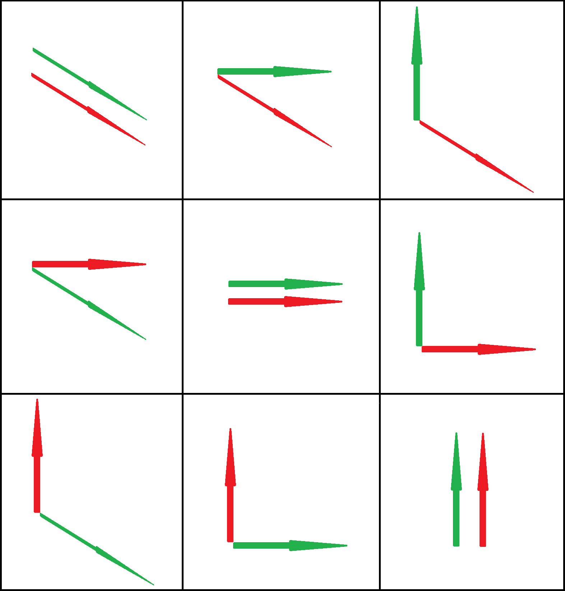

# Théorie de la corrélation. Corrélations multiple et partielle

Ce chapitre généralise la corrélation simple entre deux variables quantitatives à plusieurs variables quantitatives.

## Généralisation de l'espérance et de la variance pour $n$ variables aléatoires

Pour $n$ variables aléatoires, l'espérance d'une somme algébrique de variables aléatoires vaut :

$\mathbb{E} \left( \sum_{i = 1}^{n} X_i \right) = \sum_{i = 1}^{n} \mathbb{E} \left( X_i \right)$

Pour $n$ variables aléatoires, la variance d'une somme algébrique de variables aléatoires vaut :

$\mathbb{V} \left( \sum_{i = 1}^{n} a_i X_i \right) = \sum_{i = 1}^{n} {a_i}^2 \mathbb{V} \left( X_i \right) + 2 \sum_{{\scriptsize \begin{array}{c} i = 1\\ i \neq j \end{array}}}^{n} a_i a_j \mathrm{cov} \left( X_i, X_j \right)$

Dans ce cadre, deux variables aléatoires sont indépendantes si $\mathbb{V} \left( \sum_{i = 1}^{n} a_i X_i \right) = \sum_{i = 1}^{n} {a_i}^2 \mathbb{V} \left( X_i \right)$.

## Corrélation multiple

On appelle **corrélation multiple** la corrélation qu'il existe entre trois ou plusieurs variables.

Les principes fondamentaux qui caractérisent la corrélation multiple sont les mêmes que ceux de la corrélation simple.

Par exemple, soit $Y = a_0 + a_1 X + a_2 X^2 + \ldots{}$. Le coefficient de détermination $r^2$ correspond toujours au rapport entre la variance $Y$ expliquée par l'ensemble des régresseurs et la variance totale de $Y$. Toutefois, $r^2$ doit être corrigée s'il y a $k$ régresseurs :

${r^2}_{\textrm{corrigé}} = \frac{\left( n - 1 \right) r^2 - k}{n - k - 1} = \left\langle r^2 \right\rangle$

avec $\left\langle r^2 \right\rangle$ la moyenne des coefficients de détermination, d'où

${{\sigma}_e}^2 = \left( 1 - {r^2}_{\textrm{corrigé}} \right) {s_Y}^2$

## Notation indicée

Soient $X_1, X_2, X_3, \ldots{}$, les variables considérées. On désignera par $X_{11}, X_{12}, X_{13}, \ldots{}$, les valeurs de la variable $X_1$, par $X_{21}, X_{22}, X_{23}, \ldots{}$, les valeurs de la variable $X_2$, *etc*. Avec cette notation, la somme $X_{21} + X_{22} + X_{23} + \ldots{} + X_{2N}$ s'écrira sous la forme $\sum_{j = 1}^{N} X_{2j}$, $\sum X_{2j}$ ou simplement $\sum X_{2}$. Lorsque il n'y a aucune ambiguïté, c'est la dernière notation que l'on considère. C'est ainsi que la moyenne de $X_2$ peut s'écrire $\left\langle X_2 \right\rangle = \frac{1}{N} \sum X_{2}$.

## Équation de régression. Plan de régression

Une équation de régression est une équation qui permet d'estimer une variable, $X_1$ par exemple, en fonction de variables indépendantes $X_2$, $X_3$, *etc*. Cette équation est l'équation de régression de $X_1$ en fonction de $X_2$, $X_3$, \ldots{} On écrira parfois $X_1 = F \left( X_2, X_3, \ldots{} \right)$ que l'on lit « $X_1$ est une fonction de $X_2$, $X_3$, *etc*. ».

L'équation de régression la plus simple entre trois variables, $X_1$ en fonction de $X_2$ et $X_3$, par exemple, a la forme :

$X_1 = b_{1.23} + b_{12.3} X_2 + b_{13.2} X_3$

dans laquelle $b_{1.23}$, $b_{12.3}$ et $b_{13.2}$ sont des constantes.

Si $X_3$ reste constante dans l'équation n°\ref{eq24}, le graphe de $X_1$ en fonction de $X_2$ est une droite de pente $b_{13.2}$.

Si $X_2$ reste constante dans l'équation n°\ref{eq24}, le graphe de $X_1$ en fonction de $X_3$ est une droite de pente $b_{12.3}$.

> [!NOTE]
> Les indices suivant chaque point indiquent les variables qui sont constantes dans chaque cas.

$X_1$ variant partiellement du fait des variations de $X_2$ ou $X_3$, on dit que $b_{12.3}$ et $b_{13.2}$ sont les **coefficients de régression partielle** de $X_1$ en $X_2$, avec $X_3$ constant et de $X_1$ en $X_3$, avec $X_2$ constant.

On dit que l'équation $X_1 = b_{1.23} + b_{12.3} X_2 + b_{13.2} X_3$ est l'**équation de la régression linéaire** de $X_1$ en $X_2$ et $X_3$. Dans un système de coordonnées rectangulaires à trois dimensions, elle représente un plan que l'on appelle **plan de régression** et qui est la généralisation de la droite de régression entre deux variables.

## Équations normales du plan de régression des moindres carrés

De même qu'il existe des droites de régression des moindres carrés représentant un ensemble de $N$ points $\left( X, Y \right)$ du diagramme de dispersion à deux dimensions, il existe des **plans de régression des moindres carrés** ajustant un ensemble de $N$ points $\left( X_1, X_2, X_3 \right)$ d'un diagramme de dispersion à trois dimensions.

Le plan de régression des moindres carrés de $X_1$ en $X_2$ et $X_3$ a la forme de l'équation $X_1 = b_{1.23} + b_{12.3} X_2 + b_{13.2} X_3$ dans laquelle $b_{1.23}$, $b_{12.3}$ et $b_{13.2}$ sont déterminés par la résolution simultanée des **équations normales**.

$\left\lbrace  \begin{array}{l} \sum X_1 = b_{1.23} N + b_{12.3} \sum X_2 + b_{13.2} \sum X_3 \\ \sum X_1 X_2 = b_{1.23} \sum X_2 + b_{12.3} \sum {X_2}^2 + b_{13.2} \sum X_2 X_3 \\ \sum X_1 X_3 = b_{1.23} \sum X_3 + b_{12.3} \sum X_2 X_3 + b_{13.2} \sum {X_3}^2 \end{array} \right.$

Celles-ci s'obtiennent en multipliant successivement l'équation $X_1 = b_{1.23} + b_{12.3} X_2 + b_{13.2} X_3$ par 1, $X_2$ et $X_3$, et en sommant membre à membre.

Sauf avis contraire, chaque fois que l’on se réfère à une équation de régression, on sous-entend qu'il s'agit de l'équation de régression des moindres carrés.

Si $x_1 = X_1 - \left\langle X_1 \right\rangle$, $x_2 = X_2 - \left\langle X_2 \right\rangle$ et $x_3 = X_3 - \left\langle X_3 \right\rangle$, on écrit plus simplement l'équation de $X_1$ en $X_2$ et $X_3$ sous la forme :

$x_1 = b_{1.23} x_2 + b_{13.2} x_3$

dans laquelle $b_{1.23}$ et $b_{13.2}$ s'obtiennent par résolution simultanée des équations :

$\left\lbrace  \begin{array}{l} \sum x_1 x_2 = b_{1.23} \sum {x_2}^2 + b_{13.2} \sum x_2 x_3 \\ \sum x_1 x_3 = b_{1.23} \sum x_2 x_3 + b_{13.2} \sum {x_3}^2 \end{array} \right.$

Ces équations, qui sont équivalentes aux équations normales, s'obtiennent en multipliant successivement l'équation $x_1 = b_{1.23} x_2 + b_{13.2} x_3$ par $x_2$ et $x_3$ et en sommet membre à membre.

## Plan de régression et coefficient de corrélation

Soient $r_{12}$, $r_{13}$, $r_{23}$ les coefficients de corrélation linéaire respectifs des variables $X_1$ et $X_2$, $X_1$ et $X_3$ et $X_2$ et $X_3$ que l'on appelle parfois **coefficients de corrélation d'ordre zéro**. L’équation du plan de régression des moindres carrés est alors

$\frac{x_1}{s_1} = \left( \frac{r_{12} - r_{13} r_{23}}{1 - {r_{23}}^2} \right) \frac{x_2}{s_2} + \left( \frac{r_{13} - r_{12} r_{23}}{1 - {r_{23}}^2} \right) \frac{x_3}{s_3}$

dans laquelle les variables ont été centrées réduites $x_1 = X_1 - \left\langle X_1 \right\rangle$, $x_2 = X_2 - \left\langle X_2 \right\rangle$ et $x_3 = X_3 - \left\langle X_3 \right\rangle$, et $s_1$, $s_2$ et $s_3$ sont respectivement les écarts types $X_1$, $X_2$ et $X_3$.

> [!NOTE]
> Si la variable $X_3$ est absente, si $X_1 = Y$ et $X_2 = X$, l'équation $\frac{x_1}{s_1} = \left( \frac{r_{12} - r_{13} r_{23}}{1 - {r_{23}}^2} \right) \frac{x_2}{s_2} + \left( \frac{r_{13} - r_{12} r_{23}}{1 - {r_{23}}^2} \right) \frac{x_3}{s_3}$ se réduit à l'équation à deux variables.

## Erreur quadratique moyenne d'un estimateur (écart type lié)

Par la généralisation évidente de l'équation à deux variables, on peut définir l'écart type de $X_1$ lié par $X_2$ et $X_3$ par :

$s_{1.23} = \sqrt{\frac{\sum \left( X_1 - {\hat{X}}_1 \right)}{N}}$

pour lequel ${\hat{X}}_1$ représente les valeurs $X_1$ estimées à partir des équations de régression 1 ou 5.

L'écart type lié d'un estimateur peut aussi s'exprimer en fonction des coefficients de corrélation $r_{12}$, $r_{13}$ et $r_{23}$, à partir de

$s_{1.23} = s_1 \sqrt{\frac{1 - {r_{12}}^2 - {r_{13}}^2 + 2 r_{12} r_{13} r_{23}}{1 - {r_{23}}^2}}$

Il est possible de généraliser à trois dimensions l'erreur quadratique de deux variables. Pour cela, il suffit de remplacer les droites parallèles à la droite de régression par des plans parallèles au plan de régression. On obtient une meilleure estimation de l'erreur quadratique moyenne d'une population par ${\hat{s}}_{1.23} = s_{1.23} \sqrt{\frac{N}{N - 3}}$.

## Le coefficient de corrélation multiple

On définit le **coefficient de corrélation multiple** de la même manière que le coefficient de corrélation simple. Le coefficient de corrélation multiple de deux variables est :

$R_{1.23} = \sqrt{1 - \frac{{s_{1.23}}^2}{{s_1}^2}}$

dans lequel $s_1$ est l'écart type de la variable $X_1$ et dans lequel $s_{1.23}$ s'obtient par les équations précédentes. La quantité ${R_{1.23}}^2$ est appelée **coefficient de détermination multiple**.

> [!NOTE]
> Lorsqu'on utilise une équation de régression linéaire, le coefficient de corrélation multiple prend le nom de **coefficient de corrélation linéaire multiple**. Sauf avis contraire, chaque fois que l'on se réfère à la corrélation linéaire multiple, cela sous-entend qu'il s'agit de corrélation multiple linéaire.

En fonction de $r_{12}$, $r_{13}$ et $r_{23}$, l'équation précédente s'écrit :

$R_{1.23} = \sqrt{\frac{{r_{12}}^2 + {r_{13}}^2 - 2 r_{12} r_{13} r_{23}}{1 - {r_{23}}^2}}$

Le coefficient de corrélation multiple varie entre 0 et 1. Plus il est proche de 1, plus la relation linéaire entre les variables est exacte. Plus il est proche de zéro, moins cette relation est linéaire. Lorsque le coefficient de corrélation multiple est égal à 1, on dit que la **corrélation** est **totale**.

> [!WARNING]
> Bien qu'il n'y ait pas de relation linéaire entre les variables dont le coefficient de corrélation est nul, il est possible qu'il y ait une **relation non linéaire** entre elles.

## Substitution d'une variable expliquée

Les résultats précédents sont valables lorsque $X_1$ est la variable expliquée. Si c'est $X_3$ que l'on prend comme variable expliquée, il faut simplement permuter les indices 1 et 3 dans les formules déjà obtenues.

Par exemple, l'équation de régression de $X_3$ en $X_1$ et $X_2$ est :

$\frac{x_3}{s_3} = \left( \frac{r_{23} - r_{13} r_{12}}{1 - {r_{12}}^2} \right) \frac{x_2}{s_2} + \left( \frac{r_{13} - r_{23} r_{12}}{1 {r_{12}}^2} \right) \frac{x_1}{s_1}$

avec $r_{32} = r_{23}$, $r_{31} = r_{13}$, $r_{12} = r_{21}$.

## Généralisation à plus de trois variables

On généralise la notion à plus de trois variables par analogie avec les résultats précédents. Ainsi, l'équation de régression linéaire de $X_1$ en $X_2$, $X_3$ et $X_4$ s'écrit :

$X_1 = b_{1.234} + b_{12.34} X_2 + b_{14.23} X_4 + b_{13.24} X_3$

et représente un **hyperplan dans l'espace à quatre dimensions**. En multipliant successivement cette équation par 1, $X_2$, $X_3$ et $X_4$ et en sommant membre à membre, on obtient les équations normales à partir desquelles on calcule $b_{1.234}$, $b_{12.34}$, $b_{14.23}$ et $b_{13.24}$ qui, par substitution dans l'équation précédente donnent l'**équation de régression des moindres carrés $X_1$ en $X_2$, $X_3$ et $X_4$**.

## Corrélation partielle

On a souvent besoin de mesurer une variable indépendante particulière, toutes les autres variables mises en jeu restant constantes. Pour cela, on définit un **coefficient de corrélation partielle** comme dans le cas de la corrélation simple. La seule différence est qu'il faut considérer les variations expliquées et non expliquées qui apparaissent avec et sans la variable indépendante particulière.

Si $r_{12.3}$ est le coefficient de corrélation partielle entre $X_1$ et $X_2$, avec $X_3$ constant, on trouve :

$r_{12.3} = \frac{r_{12} - r_{13} r_{23}}{\sqrt{\left( 1 - {r_{13}}^2 \right) \left( 1 - {r_{23}}^2 \right)}}$

Si $r_{12.34}$ est le coefficient de corrélation partielle entre $X_1$ et $X_2$, avec $X_3$ et $X_4$ constants, on trouve :

$r_{12.34} = \frac{r_{12.4} - r_{13.4} r_{23.4}}{\sqrt{\left( 1 - {r_{13.4}}^2 \right) \left( 1 - {r_{23.4}}^2 \right)}} = \frac{r_{12.3} - r_{14.3} r_{24.3}}{\sqrt{\left( 1 - {r_{14.3}}^2 \right) \left( 1 - {r_{24.3}}^2 \right)}}$

> [!NOTE]
> Ces résultats sont commodes, car n'importe quel coefficient de corrélation partielle peut ultérieurement dépendre des coefficients de corrélation $r_{12}$, $r_{23}$, *etc*. c'est-à-dire des **coefficients de corrélation d'ordre zéro**.

Dans le cas de deux variables $X$ et $Y$, si les deux droites de régression ont pour équation $Y = a_0 + a_1 X$ et $X = b_0 + b_1 Y$, on a vu que $r^2 = a_1 b_1$. Cela se généralise aisément :

$X_1 = b_{1.234} + b_{12.34} X_2 + b_{13.24} X_3 + b_{14.23} X_4$

et

$X_4 = b_{4.123} + b_{41.23} X_1 + b_{42.13} X_2 + b_{43.12} X_3$

sont les équations de régression respectives de $X_1$ en $X_2$, $X_3$, $X_4$ et de $X_4$ en $X_1$, $X_2$, $X_3$, on a :

${r_{14.23}}^2 = b_{14.23} b_{41.23}$

Ceci peut être un point de départ pour définir les coefficients de corrélation partielle.

## Relation entre les coefficients de corrélations multiple et partielle

La correspondance entre les coefficients de corrélation multiple et les différents coefficients de corrélation partielle permet d'établir des résultats intéressants que l'on généralise facilement.

$1 - {R_{1.23}}^2 = \left( 1 - {r_{12}}^2 \right) \left( 1 - {r_{13.2}}^2 \right)$

$1 - {R_{1.234}}^2 = \left( 1 - {r_{12}}^2 \right) \left( 1 - {r_{13.2}}^2 \right) \left( 1 - {r_{14.23}}^2 \right)$

## Régression multiple non linéaire

Les résultats de la régression multiple linéaire se généralisent également à la régression multiple non linéaire. On définit les coefficients de corrélation correspondants par les mêmes méthodes que ci-dessus.

## Remarque : les tenseurs statistiques

L'écriture tensorielle a été introduite dans ce chapitre par la notation indicée de la sommation. Ceci est l'occasion d'introduire la notion de **tenseur**.

Un vecteur est un tenseur à un indice. On dit que c'est un tenseur d'ordre 1, car il ne possède qu'un ordre pour ces composantes.

Un tenseur est un produit de vecteurs.

Un tenseur est dit **contravariant** lorsque son indice est en exposant. Le vecteur est alors décrit par ses **composantes**.

Un tenseur est dit **covariant** lorsque son indice est en indice. Le vecteur est alors décrit par son **produit scalaire**.

La covariance est l'explication du processus contravariant – covariant. La covariance s'exprime par la contravariance.

Tout tenseur est une matrice, mais toute matrice n'est pas forcément un tenseur.

Si une matrice représente un objet, alors elle est un tenseur.

Un tenseur commande les lois de transformation de coordonnées.

La matrice de covariance $\sigma$ est un tenseur symétrique vérifiant l'égalité suivante :

${\sigma}_{ij} = {\sigma}_{ji}$

Concrètement, un tenseur ${\sigma}_{ij}$ représente un « carré de données ». On dit que c'est un tenseur d'ordre 2. Si on considère les deux vecteurs associés $V$ et $P$, si l'on considère les valeurs contravariantes de $V$ et les valeurs covariantes de $P$, on peut construire la matrice suivante :

$\left(  \begin{array}{ccc} V^1 P_1 & V^1 P_2 & V^1 P_3 \\ V^2 P_1 & V^2 P_2 & V^2 P_3 \\ V^3 P_1 & V^3 P_2 & V^3 P_3  \end{array} \right)$

qui est un tenseur d'ordre 2, noté avec la première représentation :

$\left(  \begin{array}{ccc} T^{11} & T^{12} & T^{13} \\ T^{21} & T^{22} & T^{23} \\ T^{31} & T^{32} & T^{33}  \end{array} \right)$

Il est possible de proposer la combinaison inverse, à savoir les valeurs covariantes de $V$ et les valeurs contravariantes de $P$ :

$\left(  \begin{array}{ccc} V_1 P^1 & V_1 P^2 & V_1 P^3 \\ V_2 P^1 & V_2 P^2 & V_2 P^3 \\ V_3 P^1 & V_3 P^2 & V_3 P^3  \end{array} \right)$

qui est un tenseur d'ordre 2 donnant une seconde représentation :

$\left(  \begin{array}{ccc} T_{1}^{1} & T_{1}^{2} & T_{1}^{3} \\ T_{2}^{1} & T_{2}^{2} & T_{2}^{3} \\ T_{3}^{1} & T_{3}^{2} & T_{3}^{3}  \end{array} \right)$

Un tenseur d'ordre 2 permet l'association d'un nombre à toute combinaison possible de deux vecteurs de base en termes de directions (Fig. 1).

**Figure 1. Représentation des directions du tenseur d'ordre 2 de la représentation n°1**

Concrètement, un tenseur ${\sigma}_{ijk}$ représente un « cube de données ». On dit que c'est un tenseur d'ordre 3. Dans un tel tenseur, on associe un nombre à toute combinaison possible de trois vecteurs de base. On obtient le « cube de directions ».

## Liens

- [Topo en format P.D.F.](./PDF/Seance-10-Chapitre-23.pdf)
