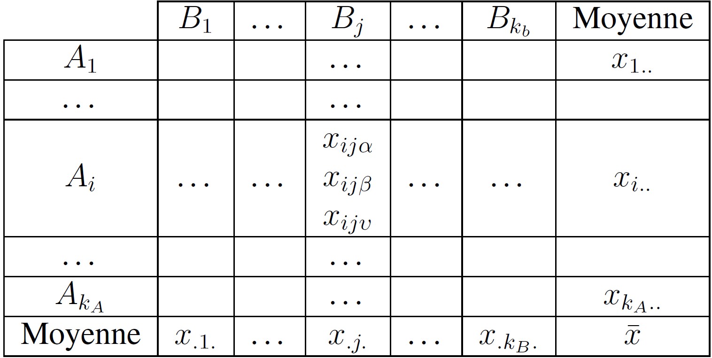
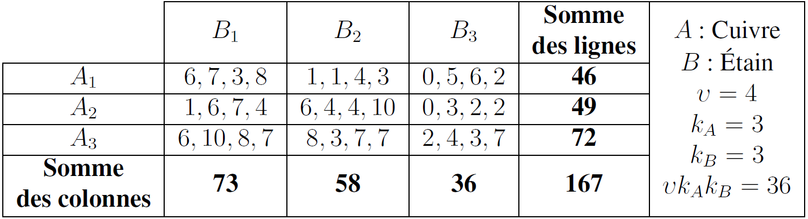

# Analyse de la variance à double entrée

L'analyse de la variance[^1] permet de généraliser le test de comparaison de plusieurs échantillons au problème suivant : **la comparaison des moyennes de plusieurs échantillons indépendants**. Ainsi, comme son nom ne l'indique pas, l'analyse de la variance permet de **comparer des moyennes** – c'est la méthode à utiliser lorsqu'il faut comparer plusieurs moyennes (à partir de trois). Il faut ajouter que le procédé qui consiste à tester l'égalité des moyennes de chaque couple n'est pas satisfaisant. Aussi, la nécessité d'une procédure permettant de **tester globalement** l'ensemble de tous les échantillons est fournie par la **théorie de l'analyse de la variance**. Le but de cette théorie est d'étudier la variabilité d'un objet en fonction d'un ensemble de facteurs que l'on peut contrôler systématiquement, et que l'on souhaite dissocier la part revenant à chaque facteur.

L'An.O.Va. permet d'étudier la dépendance d'une variable quantitative à une ou deux variables qualitatives. Plus généralement, les variables qualitatives sont appelées **facteurs**. Le facteur contrôlé peut intervenir dans des conditions qui différent :

1. soit par leur nature,

2. soit par leur intensité.

De plus, le facteur contrôlé peut être : 

1. soit à effets fixes, 

2. soit à effets aléatoires.

La variable dépendante (V.D.) est une variable quantitative continue. Les variables indépendantes (V.I.) correspondent aux facteurs. De fait, l'étude d'un facteur est une analyse bivariée, tandis que, avec au moins deux facteurs, l'analyse est multivariée. L'An.O.Va. établit si la dépendance étudiée est significative pour le facteur considéré. Pour y répondre, il faut tester si la moyenne de la variable quantitative d'étude est homogène sur l'ensemble des modalités de la variable qualitative. Il faut rejeter l'hypothèse nulle $H_0$ d'égalité des moyennes par l'analyse de la variance. Le test utilisé est le test $F$ de Fisher consistant à comparer la variance inter-échantillon à la variance intra-échantillon. On tente d'expliquer la **cause** de la diversité des informations par l'analyse de leur variance.

Il faut noter que l'analyse de la variance n'est valable en toute rigueur que pour des **échantillons tirés de populations normales et de même variance**. En général, le non-respect de ces conditions n'a pas trop d'influence sur la validité du test. Dit autrement, l'analyse de la variance est une **méthode robuste**. L'erreur introduite est toutefois d'autant plus forte que les effectifs des échantillons sont faibles et inégaux.

L'**analyse de la variance à double entrée** étudie l'action simultanée de deux facteurs contrôlés, chacun agissant individuellement avec une possibilité d'interaction entre les deux.

Soient $A$ et $B$ les deux facteurs contrôlés, le facteur $A$ intervenant à $k_A$ niveaux différents, et le facteur $B$ à $k_B$ niveaux différents. On est amené à expérimenter, puis analyser les $k_A k_B$ combinaisons de type $A_i B_j$. Pour chacune de ces combinaisons, on a effectué, pour examen, $\upsilon$ mesures. Si le nombre $\upsilon$ de mesures est le même pour chaque combinaison, l'**analyse** est **orthogonale**.

Pour une analyse orthogonale à double entrée, avec répétitions, le nombre total de mesures est : $N = {\upsilon} k_A k_B$. Les résultats se regroupent sous la forme d'un tableau à double entrée (Tab. 1).

**Tableau 1. Tableau à double entrée d'une analyse de variance à double entrée**

Les différentes moyennes figurant dans le tableau sont :

- pour chaque case, case $A_i B_j$, par exemple : $x_{ij.} = \frac{1}{\upsilon} \sum_{\alpha = 1}^{\upsilon} x_{ij{\alpha}}$ ;

- pour chaque ligne, ligne $A_i$, par exemple : $x_{i..} = \frac{1}{{\upsilon} k_B} \sum_{j = 1}^{k_B} \sum_{\alpha = 1}^{\upsilon} x_{ij{\alpha}}$ ;

- pour chaque colonne, colonne $B_j$, par exemple : $x_{.j.} \frac{1}{{\upsilon} k_A} \sum_{i = 1}^{k_A} \sum_{\alpha = 1}^{\upsilon} x_{ij{\alpha}}$.

La moyenne générale vaut alors :

$\bar{x} = \frac{1}{\upsilon k_A k_B} \sum_{i = 1}^{k_A} \sum_{j = 1}^{k_B} \sum_{\alpha = 1}^{\upsilon} x_{ij{\alpha}}$

## Variations

Toutes les variations, donc tous les calculs, se ramènent, en fait, à une succession d'analyses de la variance à simple entrée. On peut analyser l'effet global $\left( AB \right)$ des facteurs $A$ et $B$, sous la forme d'une analyse de la variance à simple entrée, dans laquelle les différentes modalités du facteur contrôlé sont toutes les combinaisons des facteurs $A$ et $B$.

On décompose la variation totale :

$S^2 = \sum_{i = 1}^{k_A} \sum_{j = 1}^{k_B} \sum_{\alpha = 1}^{\upsilon} \left( x_{ij{\alpha}} - \bar{x} \right)^2$

à l'aide de la variation globale calculée pour chacune des $k_A k_B$ combinaisons des facteurs $A$ et $B$ :

${S_{\left( AB \right)}}^2 = \upsilon \sum_{i = 1}^{k_A} \sum_{j = 1}^{k_B} \left( x_{ij.} - \bar{x} \right)^2$

et la variation résiduelle par rapport à l'effet global $\left( AB \right)$ :

${S_R}^2 = \sum_{i = 1}^{k_A} \sum_{j = 1}^{k_B} \sum_{\alpha = 1}^{\upsilon} \left( x_{ij{\alpha}} - x_{ij.} \right)^2$

On obtient une première décomposition de la variation totale sous la forme :

$S^2 = {S_{\left( AB \right)}}^2 + {S_R}^2$

Toutefois, cette décomposition est insuffisante, car elle ne fait pas apparaître l'action des facteurs $A$ et $B$ individuellement, d'une part, et de leur interaction éventuelle, d'autre part. En écrivant la différence qui intervient dans la variation globale $\left( AB \right)$ sous la forme :

$x_{ij.} = \left( x_{i..} - \bar{x} \right) + \left( x_{.j.} - \bar{x} \right) + \left[ x_{ij.} - \left( x_{i..} - x_{.j.} \right) + \bar{x} \right]$

on fait apparaître, après avoir élevé au carré, et fait la sommation sur tous les indices, trois termes que l'on appelle :

1. l'**effet principal du facteur $A$** :

${S_A}^2 = \upsilon k_B \sum_{i = 1}^{k_A} \left( x_{i..} - \bar{x} \right)^2$

2. l'**effet principal du facteur $B$** :

${S_A}^2 = \upsilon k_A \sum_{j = 1}^{k_B} \left( x_{.j.} - \bar{x} \right)^2$

3. l'**interaction $AB$** :

${S_{AB}}^2 = \upsilon \sum_{i = 1}^{k_A} \sum_{j = 1}^{k_B} \left[ x_{ij.} - \left( x_{i..} + x_{.j.} \right) + \bar{x} \right]^2$

L'effet principal du facteur $A$ correspond à une analyse à simple entrée dans laquelle les différentes modalités du facteur contrôlé sont les $k_A$ lignes du tableau, comprenant chacune $\upsilon k_B$ termes. Il s'agit de la même interprétation pour l'effet principal du facteur $B$. L'interaction correspond à la variation résiduelle dans cette optique.

On obtient la décomposition complète de la variation totale :

$S^2 = {S_A}^2 + {S_B}^2 + {S_{AB}}^2 + {S_R}^2$

## Calcul rapide des différentes variations

On appelle le **terme correctif** la valeur $\Delta$ :

$\Delta = \frac{1}{\upsilon k_A k_B} \left( \sum_{i = 1}^{k_A} \sum_{j = 1}^{k_B} \sum_{\alpha = 1}^{\upsilon} x_{ij{\alpha}} \right)^2$

La **variation totale** vaut :

$S^2 = \sum_{i = 1}^{k_A} \sum_{j = 1}^{k_B} \sum_{\alpha = 1}^{\upsilon} {x_{ij{\alpha}}}^2 - \Delta$

L'**effet global $\left( AB \right)$** vaut :

${S_{\left( AB \right)}}^2 = \frac{1}{\upsilon} \sum_{i = 1}^{k_A} \sum_{j = 1}^{k_B} \left( \sum_{\alpha = 1}^{\upsilon} {x_{ij{\alpha}}} \right)^2 - \Delta$

La **variation résiduelle** vaut :

${S_R}^2 = S^2 - {S_{AB}}^2$

L'**effet principal $A$** vaut :

${S_A}^2 = \frac{1}{\upsilon k_B} \sum_{i = 1}^{k_A} \left( \sum_{j = 1}^{k_B} \sum_{\alpha = 1}^{\upsilon} {x_{ij{\alpha}}} \right)^2 - \Delta$

L'**effet principal $B$** vaut :

${S_B}^2 = \frac{1}{\upsilon k_A} \sum_{j = 1}^{k_B} \left( \sum_{i = 1}^{k_A} \sum_{\alpha = 1}^{\upsilon} {x_{ij{\alpha}}} \right)^2 - \Delta$

L'**interaction $AB$** vaut :

${S_{AB}}^2 = {S_{\left( AB \right)}}^2 - {S_A}^2 - {S_B}^2$

## Analyse de la variance et tests d'homogénéité

Le but de cette analyse est de mettre en évidence les **effets significatifs**. Pour chaque niveau $\left( A_i, B_j \right)$, on suppose que les résultats des mesures sont distribués selon une loi normale de même écart type $\sigma$. Si la population est homogène, c'est-à-dire si les facteurs $A$ et $B$ n'exercent aucune influence sur le résultat des mesures, l'ensemble des résultats peut être considéré comme un échantillon unique de $N = \upsilon k_A k_B$ valeurs extraites au hasard d'une population normale, et réparties également au hasard, avec $\upsilon$ valeurs par case, dans les $k_A k_B$ cases du tableau des données. Le résultat d'une mesure se met sous la forme :

$x_{ij{\alpha}} = {\lambda}_0 + {\xi}_{ij{\alpha}}$

${\lambda}_0$ est une constante et ${\xi}_{ij{\alpha}}$ est une fluctuation aléatoire suivant une loi normale d'espérance nulle et d'écart type $\sigma$.

Sous l'hypothèse d'homogénéité, les quotients des variations ${S_A}^2$, ${S_B}^2$, ${S_{AB}}^2$ et ${S_R}^2$ par la variance ${\sigma}^2$ suivent des lois du ${\chi}^2$, dont les degrés de liberté sont donnés dans un tableau de synthèse (Tab. 2), au sein duquel les différents quotients $V_A$, $V_B$, $V_{AB}$ et $V_R$ sont des estimations de la variance ${\sigma}^2$ basées sur leurs différents degrés de liberté.

| **Variations** | **Somme des carrés** | **Degré de liberté** | **Quotient** |
| :-: | :-: | :-: | :-: |
| **Effet principal $A$** | ${S_A}^2$ | $k_A - 1$ | $V_A = \frac{{S_A}^2}{k_A - 1}$ |
| **Effet principal $B$** | ${S_B}^2$ | $k_B - 1$ | $V_B = \frac{{S_B}^2}{k_B - 1}$ |
| **Interaction** | ${S_{AB}}^2$ | $\left( k_A - 1 \right) \left( k_B - 1 \right)$ | $V_{AB} = \frac{{S_{AB}}^2}{\left( k_A - 1 \right) \left( k_B - 1 \right)}$ |
| **Variation résiduelle** | ${S_R}^2$ | $k_A k_B \left( \upsilon - 1  \right)$ | $VR = \frac{{S_R}^2}{\left( \upsilon - 1 \right) k_A k_B}$ |
| **Variation totale** | $S^2$ | $\upsilon k_A k_B - 1$ |  |
 
**Tableau 2. Synthèse des variations d'une analyse de la variance à double entrée**

Les tests d'homogénéité permet de comparer l'interaction $AB$ et la variation résiduelle ${S_R}^2$.

- **Cas 1.** L'interaction $AB$ n'est pas significative au seuil $\alpha$ si :

$\frac{V_{AB}}{V_R} \leq F_{1 - \alpha} \left[ \left( k_A - 1 \right) \left( k_B - 1 \right), k_A k_B \left( \upsilon - 1 \right) \right]$

Dans cette hypothèse, on étudie les effets principaux $A$ et $B$ en les comparant à la variation résiduelle ${S_R}^2$.

1. L'effet A n'est pas significatif au seuil $\alpha$ si :

$\frac{V_A}{V_R} \leq F_{1 - \alpha} \left[ \left( k_A - 1 \right), k_A k_B \left( \upsilon - 1 \right) \right]$

2. L'effet B n'est pas significatif au seuil $\alpha$ si :

$\frac{V_B}{V_R} \leq F_{1 - \alpha} \left[ \left( k_B - 1 \right), k_A k_B \left( \upsilon - 1 \right) \right]$

La population est homogène au seuil $\alpha$ si les trois effets $A$, $B$ et $AB$ ne sont pas significatifs. Dans ces conditions, le modèle adopté est le suivant :

$x_{ij{\alpha}} = {\lambda}_0 + {\xi}_{ij{\alpha}}$

L’estimation de la constante ${\lambda}_0$ est la moyenne générale $\bar{x}$, et celle de la variance ${\sigma}^2$, le quotient $V_R$.

- **Cas 2.** L'interaction $AB$ est significative au seuil $\alpha$ si :

$\frac{V_{AB}}{V_R} > F_{1 - \alpha} \left[ \left( k_A - 1 \right) \left( k_B - 1 \right), k_A k_B \left( \upsilon - 1 \right) \right]$

Dans cette hypothèse, on étudie les effets principaux $A$ et $B$ en les comparant à l'interaction $AB$.

1. L'effet A n'est pas significatif au seuil $\alpha$ si :

$\frac{V_A}{V_{AB}} \leq F_{1 - \alpha} \left[ \left( k_A - 1 \right), \left( k_A - 1 \right) \left( k_B - 1 \right) \right]$

Il est significatif si :

$\frac{V_A}{V_{AB}} > F_{1 - \alpha} \left[ \left( k_A - 1 \right), \left( k_A - 1 \right) \left( k_B - 1 \right) \right]$

2. L'effet B n'est pas significatif au seuil $\alpha$ si :

$\frac{V_B}{V_{AB}} \leq F_{1 - \alpha} \left[ \left( k_B - 1 \right), \left( k_A - 1 \right) \left( k_B - 1 \right) \right]$

Il est significatif si :	

$\frac{V_B}{V_{AB}} > F_{1 - \alpha} \left[ \left( k_B - 1 \right), \left( k_A - 1 \right) \left( k_B - 1 \right) \right]$

La formule générale pour le résultat d'une mesure est la suivante :

$x_{ij{\alpha}} = {\lambda}_0 + {\lambda}_{A_i} + {\lambda}_{B_j} + I_{A_i B_j} + {\xi}_{AB{\alpha}}$

${\lambda}_0$ est une constante. ${\lambda}_{A_i}$ est une correction intéressant un même niveau du facteur $A$, donc tous les cases d'une même ligne. ${\lambda}_{B_j}$ est une correction intéressant un même niveau du facteur $B$, donc toutes les cases d'une même colonne. $I_{A_i B_j}$ est une correction intéressant toutes les mesures d'une même case, elle est caractéristique d'une combinaison de deux niveaux des facteurs $A$ et $B$.

Selon les résultats des tests, seuls certains termes figureront dans la décomposition. On montre que les estimations des termes significatifs sont :

${\hat{\lambda}}_0 = \bar{x}$

${\hat{\lambda}}_{A_i} = x_{i..} - \bar{x}$

${\hat{\lambda}}_{B_j} = x_{.j.} - \bar{x}$

${\hat{I}}_{A_i} = x_{ij.} - \left( x_{i..} + x_{.j.} \right) + \bar{x}$

> [!WARNING]
> Les calculs sont longs, mais il existe des logiciels d'analyse de la variance. Il suffit alors d'interpréter correctement les sorties de ces programmes.

## Exemple d'analyse de la variance à deux entrées

Un fabricant de coussinets en bronze fritté se propose de déterminer si la résistance à la rupture du bronze dépend des lots de poudre de cuivre et d'étain utilisés pour son élaboration. Pour ce, on réalise à partir de trois lots différents de poudre de cuivre et trois lots différents de poudre d'étain, neuf mélanges de composition identiques (90 % de cuivre et 10 % d'étain), correspondant aux neufs combinaisons deux à deux des lots de cuivre et d'étain utilisés.

À partir de chacun de ces neufs mélanges, on comprime d{}'abord, sous une même pression, quatre éprouvettes de flexion identique\footnote{c'est-à-dire avec le même alliage}. Les trente-six éprouvettes obtenues sont ensuite frittées en une même opération dans un four à atmosphère réductrice. Ces éprouvettes sont enfin cassées sur une machine d'essai. Les charges de rupture ainsi déterminées sont arrondies à 0,1 kg/mm² près, et sont reportées dans le tableau de synthèse en hectogramme, en excès de la valeur de 2 kg/mm² choisie pour origine (Tab. 3). Une analyse de la variance à double entrée donne une réponse au fabricant.

**Tableau 3. Exemple. Éléments entrant dans la fabrication du bronze**

On calcule la somme par cases :

$\begin{array}{lll} A_1 B_1 : 24 & A_1 B_2 : 9 & A_1 B_3 : 13 \\ A_2 B_1 : 18 & A_2 B_2 : 24 & A_2 B_3 : 7 \\ A_3 B_1 : 31 & A_3 B_2 : 25 & A_3 B_3 : 16 \end{array}$

Pour obtenir la variation totale, on calcule le terme correctif $\Delta$ :

$\Delta = \frac{167^2}{36} = 774,70$

puis, on calcule la somme des carrés des valeurs :

$\begin{array}{l} 6^2 + 7^2 + 3^2 + 8^2 + 1^2 + 1^2 + 4^2 + 3^2 + 0^2 + 5^2 + 6^2 + 2^2 + 1^2 + 6^2 + 7^2 + \\ + 4^2 + 6^2 + 4^2 + 4^2 + 10^2 + 0^2 + 3^2 + 2^2 + 2^2 + 6^2 + 10^2 + 8^2 + 7^2 + 8^2 + \\ + 3^2 + 7^2 + 7^2 + 2^2 + 4^2 + 3^2 + 7^2 = 1035 \end{array}$

La variation totale $S^2$ vaut alors :

$S^2 = 1035 - 774,70 = 260,30$

La variation globale vaut :

$\begin{array}{l} {S_{\left( AB \right)}}^2 = \frac{1}{4} \left( 24^2 + 18^2 + 31^2 + 9^2 + 24^2 + 25^2 + 13^2 + 7^2 + 16^2 \right) - 774,7 \\ {S_{\left( AB \right)}}^2 = 904,25 - 774,70 \\ {S_{\left( AB \right)}}^2 = 129,55 \approx 129,6 \end{array}$

La variation résiduelle vaut :

${S_R}^2 = 260,3 - 129,6 = 130,7$

L'effet principal du facteur $A$ vaut :

$\begin{array}{l} {S_A}^2 = \frac{1}{12} \left( 46^2 + 49^2 + 72^2 \right) - 774,7 \\ {S_A}^2 \approx 808,4 - 774,7 \\ {S_A}^2 \approx 33,7 \end{array}$

L'effet principal du facteur $B$ vaut :

$\begin{array}{l} {S_B}^2 = \frac{1}{12} \left( 73^2 + 58^2 + 36^2 \right) - 774,7 \\ {S_B}^2 \approx 832,4 - 774,7 \\ {S_B}^2 \approx 57,7 \end{array}$

L'interaction $AB$ vaut :

${S_{AB}}^2 = 129,6 - 33,7 - 57,7 = 38,2$

Toutes ces valeurs sont synthétisées dans un tableau de synthèse (Tab. 4).

| **Variations** | **Somme des carrés** | **Degré de liberté** | **Quotient** |
| :-: | :-: | :-: | :-: |
| **Effet principal A** | ${S_A}^2 = 33,70$ | $k_A - 1 = 2$ | $V_A = \frac{{S_A}^2}{k_A - 1} = 16,85$ |
| **Effet principal B** | ${S_B}^2 = 57,70$ | $k_B - 1 = 2$ | $V_B = \frac{{S_B}^2}{k_B - 1} = 28,85$ |
| **Interaction** | ${S_{AB}}^2 = 38,20$ | $\left( k_A - 1 \right) \left( k_B - 1 \right) = 4$ | $V_{AB} = \frac{{S_{AB}}^2}{\left( k_A - 1 \right) \left( k_B - 1 \right)} = 9,55$ |
| **Variation résiduelle** | ${S_R}^2 = 130,70$ | $k_A k_B \left( \upsilon - 1 \right) = 27$ | $V_R = \frac{{S_R}^2}{\left( \upsilon - 1 \right) k_A k_B} = 4,85$ |
| **Variation totale** | $S^2 = 260,30$ | $\upsilon k_A k_B - 1 = 35$ |  |
 
**Tableau 4. Exemple. Synthèse des variations d'une analyse de la variance à double entrée des éléments entrant dans la fabrication du bronze**

Désormais, on peut effectuer le test d'homogénéité.

### Test d'homogénéité avec un risque $\alpha = 0,05$

L'interaction $AB$ vaut $\frac{V_{AB}}{V_R} \approx 1,97$, or, d'après la table de Fisher, $F_{0,95} \left( 4,27 \right) = 2,73$, comme $\frac{V_{AB}}{V_R} < 2,73$, l'interaction n'est pas significative.

L'effet principal $A$ vaut $\frac{V_{A}}{V_R} = \frac{16,85}{4,85} = 3,48$, or, d'après la table de Fisher, $F_{0,95} \left( 2,27 \right) = 3,35$, comme $\frac{V_{A}}{V_R} > 3,35$, l'effet principal $A$ est significatif.

L'effet principal $B$ vaut $\frac{V_{B}}{V_R} = \frac{28,85}{4,85} = 5,95$, or, d'après la table de Fisher, $F_{0,95} \left( 2,27 \right) = 3,35$, comme $\frac{V_{B}}{V_R} > 3,35$, l'effet principal $B$ est significatif.

Au risque $\alpha = 0,05$, l'hypothèse d'homogénéité doit être rejetée. Les lots de cuivre et d'étain exercent une influence sur la résistance à la rupture de ces éprouvettes. Leurs effets sont additifs et il ne semble pas qu'il existe une interaction dans les lots de cuivre et d'étain associés dans un même mélange.

### Test d'homogénéité avec un risque $\alpha = 0,01$

L'interaction $AB$ vaut $\frac{V_{AB}}{V_R} \approx 1,97$, or, d'après la table de Fisher, $F_{0,99} \left( 4,27 \right) = 4,11$, comme $\frac{V_{AB}}{V_R} < 4,11$, l'interaction n'est pas significative.

L'effet principal $A$ vaut $\frac{V_{A}}{V_R} = \frac{16,85}{4,85} = 3,48$, or, d'après la table de Fisher, $F_{0,99} \left( 2,27 \right) = 5,49$, comme $\frac{V_{A}}{V_R} < 5,49$, l'effet principal $A$ n'est pas significatif.

L'effet principal $B$ vaut $\frac{V_{B}}{V_R} = \frac{28,85}{4,85} = 5,95$, or, d'après la table de Fisher, $F_{0,99} \left( 2,27 \right) = 5,49$, comme $\frac{V_{B}}{V_R} > 5,49$, l'effet principal $B$ est significatif.

Au risque $\alpha = 0,01$, l'hypothèse d'homogénéité doit être rejetée. Seuls les lots d'étain exercent une influence sur la résistance à la rupture de ces éprouvettes. Les effets ne sont pas additifs et il ne semble pas qu'il existe une interaction dans les lots de cuivre et d'étain associés dans un même mélange.

> [!NOTE]
> Si l'on choisit un risque $\alpha = 0,005$, aucun facteur n'est significatif.

## Liens

- [Topo en format P.D.F.](./PDF/Seance-10-Chapitre-24.pdf)

## Notes de bas de page

[^1]: *Analysis of Variance* (An.O.Va.)

[^2]: c'est-à-dire avec le même alliage
