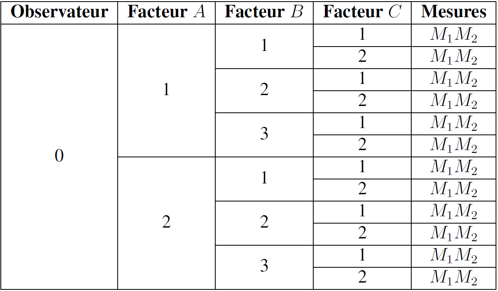

# Analyse de la variance orthogonale à entrées multiple

L'analyse de la variance[^1] permet de généraliser le test de comparaison de plusieurs échantillons au problème suivant : **la comparaison des moyennes de plusieurs échantillons indépendants**. Ainsi, comme son nom ne l'indique pas, l'analyse de la variance permet de **comparer des moyennes** – c'est la méthode à utiliser lorsqu'il faut comparer plusieurs moyennes (à partir de trois). Il faut ajouter que le procédé qui consiste à tester l'égalité des moyennes de chaque couple n'est pas satisfaisant. Aussi, la nécessité d'une procédure permettant de **tester globalement** l'ensemble de tous les échantillons est fournie par la **théorie de l'analyse de la variance**. Le but de cette théorie est d'étudier la variabilité d'un objet en fonction d'un ensemble de facteurs que l'on peut contrôler systématiquement, et que l'on souhaite dissocier la part revenant à chaque facteur.

L'An.O.Va. permet d'étudier la dépendance d'une variable quantitative à une ou deux variables qualitatives. Plus généralement, les variables qualitatives sont appelées **facteurs**. Le facteur contrôlé peut intervenir dans des conditions qui différent : \begin{inparaenum} \item soit par leur nature, \item soit par leur intensité. \end{inparaenum} De plus, le facteur contrôlé peut être : \begin{inparaenum} \item soit à effets fixes, \item soit à effets aléatoires. \end{inparaenum}

La variable dépendante (V.D.) est une variable quantitative continue. Les variables indépendantes (V.I.) correspondent aux facteurs. De fait, l'étude d'un facteur est une analyse bivariée, tandis que, avec au moins deux facteurs, l'analyse est multivariée. L'An.O.Va. établit si la dépendance étudiée est significative pour le facteur considéré. Pour y répondre, il faut tester si la moyenne de la variable quantitative d'étude est homogène sur l'ensemble des modalités de la variable qualitative. Il faut rejeter l'hypothèse nulle $H_0$ d'égalité des moyennes par l'analyse de la variance. Le test utilisé est le test $F$ de Fisher consistant à comparer la variance inter-échantillon à la variance intra-échantillon. On tente d'expliquer la **cause** de la diversité des informations par l'analyse de leur variance.

Il faut noter que l'analyse de la variance n'est valable en toute rigueur que pour des **échantillons tirés de populations normales et de même variance**. En général, le non-respect de ces conditions n'a pas trop d'influence sur la validité du test. Dit autrement, l'analyse de la variance est une **méthode robuste**. L'erreur introduite est toutefois d'autant plus forte que les effectifs des échantillons sont faibles et inégaux.

L'**analyse de la variance à entrées multiples** s'effectue avec plusieurs facteurs contrôlés.

## Analyse de la variance orthogonale à entrées multiples

Les méthodes d'analyse de la variance à double entrée peuvent être généralisées à l'étude d'un nombre quelconque de facteurs contrôlés. Les formules sont de plus en plus lourdes à écrire, mais la théorie présente peu de difficultés.

Par exemple, pour une analyse orthogonale à quatre facteurs contrôlés $A$, $B$, $C$ et $D$, la décomposition de la variation totale doit tenir compte :

1. des effets principaux : $A$, $B$, $C$ et $D$ ;

2. des interactions deux à deux : $AB$, $AC$, $AD$, $BC$, $BD$ et $CD$ ;

3. des interactions trois à trois : $ABC$, $ABD$, $ACD$ et $BCD$ ;

4. de l'interaction des quatre facteurs : $ABCD$ ;

5. de la variation résiduelle.

Pour calculer chaque effet ou chaque interaction, il suffit de considérer des analyses de la variance à simple entrée.

## Analyse de la variance à triple entrée sans répétition

On considère une analyse à triple entrée sans répétition, le facteur contrôlé $A$ intervient à $k_A$ niveaux, le facteur contrôlé $B$ à $k_B$ niveaux et le facteur contrôlé $C$ à $k_C$ niveaux.

Pour chaque combinaison $A_i B_j C_l$ des trois facteurs, on a effectué une seule mesure c'est-à-dire une analyse sans répétition.

Dans ces conditions, on doit admettre que l'interaction du troisième ordre $ABC$ n'est pas significative. Le quotient $V_{ABC}$ donne l'estimation de la variance d'erreur ${\sigma}^2$, il est utilisé dans les différents tests de Fisher pour trouver les actions significatives ou non. La variation totale est l'effet global $\left( ABC \right)$.

### Décomposition de la variation totale

$S^2 = {S_A}^2 + {S_B}^2 + {S_C}^2 + {S_{AB}}^2 + {S_{AC}}^2 + {S_{BC}}^2 + {S_{ABC}}^2$

Exemples.

- L'effet global $\left( AC \right)$ vaut : ${S_{\left( AC \right)}}^2 = k_B \sum_{i = 1}^{k_A} \sum_{l = 1}^{kC} \left( x_{i.l} - \bar{x} \right)^2$.

- L'effet principal $C$ vaut : ${S_{C}}^2 = k_A k_B \sum_{l = 1}^{k_C} \left( x_{..l} - \bar{x} \right)^2$.

- L'interaction $AC$ vaut : ${S_{AC}}^2 = {S_{\left( AC \right)}}^2 - {S_A}^2 - {S_C}^2$.

### Calcul rapide des différents facteurs

On pose $\Delta = \frac{1}{k_A k_B k_C} \left( \sum_{i = 1}^{k_A} \sum_{j = 1}^{k_B} \sum_{l = 1}^{k_C} x_{ijl} \right)^2$.

${S_{\left( AC \right)}}^2 = \frac{1}{k_B} \sum_{i = 1}^{k_A} \sum_{l = 1}^{k_C} \left( \sum_{i = 1}^{k_B} x_{ijl} \right)^2 - \Delta$

${S_C}^2 = \frac{1}{k_A k_B} \sum_{l = 1}^{k_C} \left( \sum_{i = 1}^{k_A} \sum_{j = 1}^{k_B} x_{ijl} \right)^2 - \Delta$

${S_A}^2 = \frac{1}{k_B k_C} \sum_{i = 1}^{k_A} \left( \sum_{j = 1}^{k_B}\sum_{l = 1}^{k_C} x_{ijl} \right)^2 - \Delta$

### Tableau d'analyse de la variance à triple entrée sans répétition

| **Variations** | **Somme des carrés** | **Degré de liberté** | **Quotient** |
| :-: | :-: | :-: | :-: |
| **Effet principal $A$** | ${S_A}^2$ | $k_A - 1$ | $V_A = \frac{{S_A}^2}{k_A - 1}$ |
| **Effet principal $B$** | ${S_B}^2$ | $k_B - 1$ | $V_B = \frac{{S_B}^2}{k_B - 1}$ |
| **Effet principal $C$** | ${S_C}^2$ | $k_C - 1$ | $V_C = \frac{{S_C}^2}{k_C - 1}$ |
| **Interaction $AB$** | ${S_{AB}}^2$ | $\left(k_A - 1 \right) \left(k_B - 1 \right)$ | $V_{AB} = \frac{{S_{AB}}^2}{\left(k_A - 1 \right) \left(k_B - 1 \right)}$ |
| **Interaction $AC$** | ${S_{AC}}^2$ | $\left(k_A - 1 \right) \left(k_C - 1 \right)$ | $V_{AC} = \frac{{S_{AC}}^2}{\left(k_A - 1 \right) \left(k_C - 1 \right)}$ |
| **Interaction $BC$** | ${S_{BC}}^2$ | $\left(k_B - 1 \right) \left(k_C - 1 \right)$ | $V_{BC} = \frac{{S_{BC}}^2}{\left(k_B - 1 \right) \left(k_C - 1 \right)}$ |
| **Interaction $ABC$** | ${S_{ABC}}^2$ | $\left(k_A - 1 \right) \left(k_B - 1 \right) \left(k_C - 1 \right)$ | $V_{ABC} = \frac{{S_{ABC}}^2}{\left(k_A - 1 \right) \left(k_B - 1 \right) \left(k_C - 1 \right)}$ |
| **Variation totale** | $S^2$ | $k_A k_B k_C - 1$ |  |
 
**Tableau 1. Synthèse des variations d'une analyse de la variance à triple entrée sans répétition**

## Analyse de la variance emboîtée

Ce type d'analyse convient bien au cas pour lequel les facteurs sont hiérarchisés (ou emboîtés).

### Construction de l'arbre

Le plan d'expérience a la forme d'un arbre dans lequel l'observateur est le pied de l'arbre. Chaque sommet, ou nœud représente une modalité particulière de l'un des facteurs susceptibles d'avoir une influence sur les mesures (Tab. 2). Les branches extrêmes correspondent aux résultats des mesures.

**Tableau 2. Construction de l'arbre d'une analyse de variance emboîtée**

On suppose que l'on rencontre le même nombre de sommets dans tout trajet partant du pied de l'arbre en aboutissant à une branche extrême. L'**ordre du plan** est le nombre commun de sommets rencontrés. On suppose qu'il part le même nombre de branches de chacun des sommets de même rang : le plan d'expérience est un **plan orthogonal**.

On note : $k_A$ le nombre de branches partant du pied de l'arbre vers les sommets $A$ ; $k_B$ le nombre de branches partant de chaque sommet $A$ vers les sommets $B$ ; $k_C$ le nombre de branches partant de chaque sommet $B$ vers les sommets $C$ ; $\upsilon$ le nombre de branches de chaque sommet $C$ (branches extrêmes).

Le nombre total $N$ de mesures vaut : $N = \upsilon k_A k_B k_C$.

### Tableau de l'analyse de la variance emboîtée

On part d'abord des sommets du rang le plus élevé, les sommets $C$ dans le cas considéré. Les mesures recueillies $x_{ijl{\alpha}}$ peuvent être considérées comme les résultats d'une analyse de la variance à simple entrée dont les différents niveaux correspondraient aux $k_C$ sommets de rang $C$. La **variation résiduelle** (ou intraclasse) correspondant à cette analyse, est :

$M/ABC = \sum_{i = 1}^{k_A} \sum_{j = 1}^{k_B} \sum_{l = 1}^{k_C} \sum_{\alpha = 1}^{\upsilon} \left( x_{ijl{\alpha}} - x_{ijl.} \right)^2$

Cette variation caractérise la somme des dispersions des mesures provenant d'un même sommet de rang $C$, donc d'un même sommet de rang $B$ et de rang $A$. La moyenne $x_{ijl.}$ de toutes les mesures partant d'un même sommet $C$ peut être prise comme mesure caractérisant ce sommet.

Partant, ensuite des sommets de rang $B$, on peut considérer l'ensemble des moyennes $x_{ijl.}$ comme les données d'une analyse de la variance à simple entrée, dont les différents niveaux correspondraient aux sommets de rang $B$. On peut calculer la **variation résiduelle** (ou interclasse) correspondant à cette analyse :

$C/AB = \sum_{i = 1}^{k_A} \sum_{j = 1}^{k_B} \sum_{l = 1}^{k_C} \upsilon \left( x_{ijl.} - x_{ij..} \right)^2$

Cette variation caractérise la somme, pour tous les sommets $B$, des dispersions des moyennes $x_{ijl.}$ caractérisant tous les sommets $C$ reliés à un même sommet $B$. Le même processus s'étend inclusivement jusqu'aux sommets $A$.

Partant enfin de l'observateur, on calcule la variation caractérisant la dispersion entre les sommets $A$ (ou effet principal du facteur $A$) :

$A = \sum_{i = 1}^{k_A} \upsilon k_B k_C \left( x_{i...} - x_{....} \right)^2$

On a réalisé une suite d'analyses à simple entrée qui s'emboîtent les unes dans les autres, d'où le nom de ce type de plan d'expérience.

On obtient le tableau synthétisant l'analyse de la variance emboîtée (Tab. 3).

| **Variations** | **Somme des carrés** | **Degré de liberté** | **Quotient** |
| :-: | :-: | :-: | :-: |
| **Effet principal $A$** | $A$ | ${\delta}_A = k_A - 1$ | $V_A = \frac{A}{{\delta}_A}$ |
| **Somme des effets principaux $B$ pour un  même $A$** | $B/A$ | ${\delta}_B = k_A \left( k_B - 1 \right)$ | $V_{B/A} = \frac{B/A}{{\delta}_b}$ |
| **Somme des effets principaux $C$ pour un même $A$ et un même $B$** | $C/AB$ | ${\delta}_C = k_A k_B \left( k_C - 1 \right)$ | $V_{C/AB} = \frac{C/AB}{{\delta}_C}$ |
| **Variations entre mesures pour un même $C$, un même $B$ et un même $A$** | $M/ABC$ | ${\delta}_M = k_A k_B k_C \left( \upsilon - 1 \right)$ | $V_{M/ABC} = \frac{M/ABC}{{\delta}_M}$ |
| **Variation totale** | $T = \left( ABCM \right)$ | ${\delta}_T = {\upsilon} k_A k_B k_C - 1$ |  |

**Tableau 3. Tableau de l'analyse de la variance emboîtée**

On peut vérifier l'égalité suivante :

$T = A + B/A +C/AB + M/ABC$

### Interprétation des résultats

La recherche des effets significatifs dépend du choix des modalités d'intervention des facteurs $A$, $B$ et $C$.

#### Choix aléatoire

Le quotient $V_{M/ABC}$ sert de terme de comparaison pour déterminer si l'écart type ${\sigma}_C$ peut être considéré comme nul au seuil $\alpha$.

Si l'on doit considérer l'écart type ${\sigma}_C \neq 0$, le quotient $V_{C/AB}$ est utilisé pour déterminer si l'écart type ${\sigma}_B$ peut être considéré comme nul au seuil $\alpha$.

Si l'on doit considérer l'écart type ${\sigma}_B \neq 0$, le quotient $V_{B/A}$ est utilisé pour déterminer si l'écart type ${\sigma}_A$ peut être considéré comme nul au seuil $\alpha$.

#### Choix systématique

Le quotient $V_{M/ABC}$ sert de terme de comparaison pour déterminer si l'un quelconque des trois effets $A$, $B/A$, $C/AB$ est significatif au seuil $\alpha$.

## Carré latin

Le carré latin est un **cas particulier de l'analyse à triple entrée**, très utilisé en pratique, car il minimise le nombre d'essais. Pour ce, les trois facteurs contrôlés interviennent avec un même nombre de niveaux, c'est-à-dire $k_A = k_B = k_C = k$. Le plan d'expérience est représenté par un carré divisé en $k$ lignes (les niveaux du facteur $A$) et en $k$ colonnes (les niveaux du facteur $B$). Chaque case du carré, correspondant à une combinaison du type $A_i B_j$, est associée à une niveau $C_l$ du facteur $C$, de telle sorte que, sur chaque ligne et chaque colonne du carré, apparaisse une fois et une seule chacun des $k$ niveaux du facteur $C$. Il s'agit d'un plan d'expérience limité ne permettant pas d'obtenir toutes les conclusions que l'on pourrait tirer d'une analyse classique.

> [!NOTE]
> Exemple très connu de carré latin~: le sudoku

## Liens

- [Topo en format P.D.F.](./PDF/Seance-10-Chapitre-25.pdf)

## Notes de bas de page

[^1]: *Analysis of Variance* (An.O.Va.)
